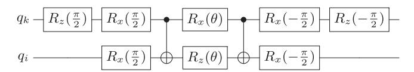
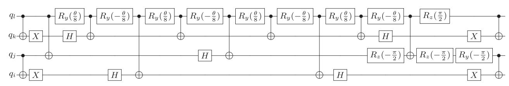
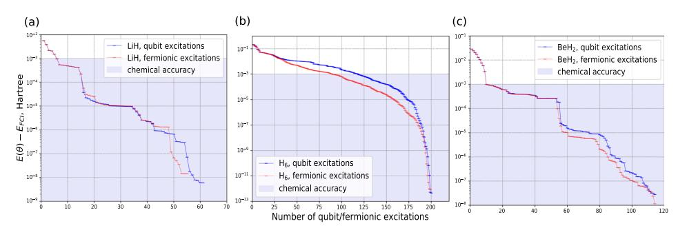
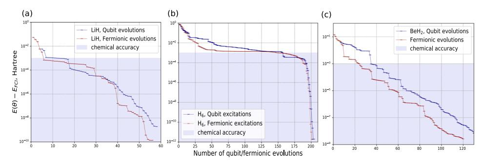
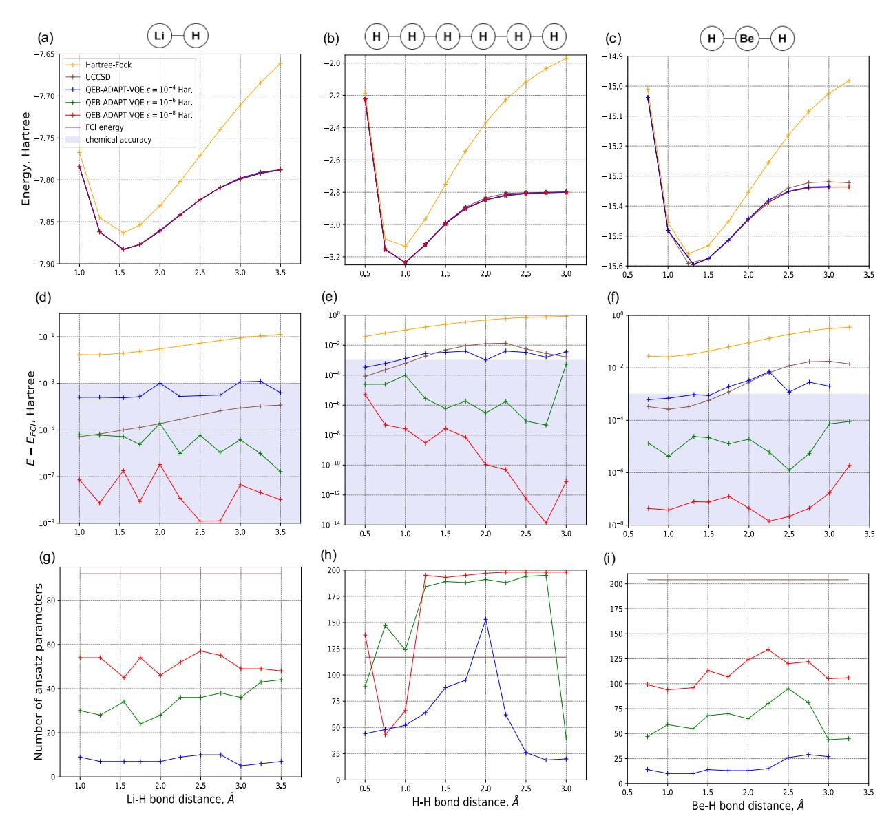
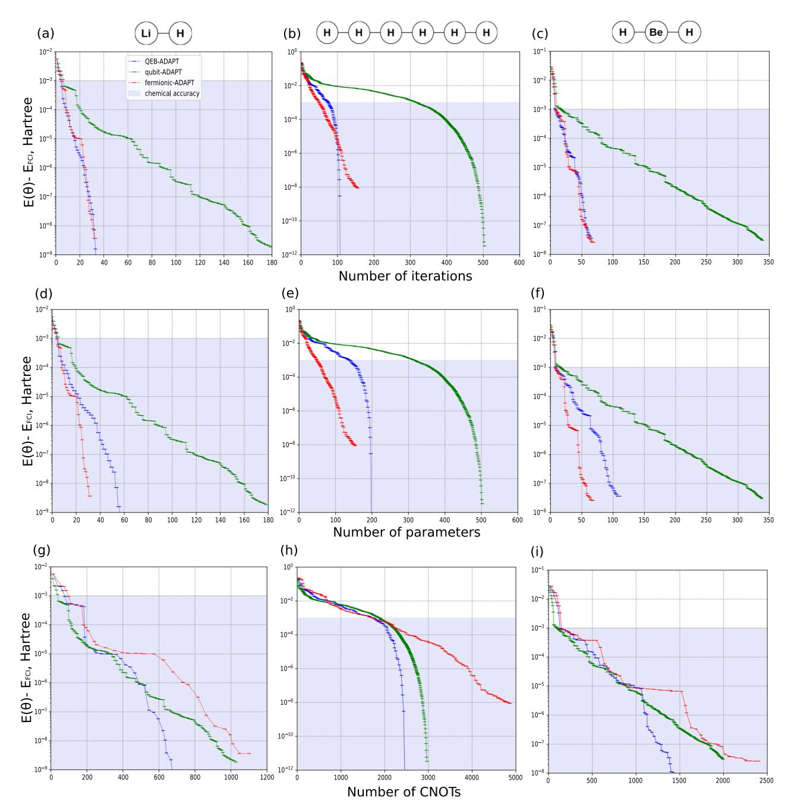

ARTICLE

https://doi.org/10.1038/s42005-021-00730-0 **OPEN**

# Qubit-excitation-based adaptive variational quantum eigensolver

Yordan S. Yordano[v](http://orcid.org/0000-0002-3828-0090) 1,2✉, V. Armaos3, Crispin H. W. Barnes1 & David R. M. Arvidsson-Shuku[r](http://orcid.org/0000-0002-0185-0352) [1](http://orcid.org/0000-0002-0185-0352),2✉

Molecular simulations with the variational quantum eigensolver (VQE) are a promising application for emerging noisy intermediate-scale quantum computers. Constructing accurate molecular ansätze that are easy to optimize and implemented by shallow quantum circuits is crucial for the successful implementation of such simulations. Ansätze are, generally, constructed as series of fermionic-excitation evolutions. Instead, we demonstrate the usefulness of constructing ansätze with "qubit-excitation evolutions", which, contrary to fermionic excitation evolutions, obey "qubit commutation relations". We show that qubit excitation evolutions, despite the lack of some of the physical features of fermionic excitation evolutions, accurately construct ansätze, while requiring asymptotically fewer gates. Utilizing qubit excitation evolutions, we introduce the qubit-excitation-based adaptive (QEB-ADAPT)-VQE protocol. The QEB-ADAPT-VQE is a modification of the ADAPT-VQE that performs molecular simulations using a problem-tailored ansatz, grown iteratively by appending evolutions of qubit excitation operators. By performing classical numerical simulations for small molecules, we benchmark the QEB-ADAPT-VQE, and compare it against the original fermionic-ADAPT-VQE and the qubit-ADAPT-VQE. In terms of circuit efficiency and convergence speed, we demonstrate that the QEB-ADAPT-VQE outperforms the qubit-ADAPT-VQE, which to our knowledge was the previous most circuit-efficient scalable VQE protocol for molecular simulations.

1 Cavendish Laboratory, Department of Physics, University of Cambridge, Cambridge CB3 0HE, UK. 2Hitachi Cambridge Laboratory, J. J. Thomson Avenue, CB3 0HE Cambridge, UK. 3 Laboratory of Atmospheric Physics, Department of Physics, University of Patras, Patras, Greece. ✉email: [yy387@cam.ac.uk](mailto:yy387@cam.ac.uk); [drma2@cam.ac.uk](mailto:drma2@cam.ac.uk)

uantum computers are anticipated to enable simulations of quantum systems more efficiently and accurately than classical computers  $^{1,2}$ . A promising algorithm to perform this task on emerging noisy intermediate-scale quantum (NISQ) $^{3-5}$  computers is the variational quantum eigensolver (VQE) $^{6-12}$ . The VQE is a hybrid quantum-classical algorithm that estimates the lowest eigenvalue of a Hamiltonian H by minimizing the energy expectation value  $E(\theta) = \langle \psi(\theta)|H|\psi(\theta)\rangle$  with respect to a parametrized state  $|\psi(\theta)\rangle = U(\theta)|\psi_0\rangle$ . Here,  $\theta$  is a set of variational parameters, and the unitary  $U(\theta)$  is an ansatz. Compared to other purely quantum algorithms for eigenvalue estimation, like the quantum-phase estimation algorithm  $^{13,14}$ , the VQE requires shallower quantum circuits. This makes the VQE more noise resistant, at the expense of requiring a higher number of quantum measurements and additional classical postprocessing.

The VQE can solve the electronic structure problem6,15 by estimating the lowest eigenvalue of an electronic Hamiltonian. A major challenge for the practical realization of a molecular VQE simulation on NISQ computers is to construct a variationally flexible ansatz  $U(\theta)$  that: (1) accurately approximates the ground state of H; (2) is easy to optimize; and (3) can be implemented by a shallow circuit.

These desired qualities are satisfied, to various levels, by several types of ansätze. The unitary coupled-cluster (UCC) type, was the first to be used for molecular VQE simulations16. The UCC is motivated by the classical coupled-cluster theory15, and corresponds to a series of unitary evolutions of fermionic-excitation operators, which we refer to as "fermionic excitation evolutions" (see the section "Ansatz elements"). A prominent example of a UCC ansatz is the UCC Singles and Doubles (UCCSD)17-22, which corresponds to a series of single and double-fermionicexcitation evolutions. The UCCSD has been used successfully to implement the VQE for small molecules 16,17,23. Due to their physically motivated fermionic structure, UCC ansätze respects the symmetries of electronic wavefunctions, which makes these ansätze accurate and easy to optimize. Even a relatively simple UCC ansatz, like the UCCSD, is highly accurate for weakly correlated systems, such as molecules near their equilibrium configuration 16,17,24,25. However, UCC ansätze are generalpurpose built and do not take into account details of the system of interest. They contain redundant excitation terms, resulting in unnecessarily high numbers of variational parameters as well as long ansatz circuits. Moreover, to simulate strongly correlated systems, UCC ansätze requires higher-order excitations and/or multiple-step Trotterization24, which creates additional overhead for the quantum hardware.

Another type of "hardware-efficient" ansätze26–30 corresponds to universal unitary transformations implemented as periodic sequences of parametrized one- and two-qubit gates. These ansätze are implemented by shallow circuits, and can be highly variationally flexible. However, as they lack a physically motivated structure, these ansätze require a large number of variational parameters and may suffer by vanishing energy gradients along their variational parameters, making classical optimization intractable for large molecules31,32. In some scenarios, this is known as the barren plateau problem32–35.

Recently, a number of works36–44 suggested new "iterative" VQE protocols, which instead of using general-purpose, fixed ansätze, construct problem-tailored ansätze on the go. These algorithms can construct arbitrarily accurate ansätze that are optimized in the number of variational parameters and the ansatz-circuit depth, at the expense of requiring a larger number of quantum computer measurements. The ADAPT-VQE protocols36,37 are perhaps the most prominent family of iterative VQE protocols. The fermionic-ADAPT-VQE36, which was

the first iterative VQE protocol, constructs its ansatz by iteratively appending parametrized unitary operators, which we refer to as "ansatz elements". The ansatz element at each iteration is sampled from a pool of spin-complement single- and doublefermionic-excitation evolutions, based on an energy-gradient hierarchy. The fermionic-ADAPT-VQE was demonstrated to achieve chemical accuracy ( $10^{-3}$  Hartree), using an ansatz with several times fewer variational parameters, and a correspondingly shallower circuit, than the UCCSD. In the follow-up work37, the qubit-ADAPT-VQE utilizes an ansatz-element pool of more variationally flexible and rudimentary Pauli string exponentials. Due to this, the qubit-ADAPT-VQE constructs even shallower ansatz circuits than the fermionic-ADAPT-VQE, thus being, to the best of our knowledge, the currently most circuit-efficient, physically motivated VQE algorithm. However, the use of more rudimentary unitary operations comes at the expense of requiring additional variational parameters and iterations to construct an ansatz for a given accuracy.

In this work, we utilize unitary operations that, despite the lack of some of the physical features captured by fermionic-excitation evolutions, achieve the accuracy of fermionic excitations evolutions as well as the hardware efficiency of Pauli string exponentials. These operations can be used to construct circuit-efficient molecular ansätze without incurring as many additional variational parameters and iterations, as the qubit-ADAPT-VQE. We call these unitary operations "qubit excitation evolutions". Qubitexcitation evolutions23,45-47 are unitary evolutions of "qubit excitation operators", which satisfy "qubit commutation relations"46,47. Qubit-excitation evolutions can be implemented by circuits that act on fixed numbers of qubits, as opposed to fermionic-excitation evolutions, which act on a number of qubits that scale at least as  $O(\log_2 N_{\text{MO}})$  with the number of considered molecular spin orbitals  $N_{\text{MO}}$ . We show numerically that qubitexcitation evolutions can approximate an electronic wavefunction almost as accurately as fermionic-excitation evolutions can. On the other hand, qubit-excitation evolutions enjoy higher complexity than Pauli string exponentials, thus allowing for more rapid construction of the ansatz. We utilize qubit-excitation evolutions to introduce the qubit-excitation-based adaptive variational quantum eigensolver (QEB-ADAPT-VQE) protocol. As the name suggests, the OEB-ADAPT-VOE is an ADAPT-VOE protocol for molecular simulations that grows a problem-tailored ansatz from an ansatz-element pool of qubit-excitation evolutions. The QEB-ADAPT-VQE also features a modified ansatzgrowing strategy, which allows for a more efficient ansatz construction at the expense of a constant-factor increase of quantum computer measurement. We benchmark the performance of the QEB-ADAPT-VQE with classical numerical simulations for small molecules: LiH, H6, and BeH2. In the section "Energy dissociation curves", we compare the QEB-ADAPT-VQE to the standard UCCSD-VQE by presenting energy-dissociation curves obtained with each of the two methods. In the section "Energy convergence", we compare the QEB-ADAPT-VQE to the fermionic-ADAPT-VQE and to the qubit-ADAPT-VQE by presenting energy convergence plots, obtained with each of the three ADAPT-VQE protocols.

#### Results

**Theoretical background and notation**. We begin with a theoretical introduction (required for the self-completeness of the paper) and by defining our notation. Finding the ground-state electron wavefunction  $|E_0\rangle$  and corresponding energy  $E_0$  of a molecule (or an atom) is known as the "electronic structure problem" 15. This problem can be solved by solving the time-

independent Schrödinger equation  $H|\Phi_0\rangle=E_0|\Phi_0\rangle$ , where H is the electronic Hamiltonian of the molecule. Within the Born–Oppenheimer approximation, where the nuclei of the molecule are treated as motionless, H can be secondly quantized as

$$H = \sum_{i,k}^{N_{\text{MO}}} h_{i,k} a_i^{\dagger} a_k + \sum_{i,k,l}^{N_{\text{MO}}} h_{i,j,k,l} a_i^{\dagger} a_j^{\dagger} a_k a_l.$$
 (1)

As already mentioned,  $N_{\rm MO}$  is the number of molecular spin orbitals,  $a_i^{\dagger}$  and  $a_i$  are fermionic creation and annihilation operators, corresponding to the ith molecular spin orbital, and the factors  $h_{ij}$  and  $h_{ijkl}$  are one- and two-electron integrals, written in a spin-orbital basis 15. The Hamiltonian expression in Eq. (1) can be mapped to quantum-gate operators using an encoding method, e.g., the Jordan–Wigner 48 or the Bravyi–Kitaev 49 methods. Throughout this work, we assume the more straightforward Jordan–Wigner encoding, where the occupancy of the ith molecular spin orbital is represented by the state of the ith qubit.

The fermionic operators  $a_i^{\dagger}$  and  $a_i$  satisfy anticommutation relations

$$\{a_i, a_i^{\dagger}\} = \delta_{i,i}, \ \{a_i, a_i\} = \{a_i^{\dagger}, a_i^{\dagger}\} = 0.$$
 (2)

Within the Jordan–Wigner encoding,  $a_i^{\dagger}$  and  $a_i$  can be written in terms of quantum-gate operators as

$$a_i^{\dagger} = Q_i^{\dagger} \prod_{r=0}^{i-1} Z_r = \frac{1}{2} (X_i - iY_i) \prod_{r=0}^{i-1} Z_r \text{ and}$$
 (3)

$$a_i = Q_i \prod_{r=0}^{i-1} Z_r = \frac{1}{2} (X_i + iY_i) \prod_{r=0}^{i-1} Z_r,$$
 (4)

where

$$Q_i^{\dagger} \equiv \frac{1}{2}(X_i - iY_i)$$
 and (5)

$$Q_i \equiv \frac{1}{2}(X_i + iY_i). \tag{6}$$

We refer to  $Q_i^{\dagger}$  and  $Q_i$  as qubit creation and annihilation operators, respectively. They act to change the occupancy of spin-orbital i. The Pauli-z strings, in Eqs. (3) and (4), compute the parity of the state and act as exchange phase factors that account for the fermionic anticommutation of  $a^{\dagger}$  and a. Substituting Eqs. (3) and (4) into Eq. (1), H can be written as

$$H = \sum_{r} h_r \prod_{s=0}^{N_{MO}-1} \sigma_s^r, \tag{7}$$

where  $\sigma_s$  is a Pauli operator  $(X_s, Y_s, Z_s, \text{ or } I_s)$  acting on qubit s, and  $h_r$  (not to be confused with  $h_{ik}$  and  $h_{ijkl}$ ) is a real scalar coefficient. The number of terms in EQ. (7) scales as  $O(N_{\text{MO}}^4)$ .

Once H is mapped to a Pauli operator representation, the VQE can be used to minimize the expectation value  $E(\theta) = \langle \psi(\theta) | H | \psi(\theta) \rangle$ . The VQE relies upon the Rayleigh–Ritz variational principle

$$\langle \psi(\theta) | \boldsymbol{H} | \psi(\theta) \rangle \ge \boldsymbol{E_0},$$
 (8)

to find an estimate for  $E_0$ . The VQE is a hybrid quantum-classical algorithm that uses a quantum computer to prepare the trial state  $|\psi(\theta)\rangle$  and evaluate  $E(\theta)$ , and a classical computer to process the measurement data and update  $\theta$  at each iteration. The trial state  $|\psi(\theta)\rangle = U(\theta)|\psi_0\rangle$  is generated by an ansatz,  $U(\theta)$ , applied to an initial reference state  $|\psi_0\rangle$ .

The ADAPT-VQE protocols. The ADAPT-VQE protocols iteratively construct problem-tailored ansätze on the go. At the *m*th iteration one or several unitary operators,  $\{U_r^{(m)}(\theta_r^{(m)})\}$ , which we refer to as ansatz elements, are appended to the left of the already existing ansatz,  $U(\theta^{(m-1)})$ :

$$U(\theta^{(m)}) = \prod_{r} U_r^{(m)}(\theta_r^{(m)})U(\theta^{(m-1)}) = \prod_{p=m}^{1} \prod_{r} U_r^{(p)}(\theta_r^{(p)}).$$
(9)

The ansatz elements,  $\{U_r^{(m)}(\theta_r^{(m)})\}$ , at each iteration, are chosen from a finite ansatz-element pool  $\mathbb{P}$ , based on an ansatz-growing strategy that aims to achieve the lowest estimate of  $E(\boldsymbol{\theta}^{(m)})$ . After a new ansatz  $U(\boldsymbol{\theta}^{(m)})$  is constructed, the new set of variational parameters  $\boldsymbol{\theta}^{(m)} = \boldsymbol{\theta}^{(m-1)} \cup \{\theta_r^{(m)}\}$  is optimized by the VQE, and a new estimate for  $E(\boldsymbol{\theta}^{(m)})$  is obtained. This iterative greedy strategy results in an ansatz that is tuned specifically to the system being simulated, and can approximate the ground eigenstate of the system with considerably fewer variational parameters and a shallower ansatz circuit, than general-purpose fixed ansätze, like the UCCSD.

In the fermionic-ADAPT-VQE, the ansatz-element pool  $\mathbb{P}$  is a set of spin-complement pairs of single and double-fermionic-excitation evolutions. In the qubit-ADAPT-VQE,  $\mathbb{P}$  is a set of parametrized exponentials of XY-Pauli strings. The growth strategy of the fermionic-ADAPT-VQE and the qubit-ADAPT-VQE is to add, at each iteration, the ansatz element with the largest energy-gradient magnitude

$$\left| \frac{\partial}{\partial \theta^{(m)}} \langle \psi^{(m-1)} | U^{(m)\dagger}(\theta^{(m)}) H U^{(m)}(\theta^{(m)}) | \psi^{(m-1)} \rangle \right|_{\theta=0},$$

where  $|\psi^{(m-1)}\rangle$  is the trial state at the end of the (m-1)th iteration. For detailed descriptions of the fermionic-ADAPT-VQE and the qubit-ADAPT-VQE, we refer the reader to refs. 36 and 37, respectively.

**Ansatz elements.** Single- and double-fermionic-excitation evolutions can construct an ansatz that approximates an electronic wavefuction to an arbitrary accuracy50,51. Single and double-fermionic-excitation operators are defined, respectively, by the skew-Hermitian operators

$$T_{ik} \equiv a_i^{\dagger} a_k - a_k^{\dagger} a_i$$
 and (10)

$$T_{ijkl} \equiv a_i^{\dagger} a_j^{\dagger} a_k a_l - a_k^{\dagger} a_l^{\dagger} a_i a_j. \tag{11}$$

Single and double-fermionic-excitation evolutions are thus given, respectively, by the unitaries

$$A_{ik}(\theta) = e^{\theta T_{ik}} = \exp\left[\theta(a_i^{\dagger} a_k - a_k^{\dagger} a_i)\right]$$
 and (12)

$$A_{ijkl}(\theta) = e^{\theta T_{ijkl}} = \exp\left[\theta(a_i^{\dagger} a_j^{\dagger} a_k a_l - a_k^{\dagger} a_l^{\dagger} a_i a_j)\right]. \tag{13}$$

Using Eqs. (3) and (4), for i < j < k < l,  $A_{ik}$  and  $A_{ijkl}$  can be expressed in terms of quantum-gate operators as

$$A_{ik}(\theta) = \exp\left[i\frac{\theta}{2}(X_iY_k - Y_iX_k)\prod_{r=i+1}^{k-1}Z_r\right] \text{ and } (14)$$

$$\begin{split} A_{ijkl}(\theta) &= \exp \left[ i \frac{\theta}{8} \left( X_i Y_j X_k X_l + Y_i X_j X_k X_l + Y_i Y_j Y_k X_l + Y_i Y_j X_k Y_l \right. \right. \\ &\left. - X_i X_j Y_k X_l - X_i X_j X_k Y_l - Y_i X_j Y_k Y_l - X_i Y_j Y_k Y_l \right) \prod_{r=i+1}^{j-1} Z_r \prod_{r'=k+1}^{l-1} Z_{r'} \right]. \end{split}$$

As seen from Eqs. (14) and (15), fermionic-excitation evolutions act on a number of qubits that scales as  $O(N_{\rm MO})$ . Therefore, they are implemented by circuits whose size (in terms of number of

**Fig. 1 A circuit to implement a single-qubit-excitation evolution.** A single-qubit-excitation evolution is defined by the unitary operator  $\tilde{A}_{ik}(\theta) = \exp\left[i\frac{\theta}{2}(X_iY_k - Y_iX_k)\right]$ , where X and Y are the Pauli X and Y operators (the subscript denotes the qubit on which these operators act).  $Q_i$  denote the state of qubit i.  $Q_i$   $Q_i$  and  $Q_i$  denote single-qubit rotation gates around the X and X axes, respectively, by  $Q_i$ .

CNOTs) also scales as  $O(N_{\rm MO})$ . We derived a CNOT-efficient method to construct circuits for fermionic excitations evolutions in ref. 47. The circuits for a single and double-fermionic-excitation evolution have CNOT counts of 2(k-i)+1 and 2(l+j-i-k)+9, respectively.

Qubit-excitation operators are defined by the qubit annihilation and creation operators,  $Q_i$  and  $Q_i^{\dagger}$  (Eqs. (5) and (6)), which satisfy the qubit-commutation relations

$$\{Q_i,Q_i^{\dagger}\}=\delta_{i,j},[Q_i,Q_j^{\dagger}]=0 \text{ if } i\neq j, \quad \text{and} \quad [Q_i,Q_j]=[Q_i^{\dagger},Q_j^{\dagger}]=0 \text{ for all } i,j.$$

Some authors have referred to these commutation relations as parafermionic46. Single- and double-qubit-excitation operators are given, respectively, by the skew-Hermitian operators

$$\tilde{T}_{ik} \equiv Q_i^{\dagger} Q_k - Q_k^{\dagger} Q_i$$
 and (17)

$$\tilde{T}_{ijkl} \equiv Q_i^{\dagger} Q_j^{\dagger} Q_k Q_l - Q_k^{\dagger} Q_l^{\dagger} Q_i Q_j.$$
 (18)

Thus, single and double-qubit-excitation evolutions are given, respectively, by the unitary operators

$$\tilde{A}_{ik}(\theta) = e^{\theta \tilde{T}_{ik}} = \exp\left[\theta(Q_i^{\dagger}Q_k - Q_k^{\dagger}Q_i)\right] \text{ and }$$
 (19)

$$\tilde{A}_{ijkl}(\theta) = e^{\theta \tilde{T}_{ijkl}} = \exp \left[ \theta (Q_i^{\dagger} Q_j^{\dagger} Q_k Q_l - Q_k^{\dagger} Q_l^{\dagger} Q_i Q_j) \right]. \tag{20}$$

Using Eqs. (5) and (6),  $\tilde{A}_{ik}$  and  $\tilde{A}_{ijkl}$  can be re-expressed in terms of quantum-gate operators as

$$\tilde{A}_{ik}(\theta) = \exp\left[i\frac{\theta}{2}(X_iY_k - Y_iX_k)\right]$$
 and (21)

$$\begin{split} \tilde{A}_{ijkl}(\theta) = & \exp \left[ \mathrm{i} \frac{\theta}{8} \left( X_i Y_j X_k X_l + Y_i X_j X_k X_l + Y_i Y_j Y_k X_l + Y_i Y_j X_k Y_l \right. \right. \\ & \left. - X_i X_j Y_k X_l - X_i X_j X_k Y_l - Y_i X_j Y_k Y_l - X_i Y_j Y_k Y_l \right) \right]. \end{split}$$

As seen from Eqs. (21) and (22), unlike fermionic-excitation evolutions, qubit-excitation evolutions act on a fixed number of qubits, and can be implemented by circuits that have a fixed number of *CNOTs*. Single-qubit-excitation evolutions can be performed by the circuit in Fig. 1, with a *CNOT* count of 2. Double-qubit-excitation evolutions can be performed by the circuit in Fig. 2, which was introduced in ref. 47, with a *CNOT* count of 13.

For larger systems, qubit-excitation evolutions are increasingly more CNOT-efficient compared to fermionic-excitation evolutions, whose CNOT count scales as  $O(N_{\rm MO})$  in the Jordan–Wigner encoding and as  $O(\log N_{\rm MO})$  in the Bravyi–Kitaev encoding. On the other hand, single- and double-qubit-excitation evolutions, as seen from Eqs. (21) and (22), correspond to combinations of 2 and 8, mutually commuting Pauli string exponentials, respectively. Hence, by constructing ansätze with qubit-excitation evolutions instead of

Pauli string exponentials, we decrease the number of variational parameters. A further advantage of qubit-excitation evolutions is that they allow for the local circuit optimizations of ref. 47, which Pauli string exponentials do not.

When comparing the QEB-ADAPT-VQE with the fermionic-ADAPT-VQE (see the section "Energy convergence"), we assume the use of the qubit- and fermionic-excitation evolutions circuits derived in ref.  $^{47}$ . To our knowledge, these are the most CNOT-efficient circuits for these two types of unitary operations. For the qubit-ADAPT-VQE, we assume that an exponential of a Pauli string of length l is implemented by a standard CNOT staircase construction  $^{6,47,52}$ , with a CNOT count of 2(l-1). Global circuit optimization is beyond the scope of this paper.

The QEB-ADAPT-VQE protocol. In the previous section, we formally introduced qubit-excitation evolutions and presented the circuits that implement such unitary evolutions. Here, we describe the three preparation components, and the fourth iterative component, of the QEB-ADAPT-VQE protocol.

First, we transform the molecular Hamiltonian H to a quantum-gate-operator representation as described earlier. This transformation is a standard step in every VQE algorithm. It involves the calculation of the one- and two-electron integrals  $h_{ik}$  and  $h_{ijkl}$  (Eq. (1)), which can be done efficiently (in time polynomial in  $N_{\rm MO}$ ) on a classical computer6.

Second, we define an ansatz-element pool  $\mathbb{P}(\tilde{A}, N_{\text{MO}})$  of all unique single and double-qubit-excitation evolutions,  $\tilde{A}_{ik}(\theta)$  and  $\tilde{A}_{ijkl}(\theta)$ , respectively, for  $i, j, k, l \in \{0, N_{\text{MO}} - 1\}$ . The size of this pool is  $||\mathbb{P}(\tilde{A}, N_{\text{MO}})|| = {N_{\text{MO}} \choose 2} + 3{N_{\text{MO}} \choose 4}$ . Here,  $||\cdot||$  denotes a set's cardinality.

Third, we choose an initial reference state  $|\psi_0\rangle$ . For faster convergence,  $|\psi_0\rangle$  should have a significant overlap with the unknown ground state,  $|E_0\rangle$ . In the classical numerical simulations presented in this paper, we use the conventional choice of the Hartree–Fock state53.

Fourth, we initialize the iteration number to m=1, and the ansatz to the identity  $U \rightarrow U^{(0)} = I$ . Then, we initiate the QEB-ADAPT-VQE iterative loop. We start by describing the six steps of the mth iteration of the QEB-ADAPT-VQE. We then comment on these steps.

- 1. Prepare state  $|\psi^{(m-1)}\rangle = U(\theta^{(m-1)})|\psi_0\rangle$ , with  $\theta^{(m-1)}$  as determined in the previous iteration.
- 2. For each qubit-excitation evolution  $\tilde{A}_p(\theta_p) = e^{\theta_p \tilde{T}_p} \in \mathbb{P}(\tilde{A}, N_{\text{MO}})$ , calculate the energy gradient:

$$\frac{\partial}{\partial \theta_{p}} E^{(m-1)}(\theta_{p}) \bigg|_{\theta_{p}=0} = \frac{\partial}{\partial \theta_{p}} \langle \psi^{(m-1)} | \tilde{A}_{p}^{\dagger}(\theta_{p}) H \tilde{A}_{p}(\theta_{p}) | \psi^{(m-1)} \rangle \bigg|_{\theta_{p}=0}$$

$$= \langle \psi^{(m-1)} | [H, \tilde{T}_{p}] | \psi^{(m-1)} \rangle.$$
(23)

- 3. Identify the set of n qubit-excitation evolutions,  $\tilde{\mathbb{A}}^{(m)}(n)$ , with largest energy gradient magnitudes. For  $\tilde{A}_p(\theta_p) \in \tilde{\mathbb{A}}^{(m)}(n)$ :
  - (a) Run the VQE to find  $\min_{\theta^{(m-1)},\theta_p} E(\theta^{(m-1)},\theta_p) = \min_{\theta^{(m-1)},\theta_p} \langle \psi_0 | U^\dagger(\theta^{(m-1)}) \tilde{A}_p^\dagger(\theta_p) H \tilde{A}_p(\theta_p) U(\theta^{(m-1)}) | \psi_0 \rangle$ . (b) Calculate the energy reduction  $\Delta E_p^{(m)} = E^{(m-1)} \min_{\theta^{(m-1)},\theta_p} E(\theta^{(m-1)},\theta_p)$  for each p. (c) Save the (re)optimized values of  $\theta^{(m-1)} \cup \{\theta_p\}$  as  $\theta_p^{(m)}$  for each p.
- 4. Identify the largest energy reduction  $\Delta E^{(m)} \equiv \Delta E_{p'}^{(m)} = \max_{p} \{\Delta E_{p}^{(m)}\}$ , and the corresponding qubit-excitation evolution  $\tilde{A}^{(m)}(\theta^{(m)}) \equiv \tilde{A}_{p'}(\theta_{p'})$ .

Fig. 2 A circuit to implement a double-qubit-excitation evolution. A double-qubit-excitation evolution is defined by the unitary operator  $\tilde{A}_{ikl}(\theta) = \exp\left[\mathrm{i}\frac{\theta}{8}(X_1Y_1X_kX_l + Y_1X_1X_kX_l + Y_1Y_1Y_kX_l + Y_1Y_1X_kY_l - X_1X_1Y_kX_l - X_1X_1X_kY_l - Y_1X_1Y_kY_l - X_1Y_1Y_kY_l)\right], \text{ where } X \text{ and } Y \text{ are the Pauli } x \text{ and } y \text{ operators.}$  $q_i$  denote the state of qubit i. H denotes the Hadamard gate (not to be confused with the molecular Hamiltonian), and  $R_v(\theta)$  and  $R_v(\theta)$  denote single-qubit rotation gates around the y and z axes, respectively, by  $\theta$ .

If  $\Delta E^{(m)} < \epsilon$ , where  $\epsilon > 0$  is an energy threshold:

Else:

- Append  $\tilde{A}^{(m)}(\theta^{(m)})$ the ansatz:
- Append A (0°) to the above.  $\tilde{A}^{(m)}(\theta^{(m)})U(\theta^{(m-1)})$ Set  $E^{(m)} = E^{(m-1)} \Delta E_{p'}^{(m)}$ Set the values of the new set of variational parameters,  $\theta^{(m)} = \theta^{(m-1)} \cup \{\theta_{p'}\}$ , to  $\theta_{p'}^{(m)}$
- 5. (Optional) If the ground state of the system of interest is known, a priori, to have the same spin as  $|\psi_0\rangle$ , append to the ansatz the spin-complementary of  $\tilde{A}^{(m)}(\theta^{(m)})$ ,  $\tilde{A}^{'(m)}(\theta^{'(m)})$ . unless  $\tilde{A}^{(m)}(\theta^{(m)}) \equiv \tilde{A}^{'(m)}(\theta^{'(m)})$ :

$$U(\theta^{(m)}) = \tilde{A}^{'(m)}(\theta^{'(m)})\tilde{A}^{(m)}(\theta^{(m)})U(\theta^{(m-1)}). \tag{24}$$

# 6. Enter the m+1 iteration by returning to step 1

We now provide some more information about the steps of the protocol. The QEB-ADAPT-VQE loop starts by preparing the trial state  $\ket{\psi^{(m-1)}}$  obtained in the (m-1)th iteration. To identify a suitable qubit-excitation evolution to append to the ansatz, first we calculate (step 2) the gradient of the energy expectation value, with respect to the variational parameter of each qubit-excitation evolution in  $\mathbb{P}(A, N_{\text{MO}})$ . The gradients are evaluated at  $\theta_p = 0$ because of the presumption that  $|\psi_0\rangle$  is close to the ground state, which suggests that the optimized value of  $\theta_p$  is close to 0. The gradients (Eq. (23)) are calculated by measuring, on a quantum computer, the expectation value of the commutator of H and the corresponding qubit-excitation operator  $\tilde{T}_p$ , with respect to  $|\psi^{(m-1)}\rangle$ . The expression for the gradient in Eq. (23) is derived explicitly in Supplementary Note 1. Note that, steps 1 and 2 are identical to those of the original fermionic-ADAPT-VQE.

The gradients calculated in step 2, indicate how much each qubit excitation can decrease  $E^{(m-1)}$ . However, the largest gradient does not necessarily correspond to the largest energy reduction, optimized over all variational parameters. In step 3, we identify the set of n qubit-excitation evolutions with the largest energy-gradient magnitudes:  $\tilde{\mathbb{A}}^{(m)}(n) \in \mathbb{P}(\tilde{A}, N_{\text{MO}})$ . We assume that  $\tilde{\mathbb{A}}^{(m)}(n)$  likely contains the qubit-excitation evolution that reduces  $E^{(m-1)}$  the most. For each of the n qubit-excitation evolutions in  $\tilde{\mathbb{A}}^{(m)}(n)$ , we run the VQE with the ansatz from the previous iteration to calculate how much it contributes to the energy reduction. Step 3 is not present in the original fermionic-ADAPT-VQE, which directly grows its ansatz by the ansatz element with largest energy-gradient magnitude (equivalent to n=1). Performing step 3 for n>1 further reduces the ansatz circuit at the expense of more quantum computer measurements. A study of the performance of the QEB-ADAPT-VQE for different values of n is presented in Supplementary Note 5. The study shows that for the three molecules considered in this paper, LiH, H6, and BeH2, a CNOT reduction between 15 and 25% is achieved for n = 10.

In step 4, we pick the qubit excitation,  $\tilde{A}^{(m)}(\theta^{(m)})$ , with the largest contribution to the energy reduction,  $\Delta E^{(m)}$ . If  $\Delta E^{(m)}$  is below some threshold  $\epsilon > 0$ , we exit the iterative loop. If instead the  $|\Delta E^{(m)}| > \epsilon$ , we add  $\tilde{A}^{(m)}(\theta^{(m)})$  to the ansatz.

If it is known, a priori, that the ground state of the simulated system has spin zero as the Hartree-Fock state does, we assume that qubit-excitation evolutions come in spin-complement pairs. Hence, we append the spin-complement of  $\tilde{A}^{(m)}(\theta^{(m)})$ ,  $\tilde{A}'^{(m)}(\theta'^{(m)})$ (step 5) to the ansatz. However, unlike the fermionic-ADAPT-VOE, the QEB-ADAPT-VOE assigns independent variational parameters to the two spin-complement excitation evolutions. The reason for this is that qubit-excitation evolutions do not account for the parity of the state. Hence, additional variational flexibility is required to obtain the correct relative sign between the two spin-complement qubit-excitation evolutions. Performing step 5 roughly halves the number of iterations required to construct an ansatz for a particular accuracy.

In Supplementary Note 4, we discuss the computational complexity of the QEB-ADAPT-VQE. As a worst-case estimate, the QEB-ADAPT-VQE might require as many as  $O(nN_{MO}^{16})$ quantum computer measurements.

Classical numerical simulations. We perform classical numerical VQE simulations for LiH, H6, and BeH2 to compare the use of qubit and fermionic excitations in the construction of molecular ansätze and to benchmark the performance of the QEB-ADAPT-VQE. LiH and BeH2 have been simulated with VQE-based protocols on real quantum computers and are often used in the field of quantum-computational chemistry to classically benchmark various VQE protocols17,18,36,39,40. Similar to refs. 36,37, we use H6 as a prototype of a molecule with a strongly correlated ground state. Our numerical results are based on a custom code, designed to implement ADAPT-VQE protocols for arbitrary ansatzelement pools and ansatz-growing strategies. The code is optimized to analytically calculate excitation-based state vectors (see Supplementary Note 2). The code uses the openfermion-psi454 package to second-quantize the Hamiltonian, and subsequently to transform it to quantum-gate-operator representation. For all simulations presented in this paper, we represent the molecular Hamiltonians in the Slater type orbital-3 Gaussians (STO-3G) spin-orbital basis set55,56, without assuming frozen orbitals. In this basis set, LiH, H6, and BeH2, have 12, 12, and 14 spin orbitals, respectively, which are represented by 12, 12, and 14 qubits. For the optimization of variational parameters, we use the gradientdescend Broyden Fletcher Goldfarb Shannon (BFGS) minimization method57 from Scipy58. We also supply to the BFGS an analytically calculated energy-gradient vector (see Supplementary Note 3), for faster optimization. We note that in the presence of high noise levels, gradient-descend minimizers are likely to

**Fig. 3 Comparison of the qubit and fermionic-excitation evolutions at equilibrium bond distances.** The three subfigures present energy-convergence plots for the ground states of: **a** LiH, **b** H6, and **c** BeH2, in the STO-3G orbital basis set, at bond distances of  $r_{Li-H} = 1.546$  Å,  $r_{H-H} = 1.5$  Å, and  $r_{Be} = 1.316$  Å, respectively. The blue plots are obtained with the QEB-ADAPT-VQE for n = 1 and step 5 not implemented. The red plots are obtained with the fermionic-ADAPT-VQE using an ansatz-element pool of non-spin-complement fermionic-excitation evolutions. The plots are terminated at  $\epsilon = 10^{-12}$ 

struggle to find the global energy minimum59,60, while direct search minimizers, like the Nelder–Mead61, are likely to perform better62,63.

Qubit versus fermionic excitations. In this section, we compare qubit and fermionic-excitation evolutions in their ability to construct ansätze to approximate electronic wavefunctions. Directly comparing the QEB-ADAPT-VQE and the fermionic-ADAPT-VQE (as we do in the section "Energy convergence") does not constitute a fair comparison of the two types of excitation evolutions: the QEB-ADAPT-VQE assigns one variational parameter per qubit-excitation evolution in its ansatz, whereas the fermionic-ADAPT-VQE assigns one variational parameter per spin-complement pair of fermionic-excitation evolutions. Consequently, here we compare the QEB-ADAPT-VQE for n = 1and step 5 not implemented, to the fermionic-ADAPT-VQE when it grows its ansatz by appending individual fermionicexcitation evolutions (instead of spin-complement pairs of fermionic-excitation evolutions). In this way, the two protocols differ only in using a pool of qubit-excitation evolutions, and a pool of fermionic-excitation evolutions, respectively.

Figure 3 shows energy-convergence plots, obtained with the two protocols as explained above, for the ground states of LiH (Fig. 3a),  $H_6$  (Fig. 3b), and  $BeH_2$  (Fig. 3c) at bond distances of  $r_{Li}$  $_{\rm H} = 1.546 \,\text{Å}, \, r_{\rm H-H} = 1.5 \,\text{Å}, \, \text{and} \, \, r_{\rm Be-H} = 1.316 \,\text{Å}, \, \text{respectively. All}$ plots are terminated for  $\epsilon = 10^{-12}$  Hartree. The two protocols converge similarly, with the fermionic-ADAPT-VQE converging slightly faster for more than ~50 ansatz elements. This difference is most evident for the more strongly correlated H6 (Fig. 3b), where the fermionic-ADAPT-VQE requires up to 20% fewer excitation evolutions than the QEB-ADAPT-VQE to achieve a given accuracy. These observations suggest that fermionicexcitation-based ansätze might be able to approximate strongly correlated states a bit better than qubit-excitation-based ansätze. To further investigate this observation, in Fig. 4 we include energy-convergence plots, similar to those in Fig. 3, but for bond distances of  $r_{\text{Li-H}} = 3 \text{ Å}$  (Fig. 4a),  $r_{\text{H-H}} = 3 \text{ Å}$  (Fig. 4b), and  $r_{\text{Be-H}} = 3 \text{ Å (Fig. 4c)}$ . At larger bond distances the ground states of the LiH, and BeH2 are more strongly correlated, so we expect to see a larger difference in the convergence rates of the two

In Fig. 4a, c, we see that for LiH and BeH2, at  $r_{\text{Li-H}} = 3$  Å and  $r_{\text{Be-H}} = 3$  Å, respectively, indeed there is a larger difference in the convergence rates of the two protocols, in favor of the fermionic-ADAPT-VQE. This is more evident for BeH2 where the fermionic-ADAPT-VQE requires ~20% fewer ansatz elements, on average, than the QEB-ADAPT-VQE, to achieve a given accuracy. These results further indicate that fermionic-excitation-

based ansätze can approximate strongly correlated states better than qubit-excitation-based ansätze.

Energy-dissociation curves. Figure 5 shows energy-dissociation curves for LiH, H6, and BeH2, obtained with the QEB-ADAPT-VQE for n=10 and energy-reduction thresholds  $\epsilon_4=10^{-4}$  Hartree,  $\epsilon_6=10^{-6}$  Hartree and  $\epsilon_8=10^{-8}$  Hartree. Dissociation curves obtained with the Hartree–Fock (HF) method, the full configuration interaction (FCI) method, and the VQE, using an untrotterized UCCSD ansatz (UCCSD-VQE) are also included for comparison. The UCCSD includes spin-conserving single and double-fermionic evolutions only, for a fairer comparison to the OEB-ADAPT-VQE.

Figure 5a–c shows the absolute values for the ground-state energy estimates. All methods except the HF, produce close energy estimates that cannot be clearly distinguished. In Fig. 5d–f, the exact FCI energy is subtracted in order to differentiate better the different methods and their corresponding errors.

The UCCSD-VQE achieves chemical accuracy over all bond distances for LiH (Fig. 5d) and over bond distances close to equilibrium configuration for  $H_6$  (Fig. 5e) and  $BeH_2$  (Fig. 5f). However, the UCCSD-VQE fails to achieve chemical accuracy for bond distances away from equilibrium configuration for  $H_6$  and  $BeH_2$ , where the ground states become more strongly correlated.

The QEB-ADAPT-VQE for  $\epsilon_4$ , similarly to the UCCSD-VQE, struggles to achieve chemical accuracy for strongly correlated ground states. However, for  $\epsilon_6$  and  $\epsilon_8$  the QEB-ADAPT-VQE achieves chemical accuracy over all investigated bond distances, for all three molecules. This indicates that the QEB-ADAPT-VQE can successfully construct ansätze to accurately approximate strongly correlated states.

However, the real strength of the QEB-ADAPT-VQE, similarly to other ADAPT-VQE protocols, is not just in constructing accurate ansätze, but in constructing accurate problem-tailored ansätze with few variational parameters, and corresponding shallow ansatz circuits. Figure 5g–i shows plots of the number of variational parameters used by the ansatz of each method as a function of bond distance. In the cases of LiH (Fig. 5g) and BeH2 (Fig. 5i), the ansätze constructed by the QEB-ADAPT-VQE for  $\epsilon_6$  and  $\epsilon_8$  are not only more accurate than the UCCSD but also have significantly fewer parameters. However, in the case of H6, the QEB-ADAPT-VQE on average requires more parameters than the UCCSD. The reason for this is that H6 is more strongly correlated than LiH and BeH2, so even an optimally constructed ansatz would require more variational parameters than the UCCSD, to accurately approximate the ground state of H6.

An interesting observation is the abrupt changes in the number of variational parameters used by the QEB-ADAPT-VQE for  $\rm H_6$ 

Fig. 4 Comparison of the qubit and fermionic-excitation evolutions at large bond distances. The three subfigures present energy-convergence plots for the ground states of: a LiH, b H6, and c BeH2, in the STO-3G orbital basis set, at bond distances of rLi−H = 3 Å, rH−H = 3 Å, and rBe−H = 3 Å, respectively. The blue plots are obtained with the QEB-ADAPT-VQE for n = 1 and step 5 not implemented. The red plots are obtained with the fermionic-ADAPT-VQE using an ansatz-element pool of non-spin-complement fermionic-excitation evolutions. The plots are terminated at ϵ = 10−12 Hartree.

Fig. 5 Energy-dissociation curves for LiH, H6, and BeH2 molecules in the STO-3G orbital basis set. a–c Absolute energy as a function of bond distance. d–f Energy error with respect to the exact FCI energy as a function of bond distance. g–i Number of ansatz variational parameters required to reach the energy accuracies in (d–f). The QEB-ADAPT-VQE is performed for n = 10 and step 5 implemented. The number of variational parameters for the UCCSD is 92, 117, and 204 for LiH, H6, and BeH2, respectively. The number of variational parameters is also equivalent to the number of ansatz elements of each ansatz.

**Fig. 6 Comparison of the QEB-ADAPT-VQE, the fermionic-ADAPT-VQE, and the qubit-ADAPT-VQE.** The subfigures above present energy-convergence plots for the ground states of LiH, H6, and BeH2, in the STO-3G orbital basis set, at bond distances  $r_{\text{Li-H}} = 1.546 \text{ Å}$ ,  $r_{\text{H-H}} = 1.5 \text{ Å}$ , and  $r_{\text{Be-H}} = 1.316 \text{ Å}$ . The plots compare the QEB-ADAPT-VQE (blue), the fermionic-ADAPT-VQE (red), and the qubit-ADAPT-VQE (green) protocols in terms of the number of iterations (**a-c**), the number of parameters (**d-f**), and the number of *CNOTs* (**g-i**). The QEB-ADAPT-VQE is performed for n = 1. All convergence plots are terminated for an energy-reduction threshold of  $\epsilon = 10^{-12}$  Hartree. The *CNOT* counts in (**g-i**) are obtained assuming the use of the quantum circuits discussed in the section "Ansatz elements".

at bond distances of around 1, 2, and 2.75 Å. The reason for these changes are molecular structure transformations, where different eigenstates of H become lowest in energy (energy-level crossings).

**Energy convergence.** In this section, we compare the QEB-ADAPT-VQE against the fermionic-ADAPT-VQE and the qubit-ADAPT-VQE using energy-convergence plots (see Fig. 6). To ensure a fair comparison we choose the following settings for the three protocols: We perform the QEB-ADAPT-VQE for n=1, using an ansatz-element pool of all unique single- and double-qubit-excitation evolutions. The fermionic-ADAPT-VQE is

performed as in ref.  $^{36}$ , using an ansatz-element pool of all unique single and double spin-complement fermionic-excitation evolutions. For the qubit-ADAPT-VQE, we use an ansatz element of all evolutions of XY-Pauli strings of length 2 and 4 that have an odd number of Ys. This pool consists of  $O(N^4)$  Pauli string evolutions that can be combined to obtain all qubit-excitation evolutions in the ansatz element of the QEB-ADAPT-VQE (see the section "Ansatz elements"). Because of this, the comparison between the QEB-ADAPT-VQE and qubit-ADAPT-VQE, in terms of ansatz-circuit efficiency, can be considered fair. We note that the authors of ref.  $^{37}$  proved that the qubit-ADAPT-VQE actually can

construct an ansatz that exactly recovers the FCI wavefunction, using a reduced ansatz-element pool of only  $2N_{MO}-2$  Pauli string evolutions. This reduced pool can decrease the number of quantum computer measurements required to evaluate the energy gradients at each iteration (see step 2 of the QEB-ADAPT-VQE) from  $O(N_{MO}^8)$  to  $O(N_{MO}^5)$ . However, the reduced ansatz-element pool will also result in a slower and less circuit-efficient ansatz construction, so using this reduced pool in the comparison with the QEB-ADAPT-VQE would not be fair.

We compare the three protocols in terms of three cost metrics, required to construct an ansatz to achieve a specific accuracy: (1) the number of iterations; (2) the number of variational parameters; and (3) the number of CNOTs. The number of iterations and the number of variational parameters (the number of iterations is the same as the number of variational parameters for the fermionic-ADAPT-VQE and the qubit-ADAPT-VQE, but not for the QEB-ADAPT-VQE) determine the total number of quantum computer measurements (see Supplementary Note 4). The CNOT count of the ansatz circuit is approximately proportional to its depth. Hence, the CNOT count can be used as a measure of the run time of the quantum subroutine of the VQE, which also reflects the error accumulated by the quantum hardware. Due to the limited coherence times of NISQ computers, the CNOT count is considered as a primary cost metric.

Figure 6 shows energy-convergence plots, obtained with the three ADAPT-VQE protocols, for LiH, H6, and BeH2 at bond distances of  $r_{Li-H}=1.546$  Å,  $r_{H-H}=1.5$  Å, and  $r_{Be-H}=1.316$  Å, respectively. All energy-convergence plots are terminated at  $\epsilon=10^{-12}$  Hartree.

In Fig. 6a–c, we notice that the QEB-ADAPT-VQE and the fermionic-ADAPT-VQE perform similarly in terms of the number of iterations. This implies that the QEB-ADAPT-VQE and the fermionic-ADAPT-VQE use approximately the same number of the qubit and fermionic-excitation evolutions, respectively, when constructing their respective ansätze. This result is expected because the two types of excitation evolutions perform similarly in constructing electronic wavefunction ansätze. Since qubit-excitation evolutions are implemented by simpler circuits than fermionic-excitation evolutions, the QEB-ADAPT-VQE systematically outperforms the fermionic-ADAPT-VQE in terms of *CNOT* count in Fig. 6g–i.

While the QEB-ADAPT-VQE and the fermionic-ADAPT-VQE require similar numbers of iterations (Fig. 6a-c), the QEB-ADAPT-VQE requires up to twice as many variational parameters (Fig. 6d-f). This difference is due to the fact that the QEB-ADAPT-VQE assigns one parameter to each qubit-excitation evolutions in its ansatz, whereas the fermionic-ADAPT-VQE assigns one parameter to a pair of spin-complement fermionic-excitation evolutions.

Figure 6a-d shows that the QEB-ADAPT-VQE converges faster, requiring systematically fewer iterations and variational parameters than the qubit-ADAPT-VQE. As suggested in the section "Ansatz elements", this result is due to the fact that single-and double-qubit-excitation evolutions correspond to combinations of 2 and 8 Pauli string exponentials.

In terms of CNOT count (Fig. 6g-i), the qubit-ADAPT-VQE is more efficient than the QEB-ADAPT-VQE at low accuracies. However, for higher accuracies, and correspondingly larger ansätze, the QEB-VQE-ADAPT starts to systematically outperform the qubit-ADAPT-VQE in terms of *CNOT* efficiency. This result can be attributed to the fact that qubit evolutions allow for the local circuit optimizations introduced in ref. 47, whereas Pauli string evolutions, albeit more variationally flexible, do not allow for any local circuit optimizations.

As a side point, it is interesting to note that when the fermionic-ADAPT-VQE is performed with a pool of independent single- and double-fermionic evolutions (Figs. 3 and 4) it is able to converge, albeit more slowly, to higher final accuracies than when it is performed with a pool of spin-complement pairs of single and double-fermionic evolutions (Fig. 6). This is owing to the fact that the pool of independent fermionic-excitation is more variationally flexible.

#### Discussion

In this work, we investigated the use of qubit excitations to construct electronic VQE ansätze. We demonstrated numerically that in general an ansatz of qubit-excitation evolutions can approximate a molecular electronic wavefunction almost as accurately as an ansatz of fermionic-excitation evolutions. However, fermionic-excitation-based ansätze were found to be a slightly more accurate per number of excitation evolutions when approximating strongly correlated states. These results suggest that, on their own, the Pauli-z strings, which measure the parity of the state and account for the anticommutation of the fermionic-excitation operators, play little role in the variational flexibility of an electronic wavefunction ansatz. These results agree with previous findings in refs. 37,45. Another advantage of fermionic-excitation evolutions is that they can form spincomplement pairs of fermionic-excitation evolutions. Such spincomplement pairs can then be used to enforce parity conservation and thus reduce the number of variational parameters of an ansatz by up to a factor of 2. Nonetheless, fermionic-excitation evolutions are implemented by circuits whose size, in terms of CNOT count, scales linearly (logarithmically) in the Jordan-Wigner (Bravyi-Kitaev) encoding with the system size, as opposed to qubit-excitation evolutions, which enjoy the quantum-computational benefit of being implemented by fixedsize circuits. Therefore, for NISQ devices, where the number of CNOTs is a primary cost factor, qubit-excitation evolutions are more suitable for constructing electronic ansätze.

Motivated by the accuracy and circuit efficiency of qubit-excitation-based ansätze, we introduce the qubit-excitation-based adaptive variational quantum eigensolver (QEB-ADAPT-VQE). The QEB-ADAPT-VQE simulates molecular electronic ground states with a problem-tailored ansatz, grown iteratively by appending single and double-qubit-excitation evolutions. We benchmarked the performance of the QEB-ADAPT-VQE with classical numerical simulations for LiH, H6, and BeH2. In particular, we compared the QEB-ADAPT-VQE to the original fermionic-ADAPT-VQE, and its more slowly converging, but a more circuit-efficient cousin, the qubit-ADAPT-VQE. Compared to the fermionic-ADAPT-VQE, the QEB-ADAPT-VQE requires up to twice as many variational parameters. However, the QEB-ADAPT-VQE requires asymptotically fewer *CNOTs*, owing to its use of qubit-excitation evolutions.

The simulations also showed that the qubit-ADAPT-VQE is more *CNOT*-efficient than the QEB-ADAPT-VQE in achieving low accuracies that correspond to small ansatz circuits. However, for higher accuracies and correspondingly larger ansatz circuits, the QEB-ADAPT-VQE systematically outperformed the qubit-ADAPT-VQE in terms of *CNOT* efficiency. The primary reason for this is that qubit evolutions allow for local circuit optimizations, while the more rudimentary Pauli string evolutions, utilized by the qubit-ADAPT-VQE, do not. In practice, we are often just interested in reaching chemical accuracy. Therefore, one might question what is the usefulness of constructing more *CNOT*-efficient ansätze with the QEB-ADAPT-VQE for accuracy higher than chemical accuracy. Although the numerical results presented

here are not sufficient to draw a general conclusion, they indicate that the *CNOT* efficiency of the QEB-ADAPT-VQE becomes more evident for larger ansatz circuits. Therefore, for larger molecules, the QEB-ADAPT-VQE will likely be able to reach chemical accuracy using fewer *CNOTs* than the qubit-ADAPT-VQE. Our simulation results also demonstrated that in terms of convergence speed, the QEB-ADAPT-VQE requires fewer variational parameters, and correspondingly fewer ansatz-constructing iterations, than the qubit-ADAPT-VQE.

These results imply that the QEB-ADAPT-VQE is more circuit-efficient and converges faster than the qubit-ADAPT-VQE, which to our knowledge was the previously most circuitefficient, scalable VQE protocol for molecular modeling. We do remark though, that in our comparison of the QEB-ADAPT-VQE and the qubit-ADAPT-VQE, we ignored the fact that the latter protocol can use a reduced ansatz element of  $O(N_{MO})$  Pauli string evolutions, as shown in ref. 37. Using a reduced ansatz-element pool would decrease the number of required quantum computer measurements, but will also result in a slower and less efficient ansatz construction. Moreover, the complexity of a single iteration of both the QEB-VQE-ADAPT and the qubit-ADAPT-VQE, might actually be dominated by running the VQE (see Supplementary Note 4). Therefore, reducing the size of the ansatzelement pool might not affect the overall complexity of the protocol. We also note that, in theory, hardware-efficient ansätze and the ansätze of the IQCC protocol suggested in refs. 39,40 can be implemented by shallower circuits than the ansätze constructed by the QEB-ADAPT-VQE. However, hardware-efficient ansätze and the IOCC are unlikely to be scalable for large systems: the optimization of hardware-efficient ansätze is likely to become intractable for large systems; and the IQCC requires evaluating a number of expectation values, exponential in the number of variational parameters.

As further work, three potential upgrades to the QEB-VQE-ADAPT can be considered. First, the ansatz-element pool of the QEB-VQE-ADAPT can be expanded to include non-symmetry-preserving terms as suggested in ref. 64. Potentially, this expanded pool could further improve the speed of convergence and boost the resilience to symmetry-breaking errors of the QEB-VQE-ADAPT. Second, methods from ref. 41 can be used to "prune", from the already constructed ansatz, qubit-excitation evolutions that have little contribution to the energy reduction. This could potentially optimize further the constructed ansatz. Third, the QEB-VQE-ADAPT functionality can be expanded to enable estimations of energies of low-lying excited states. This will be the topic of another work (see ref. 65 for a preprint).

#### **Data availability**

Data generated during the study is available upon request from the authors (E-mail: yy387@cam.ac.uk or drma2@cam.ac.uk).

#### Code availability

The code used to perform the numerical simulations presented in this paper is publicly available at https://github.com/JordanovSJ.

Received: 9 April 2021; Accepted: 13 September 2021; Published online: 14 October 2021

# References

- Benioff, P. The computer as a physical system: a microscopic quantum mechanical Hamiltonian model of computers as represented by Turing machines. J. Stat. Phys. 22, 563–591 (1980).
- Feynman, R. P. Simulating physics with computers. Int. J. Theor. Phys. 21. https://www.researchgate.net/publication/254705307\_RICHARD\_FEYNMAN\_ SIMULATING\_PHYSICS\_WITH\_COMPUTERS (1999).

- Preskill, J. Quantum computing in the nisq era and beyond. Quantum 2, 79 (2018).
- Arute, F. et al. Quantum supremacy using a programmable superconducting processor. *Nature* 574, 505–510 (2019).
- Elfving, V. E. et al. How will quantum computers provide an industrially relevant computational advantage in quantum chemistry? Preprint at https:// arxiv.org/abs/2009.12472 (2020).
- McArdle, S., Endo, S., Aspuru-Guzik, A., Benjamin, S. C. & Yuan, X. Quantum computational chemistry. Rev. Mod. Phys. 92, 015003 (2020).
- McClean, J. R., Romero, J., Babbush, R. & Aspuru-Guzik, A. The theory of variational hybrid quantum-classical algorithms. *New J. Phys.* 18, 023023 (2016)
- Cerezo, M. et al. Variational quantum algorithms. Nat Rev Phys 3, 625–644 (2021).
- O'Malley, P. J. J. et al. Scalable quantum simulation of molecular energies *Phys. Rev. X* 6, 031007 (2016).
- Wang, D., Higgott, O. & Brierley, S. Accelerated variational quantum eigensolver. *Phys. Rev. Lett.* 122, 140504 (2019).
- Arute, F. et al. Hartree-fock on a superconducting qubit quantum computer. Science 309, 1704–1707 (2005).
- Gonthier, J. F. et al. Identifying challenges towards practical quantum advantage through resource estimation: the measurement roadblock in the variational quantum eigensolver. Preprint at https://arxiv.org/abs/2012.04001 (2020)
- Nielsen, M. A. & Chuang, I. Quantum computation and quantum information. Preprint at http://csis.pace.edu/ctappert/cs837-19spring/QCtextbook.pdf (2002).
- Dorner, U. et al. Optimal quantum phase estimation. Phys. Rev. Lett. 102, 040403 (2009).
- Helgaker, T., Jorgensen, P. & Olsen, J. Molecular Electronic-structure Theory (John Wiley & Sons, 2014).
- Peruzzo, A. et al. A variational eigenvalue solver on a photonic quantum processor. Nat. Commun. 5, 4213 (2014).
- Hempel, C. et al. Quantum chemistry calculations on a trapped-ion quantum simulator. *Phys. Rev. X* 8, 031022 (2018).
- Romero, J. et al. Strategies for quantum computing molecular energies using the unitary coupled cluster ansatz. Quant. Sci. Technol. 4, 014008 (2018).
- Harsha, G., Shiozaki, T. & Scuseria, G. E. On the difference between variational and unitary coupled cluster theories. J. Chem. Phys. 148, 044107 (2018)
- Bauman, N. P., Chládek, J., Veis, L., Pittner, J. & Kowalski, K. Variational quantum eigensolver for approximate diagonalization of downfolded hamiltonians using generalized unitary coupled cluster ansatz. *Quantum Sci. Technol.* 6, 034008 (2021).
- Dallaire-Demers, P.-L., Romero, J., Veis, L., Sim, S. & Aspuru-Guzik, A. Low-depth circuit ansatz for preparing correlated fermionic states on a quantum computer. *Quant. Sci. Technol.* 4, 045005 (2019).
- Sokolov, I. O. et al. Quantum orbital-optimized unitary coupled cluster methods in the strongly correlated regime: Can quantum algorithms outperform their classical equivalents? J. Chem. Phys. 152, 124107 (2020).
- 23. Nam, Y. et al. Ground-state energy estimation of the water molecule on a trapped-ion quantum computer. npj Quant. Inform. 6, 1-6 (2020).
- Lee, J., Huggins, W. J., Head-Gordon, M. & Whaley, K. B. Generalized unitary coupled cluster wave functions for quantum computation. *J. Chem. Theory Comput.* 15, 311–324 (2018).
- Grimsley, H. R., Claudino, D., Economou, S. E., Barnes, E. & Mayhall, N. J. Is the trotterized uccsd ansatz chemically well-defined? *J. Chem. Theory Comput.* https://pubs.acs.org/doi/abs/10.1021/acs.jctc.9b01083 (2019).
- Kandala, A. et al. Hardware-efficient variational quantum eigensolver for small molecules and quantum magnets. *Nature* 549, 242–246 (2017).
- Kandala, A. et al. Extending the computational reach of a noisy superconducting quantum processor. *Nature* 567, 491–495 (2019).
- Ganzhorn, M. et al. Gate-efficient simulation of molecular eigenstates on a quantum computer. Phys. Rev. Appl. 11, 044092 (2019).
- Barkoutsos, P. K. et al. Quantum algorithms for electronic structure calculations: particle-hole hamiltonian and optimized wave-function expansions. *Phys. Rev. A* 98, 022322 (2018).
- Gard, B. T. et al. Efficient symmetry-preserving state preparation circuits for the variational quantum eigensolver algorithm. npj Quant. Inform. 6, 1–9 (2020).
- Bittel, L. & Kliesch, M. Training variational quantum algorithms is nphard-even for logarithmically many qubits and free fermionic systems. Preprint at https://arxiv.org/abs/2101.07267 (2021).
- McClean, J. R., Boixo, S., Smelyanskiy, V. N., Babbush, R. & Neven, H. Barren plateaus in quantum neural network training landscapes. *Nat. Commun.* 9, 1–6 (2018).
- Wang, S. et al. Noise-induced barren plateaus in variational quantum algorithms. Preprint at https://arxiv.org/abs/2007.14384 (2020).

-  Cerezo, M., Sone, A., Volkoff, T., Cincio, L. & Coles, P. J. Cost-functiondependent barren plateaus in shallow quantum neural networks. *Nat Commun* 12, 1791 (2021).
- Abbas, A. et al. The power of quantum neural networks. Nat Comput Sci 1, 403–409 (2021).
- Grimsley, H. R., Economou, S. E., Barnes, E. & Mayhall, N. J. An adaptive variational algorithm for exact molecular simulations on a quantum computer. *Nat. Commun.* 10, 1–9 (2019).
- Tang, H. L. et al. Qubit-adapt-vqe: An adaptive algorithm for constructing hardware-efficient ansätze on a quantum processor. PRX Quant. 2, 020310 (2021).
- Rattew, A. G., Hu, S., Pistoia, M., Chen, R. & Wood, S. A domain-agnostic, noise-resistant evolutionary variational quantum eigensolver for hardwareefficient optimization in the Hilbert space. Preprint at https://arxiv.org/abs/ 1910.09694 (2019).
- Ryabinkin, I. G., Lang, R. A., Genin, S. N. & Izmaylov, A. F. Iterative qubit coupled cluster approach with efficient screening of generators. *J. Chem. Theory Comput.* 16, 1055–1063 (2020).
- Lang, R. A., Ryabinkin, I. G. & Izmaylov, A. F. Unitary Transformation of the Electronic Hamiltonian with an Exact Quadratic Truncation of the Baker-Campbell-Hausdorff Expansion. J. Chem. Theory Comput. 17, 66–78 (2021).
- Sim, S., Romero, J., Gonthier, J. F. & Kunitsa, A. A. Adaptive pruning-based optimization of parameterized quantum circuits. *Quantum Sci. Technol.* 6, 025019 (2021).
- Daniel Claudino, A. J. M., Jerimiah, W. & Humble, T. S. Benchmarking adaptive variational quantum eigensolvers. Preprint at https://arxiv.org/abs/ 2011.01279 (2020).
- Matsuo, A. Problem-specific entangler circuits of the vqe algorithm for optimization problems. Preprint at https://arxiv.org/abs/2006.05643 (2020).
- Liu, J., Li, Z. & Yang, J. An efficient adaptive variational quantum solver of the Schrodinger equation based on reduced density matrices. *J. Chem. Phys.* 154, 244112 (2021).
- Xia, R. & Kais, S. Qubit coupled cluster singles and doubles variational quantum eigensolver ansatz for electronic structure calculations. *Quant. Sci. Technol.* https://iopscience.iop.org/article/10.1088/2058-9565/abbc74/meta (2020).
- Wu, L.-A. & Lidar, D. Qubits as parafermions. J. Mathemat. Phys. 43, 4506–4525 (2002).
- Yordanov, Y. S., Arvidsson-Shukur, D. R. M. & Barnes, C. H. W. Efficient quantum circuits for quantum computational chemistry. *Phys. Rev. A* 102, 062612 (2020).
- Wigner, E. & Jordan, P. Über das paulische äquivalenzverbot. Z. Phys 47, 631 (1928).
- Bravyi, S. B. & Kitaev, A. Y. Fermionic quantum computation. *Annal. Phys.* 298, 210–226 (2002).
- Mazziotti, D. A. Exact two-body expansion of the many-particle wave function. Phys. Rev. A 102, 030802 (2020).
- Nooijen, M. Can the eigenstates of a many-body hamiltonian be represented exactly using a general two-body cluster expansion? *Phys. Rev. Lett.* 84, 2108–2111 (2000).
- Whitfield, J. D., Biamonte, J. & Aspuru-Guzik, A. Simulation of electronic structure hamiltonians using quantum computers. *Mol. Phys.* 109, 735–750 (2011).
- Helgaker, T. et al. Recent advances in wave function-based methods of molecular-property calculations. Chem. Rev. 112, 543–631 (2012).
- McClean, J. et al. Openfermion: the electronic structure package for quantum computers. *Quant. Sci. Technol.* https://iopscience.iop.org/article/10.1088/ 2058-9565/ab8ebc/meta (2020).
- Ditchfield, R., Hehre, W. J. & Pople, J. A. Self-consistent molecular-orbital methods. ix. an extended gaussian-type basis for molecular-orbital studies of organic molecules. J. Chem. Phys. 54, 724–728 (1971).
- Hehre, W. J., Stewart, R. F. & Pople, J. A. self-consistent molecular-orbital methods. i. use of gaussian expansions of slater-type atomic orbitals. *J. Chem. Phys.* 51, 2657–2664 (1969).
- 57. Fletcher, R. Practical Methods of Optimization (John Wiley & Sons, 2013).
- Virtanen, P. et al. Scipy 1.0: fundamental algorithms for scientific computing in python. Nat. Methods 17, 261–272 (2020).

- Podewitz, M., Stiebritz, M. T. & Reiher, M. An enquiry into theoretical bioinorganic chemistry: how heuristic is the character of present-day quantum chemical methods? *Faraday Discuss.* 148, 119–135 (2011).
- Lavrijsen, W., Tudor, A., Müller, J., Iancu, C. & de Jong, W. Classical optimizers for noisy intermediate-scale quantum devices. Preprint at https:// arxiv.org/pdf/2004.03004.pdf (2020).
- Nelder, J. A. & Mead, R. A simplex method for function minimization. *Computer J.* 7, 308–313 (1965).
- Kokail, C. et al. Self-verifying variational quantum simulation of lattice models. *Nature* 569, 355–360 (2019).
- Barron, G. S. et al. Preserving symmetries for variational quantum eigensolvers in the presence of noise. Phys. Rev. Applied 16, 034003 (2021).
- Choquette, A. et al. Quantum-optimal-control-inspired ansatz for variational quantum algorithms. update with Phys. Rev. Research 3, 023092 (2021).
- Yordanov, Y. S., Barnes, C. H. & Arvidsson-Shukur, D. R. Molecular excited state vqe simulations with iteratively constructed qubit-excitation-based ans\" atze. Preprint at https://arxiv.org/abs/2106.06296 (2021).

### **Acknowledgements**

The authors wish to thank K. Naydenova and J. Drori for their useful discussions. Y.S.Y. acknowledges financial support from the EPSRC and Hitachi via CASE studentships RG97399. D.R.M.A.-S. was supported by the EPSRC, Lars Hierta's Memorial Foundation, and Girton College.

#### **Author contributions**

Y.S.Y., D.A.S. and V.A. conceived the project. Y.S.Y. wrote the code, performed the calculations, and wrote the paper. D.A.S. and C.H.W.B. supervised the project.

# **Competing interests**

The authors declare no competing interests

## **Additional information**

**Supplementary information** The online version contains supplementary material available at https://doi.org/10.1038/s42005-021-00730-0.

Correspondence and requests for materials should be addressed to Yordan S. Yordanov or David R. M. Arvidsson-Shukur.

**Peer review information** *Communications Physics* thanks the anonymous reviewers for their contribution to the peer review of this work. Peer reviewer reports are available.

Reprints and permission information is available at http://www.nature.com/reprints

**Publisher's note** Springer Nature remains neutral with regard to jurisdictional claims in published maps and institutional affiliations.

**Open Access** This article is licensed under a Creative Commons Attribution 4.0 International License, which permits use, sharing,

adaptation, distribution and reproduction in any medium or format, as long as you give appropriate credit to the original author(s) and the source, provide a link to the Creative Commons license, and indicate if changes were made. The images or other third party material in this article are included in the article's Creative Commons license, unless indicated otherwise in a credit line to the material. If material is not included in the article's Creative Commons license and your intended use is not permitted by statutory regulation or exceeds the permitted use, you will need to obtain permission directly from the copyright holder. To view a copy of this license, visit <a href="https://creativecommons.org/licenses/by/4.0/">https://creativecommons.org/licenses/by/4.0/</a>.

© The Author(s) 2021