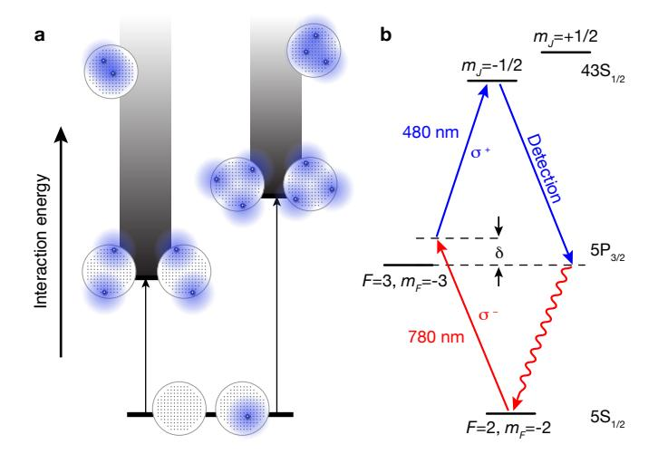
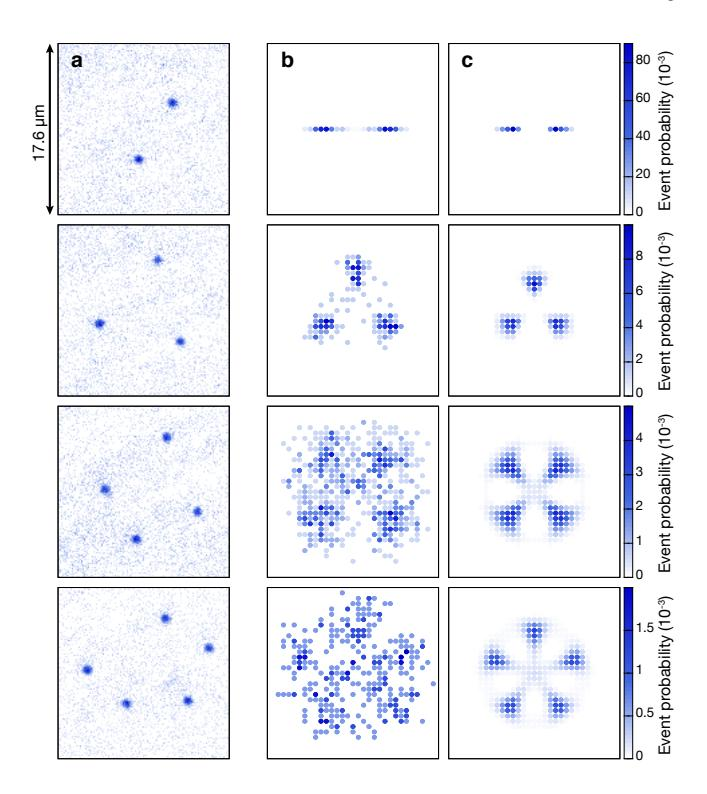
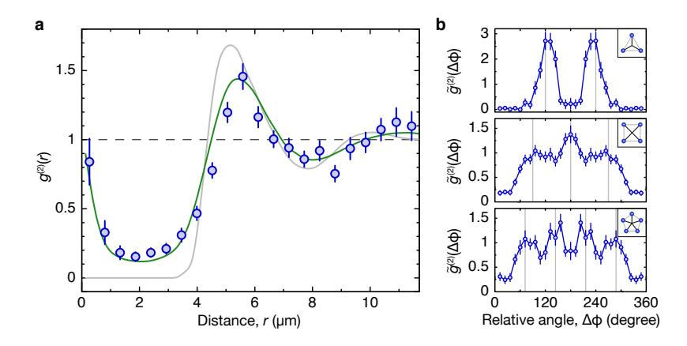
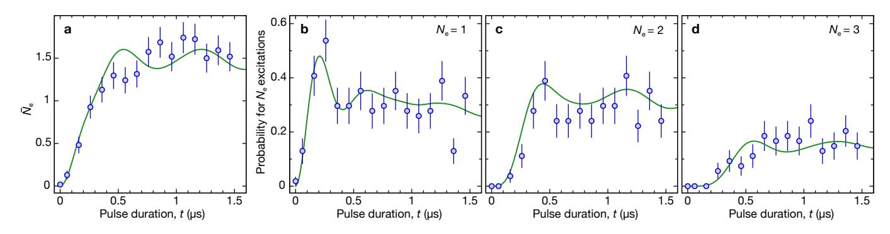
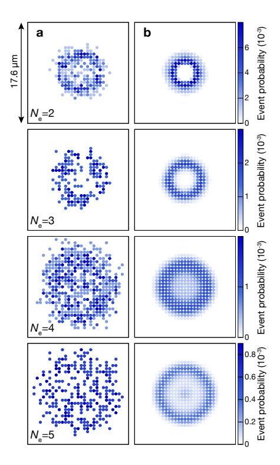
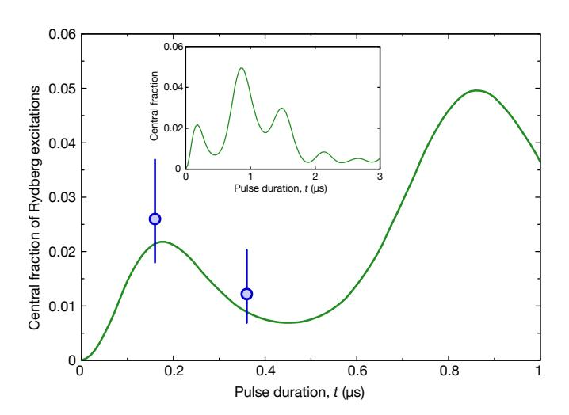
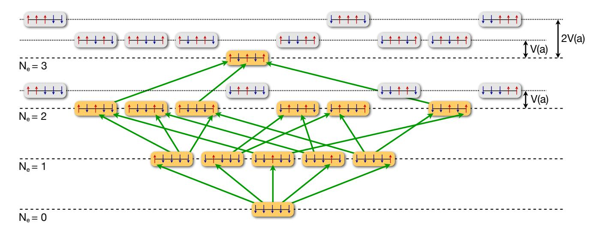

# Observation of mesoscopic crystalline structures in a two-dimensional Rydberg gas

Peter Schauß1,\*, Marc Cheneau1, Manuel Endres1, Takeshi Fukuhara1, Sebastian Hild1, Ahmed Omran1, Thomas Pohl2, Christian Gross1, Stefan Kuhr1,3, and Immanuel Bloch1,4

1 Max-Planck-Institut für Quantenoptik, 85748 Garching, Germany

2 Max-Planck-Institut für Physik komplexer Systeme, 01187 Dresden, Germany

3 University of Strathclyde, Department of Physics, SUPA, Glasgow G4 0NG, UK and

4 Ludwig-Maximilians-Universität, Fakultät für Physik, 80799 München, Germany

(Dated: 29 August 2012)

The ability to control and tune interactions in ultracold atomic gases has paved the way towards the realization of new phases of matter. Whereas experiments have so far achieved a high degree of control over short-ranged interactions, the realization of long-range interactions would open up a whole new realm of many-body physics and has become a central focus of research. Rydberg atoms are very well-suited to achieve this goal, as the van der Waals forces between them are many orders of magnitude larger than for ground state atoms [1]. Consequently, the mere laser excitation of ultracold gases can cause strongly correlated many-body states to emerge directly when atoms are transferred to Rydberg states. A key example are quantum crystals, composed of coherent superpositions of different spatially ordered configurations of collective excitations [2–5]. Here we report on the direct measurement of strong correlations in a laser excited two-dimensional atomic Mott insulator [6] using high-resolution, in-situ Rydberg atom imaging. The observations reveal the emergence of spatially ordered excitation patterns in the high-density components of the prepared many-body state. They have random orientation, but well defined geometry, forming mesoscopic crystals of collective excitations delocalised throughout the gas. Our experiment demonstrates the potential of Rydberg gases to realise exotic phases of matter, thereby laying the basis for quantum simulations of long-range interacting quantum magnets.

The strongly enhanced interaction between Rydberg atoms makes them unique building blocks for a variety of applications ranging from quantum optics and quantum information processing [1, 7, 8] to engineering of exotic quantum many-body phases [9-11]. For the latter purpose, two main ideas have been explored theoretically. On the one hand, the weak admixing of a Rydberg state to the atomic ground state using offresonant laser coupling was suggested as a way to benefit from the long-range interactions without persistent population in the Rydberg state [9, 10, 12]. On the other hand, direct laser excitation leads to the formation of a gas of Rydberg excitations, also called Rydberg gas. This strongly correlated system [13] can exhibit highly non-classical states characterized by the coherent superposition of ordered structures in the spatial distribution of the Rydberg excitations [2–5, 14–16]. Here the excitation dynamics proceeds on a timescale of a few microseconds, on which the atoms can be considered frozen in space, representing strongly interacting effective spins. At the heart of the formation of such correlated states lies the dipole blockade effect [1, 7, 8] that prevents simultaneous Rydberg excitation of two close-by atoms [17– 21. Recent experiments using two trapped atoms have shown how this blockade effect can be used to implement fast two-qubit quantum gates [22, 23]. In larger ultracold atomic ensembles, the coherence of the collective excitation was demonstrated [24–26] and evidence for strong correlations could be found by observing universal scaling laws for the number of excited Rydberg atoms [27, 28]. However, direct measurements of spatial ordering have remained an outstanding challenge. Important steps in this direction were recently explored using a field-ion-microscope [20], allowing for the measurement of the blockade radius in a three-dimensional Rydberg gas. Recent theoretical works, on the other hand, have proposed detection schemes with potential resolution below the blockade radius, based on conditional Raman transfer [29] or electromagnetically induced transparency [30].

Here, we demonstrate an alternative approach that permits direct imaging of spatial excitation patterns, and precise measurements of correlation functions. This allows to probe the underlying spatially ordered constituents of the excited many-body state, revealing crystalline excitation patterns of its high-density components. Two key advancements form the basis of our observations. First, a two-dimensional atomic Mott insulator provides a dense and well-ordered initial system that maximises coherence times during the excitation dynamics. Second, we developed an all-optical technique to image individual Rydberg atoms in-situ with high spatial and temporal resolution.

The physical system considered here is a two-dimensional gas of alkali atoms trapped in a rotationally invariant harmonic confinement potential and pinned in a square optical lattice. The gas was prepared deep in the Mott-insulating phase, ensuring uniform filling with one atom per site within a disk of radius  $R \simeq \sqrt{N_{\rm at} a_{\rm lat}^2/\pi}$ , where  $N_{\rm at}$  is the total number of atoms and  $a_{\rm lat}$  the

\* Electronic address: peter.schauss@mpq.mpg.de

Figure 1. Schematics of the many-body excitation. a, Energy spectrum in the absence of optical driving. States with more than one excitation form a broad energy band (gray shading) above the degenerate manifold comprising the ground state and all singly excited states. For each excitation number  $N_{\rm e}>1,$  the states with lowest energy correspond to spatially ordered configurations, which maximise the distance between the Rydberg excitations. The minimal interaction energy (black arrows) is determined by the finite system size and increases with  $N_{\rm e}$ . Possible spatial configurations of the excitations (blue dots) in the initial Mott-insulating state (black dots) are shown schematically as circular insets next to their respective interaction energy. The blockade radius is depicted by the blue shaded disc around the excitation. b, Simplified level scheme of 87Rb showing the transitions used for the Rydberg excitation and detection.

lattice spacing. The atoms were initially in their electronic ground state,  $|g\rangle$ , and then resonantly coupled to a Rydberg state,  $|e\rangle$ . In the interaction picture, the internal dynamics of the atoms is governed by the many-body Hamiltonian:

$$\hat{H} = \frac{\hbar\Omega}{2} \sum_{i} \left( \hat{\sigma}_{eg}^{(i)} + \hat{\sigma}_{ge}^{(i)} \right) + \sum_{i \neq j} \frac{V_{ij}}{2} \hat{\sigma}_{ee}^{(i)} \hat{\sigma}_{ee}^{(j)} . \tag{1}$$

Here, the vectors  $\boldsymbol{i}=(i_x,i_y)$  label the lattice sites in the plane. The first term in this Hamiltonian describes the coherent coupling of the ground and excited states with Rabi frequency  $\Omega$ , where  $\hat{\sigma}_{ge}^{(i)}=|e_i\rangle\langle g_i|$  and  $\hat{\sigma}_{eg}^{(i)}=|g_i\rangle\langle e_i|$  are the local transition operators. The second term is the van der Waals interaction potential between two atoms in the Rydberg state. In our case it is repulsive and takes the asymptotic form:  $V_{ij}=-C_6/r_{ij}^6$ , with the van der Waals coefficient  $C_6<0$  and  $r_{ij}=a_{\text{lat}}|i-j|$  the distance between the two atoms at sites  $\boldsymbol{i}$  and  $\boldsymbol{j}$ . The projection operator  $\hat{\sigma}_{ee}^{(i)}=|e_i\rangle\langle e_i|$  measures the population of the Rydberg state at site  $\boldsymbol{i}$ . This model is valid as long as the mechanical motion of the atoms and all decoherence effects can be neglected (Supplementary Information).

The dynamics of this strongly correlated system can

be understood intuitively from its energy spectrum in the absence of optical driving. It is instructive to group the large number of many-body states,  $2^{N_{\rm at}}$ , according to the number of Rydberg excitations,  $N_{\rm e}$ , contained in each state (Fig. 1a). All singly excited states ( $N_e = 1$ ) with different positions of the Rydberg atom have identical energies and form a  $N_{\rm at}$ -fold degenerate manifold. For multiply excited states  $(N_e > 1)$ , this degeneracy is lifted by the strong van der Waals interaction, giving rise to a broad energy band (Fig. 1a). Starting from the ground state, the creation of the first excitation is resonant, while the sequential coupling to many-body states with larger number of excitations is rapidly detuned by the interactions. In fact, the rapid variation of the van der Waals potential with distance prevents the excitation of all those states where Rydberg atoms are separated by less than the blockade radius,  $R_{\rm b}$ , defined by  $\hbar\Omega = -C_6/R_{\rm b}^6$ . The existence of this exclusion radius is expected to have a striking consequence: while the total many-body state exhibits finite-range correlations on a scale of  $R_{\rm b}$  [13], its high-density components with a Rydberg density close to  $1/R_{\rm b}^2$  should display a crystalline structure, meaning that the position of the Rydberg atoms is correlated over a distance comparable to the system size.

The excitation dynamics of all configurations should occur in an entirely coherent fashion, resulting in highly non-classical many-body states. First, the approximate rotational symmetry of our system leads to symmetric superpositions of all microscopic configurations with different orientation but identical relative positions of the Rydberg atoms. Second, since the coupling addresses all states within an energy range  $\sim \hbar\Omega$ , it produces a coherent superposition of many-body states with different number of excitations and slightly different separation between the Rydberg atoms (Fig. 1a). This collective nature of the excited many-body states dramatically changes the timescale on which their dynamics occurs. The coupling strength to the state with a single excitation is enhanced by a factor  $\sqrt{N_{\rm at}} \gg 1$  [8] and the coupling to states with  $N_{\rm e} > 1$  is similarly enhanced, with  $N_{\rm at}$  replaced by the number of energetically accessible configurations in each  $N_{\rm e}$ -manifold [3].

Our experiments began with the preparation of a twodimensional degenerate gas of 150 to 390  $^{87}\mathrm{Rb}$  atoms confined to a single antinode of a vertical (z-axis) optical lattice [31]. The gas was brought deep into the Mottinsulating phase by adiabatically turning on a square optical lattice with period  $a_{lat} = 532 \,\mathrm{nm}$  in the xy-plane. Within the system radius,  $R = 3.5 \,\mu\text{m}$  to  $5 \,\mu\text{m}$ , the probability of a lattice site to be occupied by a single atom was typically 80 %. The atoms were then initialised in the hyperfine ground state  $|g\rangle \equiv |5S_{1/2}, F = 2, m_F = -2\rangle$  and coupled to the Rydberg state  $|e\rangle \equiv |43S_{1/2}, m_J = -1/2\rangle$ (Fig. 1b). The coupling was achieved through a twophoton process via the intermediate state  $|5P_{3/2}, F| =$  $3, m_F = -3$  using lasers of wavelengths 780 nm and  $480 \,\mathrm{nm}$  and  $\sigma^-$  and  $\sigma^+$  polarisation, respectively (Fig. 1b and Methods). The resulting two-photon Rabi frequency

was Ω/(2π) = 170(20) kHz, yielding a blockade radius of Rb = 4.9(1) µm. Following the initial preparation, we suddenly switched on the excitation lasers and let the system evolve for a variable duration t. After the excitation pulse, we detected the Rydberg excitations by first removing all atoms in the ground state with a resonant laser pulse, then deexciting the Rydberg atoms to the ground state via stimulated emission towards the intermediate state (Fig. [1b](#page-1-0) and Methods) and finally recording their position using high-resolution fluorescence imaging [\[31\]](#page-5-10). The accuracy of the measurement was limited by the probability of 75(10) % to detect a Rydberg atom and by a background signal due to on average 0.2(1) nonremoved ground state atoms per picture (Supplementary Information). The spatial resolution of our detection technique is limited to about one lattice site by the residual motion of the atoms in the Rydberg state before deexcitation (Supplementary Information). Repeating the experiment many times allowed for sampling the different spatial configurations of Rydberg atoms constituting the many-body state and to measure their respective statistical weight.

In Fig. [2a](#page-2-0) we show typical images of microscopic configurations with Ne = 2-5. In order to analyse the structure of the many-body state, we group the individual images according to their number of excitations and determine the spatial distributions of the excitations, ρe(i) = hσˆ (i) ee i, where h · i denotes the average from repeated measurements. These distributions display a typical ring-shaped profile (Fig. [5\)](#page-6-0), which results from the blockade effect and from the rotational symmetry of the system. Crystalline structures become visible once each microscopic configuration has been centred and aligned to a fixed reference axis (Fig. [2b](#page-2-0) and Methods).

For our smallest sample (R ≈ 3.5 µm), we observe strong correlations between Ne = 2 excitations that are localized at a distance ∼ 6 µm, due to the interaction blockade. In the same dataset, configurations with Ne = 3 show an arrangement on an equilateral triangle, revealing both strong radial and azimuthal ordering. These correlations persist for larger numbers of Rydberg excitations, which we can prepare in larger samples (R ≈ 5 µm). They form quadratic and pentagonal configurations for Ne = 4 and Ne = 5, respectively. However, since their interaction energy is larger, these states are populated only with low probability, leading to a reduced signal-to-noise ratio. Our experimental data is in good agreement with numerical simulations of the many-body dynamics according to the Hamiltonian of Eq. [\(1\)](#page-1-1), for the same atom numbers, temperature and laser parameters as in the experiment (Fig. [2c](#page-2-0) and Supplementary Information). These simulations are based on a truncation of the underlying Hilbert space, exploiting the dipole blockade, and neglect any dissipative effects ([\[3\]](#page-4-14) and Supplementary Information). The spatial distributions of excitations provided by the simulation reproduce all the features observed in the experiment. The only apparent discrepancy is the overall

Figure 2. Mesoscopic crystalline components of the many-body states. Spatial distribution of excitations for the observed microscopic configurations sorted according to their number of excitations Ne = 2-5 (top to bottom row). a, Examples of false-colour fluorescence images in which deexcited Rydberg atoms are directly visible as dark-blue spots. b, Histograms of the spatial distribution of Rydberg atoms obtained after centring and aligning the individual microscopic configurations to a reference axis (Methods). The initial atom distribution had a diameter of 7.2(8) µm and 10.8(8) µm for Ne = 2-3 and Ne = 4-5, respectively. c, Theoretical prediction from numerical simulations of the excitation dynamics governed by the many-body Hamiltonian of Eq. [\(1\)](#page-1-1) for the same conditions as in the experiment (Supplementary Information).

slightly larger size of the measured structures, which can be attributed to the spatial resolution of our detection method, as discussed below.

For a more quantitative analysis of spatial correlations, we also measured the pair correlation function (Fig. [3a](#page-3-0))

$$g^{(2)}(r) = \frac{\sum_{i \neq j} \delta_{r, r_{ij}} \langle \hat{\sigma}_{ee}^{(i)} \hat{\sigma}_{ee}^{(j)} \rangle}{\sum_{i \neq j} \delta_{r, r_{ij}} \langle \hat{\sigma}_{ee}^{(i)} \rangle \langle \hat{\sigma}_{ee}^{(j)} \rangle}, \qquad (2)$$

which characterizes the occurrence of two excitations being separated by a distance r. Here δr,rij is the Kronecker symbol that restricts the sum to sites (i, j) for which rij = r. In contrast to the spatial distributions presented above, the average is now taken over all values of Ne. The pair correlation function g (2)(r) shows a strong suppression at distances smaller than r = 4.8(2) µm, which coincides with the expected blockade radius Rb = 4.9(1) µm. Moreover, we find a clear peak at r = 5.6(2) µm and evid-

Figure 3. Correlation functions of Rydberg excitations. a, Pair correlation function. The blockade effect results in a strong suppression of the probability to find two excitations separated by a distance less than the blockade radius  $R_b = 4.9(1) \, \mu \text{m}$ . Moreover, we observe a peak at  $r \simeq 5.6 \, \mu \text{m}$  and a weak oscillation at larger distances. The initial atom distribution had a diameter of  $10.8(8) \, \mu \text{m}$ . The experimental data (blue circles) are compared to the theoretical prediction both taking into account the independently characterized imperfections of our detection method (green line) and disregarding these imperfections (gray line). The dashed line marks the value of  $g^{(2)}$  in the absence of correlations. The error bars represent the standard error of the mean (s.e.m.) of  $g^{(2)}(r)$ . b, Azimuthal correlation function. The crystalline structure of the high-density components is best visible in the angular correlations around the centre of mass of the distribution of excitations, characterized by the correlation function  $\tilde{g}^{(2)}(\Delta \phi)$  defined in Eq. (3). By construction, this function is symmetric around 180°. Correlations are observed at the angles expected for the respective crystals shown in the insets. The peaks close to 180° are more pronounced since the centre of mass of a configuration is likely to lie close to the intersections of the diagonals, due to the blockade effect. Error bars, s.e.m.

ence for weak oscillations extending to the boundaries of our system. This indicates that the overall many-body state only exhibits finite-range correlations. Our theoretical calculation of  $g^{(2)}(r)$  (gray line in Fig. 3a) exhibits similar features, but shows more pronounced oscillations and vanishes perfectly within the blockade radius. These discrepancies can be attributed to several imperfections of the detection technique. The sharp peak at short distances  $r \lesssim 1 \,\mu \text{m}$  results from hopping of single atoms to adjacent sites during fluorescence imaging with a small probability of approximately 1%, which is falsely detected as two neighbouring excitations. The non-zero value of  $g^{(2)}(r)$  for distances  $r \lesssim 3 \,\mu\mathrm{m}$  arises from the imperfect removal of the ground state atoms. Finally, the shift and slight broadening of the peak in the correlation function is attributed to the residual motion of the Rydberg atoms before imaging (Supplementary Information). When accounting for these independently characterized effects in the theoretical calculations (green line in Fig. 3a), we recover excellent agreement with the measurements.

Since our system size is comparable to the blockade radius, the excitations in states with  $N_{\rm e}>1$  are localised along the circumference of the system. We characterize the resulting angular order by introducing an azimuthal correlation function that reflects the probability to find two excitations with a relative angle  $\Delta\phi$  measured with respect to the centre of mass of the distribution of excitations:

$$\tilde{g}^{(2)}(\Delta\phi) = \int \frac{\mathrm{d}\phi}{2\pi} \, \frac{\langle \hat{n}(\phi)\hat{n}(\phi + \Delta\phi)\rangle}{\langle \hat{n}(\phi)\rangle\langle \hat{n}(\phi + \Delta\phi)\rangle} \,. \tag{3}$$

Here  $\hat{n}(\phi) = \sum_{\pmb{i}} \delta_{\phi,\phi_i} \, \hat{\sigma}_{ee}^{(\pmb{i})}$  is the azimuthal distribution of excitations, with  $(r_{\pmb{i}},\phi_{\pmb{i}})$  the polar coordinates of the site  $\pmb{i}$ . As can be seen in Fig. 3b, the spatially ordered structure is clearly visible as correlations at relative angles  $\Delta\phi = \nu \times 360^\circ/N_{\rm e}$ , with  $\nu = 1,2,\ldots,N_{\rm e}$ , even for the largest excitation numbers.

We finally analyse the many-body excitation dynamics of the system. In Fig. 4a we show the time evolution of the average number of Rydberg excitations,  $\bar{N}_{\rm e} = \sum_{i} \langle \hat{\sigma}_{ee}^{(i)} \rangle$ , which quickly saturates to a small value  $\bar{N}_{\rm e} \simeq 1.5$ , much smaller than the total number of atoms in the system,  $N_{\rm at} = 150(30)$ . The saturation is reached in  $\sim 500\,\mathrm{ns}$ , a factor of ten faster than the Rabi period  $2\pi/\Omega$ , due to the collective enhancement of the optical coupling strength. The probability to observe  $N_{\rm e}$ Rydberg excitations shows a similar saturation profile for each excitation number  $N_{\rm e}$  (Fig. 4b-d), but on a timescale that increases with  $N_{\rm e},$  from about 200 ns for  $N_{\rm e}=1$ to about 600 ns for  $N_{\rm e}=3$ . This can be attributed to the variation of the collective enhancement factor associated with the number of energetically accessible microscopic configurations for a given  $N_{\rm e}$ . The theoretical excitation dynamics corresponding to the Hamiltonian (1) shows remarkable agreement with the experimental data when including the finite detection efficiency. This provides evidence that the dynamics observed in the experiment is coherent, as expected on these timescales, which are much shorter than the lifetime of the Rydberg state of 25(5) µs in the lattice and the timescale of other decoherence effects (Supplementary Information). The absence of high-contrast Rabi oscillations in the time evolution of

Figure 4. Time evolution of the number of Rydberg excitations. a, Average number of detected Rydberg atoms as a function of the excitation pulse duration. Error bars, s.e.m. b-d, Time evolution of the probability to observe  $N_{\rm e}=1$  (b),  $N_{\rm e}=2$  (c) and  $N_{\rm e}=3$  (d) Rydberg excitations. The experimental data (blue circles) are compared to the theoretical prediction (green line), which is based on initial ground state atom distributions observed in the experiment and neglects all decoherence effects. It takes into account the finite detection efficiency as a free parameter (75 %). Error bars, s.e.m.

the average number of Rydberg excitations is caused by the strong dephasing between many-body states with different interaction energies arising from the different spatial distribution of excitations. However, remnant signatures of Rabi oscillations can still be observed. In particular, the population of the singly excited states shows a peak around  $t=200(50)\,\mathrm{ns}$  (Fig. 4b), which matches the  $\pi$ -pulse time of the enhanced Rabi frequency  $\pi/\left(\sqrt{N_{\mathrm{at}}}\varOmega\right)=240(40)\,\mathrm{ns}$ . Further evidence for the coherence of the dynamics can be found in the spatially resolved analysis of the excitation dynamics (Supplementary Information).

In conclusion, we have characterised the strongly correlated excitation dynamics of a resonantly driven Rydberg gas using optical detection with unprecedented spatial resolution, and observed mesoscopic Rydberg crystals in the high-density components of the produced many-body states. One future challenge lies in the deterministic preparation of ground-state Rydberg crystals with a well-defined number of excitations via adiabatic

sweeps of the laser parameters [3, 4, 14]. Together with the demonstrated imaging technique, this would enable precise studies of quantum phase transitions in long-range interacting quantum systems on the microscopic level [2–4, 15]. Combining the dipole blockade effect with the single-atom addressing demonstrated already in our experimental setup, one could also engineer mesoscopic quantum gates [32], which can serve as an experimental "toolbox" for digital quantum simulations of a broad class of spin models, including such fundamental systems as Kitaev's toric code [33].

### ACKNOWLEDGEMENTS

We thank R. Löw for discussions. We acknowledge funding by MPG, DFG, EU (NAMEQUAM, AQUTE, Marie Curie Fellowship to M.C.) and JSPS (Postdoctoral Fellowship for Research Abroad to T.F.).

[1] M. Saffman, T. Walker, and K. Mølmer, Rev. Mod. Phys. 82, 2313 (2010).

[2] H. Weimer, R. Löw, T. Pfau, and H. P. Büchler, Phys. Rev. Lett. 101, 250601 (2008).

[3] T. Pohl, E. Demler, and M. D. Lukin, Phys. Rev. Lett. 104, 043002 (2010).

[4] J. Schachenmayer, I. Lesanovsky, A. Micheli, and A. J. Daley, New J. Phys. 12, 103044 (2010).

[5] M. Gärttner, K. P. Heeg, T. Gasenzer, and J. Evers, arXiv:1203.2884v2 (2012).

[6] I. Bloch, J. Dalibard, and W. Zwerger, Rev. Mod. Phys. 80, 885 (2008).

[7] D. Jaksch, J. I. Cirac, P. Zoller, R. Côté, and M. D. Lukin, Phys. Rev. Lett. 85, 2208 (2000).

[8] M. Lukin, M. Fleischhauer, R. Cote, L. Duan, D. Jaksch, J. Cirac, and P. Zoller, Phys. Rev. Lett. 87, 037901 (2001).

[9] G. Pupillo, A. Micheli, M. Boninsegni, I. Lesanovsky, and P. Zoller, Phys. Rev. Lett. 104, 223002 (2010).

[10] N. Henkel, R. Nath, and T. Pohl, Phys. Rev. Lett. 104, 195302 (2010).

[11] F. Cinti, P. Jain, M. Boninsegni, A. Micheli, P. Zoller, and G. Pupillo, Phys. Rev. Lett. 105, 135301 (2010).

[12] J. Honer, H. Weimer, T. Pfau, and H. Büchler, Phys. Rev. Lett. 105, 160404 (2010).

[13] F. Robicheaux and J. Hernández, Phys. Rev. A 72, 063403 (2005).

[14] R. M. W. van Bijnen, S. Smit, K. a. H. van Leeuwen, E. J. D. Vredenbregt, and S. J. J. M. F. Kokkelmans, J. Phys. B – At. Mol. Opt. 44, 184008 (2011).

[15] I. Lesanovsky, Phys. Rev. Lett. 106, 025301 (2011).

[16] M. Höning, D. Muth, D. Petrosyan, and M. Fleischhauer, arXiv:1208.2911 (2012).

[17] D. Tong, S. M. Farooqi, J. Stanojevic, S. Krishnan, Y. P. Zhang, R. Côté, E. E. Eyler, and P. L. Gould, Phys.

- Rev. Lett. 93[, 063001 \(2004\).](http://dx.doi.org/ 10.1103/PhysRevLett.93.063001)
- [18] E. Urban, T. A. Johnson, T. Henage, L. Isenhower, D. D. Yavuz, T. G. Walker, and M. Saffman, [Nature Phys.](http://dx.doi.org/10.1038/nphys1178) 5, [110 \(2009\).](http://dx.doi.org/10.1038/nphys1178)
- [19] A. Gaëtan, Y. Miroshnychenko, T. Wilk, A. Chotia, M. Viteau, D. Comparat, P. Pillet, A. Browaeys, and P. Grangier, [Nature Phys.](http://dx.doi.org/10.1038/nphys1183) 5, 115 (2009).
- [20] A. Schwarzkopf, R. Sapiro, and G. Raithel, [Phys. Rev.](http://dx.doi.org/10.1103/PhysRevLett.107.103001) Lett. 107[, 103001 \(2011\).](http://dx.doi.org/10.1103/PhysRevLett.107.103001)
- [21] Y. O. Dudin and A. Kuzmich, Science 336[, 887 \(2012\).](http://dx.doi.org/10.1126/science.1217901)
- [22] T. Wilk, A. Gaëtan, C. Evellin, J. Wolters, Y. Miroshnychenko, P. Grangier, and A. Browaeys, [Phys. Rev.](http://dx.doi.org/ 10.1103/PhysRevLett.104.010502) Lett. 104[, 010502 \(2010\).](http://dx.doi.org/ 10.1103/PhysRevLett.104.010502)
- [23] L. Isenhower, E. Urban, X. L. Zhang, A. T. Gill, T. Henage, T. A. Johnson, T. G. Walker, and M. Saffman, [Phys.](http://dx.doi.org/ 10.1103/PhysRevLett.104.010503) Rev. Lett. 104[, 010503 \(2010\).](http://dx.doi.org/ 10.1103/PhysRevLett.104.010503)
- [24] U. Raitzsch, V. Bendkowsky, R. Heidemann, B. Butscher, R. Löw, and T. Pfau, [Phys. Rev. Lett.](http://dx.doi.org/ 10.1103/PhysRevLett.100.013002) 100, 013002 [\(2008\).](http://dx.doi.org/ 10.1103/PhysRevLett.100.013002)
- [25] M. Reetz-Lamour, T. Amthor, J. Deiglmayr, and M. Weidemüller, [Phys. Rev. Lett.](http://dx.doi.org/10.1103/PhysRevLett.100.253001) 100, 253001 (2008).
- [26] Y. O. Dudin, L. Li, F. Bariani, and A. Kuzmich, [arXiv:1205.7061 \(2012\).](http://arxiv.org/abs/1205.7061)
- [27] R. Löw, H. Weimer, U. Krohn, R. Heidemann, V. Bendkowsky, B. Butscher, H. Büchler, and T. Pfau, Phys. Rev. A 80[, 033422 \(2009\).](http://dx.doi.org/ 10.1103/PhysRevA.80.033422)
- [28] M. Viteau, M. Bason, J. Radogostowicz, N. Malossi, D. Ciampini, O. Morsch, and E. Arimondo, [Phys. Rev.](http://dx.doi.org/ 10.1103/PhysRevLett.107.060402) Lett. 107[, 060402 \(2011\).](http://dx.doi.org/ 10.1103/PhysRevLett.107.060402)
- [29] B. Olmos, W. Li, S. Hofferberth, and I. Lesanovsky, Phys. Rev. A 84[, 041607\(R\) \(2011\).](http://dx.doi.org/ 10.1103/PhysRevA.84.041607)
- [30] G. Günter, M. Robert-de Saint-Vincent, H. Schempp, C. Hofmann, S. Whitlock, and M. Weidemüller, [Phys.](http://dx.doi.org/10.1103/PhysRevLett.108.013002) Rev. Lett. 108[, 013002 \(2012\).](http://dx.doi.org/10.1103/PhysRevLett.108.013002)
- [31] M. Endres, M. Cheneau, T. Fukuhara, C. Weitenberg, P. Schauß, C. Gross, L. Mazza, M. C. Bañuls, L. Pollet, I. Bloch, and S. Kuhr, Science 334[, 200 \(2011\).](http://dx.doi.org/10.1126/science.1209284)
- [32] M. Müller, I. Lesanovsky, H. Weimer, H. P. Büchler, and P. Zoller, [Phys. Rev. Lett.](http://dx.doi.org/10.1103/PhysRevLett.102.170502) 102, 170502 (2009).
- [33] H. Weimer, M. Müller, I. Lesanovsky, P. Zoller, and H. P. Büchler, [Nature Phys.](http://dx.doi.org/ 10.1038/nphys1614) 6, 382 (2010).
- [34] J. F. Sherson, C. Weitenberg, M. Endres, M. Cheneau, I. Bloch, and S. Kuhr, Nature 467[, 68 \(2010\).](http://dx.doi.org/ 10.1038/nature09378)
- [35] R. Löw, H. Weimer, J. Nipper, J. B. Balewski, B. Butscher, H. P. Büchler, and T. Pfau, [J. Phys. B](http://dx.doi.org/ 10.1088/0953-4075/45/11/113001) [– At. Mol. Opt.](http://dx.doi.org/ 10.1088/0953-4075/45/11/113001) 45, 113001 (2012).
- [36] R. M. Potvliege and C. S. Adams, [New J. Phys.](http://dx.doi.org/10.1088/1367-2630/8/8/163) 8, 163 [\(2006\).](http://dx.doi.org/10.1088/1367-2630/8/8/163)
- [37] S. Anderson, K. Younge, and G. Raithel, [Phys. Rev.](http://dx.doi.org/10.1103/PhysRevLett.107.263001) Lett. 107[, 263001 \(2011\).](http://dx.doi.org/10.1103/PhysRevLett.107.263001)
- [38] K. Singer, J. Stanojevic, M. Weidemüller, and R. Côté, [J. Phys. B – At. Mol. Opt.](http://dx.doi.org/10.1088/0953-4075/38/2/021) 38, S295 (2005).
- [39] M. Mack, F. Karlewski, H. Hattermann, S. Höckh, F. Jessen, D. Cano, and J. Fortágh, [Phys. Rev. A](http://pra.aps.org/abstract/PRA/v83/i5/e052515) 83, [052515 \(2011\).](http://pra.aps.org/abstract/PRA/v83/i5/e052515)
- [40] A. K. Mohapatra, T. R. Jackson, and C. S. Adams, [Phys.](http://dx.doi.org/10.1103/PhysRevLett.98.113003) Rev. Lett. 98[, 113003 \(2007\).](http://dx.doi.org/10.1103/PhysRevLett.98.113003)

## METHODS

Rydberg excitation and detection scheme The two excitation laser beams were counterpropagating

along the z-axis, with an intermediate-state detuning δ/(2π) = 742(2) MHz (Fig. [1b](#page-1-0)). During the sequence, a magnetic offset field of B ' 30 G along the z-axis defined the quantisation axis. The excitation pulse was performed by switching the laser at 780 nm while the laser at 480 nm was on. The temporal resolution of our measurement was thus set by the rise time of the 780 nm light, which was ' 40 ns. Immediately after the excitation pulse, we used near-resonant circularly-polarised laser beams to drive the transitions |5S1/2, F = 1i → |5P3/2, F = 2i and |5S1/2, F = 2i → |5P3/2, F = 3i and remove all ground state atoms, with a fidelity of 99.9 % in 10 µs. Subsequently, the Rydberg atoms were stimulated down to the ground state by resonantly driving the |43S1/2, mJ = −1/2i → |5P3/2, F = 3, mF = −3i transition for 2 µs.

Computation of the histograms The histograms shown in Fig. [2b](#page-2-0) are based on the digitised atom distribution reconstructed from the raw images [\[31\]](#page-5-10). They reflect the Rydberg atom distribution in a region of interest covering a disc of radius Rmax = 1.5 × R. Each individual image was aligned in the following way. First, we set the origin of the coordinate system to the centre of mass of the atom distribution. Then, for each atom we determined the angle between its position vector and a reference axis, and rotated the images about the origin by the mean value of these angles (repeating this operation would leave the configuration unchanged). The histograms contain data taken at different evolution times up to 4 µs, as we found no significant temporal dependence of the excitation patterns. The theoretical calculations used the same parameters as in the experiment (including temperature and atom number distribution of the initial state) and followed the same procedure to determine the Rydberg atom densities. Both the experimental and theoretical histograms were normalised such that the value at each bin represents the probability to observe a microscopic configuration with a Rydberg atom located at this position.

# SUPPLEMENTARY INFORMATION

### I. SPATIAL DISTRIBUTION OF THE EXCITATIONS WITHOUT ROTATIONAL ALIGNMENT

Here we show the spatial distribution of excitations based on the same data as in Fig. 2b and 2c of the main text but without the rotational alignment procedure described in the Methods section.

## II. SPATIALLY RESOLVED ANALYSIS OF THE EXCITATION DYNAMICS

The coherence of the dynamics can be revealed in a more obvious way by studying the time evolution of the spatial distribution of the Rydberg excitations. For this purpose, we considered the subset of microscopic configurations with only one excitation. Because the blockade radius is only slightly smaller than the system diameter, only those configurations in which the excitation is located close to the edge of the system are significantly coupled to configurations with two excitations. This results in different time constants for the dynamics at different distance r from the centre. We have investigated this effect theoretically by calculating the time evolution of the relative probability for the excitation to be located close to the centre of the system (green line in Fig. [6\)](#page-6-1). In contrast to Fig. 4 of the main text, we now observe Rabilike oscillations with notable amplitude over long timescales. We performed the corresponding measurement in the experiment for two pulse durations (blue circles) and find reasonable agreement. This provides further evid-

Figure 5. Spatial distribution of the distribution of excitations before rotation. a, Histograms constructed from the experimental data. The Rydberg atoms are excited with higher probability close to the edge than in the centre of the cloud. The resulting ring-shaped excitation region is clearly visible for Ne = 2 and 3. The contrast decreases for Ne = 4 and 5 due to the lower number of occurences in the experiment. b, Theoretical predictions for the excitation from initial clouds of same temperature and atom number as in the experiment (see Fig. 2 for details).

Figure 6. Excitation dynamics at the centre of the system. Relative number of excitations in the central nine sites as a function of the excitation pulse duration for microscopic configurations with a single excitation Ne = 1. The theoretical calculation (green line, inset) reveals the coherent evolution, which is hardly visible in the time evolution of the total excitation number. Two experimental points (blue circles) were obtained from an additional dataset containing about 800 images per pulse duration. It was characterized by the temperature of the initial state T = 9(2) nK, the atom number Nat = 210(30) and the radius R = 4.2(5) µm. These experimental parameters were included in the numerical simulation. The error bars denote one standard deviation of the mean (s.e.m.).

ence for the coherence of the many-body dynamics in the experiment.

## III. ADDITIONAL INFORMATION ON THE DATASETS

The experimental data results from three different datasets (A, B and C). Each dataset was characterized by a temperature, T, atom number, Nat, and diameter, 2R, which we extracted from a fit to the ground state atom distribution in the initial state [\[34\]](#page-5-13) (Table [I\)](#page-7-0). The datasets A and B were used for Fig. 2 and 3, while the dataset C was used for Fig. 4. The distribution of the number of excitations in the datasets A and B is detailed in Table [II,](#page-7-1) where we also indicated which subset of images was used for which figures. The dataset C consisted of 54 images per pulse duration and the relative distribution of excitations is directly visible in Fig. 4.

| d           | ataset A da | ataset B da | ataset C |
|-------------|-------------|-------------|----------|
| T (nK)      | 8(4)        | 13(2)       | 9(4)     |
| $N_{ m at}$ | 150(30)     | 390(30)     | 150(30)  |
| $R (\mu m)$ | 3.6(4)      | 5.4(4)      | 3.6(4)   |

Table I. Temperature T, atom number  $N_{\rm at}$  and radius R for the datasets A, B and C. Errors, s.d.

|                       | dataset A        |         | dataset B           |            |
|-----------------------|------------------|---------|---------------------|------------|
| number of excitations | number of images | figures | number of images | figures    |
| 0                     | 177              | _       | 321                 | _          |
| 1                     | 235              | _       | 375                 | 3a         |
| 2                     | 191              | 2a, 3b  | 390                 | 3a         |
| 3                     | 65               | 2a, 3b  | 308                 | 3a         |
| 4                     | 7                | _       | 177                 | 2a, 3a, 3b |
| 5                     | 1                | _       | 64                  | 2a, 3a, 3b |
| 6                     | 0                | _       | 14                  | _          |
| 7                     | 0                | _       | 5                   | _          |

Table II. Distribution of the number of excitations in the datasets A and B. For each subset of images we have also indicated in which figure of the main text it has been used.

## IV. NUMERICAL CALCULATIONS

In order to determine the dynamics governed by the Hamiltonian in Eq. (1), we expand the many-body wave function,  $|\psi\rangle$ , of the  $N_{\rm at}$ -atom system in terms of Fock-states

$$\begin{split} |\psi\rangle &= c^{(0)}|0\rangle + \sum_{\pmb{i}_1} c^{(1)}_{\pmb{i}_1}|\pmb{i}_1\rangle + \sum_{\pmb{i}_1,\pmb{i}_2} c^{(2)}_{\pmb{i}_1,\pmb{i}_2}|\pmb{i}_1,\pmb{i}_2\rangle + \dots \\ &+ \sum_{\pmb{i}_1,\dots,\pmb{i}_{N_{\rm at}}} c^{(N_{\rm at})}_{\pmb{i}_1,\dots,\pmb{i}_{N_{\rm at}}}|\pmb{i}_1,\dots,\pmb{i}_{N_{\rm at}}\rangle\;, \end{split}$$

where  $|i_1, \dots, i_{N_e}\rangle$  corresponds to a state with  $N_e$  Rydberg excitations located at lattice sites  $i_1$  to  $i_{N_e}$ , and  $c_{i_1,\ldots,i_{N_e}}^{(\widetilde{N_e})}$  denotes the respective time dependent amplitude. The basis states are eigenfunctions of the Hamiltonian (1) in the absence of laser driving, with energy eigenvalues  $E_{i_1,...,i_{N_e}}^{(N_e)} = \sum_{\alpha < \beta}^{N_e} V_{i_{\alpha}i_{\beta}}$ . For a system of  $N_{\rm at}$  atoms, this basis set expansion yields a set of  $2^{N_{\rm at}}$  coupled differential equations (Fig. 7). Due to the exponential growth of the number of many-body states with  $N_{\rm at}$ , a direct numerical propagation is practically impossible for the large number of atoms in our experiments,  $N_{\rm at} \sim 100$ . In order to make the calculations feasible, we exploit the blockade effect and discard all manybody states containing Rydberg atom pairs separated by less than a critical distance  $R_{\rm c}$ . For the present simulations, we obtain well-converged results for  $R_{\rm c} \simeq R_{\rm b}/2$ , where  $R_{\rm b}$  is the blockade radius. The resulting geometric constraint not only reduces the number of relevant manybody states within a given  $N_{\rm e}$ -manifold, but, due to the finite system size, also restricts the total number of excitations  $N_{\rm e}$  necessary to obtain converged results. For the parameters considered in this work, a maximum number of Rydberg excitations of  $N_{\rm e}^{\,\rm (max)}=6$  was found sufficient. This procedure allows to significantly mitigate the otherwise strong exponential scaling of the underlying Hilbert space dimension, and yields a power-law dependence  $\sim N_{\rm at}^{N_{\rm e}^{(\rm max)}}$  of the number of relevant basis states on the total number of atoms. This makes the computations feasible, albeit still demanding, for such large systems as in our experiment.

#### V. OPTICAL DETECTION SCHEME

We developed a fully-optical detection technique for Rydberg atoms, which represents an alternative to the usual detection schemes based on the ionisation of Rydberg atoms [18, 20, 35, 36]. Here, we provide additional details to those given in the main text, especially regarding the detection efficiency and spatial resolution.

### A. Stimulated deexcitation of the Rydberg atoms

We stimulated the Rydberg atoms down to the ground state by resonantly driving the  $|43S_{1/2}, m_J = -1/2\rangle \rightarrow$  $|5P_{3/2}, F| = 3, m_F = -3\rangle$  transition. The Rabi frequency associated with this resonant single-photon transition was typically several MHz. In combination with the short lifetime of the  $5P_{3/2}$  state (27 ns), this allows for a very efficient and fast ( $< 2 \mu s$ ) pumping to the ground state. The laser light resonant with the transition between the Rydberg and the intermediate states was produced by a resonant electro-optical modulator (EOM) in the path of the excitation laser at 480 nm, which created a sideband at the desired intermediatestate detuning  $\delta/(2\pi) = 742 \,\mathrm{MHz}$ . The other sideband and the carrier have negligible influence on the atoms in the deexcitation phase since they are off-resonant. The EOM also allows for the required fast switching of the deexcitation light within  $< 1 \, \mu s$ .

#### B. Spatial resolution

Two effects can in principle limit the spatial resolution of our detection technique. The first one is the residual hopping of the atoms during the fluorescence imaging phase. We found that such an event can occur in our experiment with a probability of approximately 1% per particle. When this happens, the moving atom will yield a fluorescence signal on two adjacent sites, which can be falsely attributed to two distinct atoms by the reconstruction algorithm. This detection artifact results in a correlation signal at short distances  $r < 1 \, \mu m$  (Fig. 3a). However, due to their rarity these events have negligible influence on the spatial resolution. The second effect is

Figure 7. Schematics of the numerical calculations. The underlying many-body level structure is shown for the example of a one-dimensional chain of five atoms. The atomic states are symbolised by effective spins, with spin-down (blue arrows) and spin-up (red arrows) corresponding to the atomic ground and Rydberg state, respectively. In the displayed example, we consider strong interactions  $V(a) \gg \hbar\Omega$  between adjacent Rydberg excitations, while next-nearest neighbour interactions  $V(2a) = V(a)/64 < \hbar\Omega$  are assumed to be smaller than the laser coupling strength. Consequently, the dynamics of near resonant basis states (orange boxes) is explicitly calculated in the simulations, while strongly shifted states (grey boxes) do not participate in the excitation dynamics and are discarded (see text for further details). The near-resonant laser coupling between relevant many-body states is indicated by the green arrows. Due to the strong geometrical constraint imposed by the interaction blockade combined with the finite system size, many-body states containing more than  $N_{\rm e}=3$  Rydberg excitations do not need to be considered.

the possible motion of the Rydberg atoms in the optical lattice potential before the imaging phase. For Rydberg atoms, the lattice potential has similar amplitude but opposite sign compared to ground state atoms [37]. An excited atom therefore finds itself at a maximum of the periodic potential and can move in the xy-plane with an average velocity of  $\sim 30\,\mathrm{nm/\mu s}$ , for a typical depth of the optical lattice potential of  $V_{\mathrm{lat}} = 40\,E_{\mathrm{r}}$ . Both effects lead to a possible motion of the Rydberg atoms by about one lattice site during the  $10\,\mathrm{\mu s}$  of the removal pulse. The recoil velocity acquired in the two-photon excitation process is insignificant in comparison as it is oriented along z-direction and only of smaller magnitude  $\simeq 4\,\mathrm{nm/\mu s}$ .

#### C. Detection efficiency

The detection efficiency for Rydberg atoms in our setup is limited by the lifetime of the Rydberg state and by the anti-confining character of the optical lattice potential for the Rydberg atoms. If a Rydberg atom decays to the ground state during the removal pulse, it will be removed as well and not detected. The residual motion of the Rydberg atoms in the lattice potential also leads to a reduction of the detection efficiency when the atoms move away from the focal plane of the imaging system, which has a depth of focus of order 1 µm. Both effects can be reduced by minimising the time the atoms spend in the Rydberg state after the excitation pulse, by reducing

the duration of the removal pulse for the ground state atoms. A removal pulse duration of 10 µs turned out to offer the best compromise between a good detection efficiency of Rydberg atoms and a low survival probability of ground state atoms.

We estimated the detection efficiency in three different ways. First, we measured the lifetime of the atoms in the Rydberg state in the lattice by varying the duration of the removal pulse. We fitted a 1/e-decay time  $\tau = 25(5)$  us, which corresponds to a detection efficiency of 65(5) %. A second estimation is provided by the time evolution of the number of Rydberg excitation displayed in Fig. 4. Here the theoretical prediction matches the data best when assuming a detection efficiency of  $\sim 75 \%$ , which is compatible with the previous estimate. Finally, the statistical weight of the different number of excitations can also be related to the detection efficiency. This last estimation points to a higher detection efficiency of  $\sim 80\%$ . Combining all these values with equal weight, we finally obtain a detection efficiency of 75 % with an uncertainty of about 10%.

#### VI. VALIDITY OF THE THE MODEL

The validity of the Hamiltonian in Eq. (1) for our experimental system relies on two main assumptions, which are discussed in this section: the positions of the atoms is frozen during the dynamics and all decoherence sources

can be neglected.

#### A. Movement of the atoms during the dynamics

The ground state atoms were confined in a three-dimensional optical lattice of depth  $V_{xy}=40(3)\,E_{\rm r}$  in the xy-plane and  $V_z=75(5)\,E_{\rm r}$  along the z-axis, where  $E_{\rm r}=(2\pi\hbar)^2/(8ma_{\rm lat}^2)$  denotes the recoil energy of the lattice, and m the atomic mass of  $^{87}{\rm Rb}$ . For the minimum lattice depth used in the experiment of  $V_{\rm lat}=40\,E_{\rm r}$ , the time associated to the inverse of the tunnelling matrix element was  $\hbar/J\simeq 700\,{\rm ms}$ , and therefore negligible compared to the timescale of the internal dynamics. The Rydberg atoms move in the lattice potential with a typical velocity of  $30\,{\rm nm/\mu s}$  (see discussion in Section V B), which can also be neglected.

### B. Light scattering from the intermediate state

One source of decoherence in our experimental system is light scattering from the intermediate state used in the two-photon excitation process. The laser beam off-resonantly driving the ground-to-intermediate-state transition had a detuning of 742 MHz and an intensity of  $\sim 450\,\mathrm{mW/cm^2}$ , yielding a scattering rate of  $9\times10^4\,\mathrm{s^{-1}}$ . This corresponds to a coherence time of  $11\,\mu\mathrm{s}$ , which is a factor of ten longer than the typical timescale of the many-body dynamics.

#### C. Laser linewidth

The finite spectral width of the optical radiation driving the transition to the Rydberg state acts as a decoherence source and was reduced by carefully stabilising the frequency of the excitation lasers. We could achieve a two-photon linewidth of  $\approx 70\,\mathrm{kHz}$ , leading to a coherence time of 14 µs. Technical details on the laser setup are provided in Section VII.

## D. Two-photon Rabi frequency

We determined the two-photon Rabi frequency by driving Rabi oscillation in a very dilute system, where the average distance between two atoms was larger than the blockade radius of the 43S state, for which the van der Waals coefficient is  $C_6 = -1.6 \times 10^{-60} \, \mathrm{J\,m^6}$  [38]. The measurement was very time-consuming in our experimental setup since at such densities only a few atoms are located within the waist of the excitation lasers, resulting in a very low signal (about one Rydberg excitation per image) with relatively large fluctuations. We could observe one period of the Rabi oscillation, as expected from the combined coherence time of light scattering and laser linewidth of 6 µs, and extracted from the data a Rabi frequency of  $\Omega/(2\pi) = 170(20) \, \mathrm{kHz}$ .

The waists of the two laser beams of wavelength 780 nm and 480 nm [39] driving the two-photon transition were 57(2)  $\mu m$  and 17(5)  $\mu m$ , respectively. The largest systems we studied had a radius of 5.4  $\mu m$ , leading to a variation in the coupling strength to the Rydberg state by  $<20\,\%$  over the whole system.

## VII. LASER SETUP

The light at a wavelength of 780 nm was produced by a diode laser whose frequency was stabilised using a modulation transfer spectroscopy in a rubidium vapour cell. The light at 480 nm was generated by frequencydoubling light at 960 nm, which was emitted from a diode laser and amplified by a tampered amplifier. This second laser was stabilised by a phase-lock to a master laser, which allows for tuning its frequency while maintaining the narrow laser linewidth. The master laser at 960 nm was locked to a temperature stabilised ULE cavity in a vacuum chamber. The short-term linewidth of both excitation lasers was measured using an independent resonator (EagleEye, Sirah Laser- und Plasmatechnik GmbH, Germany), which can resolve linewidths down to  $\sim 20 \, \mathrm{kHz}$ . We obtained a linewidth of 20 kHz for the laser at 480 nm and 50 kHz for the laser at 780 nm. We measured the long-term stability of the two-photon excitation to be 50 kHz over several hours (FWHM of the centre of the line) using EIT-spectroscopy in a rubidium vapour cell [40].