# **Phase Gadget Synthesis for Shallow Circuits**

Alexander Cowtan1 Silas Dilkes1 Ross Duncan1*,*2*,*∗ Will Simmons1*,*† Seyon Sivarajah1

1 *Cambridge Quantum Computing Ltd 9a Bridge Street, Cambridge, United Kingdom* 2 *Department of Computer and Information Sciences University of Strathclyde 26 Richmond Street, Glasgow, United Kingdom*

We give an overview of the circuit optimisation methods used by t|keti, a compiler system for quantum software developed by Cambridge Quantum Computing Ltd. We focus on a novel technique based around *phase gadgets*, a family of multi-qubit quantum operations which occur naturally in a wide range of quantum circuits of practical interest. The phase gadgets have a simple presentation in the zx-calculus, which makes it easy to reason about them. Taking advantage of this, we present an efficient method to translate the phase gadgets back to ∧*X* gates and single qubit operations suitable for execution on a quantum computer with significant reductions in gate count and circuit depth. We demonstrate the effectiveness of these methods on a quantum chemistry benchmarking set based on variational circuits for ground state estimation of small molecules.

#### **1 Introduction**

Until fully fault-tolerant quantum computers are available, we must live with the so-called Noisy Intermediate-Scale Quantum (NISQ) devices and the severe restrictions which they impose on the circuits that can be run. Few qubits are available, but limited coherence time and gate fidelity also limit the depth of circuits which can complete before being overwhelmed by errors. Automated circuit optimisation techniques are therefore essential to extract the maximum value from these devices, and such optimisation routines are becoming a standard part of compilation frameworks for quantum software [\[26\]](#page-13-0).

In this paper we give an overview of some circuit optimisation methods used in the t|keti retargetable compiler platform [1](#page-0-0) . t|keti can generate circuits which are executable on different quantum devices, solving the architectural constraints [\[15\]](#page-13-1), and translating to the required gate set, whilst minimising the gate count and circuit depth. It is compatible with many common quantum software stacks, with current support for the Qiskit [\[20\]](#page-13-2), Cirq [\[30\]](#page-13-3), and PyQuil [\[28\]](#page-13-4) frameworks.

Much work on circuit optimisation focuses on reducing *T*-count [\[2,](#page-12-0) [8,](#page-12-1) [19,](#page-13-5) [23\]](#page-13-6), a metric of some importance when considering fault-tolerant quantum computation. However, since we consider raw physical circuits, the metrics of interest for us are the total circuit depth and the number of two-qubit gates, since minimising these parameters serves as a good proxy for minimising total error rate in the circuit. The novel contribution is a new technique for circuit optimisation by

∗ ross.duncan@strath.ac.uk

†will.simmons@cambridgequantum.com

1 t|keti can be installed as a python module via PyPI: <https://pypi.org/project/pytket/>

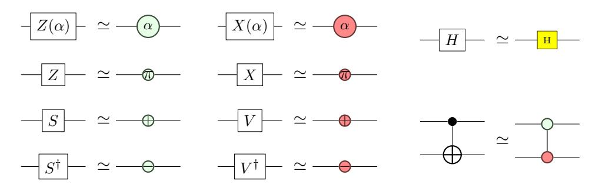

Figure 1: Common circuit gates and their representations in the scalar-free zx-calculus

exploiting symmetric structures for exponentials of Pauli strings, called *Pauli gadgets*, derived using phase gadget structures in the zx-calculus. Pauli gadgets occur naturally in quantum simulations where a Hamiltonian is decomposed into a sum of Pauli tensors and Trotterised [\[25\]](#page-13-7). Hence these techniques are specifically useful to optimise quantum circuits for quantum chemistry simulations [\[12\]](#page-12-2).

**Notation:** In the following, we will mix freely the usual quantum circuit notation and the scalar-free zx-calculus [\[13\]](#page-12-3). For both forms of diagram, we will follow a left-to-right convention. We will also adopt the same convention for composition of circuits in equations, i.e. *C*;*D* means we apply *C* first, followed by *D*. A translation of common gates between the two formalisms is given in Figure [1.](#page-1-0) A brief introduction to the zx-calculus is found in [\[18\]](#page-13-8); for a complete treatment see [\[14\]](#page-13-9). For reasons of space we omit the zx-calculus inference rules, however we use the complete set of Vilmart [\[32\]](#page-13-10).

**Remark:** Late during the preparation of this paper, it came to our attention that Litinski [\[24\]](#page-13-11) has defined a notation for Pauli product operators essentially equivalent to the Pauli gadgets of Section [4.](#page-4-0) Since that work concerns computing under a surface code, this suggests applications of our approach beyond the near term quantum devices we focus on here. The use of zx-calculus for lattice surgery by de Beaudrap and Horsman [\[7\]](#page-12-4) offers an obvious route.

# **2 Circuit Optimisations**

Circuit optimisation is typically carried out by pattern replacement: recognising a subcircuit of specific form and replacing it with an equivalent. This is sometimes called *peephole optimisation* in analogy to local optimisation techniques in classical compilers; however in the case of quantum circuits any connected subcircuit can be replaced, including the entire circuit. Usually the replacement is cheaper with respect to some cost metric, but in a multi-pass optimiser like t|keti, the replacement may enable a more powerful later optimisation pass, rather than improving the circuit itself, or map the circuit onto a particular gate set supported by the target device.

In t|keti, circuits are represented internally as non-planar maps, a generalisation of directed graphs wherein the incident edges at each vertex are ordered, to admit non-commutative operations like the ∧*X* gate. Unlike operation lists or discrete time frames, this representation preserves only the connectivity of the operations, abstracting away qubit permutations and timing information. The t|keti optimiser consists of multiple rewriting strategies called *passes* which may be combined to achieve the desired circuit transformation2. The primitive rewriting steps are computed by the double pushout method [17], although the matching is usually achieved by a custom search algorithm for efficiency reasons.

Simple examples include merging adjacent rotation gates acting on the same basis, cancelling operation-inverse pairs, and applying commutation rules. Any sequence of single-qubit operations may be fused into a single unitary, for which an Euler decomposition can be computed.  $t|ket\rangle$  has the possibility to choose which basis of rotations to use for the Euler form – for example ZXZ or XZX – depending on local context, which can permit more commutations, or easy translation to a native gate set (for example, ZYZ triples are useful to match the U3 gate supported in the Qiskit framework [20]).

If the circuit contains a long sequence of gates acting on the same two qubits, the KAK (Cartan) decomposition [9, 31] may be applied. This gives a canonical form requiring at most three  $\land X$  gates. Even when arbitrary rotations are permitted, realistic circuits include significant Clifford subcircuits. In particular,  $\mathsf{t}|\mathsf{ket}\rangle$  takes rules from [18] to reduce any pair of  $\land X$  gates that are separated only by single-qubit Clifford gates. However there is a very wide literature on Clifford circuits which could be applied here [1, 16, 29]. In the following sections we describe a novel technique for optimising a new class of multi-qubit subcircuits, called phase gadgets and Pauli gadgets.

#### 3 Phase Gadgets

In principle, local rewriting of gate sequences is sufficient for any circuit optimisation3. However, in practice, good results often require manipulation of large-scale structures in the quantum circuit. Phase gadgets are one such macroscopic structure that is easy to identify within circuits, easy to synthesise back into a circuit, and have a useful algebra of interactions with one another. **Definition 3.1.** The Z-phase gadgets  $\Phi_n(\alpha): \mathbb{C}^{\otimes n} \to \mathbb{C}^{\otimes n}$  are a family of unitary maps we define recursively as:

$$\Phi_{1}(\alpha) := Z(\alpha) \qquad \qquad \Phi_{n+1}(\alpha) := (\land X \otimes 1_{n-1}); (1_{1} \otimes \Phi_{n}(\alpha)); (\land X \otimes 1_{n-1})$$

$$\vdots \qquad \vdots \qquad \vdots \qquad \vdots \qquad \vdots \qquad \vdots \qquad \vdots$$

$$\vdots \qquad \vdots \qquad \vdots \qquad \vdots \qquad \vdots \qquad \vdots$$

**Remark 3.2.** We could equally define the X-phase gadget as the colour dual of the Z-phase gadget, and the Y-phase gadget by conjugating the Z-phase gadget with  $X(\frac{\pi}{2})$  rotations. Since we won't needs these in this paper, we'll refer to the Z-phase gadget simply as a phase gadget.

Lemma 3.3. In zx-calculus notation we have:

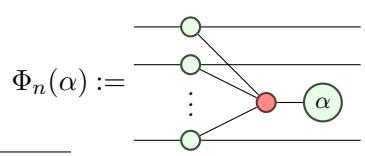

&lt;sup>2 We regret that at the time of writing this feature is not in the publicly available pytket release; it is planned for a future release.

&lt;sup>3This is a consequence of the completeness of the zx-calculus [32].

**Corollary 3.4.** We have the following laws for decomposition, commutation, and fusion of phase gadgets.

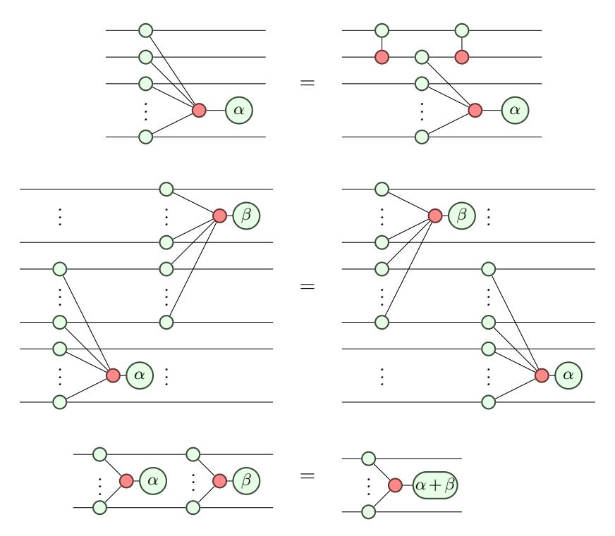

The decomposition law gives the canonical way to synthesise a quantum circuit corresponding to a given phase gadget. However, from the zx-calculus form, it's immediate that phase gadgets are invariant under permutation of their qubits, giving the compiler a lot of freedom to synthesise circuits which are amenable to optimisation. As a simple example, the naive  $\wedge X$  ladder approach, shown in Figure 2, requires a  $\wedge X$ -depth of 2(n-1) to synthesise an n-qubit phase gadget; replacing this with a balanced tree yields a  $\wedge X$  depth of  $2\lceil \log n \rceil$ . Note that the quantity of  $\wedge X$  gates used is still (and always will be) 2(n-1), but we can still obtain benefits with respect to depth.

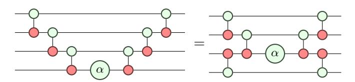

Figure 2: Comparing the worst-case and best-case patterns for constructing phase gadgets with respect to  $\wedge X$  depth. The left shows a  $\wedge X$  ladder as produced within the Unitary Coupled Cluster generator in IBM Qiskit Aqua, and the right is the optimal balanced-tree form used by  $t|ket\rangle$ .

Further, in the balanced tree form more of the  $\land X$  gates are "exposed" to the rest of the circuit, and could potentially be eliminated by a later optimisation pass. Note that this form is not unique, allowing synthesis informed by the circuit context in which the phase gadget occurs. For example,  $\mathsf{t}|\mathsf{ket}\rangle$  aligns the  $\land X$ s between consecutive phase gadgets whenever possible.

Trotterised evolution operators, as commonly found in quantum chemistry simulations, have the general form of a sequence of phase gadgets, separated by a layer of single-qubit Clifford rotations. For each consecutive pair of gadgets, if the outermost ∧*X*s align then they can both be eliminated, or if there are some intervening Clifford gates then we can use Clifford optimisation techniques to remove at least one of the ∧*X*s.

### **4 Pauli Gadgets**

In the language of matrix exponentials, the phase gadget Φ*n*(2*α*) corresponds to the operator *e* −*iαZ*⊗*n* . A consequence of Corollary [3.4](#page-3-1) is that any circuit *P* consisting entirely of *Z*-phase gadgets can be represented succinctly in the form:

$$P|x_1x_2...x_n\rangle = e^{-i\sum_j \alpha_j f_j(x_1, x_2, ..., x_n)}|x_1x_2...x_n\rangle$$
(1)

for some Boolean linear functions *fj* . For comparison, *phase-polynomial* circuits *C* (the class of circuits that can be built from {∧*X,T*} [\[3\]](#page-12-7)) can be represented as:

$$C|x_1x_2...x_n\rangle = e^{i\frac{\pi}{4}\sum_j f_j(x_1, x_2, ..., x_n)}|g(x_1, x_2, ..., x_n)\rangle$$
 (2)

for Boolean linear functions *fj* and a linear reversible function *g*. There is already a wide literature covering phase-polynomials and optimisations with them [\[2,](#page-12-0) [4,](#page-12-8) [26\]](#page-13-0).

The correspondence between phase gadgets and matrix exponentials generalises to exponentials of any Pauli tensor *e* −*iασ*1*σ*2*...σn* , by conjugating the phase gadget with approriate Clifford operators as shown in Figure [3.](#page-5-0)

**Definition 4.1.** Let *s* be a word over the alphabet {*X,Y,Z*}; then the *Pauli gadget P*(*α,s*) is defined as *U*(*s*);Φ|*s*| (*α*);*U*(*s*) † where the unitary *U*(*s*) is defined by recursion over *s*:

$$U(Zs') = I \otimes U(s') \qquad U(Ys') = X(\frac{\pi}{2}) \otimes U(s') \qquad U(Xs') = H \otimes U(s')$$

Definition [4.1](#page-4-1) can be easily extended to aribitrary strings over the Paulis (i.e. including the identity) by adding wires which the phase gadget does not act on. This is illustrated in Figure [3.](#page-5-0) Taking advantage of this we'll generally assume that the Pauli gadget is the full width of the circuit, although it may not act on every qubit.

In general, Pauli gadgets present difficulties for phase-polynomial-based circuit optimisation methods, as not all pairs of Pauli evolution operators will commute (for the simplest example, consider *e* −*iαXe* −*iβZ* 6= *e* −*iγZe* −*iδX* for any non-degenerate choices of angles). We now generalise the results of the preceding section to consider interactions between Pauli gadgets. The following is easy to demonstrate using matrix exponentials.

**Proposition 4.2.** *Let P and Q be Pauli tensors, then either (i) e* −*iαP e* −*iβQ* = *e* −*iβQe* −*iαP for all α and β; or (ii) for all αi there exist βi such that*

$$e^{-i\alpha_1 P} e^{-i\alpha_2 Q} e^{-i\alpha_3 P} = e^{-i\beta_1 Q} e^{-i\beta_2 P} e^{-i\beta_3 Q}$$

$$\tag{4}$$

Note that the *αi* and *βi* are computed as the Euler-angle decompositions of a combined rotation. Taking *P* = *Z* and *Q* = *X*, Equation [\(4\)](#page-4-2) is axiom (EU) of the ZX-calculus [\[32\]](#page-13-10). We will give a zx-calculus proof of this theorem for Pauli gadgets, with an intermediate state giving a very compact circuit representation for any consecutive pair of Pauli gadgets.

The following lemmas have elementary proofs.

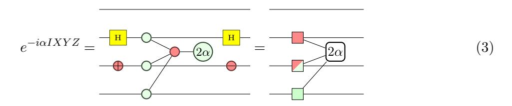

Figure 3: An example of the correspondence between Pauli evolution operators and phase gadgets. We introduce this notation on the right for a more succinct graphical representation. The green, red, and mixed-colour boxes respectively represent the Pauli gadget acting on a qubit in the Z, X, and Y bases. These are formed by a phase gadget on the qubits (generating all Z interactions), then optionally conjugating the qubits with Hadamard gates for X, or  $X(\frac{\pi}{2})$  gates for Y. We omit trivial qubits (I) from the diagrammatic representation.

**Lemma 4.3.** The commutation rules for Pauli gadgets and single-qubit Clifford gates, shown in Figure 4 are derivable in the ZX-calculus.

**Lemma 4.4.** The commutation rules for Pauli gadgets and  $\wedge X$  gates, shown in Figure 5 are derivable in the ZX-calculus.

Note that Figures 4 and 5 are not exhaustive, but they suffice for present purposes.

It will be useful to define some notation for working with strings of Paulis. For strings s and t we write their concatenation as st;  $s_i$  denotes the ith symbol of s; and |s| denotes the length of s. A string consisting entirely of I is called trivial. We say that t is a substring of s when, for all i,  $s_i \neq t_i$  implies  $t_i = I$ ; if in addition  $s \neq t$  and t is non-trivial then t is proper substring. We write  $t \cdot s$  for the pointwise multiplication of Pauli strings (up to global phase); in particular if t is a substring of s then  $(t \cdot s)_i = I$  iff  $s_i = t_i$  and is  $s_i$  otherwise. The intersection of strings s and t is the set of indices i satisfying  $s_i \neq I$  and  $t_i \neq I$ .

**Lemma 4.5.** Let st be a Pauli string; then for all  $\alpha$  there exists a Clifford unitary U acting on |s|+1 qubits such that

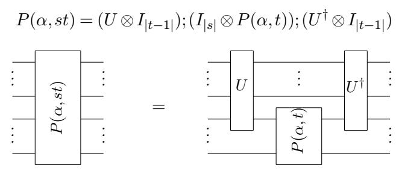

Further, U can be constructed in a canonical form which depends only on the string s.

Proof. For simplicity of exposition we assume  $s_i, t_j \neq I$  for all i and j. We construct U in two layers. The first layer of gates corresponds to U(s) from Definition 4.1. By 4.3, these gates can pass through  $P(\alpha, Z^{|s|}t)$  and cancel with their inverses from  $U^{\dagger}$  to give  $P(\alpha, st)$ . Similarly, a  $\wedge X$  gate on the first two qubits can pass through  $I \otimes P(\alpha, Z^{|s|-1}t)$  to give  $P(\alpha, st)$  by Lemma 4.4. The second layer of U is a chain of  $\wedge X$  gates that repeats this to convert  $P(\alpha, t)$  to  $P(\alpha, Z^{|s|}t)$ . The final  $\wedge X$  in this chain acts has its target on the (|s|+1)th qubit, corresponding to  $t_1$ . If  $t_1 = X$ , then the  $\wedge X$  will commute through  $P(\alpha, t)$  without extending it, so additional single

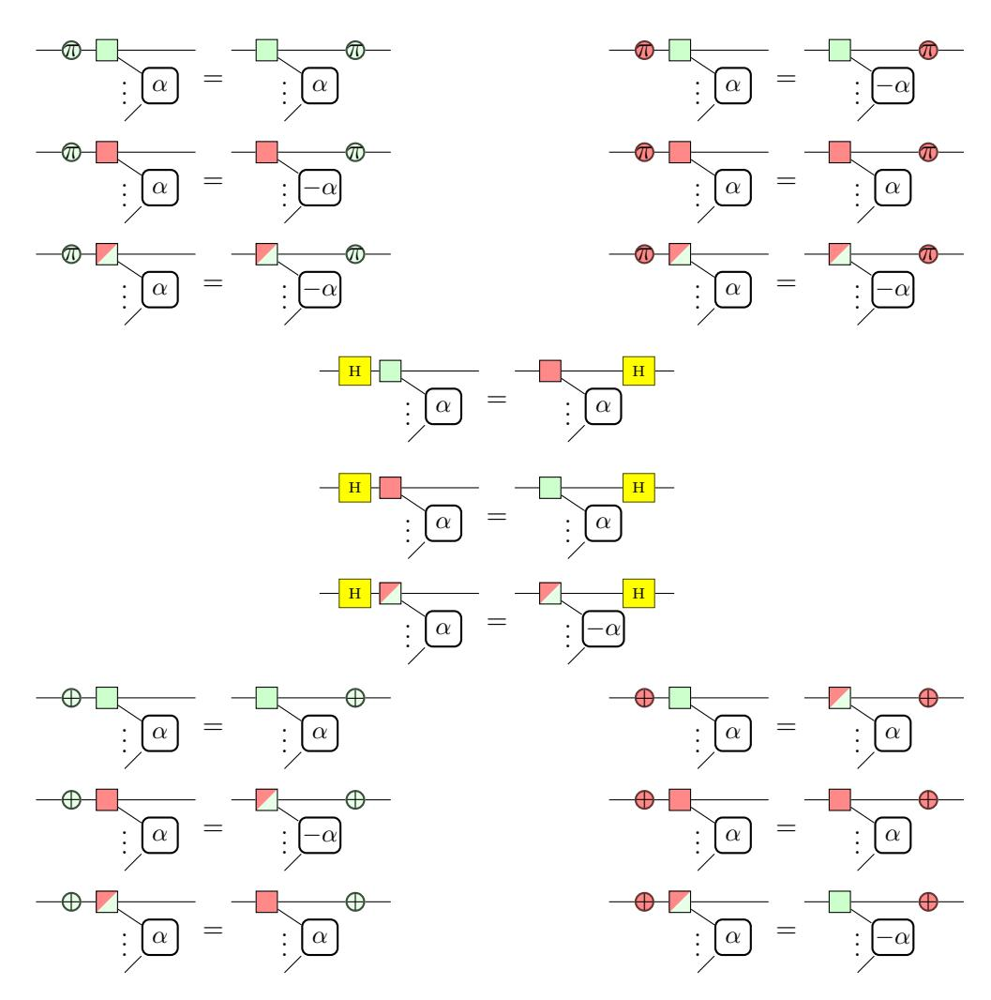

Figure 4: Rules for passing Clifford gates through Pauli gadgets.

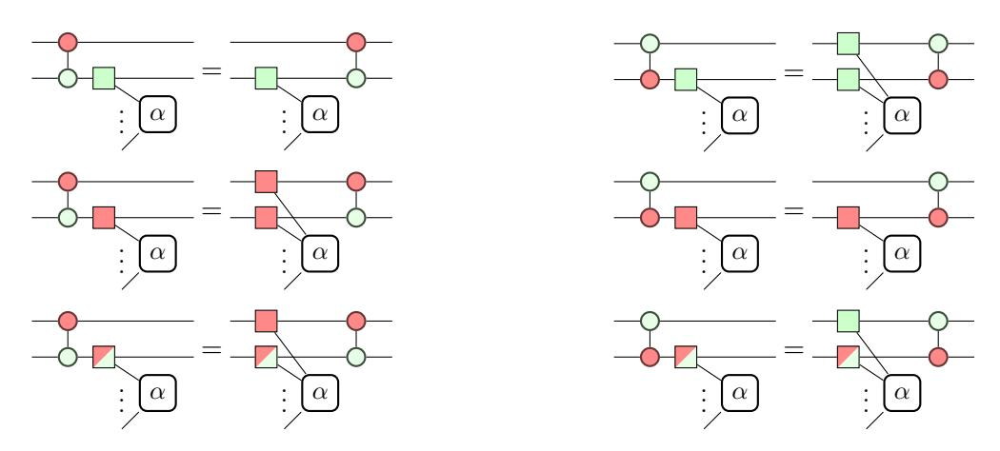

Figure 5: Rules for passing  $\wedge X$  gates through Pauli gadgets.

qubit gates may be required around the  $\wedge X$  to map  $t_1$  to Z and back. Composing these layers gives a U that can pass through  $I_{|s|} \otimes P(\alpha,t)$  and cancel with  $U^{\dagger}$  to leave  $P(\alpha,st)$ .

**Remark 4.6.** As shown in 2, the  $\wedge X$  part of U may be more efficiently constructed as a balanced tree, or some other configuration which allows later gate cancellation.

Corollary 4.7. Let t be a proper substring of s; then there exists a unitary U and a permutation  $\pi$  such that

$$P(\alpha, s) = \pi; (U \otimes I_{|s|-|t|-1}); \pi^{\dagger}; P(\alpha, t \bullet s); \pi^{\dagger}; (U^{\dagger} \otimes I_{|s|-|t|-1}); \pi^{\dagger}; P(\alpha, t \bullet s); \pi^{\dagger}; (U^{\dagger} \otimes I_{|s|-|t|-1}); \pi^{\dagger}; P(\alpha, t \bullet s); \pi^{\dagger}; (U^{\dagger} \otimes I_{|s|-|t|-1}); \pi^{\dagger}; P(\alpha, t \bullet s); \pi^{\dagger}; (U^{\dagger} \otimes I_{|s|-|t|-1}); \pi^{\dagger}; P(\alpha, t \bullet s); \pi^{\dagger}; (U^{\dagger} \otimes I_{|s|-|t|-1}); \pi^{\dagger}; P(\alpha, t \bullet s); \pi^{\dagger}; (U^{\dagger} \otimes I_{|s|-|t|-1}); \pi^{\dagger}; P(\alpha, t \bullet s); \pi^{\dagger}; (U^{\dagger} \otimes I_{|s|-|t|-1}); \pi^{\dagger}; P(\alpha, t \bullet s); \pi^{\dagger}; (U^{\dagger} \otimes I_{|s|-|t|-1}); \pi^{\dagger}; P(\alpha, t \bullet s); \pi^{\dagger}; (U^{\dagger} \otimes I_{|s|-|t|-1}); \pi^{\dagger}; P(\alpha, t \bullet s); \pi^{\dagger}; (U^{\dagger} \otimes I_{|s|-|t|-1}); \pi^{\dagger}; P(\alpha, t \bullet s); \pi^{\dagger}; (U^{\dagger} \otimes I_{|s|-|t|-1}); \pi^{\dagger}; P(\alpha, t \bullet s); \pi^{\dagger}; (U^{\dagger} \otimes I_{|s|-|t|-1}); \pi^{\dagger}; P(\alpha, t \bullet s); \pi^{\dagger}; (U^{\dagger} \otimes I_{|s|-|t|-1}); \pi^{\dagger}; P(\alpha, t \bullet s); \pi^{\dagger}; P(\alpha, t \bullet s); \pi^{\dagger}; P(\alpha, t \bullet s); \pi^{\dagger}; P(\alpha, t \bullet s); \pi^{\dagger}; P(\alpha, t \bullet s); \pi^{\dagger}; P(\alpha, t \bullet s); \pi^{\dagger}; P(\alpha, t \bullet s); \pi^{\dagger}; P(\alpha, t \bullet s); \pi^{\dagger}; P(\alpha, t \bullet s); \pi^{\dagger}; P(\alpha, t \bullet s); \pi^{\dagger}; P(\alpha, t \bullet s); \pi^{\dagger}; P(\alpha, t \bullet s); \pi^{\dagger}; P(\alpha, t \bullet s); \pi^{\dagger}; P(\alpha, t \bullet s); \pi^{\dagger}; P(\alpha, t \bullet s); \pi^{\dagger}; P(\alpha, t \bullet s); \pi^{\dagger}; P(\alpha, t \bullet s); \pi^{\dagger}; P(\alpha, t \bullet s); \pi^{\dagger}; P(\alpha, t \bullet s); \pi^{\dagger}; P(\alpha, t \bullet s); \pi^{\dagger}; P(\alpha, t \bullet s); \pi^{\dagger}; P(\alpha, t \bullet s); \pi^{\dagger}; P(\alpha, t \bullet s); \pi^{\dagger}; P(\alpha, t \bullet s); \pi^{\dagger}; P(\alpha, t \bullet s); \pi^{\dagger}; P(\alpha, t \bullet s); \pi^{\dagger}; P(\alpha, t \bullet s); \pi^{\dagger}; P(\alpha, t \bullet s); \pi^{\dagger}; P(\alpha, t \bullet s); \pi^{\dagger}; P(\alpha, t \bullet s); \pi^{\dagger}; P(\alpha, t \bullet s); \pi^{\dagger}; P(\alpha, t \bullet s); \pi^{\dagger}; P(\alpha, t \bullet s); \pi^{\dagger}; P(\alpha, t \bullet s); \pi^{\dagger}; P(\alpha, t \bullet s); \pi^{\dagger}; P(\alpha, t \bullet s); \pi^{\dagger}; P(\alpha, t \bullet s); \pi^{\dagger}; P(\alpha, t \bullet s); \pi^{\dagger}; P(\alpha, t \bullet s); \pi^{\dagger}; P(\alpha, t \bullet s); \pi^{\dagger}; P(\alpha, t \bullet s); \pi^{\dagger}; P(\alpha, t \bullet s); \pi^{\dagger}; P(\alpha, t \bullet s); \pi^{\dagger}; P(\alpha, t \bullet s); \pi^{\dagger}; P(\alpha, t \bullet s); \pi^{\dagger}; P(\alpha, t \bullet s); \pi^{\dagger}; P(\alpha, t \bullet s); \pi^{\dagger}; P(\alpha, t \bullet s); \pi^{\dagger}; P(\alpha, t \bullet s); \pi^{\dagger}; P(\alpha, t \bullet s); \pi^{\dagger}; P(\alpha, t \bullet s); \pi^{\dagger}; P(\alpha, t \bullet s); \pi^{\dagger}; P(\alpha, t \bullet s); \pi^{\dagger}; P(\alpha, t \bullet s); \pi^{\dagger}; P(\alpha, t \bullet s); \pi^{\dagger}; P(\alpha, t \bullet s); \pi^{\dagger}; P(\alpha, t \bullet s); \pi^{\dagger}; P(\alpha, t \bullet s); \pi^{\dagger}; P(\alpha, t \bullet s); \pi^{\dagger}; P(\alpha, t \bullet s); \pi^{\dagger}; P(\alpha, t \bullet s); \pi^{\dagger}; P(\alpha, t \bullet s); \pi^{\dagger}; P(\alpha, t \bullet s); \pi^{\dagger}; P(\alpha, t \bullet s); \pi^{\dagger}; P(\alpha, t \bullet s); \pi^{\dagger}; P(\alpha, t \bullet s); \pi^{\dagger}; P(\alpha, t$$

**Corollary 4.8.** Let s be a Pauli string; then for all  $\alpha$  and  $\beta$ :

$$P(\alpha, s); P(\beta, s) = P(\alpha + \beta, s)$$

**Lemma 4.9.** Let s and t be Pauli strings; then there exists a Clifford unitary U such that

$$P(\alpha, s); P(\beta, t) = U; P(\alpha, s'); P(\beta, t'); U^{\dagger}$$

where s' and t' are Pauli strings with intersection at most 1.

*Proof.* Let r denote the maximum common substring of s and t. Then by Corollary 4.7 we have

$$P(\alpha, s); P(\beta, t) = U_r; P(\alpha, r \bullet s); U_r^{\dagger}; U_r; P(\beta, r \bullet t); U_r^{\dagger} = U_r; P(\alpha, r \bullet s); P(\beta, r \bullet t); U_r^{\dagger}$$
 (5)

hence we will assume that s and t have no non-trivial common substring. Now suppose that  $s_i = Y$  and  $t_i = X$ . Applying Lemma 4.3 we can replace  $s_i$  with a Z node by conjugating with  $X(\pi/2)$ ; since X rotations commute with X nodes, this unitary can move outside the two gadgets.

$$\begin{array}{cccccccccccccccccccccccccccccccccccc$$

The pairing of Y and Z can be treated the same way. Hence we can assume that the symbol Y does not occur in the intersection of s and t.

Now we proceed by induction on the size of the intersection. If the intersection is size 0 or 1 then we have the result. Otherwise consider two non-trivial qubits i and j in the intersection. Suppose  $s_i = s_j = Z$  and  $t_i = t_j = X$ ; then by Lemma 4.4 we can reduce the size of the intersection by two as shown below:

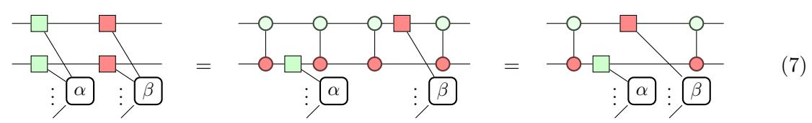

The only other case to be considered is when  $s_i = t_j = X$  and  $s_j = t_i = Z$ , in which case Lemma 4.3 gives the following reduction.

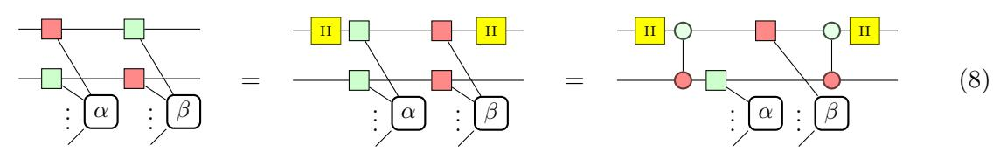

Hence the size of the intersection can be reduced to less than two.

**Theorem 4.10.** *Let s and t be strings of Paulis. Either the corresponding gadgets commute:*

$$\forall \alpha, \beta \quad P(\alpha, s); P(\beta, t) = P(\beta, t); P(\alpha, s)$$

*or they satisfy the Euler equation:*

$$\forall \alpha_i, \exists \beta_i \quad P(\alpha_1, s); P(\alpha_2, t); P(\alpha_3, s) = P(\beta_1, t); P(\beta_2, s); P(\beta_3, t)$$

*Proof.* By Lemma [4.9,](#page-7-1) we have *U*, *s* 0 and *t* 0 such that

$$P(\alpha, s); P(\beta, t) = U; P(\alpha, s'); P(\beta, t'); U^{\dagger}$$

Where *s* 0 and *t* 0 have at most intersection 1. If their intersection is trivial, or if both gadgets act on their common qubit in the same basis (Corollary [4.8\)](#page-7-2), then they commute, from which we have

$$U; P(\alpha, s'); P(\beta, t'); U^{\dagger} = U; P(\beta, t'); P(\alpha, s'); U^{\dagger} = P(\beta, t); P(\alpha, s)$$

$$(9)$$

Otherwise the gadgets need not commute, but the Euler equation holds. Without loss of generality assume that *s* is all *Z*s and *t* is all *X*s. In the case where |*s*| = |*t*| = 2, we continue as follows:

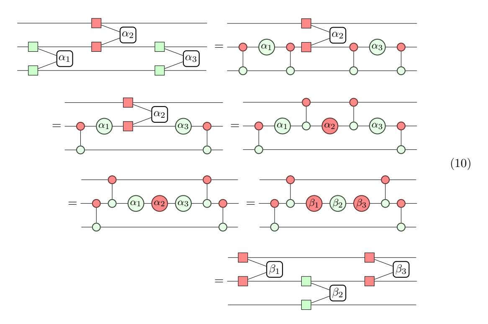

This applies Lemma [4.4](#page-5-2) to decompose Pauli gadgets and commute ∧*X* gates, followed by the (EU) rule and essentially reversing the procedure. This generalises to larger *s* and *t* by applying

#### Lemma 4.5.

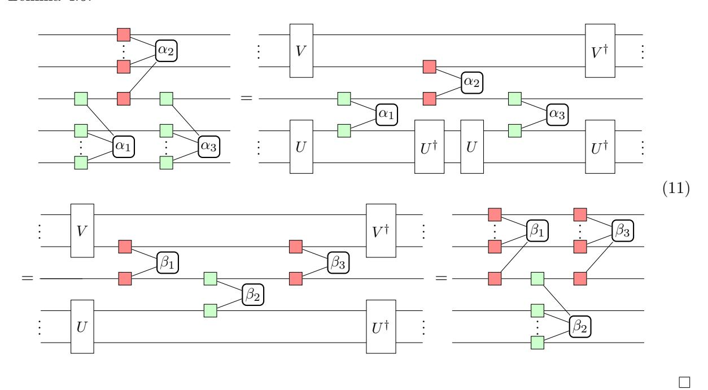

Synthesising a Pauli gadget  $P(\alpha,s)$  in isolation requires  $2(|s|-1) \land X$  gates, hence  $P(\alpha,s)$ ;  $P(\beta,t)$  would usually require  $2(|s|+|t|-2) \land X$  gates in total. Applying Equation 5 will reduce the total cost by 2 for each qubit in the maximum common substring. Equation 7 uses two gates to reduce the gadgets by 1 qubit each, giving a net saving of  $2 \land X$  gates per application. This reduces the total cost to  $2(|s|+|t|-|r|-\lfloor\frac{|u|}{2}\rfloor-2) \land X$  gates where r is the maximum common substring of s and t, and u is the subset of the intersection of s and t that is not in r. In the case where s and t act on the same set of qubits and  $|s \bullet t| \leq 2$ , we can synthesise the pair  $P(\alpha,s)$ ;  $P(\beta,t)$  using the same number of  $\land Xs$  as just  $P(\alpha,s)$ . Performance with respect to depth is harder to assess analytically and will be left for future work.

## 5 Optimisation Example

The following example is a small region of a Unitary Coupled Cluster ansatz for analysing the ground state energy of  $H_2$ . The parameters  $\alpha$  and  $\beta$  are optimised by some variational method.

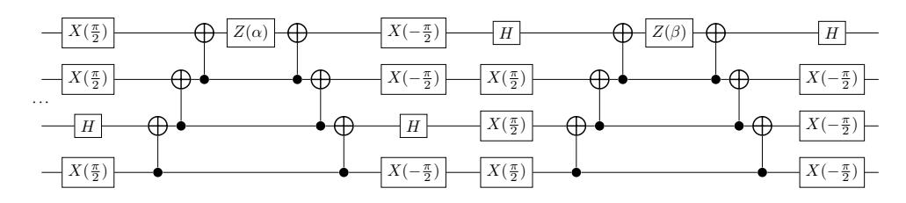

The  $\wedge X$  ladders in this circuit correspond to phase gadgets, so we start by detecting these and resynthesising them optimally to reduce the depth and expose more of the  $\wedge X$ s to the rest of

the circuit.

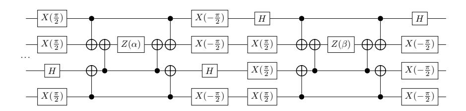

Between the parametrised gates, there is a Clifford subcircuit, featuring some aligned  $\wedge X$  pairs. The commutation and Clifford optimisation rules can further reduce the number of  $\wedge X$ s here.

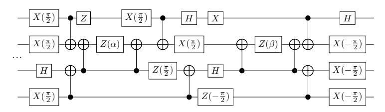

Between phase gadget resynthesis and Clifford optimisations, we have successfully reduced the two-qubit gate count of this circuit from 12 to 10, and the depth with respect to two-qubit gates from 12 to 7. However, we could have noted that the original circuit corresponds to the operation  $P(\alpha, YYXY); P(\beta, XYYY)$ . These Pauli gadgets commute according to Theorem 4.10. Following the proof, we can reduce the Pauli gadgets by stripping away the common qubits (where they both act on the X-basis) as in Equation 5, and then reducing the remaining pair to simple rotations on different qubits using Equation 7. This yields an equivalent circuit using 6 two-qubit gates which can be arranged into only 4 layers.

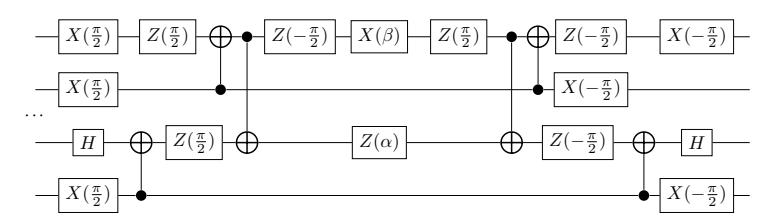

#### 6 Results

Here we present some empirical results on the performance of these optimisation techniques on realistic quantum circuits. We compared the effectiveness of a few optimising compilers at reducing the number of two-qubit interactions ( $\land X$  or equivalent) in a circuit. For t|ket $\rangle$ , we identified Pauli gadgets within the circuit and applied the aforementioned method for efficient pairwise synthesis, followed by Clifford subcircuit optimisation.

The test set used here consists of a small selection of circuits for Quantum Computational Chemistry. They correspond to variational circuits for estimating the ground state of small molecules (H2, LiH, CH2, or C2H4) by the Unitary Coupled Cluster approach [5, 6] using some choice of qubit mapping (Jordan-Wigner [21], Parity mapping [10], or Bravyi-Kitaev[11]) and chemical basis function (sto-3g, 6-31g, cc-pvDZ, or cc-pvTZ). The bulk of each circuit is generated by Trotterising some exponentiated operator, meaning many phase/Pauli gadgets will naturally

|               |        |        | Qiskit 0.10.1 |        | PyZX   |        | CQC's t keti 0.2 |        |
|---------------|--------|--------|---------------|--------|--------|--------|------------------------|--------|
| Name          | gin    | din    | gout          | dout   | gout   | dout   | gout                   | dout   |
| H2_P_sto3g    | 38     | 36     | 34            | 32     | 39     | 37     | 24                     | 18     |
| H2_BK_sto3g   | 38     | 38     | 36            | 36     | 43     | 40     | 25                     | 23     |
| H2_JW_sto3g   | 56     | 52     | 52            | 48     | 42     | 37     | 24                     | 22     |
| H2_JW_631g    | 768    | 744    | 624           | 600    | 467    | 392    | 349                    | 324    |
| LiH_JW_sto3g  | 8064   | 7616   | 6176          | 5776   | 6872   | 5579   | 3525                   | 3173   |
| LiH_P_sto3g   | 7640   | 7603   | 6222          | 6185   | 6838   | 5543   | 3992                   | 3460   |
| LiH_BK_sto3g  | 8680   | 8637   | 7402          | 7395   | 6577   | 5491   | 4226                   | 4002   |
| H2_JW_ccpvdz  | 14616  | 14436  | 10404         | 10224  | 8527   | 6105   | 5608                   | 5396   |
| CH2_JW_sto3g  | 21072  | 19749  | 15600         | 14565  | 18380  | 14995  | 9074                   | 8064   |
| LiH_JW_631g   | 69144  | 65676  | 49776         | 46596  | 58647  | 43835  | 27221                  | 24462  |
| H2_JW_ccpvtz  | 341280 | 339768 | 224640        | 223128 | 276691 | 151027 | 115376                 | 113980 |
| LiH_JW_ccpvdz | 407320 | 388620 | 282608        | 264996 | 371847 | 229491 | 145714                 | 134079 |
| C2H4_JW_sto3g | 640768 | 596857 | 438784        | 408313 | -      | -      | 248945                 | 216796 |

Table 1: Comparison of two-qubit gate count and depth for Quantum Computational Chemistry circuits achieved by quantum compilers. Each circuit was generated using a Unitary Coupled Cluster ansatz for ground state estimation of small molecules. The names of circuits indicate the molecule (H2, LiH, CH2, or C2H4), the qubit mapping (**J**ordan-**W**igner, **P**arity mapping, or **B**ravyi-**K**itaev), and chemical basis function (sto-3g, 6-31g, cc-pvDZ, or cc-pvTZ). *gin*/*din* denotes the two-qubit gate count/depth for the original circuits, and *gout*/*dout* are the corresponding quantities for the optimised circuits from each compiler. Values correspond to the Pauli gadget optimisation pass in t|keti, PyZX's full\_reduce procedure, and compilation with optimisation level 1 on Qiskit (at the time of writing, higher levels were found to not preserve the semantics of the circuit). Systems were allowed up to 10 hours of compute time for each circuit with timeouts indicated by blank cells.

occur. These circuits were all generated using the Qiskit Chemistry package [\[20\]](#page-13-2) and the QASM files can be found online [4](#page-11-0) .

All of the implementations suffered from runtime scaling issues, meaning results for some of the larger circuits were reasonably unobtainable. Overall, t|keti gained an average reduction of 54*.*5% in ∧*X* count of the circuits, outperforming the 21*.*3% from Qiskit and 16*.*3% from PyZX. We find similar savings with respect to two-qubit gate depth, where t|keti has an average reduction of 57*.*7% (21*.*8% for Qiskit, 30*.*8% for PyZX). This percentage is likely to improve as we start to look at even larger examples as the phase gadget structures are reduced from linearly-scaling ∧*X* ladders to the logarithmically-scaling balanced trees. We anticipate that incorporating the reduced form for adjacent Pauli gadgets will further cut down the ∧*X* count, especially given that rotations in the Unitary Coupled Cluster ansatz come from annihilation and creation operators, each generating a pair of rotations with very similar Pauli strings.

These empirical results were to compare pure circuit optimisation only, so no architectural constraints were imposed. It is left for future work to analyse how these techniques affect the

4QASM files and the generating python script are available at: [https://github.com/CQCL/pytket/tree/](https://github.com/CQCL/pytket/tree/master/examples/benchmarking/ChemistrySet) [master/examples/benchmarking/ChemistrySet](https://github.com/CQCL/pytket/tree/master/examples/benchmarking/ChemistrySet)

ease of routing the circuit to conform to a given qubit connectivity map. This is non-trivial for the more macroscopic changes such as identifying and resynthesising phase gadgets which can change the interaction graph from a simple line to a tree. Recent work using Steiner trees [\[22,](#page-13-17) [27\]](#page-13-18) could be useful for synthesising individual phase gadgets in an architecturally-aware manner.

As the quality of physical devices continues to improve, we can look forward to a future of fault-tolerant quantum computing. There has already been work making use of the structures discussed here in the domain of Clifford + T circuits. Notably, phase gadgets have found use recently for reducing the T-count of circuits [\[23\]](#page-13-6). Another recent paper [\[24\]](#page-13-11) presents ways to usefully synthesise Clifford + T circuits in the realm of lattice surgery which use representations of rotations that are equivalent Pauli gadgets.

#### **References**

- [1] Matthew Amy, Jianxin Chen & Neil J. Ross (2018): *A Finite Presentation of CNOT-Dihedral Operators*. Electronic Proceedings in Theoretical Computer Science 266, pp. 84–97, doi[:10.4204/eptcs.266.5.](http://dx.doi.org/10.4204/eptcs.266.5)
- [2] Matthew Amy, Dmitri Maslov & Michele Mosca (2014): *Polynomial-Time T-Depth Optimization of Clifford+T Circuits Via Matroid Partitioning*. IEEE Transactions on Computer-Aided Design of Integrated Circuits and Systems 33(10), pp. 1476–1489, doi[:10.1109/TCAD.2014.2341953.](http://dx.doi.org/10.1109/TCAD.2014.2341953)
- [3] Matthew Amy, Dmitri Maslov, Michele Mosca & Martin Roetteler (2013): *A Meet-in-the-Middle Algorithm for Fast Synthesis of Depth-Optimal Quantum Circuits*. IEEE Transactions on Computer-Aided Design of Integrated Circuits and Systems 32(6), pp. 818–830, doi[:10.1109/tcad.2013.2244643.](http://dx.doi.org/10.1109/tcad.2013.2244643)
- [4] Matthew Amy & Michele Mosca (2019): *T-Count Optimization and Reed-Muller Codes*. IEEE Transactions on Information Theory 65(8), pp. 4771–4784, doi[:10.1109/tit.2019.2906374.](http://dx.doi.org/10.1109/tit.2019.2906374)
- [5] Panagiotis Kl Barkoutsos, Jerome F Gonthier, Igor Sokolov, Nikolaj Moll, Gian Salis, Andreas Fuhrer, Marc Ganzhorn, Daniel J Egger, Matthias Troyer, Antonio Mezzacapo et al. (2018): *Quantum algorithms for electronic structure calculations: Particle-hole Hamiltonian and optimized wavefunction expansions*. Physical Review A 98(2), p. 022322, doi[:10.1103/PhysRevA.98.022322.](http://dx.doi.org/10.1103/PhysRevA.98.022322)
- [6] Rodney J Bartlett, Stanislaw A Kucharski & Jozef Noga (1989): *Alternative coupled-cluster ansätze II. The unitary coupled-cluster method*. Chemical physics letters 155(1), pp. 133–140, doi[:10.1016/S0009-](http://dx.doi.org/10.1016/S0009-2614(89)87372-5) [2614\(89\)87372-5.](http://dx.doi.org/10.1016/S0009-2614(89)87372-5)
- [7] Niel de Beaudrap & Dominic Horsman (2017): *The ZX calculus is a language for surface code lattice surgery*. In: Proc. QPL2017. Available at <https://arxiv.org/pdf/1704.08670>.
- [8] Michael Beverland, Earl Campbell, Mark Howard & Vadym Kliuchnikov (2019): *Lower bounds on the non-Clifford resources for quantum computations*. arXiv preprint 1904.01124.
- [9] M Blaauboer & RL De Visser (2008): *An analytical decomposition protocol for optimal implementation of two-qubit entangling gates*. Journal of Physics A: Mathematical and Theoretical 41(39), p. 395307, doi[:10.1088/1751-8113/41/39/395307.](http://dx.doi.org/10.1088/1751-8113/41/39/395307)
- [10] Sergey Bravyi, Jay M Gambetta, Antonio Mezzacapo & Kristan Temme (2017): *Tapering off qubits to simulate fermionic Hamiltonians*. arXiv preprint 1701.08213.
- [11] Sergey B Bravyi & Alexei Yu Kitaev (2002): *Fermionic quantum computation*. Annals of Physics 298(1), pp. 210–226, doi[:10.1006/aphy.2002.6254.](http://dx.doi.org/10.1006/aphy.2002.6254)
- [12] Yudong Cao, Jonathan Romero, Jonathan P. Olson, Matthias Degroote, Peter D. Johnson, Mária Kieferová, Ian D. Kivlichan, Tim Menke, Borja Peropadre, Nicolas P. D. Sawaya, Sukin Sim, Libor Veis & Alán Aspuru-Guzik (2018): *Quantum Chemistry in the Age of Quantum Computing*. arXiv preprint 1812.09976.
- [13] Bob Coecke & Ross Duncan (2011): *Interacting Quantum Observables: Categorical Algebra and Diagrammatics*. New J. Phys 13(043016), doi[:10.1088/1367-2630/13/4/043016.](http://dx.doi.org/10.1088/1367-2630/13/4/043016)

- [14] Bob Coecke & Aleks Kissinger (2017): *Picturing Quantum Processes: A First Course in Quantum Theory and Diagrammatic Reasoning*. Cambridge University Press, doi[:10.1017/9781316219317.](http://dx.doi.org/10.1017/9781316219317)
- [15] Alexander Cowtan, Silas Dilkes, Ross Duncan, Alexandre Krajenbrink, Will Simmons & Seyon Sivarajah (2019): *On the Qubit Routing Problem*. In Wim van Dam & Laura Mancinska, editors: 14th Conference on the Theory of Quantum Computation, Communication and Cryptography (TQC 2019), Leibniz International Proceedings in Informatics (LIPIcs) 135, Schloss Dagstuhl–Leibniz-Zentrum fuer Informatik, Dagstuhl, Germany, pp. 5:1–5:32, doi[:10.4230/LIPIcs.TQC.2019.5.](http://dx.doi.org/10.4230/LIPIcs.TQC.2019.5)
- [16] Ross Duncan, Aleks Kissinger, Simon Perdrix & John van de Wetering (2019): *Graph-theoretic Simplification of Quantum Circuits with the ZX-calculus*. arXiv preprint 1902.03178.
- [17] Hartmut Ehrig, Karsten Ehrig, Ulrike Prange & Gabriele Taentzer (2006): *Fundamentals of Algebraic Graph Transformation*. Monographs in Theoretical Computer Science, Springer Berlin Heidelberg, doi[:10.1007/3-540-31188-2.](http://dx.doi.org/10.1007/3-540-31188-2)
- [18] Andrew Fagan & Ross Duncan (2019): *Optimising Clifford Circuits with Quantomatic*. arXiv preprint 1901.10114, doi[:10.4204/eptcs.287.5.](http://dx.doi.org/10.4204/eptcs.287.5)
- [19] Luke E Heyfron & Earl T Campbell (2018): *An efficient quantum compiler that reduces T count*. Quantum Science and Technology 4(1), p. 015004, doi[:10.1088/2058-9565/aad604.](http://dx.doi.org/10.1088/2058-9565/aad604)
- [20] IBM Research: *Qiskit*. Available at <https://qiskit.org>.
- [21] Pascual Jordan & Eugene P Wigner (1928): *About the Pauli exclusion principle*. Z. Phys. 47, pp. 631–651, doi[:10.1007/BF01331938.](http://dx.doi.org/10.1007/BF01331938)
- [22] Aleks Kissinger & Arianne Meijer-van de Griend (2019): *CNOT circuit extraction for topologicallyconstrained quantum memories*. arXiv preprint 1904.00633.
- [23] Aleks Kissinger & John van de Wetering (2019): *Reducing T-count with the ZX-calculus*. arXiv preprint 1903.10477.
- [24] Daniel Litinski (2019): *A Game of Surface Codes: Large-Scale Quantum Computing with Lattice Surgery*. Quantum 3, p. 128, doi[:10.22331/q-2019-03-05-128.](http://dx.doi.org/10.22331/q-2019-03-05-128)
- [25] Jarrod R McClean, Jonathan Romero, Ryan Babbush & Alán Aspuru-Guzik (2016): *The theory of variational hybrid quantum-classical algorithms*. New Journal of Physics 18(2), p. 023023, doi[:10.1088/1367-](http://dx.doi.org/10.1088/1367-2630/18/2/023023) [2630/18/2/023023.](http://dx.doi.org/10.1088/1367-2630/18/2/023023) Available at <http://stacks.iop.org/1367-2630/18/i=2/a=023023>.
- [26] Yunseong Nam, Neil J. Ross, Yuan Su, Andrew M. Childs & Dmitri Maslov (2018): *Automated optimization of large quantum circuits with continuous parameters*. npj Quantum Information 4(1), p. 23, doi[:10.1038/s41534-018-0072-4.](http://dx.doi.org/10.1038/s41534-018-0072-4)
- [27] Beatrice Nash, Vlad Gheorghiu & Michele Mosca (2019): *Quantum circuit optimizations for NISQ architectures*. arXiv preprint 1904.01972.
- [28] Rigetti Computing: *Forest - Rigetti*. Available at <http://rigetti.com/forest>.
- [29] Peter Selinger (2015): *Generators and relations for n-qubit Clifford operators*. Logical Methods in Computer Science 11(2), doi[:10.2168/lmcs-11\(2:10\)2015.](http://dx.doi.org/10.2168/lmcs-11(2:10)2015)
- [30] The Cirq Developers: *Cirq: A python library for NISQ circuits*. Available at [https://cirq.](https://cirq.readthedocs.io/en/stable/) [readthedocs.io/en/stable/](https://cirq.readthedocs.io/en/stable/).
- [31] Guifre Vidal & Christopher M Dawson (2004): *Universal quantum circuit for two-qubit transformations with three controlled-NOT gates*. Physical Review A 69(1), p. 010301, doi[:10.1103/PhysRevA.69.010301.](http://dx.doi.org/10.1103/PhysRevA.69.010301)
- [32] Renaud Vilmart (2018): *A Near-Optimal Axiomatisation of ZX-Calculus for Pure Qubit Quantum Mechanics*. arXiv preprint 1812.09114.

#### A Proof for Lemma 4.3

*Proof.* A number of the rules follow from the ability to commute green vertices through Z components of Pauli gadgets and red vertices through X components using the spider fusion rule (S) and the colour-change rule (H) of the zx-calculus.

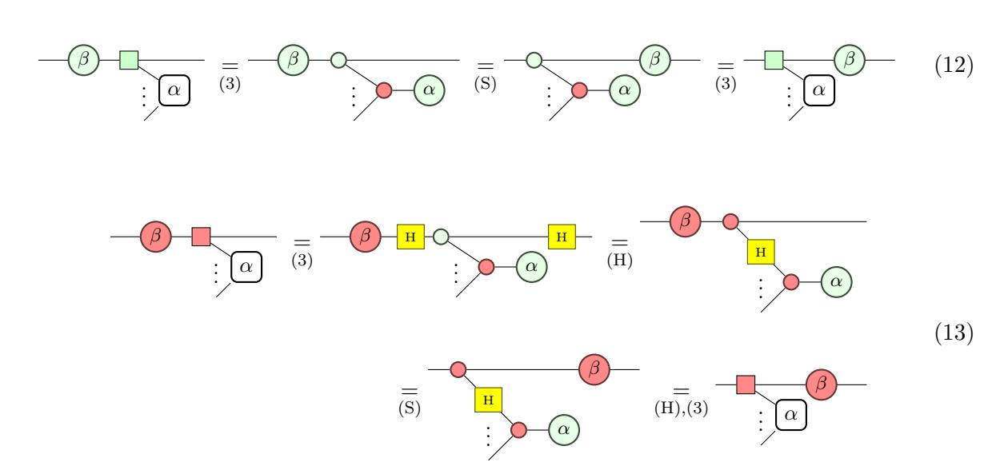

For the remaining  $\pi$ -phase properties, we will also need to use the  $\pi$ -copy/elimination rule (K1) and the phase-inversion rule (K2).

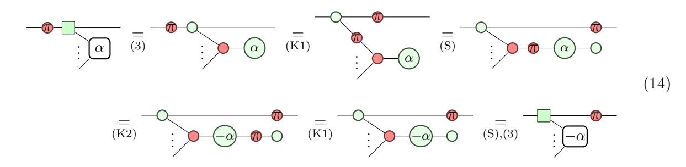

The rest of the rules for passing single qubit Clifford gates through Pauli gadgets can be obtained straighforwardly using these, as in the following example.

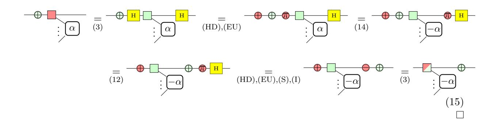

#### B Proof for Lemma 4.4

*Proof.* The control of a  $\wedge X$  can commute through a Z component of a Pauli gadget using just the spider fusion rule (S) of the zx-calculus.

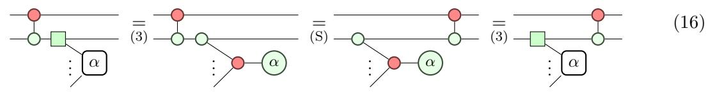

To prove the extension of Pauli gadget from a X component, we remove Hadamard gates from the path with the colour-change rule (H) and introduce a pair of  $\land X$ s using the identity (I) and Hopf (Hopf) rules. The rest follows from the bialgebra rule (B) and tidying up.

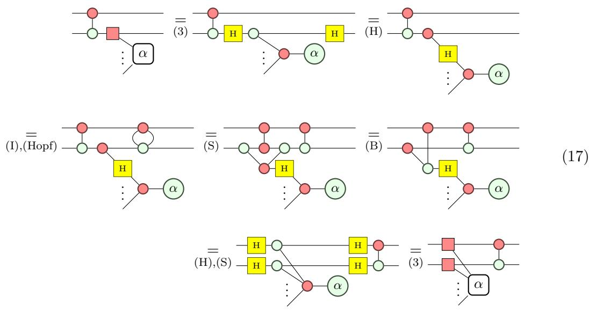

For the equivelent rule for Y, we spawn additional green phase vertices to allow us to introduce Hadamard gates via the Hadamard decomposition rule (HD), and reduce it to the X case.

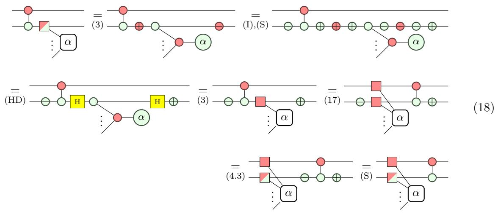

The remaining rules follow similarly.