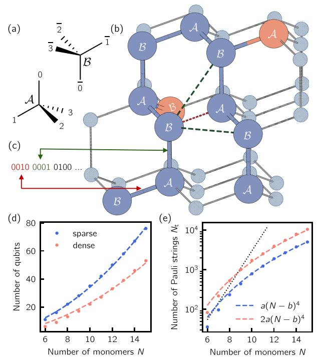
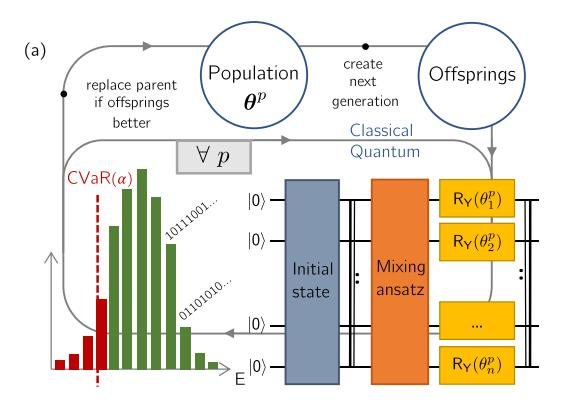
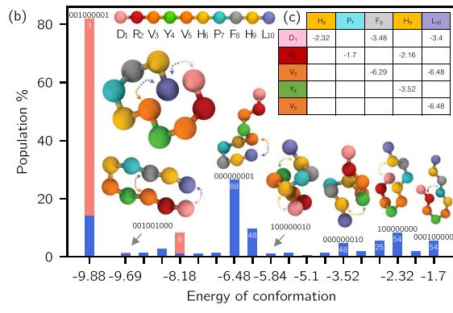
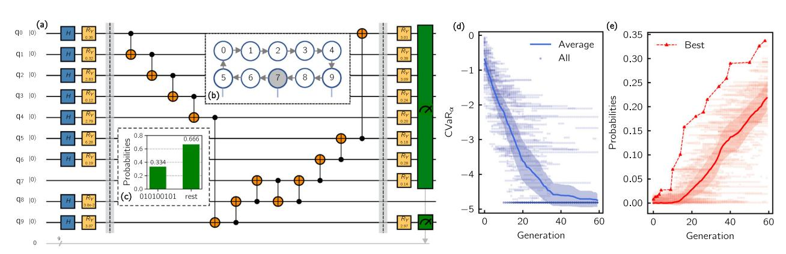

# ARTICLE OPEN

# Resource-efficient quantum algorithm for protein folding

Anton Robert1,2, Panagiotis Kl. Barkoutsos (□), Stefan Woerner (□) and Ivano Tavernelli (□) |

Predicting the three-dimensional structure of a protein from its primary sequence of amino acids is known as the protein folding problem. Due to the central role of proteins' structures in chemistry, biology and medicine applications, this subject has been intensively studied for over half a century. Although classical algorithms provide practical solutions for the sampling of the conformation space of small proteins, they cannot tackle the intrinsic NP-hard complexity of the problem, even when reduced to the simplest Hydrophobic-Polar model. On the other hand, while fault-tolerant quantum computers are beyond reach for state-of-the-art quantum technologies, there is evidence that quantum algorithms can be successfully used in noisy state-of-the-art quantum computers to accelerate energy optimization in frustrated systems. In this work, we present a model Hamiltonian with  $\mathcal{O}(N^4)$  scaling and a corresponding quantum variational algorithm for the folding of a polymer chain with N monomers on a lattice. The model reflects many physico-chemical properties of the protein, reducing the gap between coarse-grained representations and mere lattice models. In addition, we use a robust and versatile optimization scheme, bringing together variational quantum algorithms specifically adapted to classical cost functions and evolutionary strategies to simulate the folding of the 10 amino acid Angiotensin on 22 qubits. The same method is also successfully applied to the study of the folding of a 7 amino acid neuropeptide using 9 qubits on an IBM 20-qubit quantum computer. Bringing together recent advances in building gate-based quantum computers with noise-tolerant hybrid quantum-classical algorithms, this work paves the way towards accessible and relevant scientific experiments on real quantum processors.

npj Quantum Information (2021)7:38; https://doi.org/10.1038/s41534-021-00368-4

#### INTRODUCTION

The solution of Levinthal's paradox1 through a bias search in the protein configuration space2 demands a very fine description of the amino acids interactions in their natural environment to correctly drive the optimization in the rugged protein energy landscape3–5. GPU-assisted sampling methods of well parametrized coarse-grained models can provide useful insights regarding the protein's native conformation, but folding a small protein in state-of-the-art simulations comes at a very high computational cost6,7. Protein lattice models reduce the conformational space and obviate the high computational cost of an off-lattice exhaustive sampling8,9. Quantum algorithms cannot ignore those simplifications because of the limited currently available quantum resources. Perdomo-Ortiz et al. paved the way towards the construction of spin Hamiltonians to find the on-lattice heteropolymer's low-energy conformations using quantum devices, but with unattainable high costs for near-term quantum computers10,11. Recently, the amount of resources needed for the simulation of polymer lattice models was reduced, however still maintaining an exponential cost in terms of number of qubits and gates needed12,13. These methods were used to fold a coarsegrained protein model with 6 and 8 amino acid sequences on 2D and 3D lattices, respectively, using a quantum annealer 14. These experiments required 81 and 200 gubits and led to a final population of 0.13% and 0.024% for the corresponding ground state structures, using divide and conquer strategies. More recently, Fingerhuth and coworkers proposed another approach based on the Quantum Approximate Optimization Algorithm (QAOA)15 using a problem-specific alternating operator ansatz to model protein folding16. Employing the same model proposed in 13 they succeeded in folding a 4 amino acid protein model on a 2D square lattice.

In this work, we present a coarse-grained model for protein folding which is suited to the representation of branched heteropolymers comprised of *N* monomers on a tetrahedral (or "diamond") lattice. This choice is motivated by the chemical plausibility of the angles enforced by the lattice (109.47° for bond angles, 180° or 60° for dihedrals), which allows an all-atom description for a wide range of chemical and biological compounds. Given the modest resources of actual quantum devices, a two-centered coarse-grained description of amino acid (backbone and side chain) was used to mimic the protein sequence. Every monomer is depicted by one or multiple beads that can have a defined number of 'color shades' corresponding to different physical properties like hydrophobicity and charge.

#### **RESULTS**

#### The configuration qubits

As for the previous models in literature, a polymer configuration is grown on the lattice by adding the different beads one after the other and encoding, in the qubit register the different "turn"  $t_i$  that defines the position of the bead i+1 relatively to the previous bead i. Using a tetrahedral lattice, we distinguish two sets of nonequivalent lattice points  $\mathcal{A}$  and  $\mathcal{B}$  (see Fig. 1). At the  $\mathcal{A}$  sites, the polymer can only grow along the directions  $t_i \in \{0,1,2,3\}$  while at site  $\mathcal{B}$  the possible directions are  $t_i \in \{\overline{0},\overline{1},\overline{2},\overline{3}\}$ . Along the sequence, the  $\mathcal{A}$  and  $\mathcal{B}$  sites are alternated so that we can use the convention that  $\mathcal{A}$  (respectively  $\mathcal{B}$ ) sites correspond to even (odd) is. Without loss of generality, the first two turns can be set to  $t_1=\overline{1}$  and  $t_2=0$  due to symmetry degeneracy. To encode the turns, we assign one qubit per axis  $t_i=q_{4i-3}q_{4i-2}q_{4i-1}q_{4i}$  (Fig. 1 (c)). Therefore, the total number of qubits required to encode a conformation  $\mathbf{q}_{cf}$  corresponds to  $N_{cf}=4(N-3)$ . If the monomers

&lt;sup>1IBM Quantum, IBM Research - Zurich, Säumerstrasse 4, 8803 Rüschlikon, Switzerland. 2PASTEUR, Département de chimie, École Normale Supérieure, PSL University, Sorbonne Université, CNRS, 75005 Paris, France. ⊠email: ita@zurich.ibm.com

**Fig. 1 Tetrahedral lattice polymer model. a** Labeling of the coordinate systems at the sub-lattices  $\mathcal{A}$  and  $\mathcal{B}$ . **b** Typical polymer conformation (10 monomers). The red and dark green dashed lines represent a subset of inter-bead interactions considered in our model. Side chain beads are shown in orange. **c** Example of turn encoding. **d** Number of qubits required by the sparse (3-local terms) model (blue) and its dense (5-local terms) variant (orange) as a function of the number of monomers. **e** Number of Pauli strings with respect to the number of monomers for the sparse and dense encoding models. The parameters of the fit are (a,b) = (0.15, 1.49). The exponential curve (dotted line) is given as a reference.

are described by more than one bead, the same formula holds by replacing N with the total number of beads in the polymer. A denser encoding of the polymer chain using only 2(N-3) configuration qubits is presented in the Supplementary Methods.

## The interaction qubits

To describe the interactions, we introduce a new qubit register  $\textbf{q}_{\text{inv}}$ composed of  $q_{i,j}^{(l)}$  for each  $l^{th}$  nearest neighbor (l-NN) interaction on the lattice (see red and green dashed lines for l=1 and l=2 in Fig. 1, b) between beads i and i. The use of these registers will be explained in connection to the definition of the interaction energy terms. The number of gubits constituting the interaction register,  $N_{\rm in}$ , is entirely determined by the skeleton of the polymer (i.e., including the side chains), regardless of the beads' color, and scales as  $\mathcal{O}(N^2)$ . Note that two 1-NN beads occupy positions on different sub-lattices (A or B). On the other hand, for I > 1 all beads of both sub-lattices can potentially interact. Given a primary sequence, the pairwise interaction energies  $\epsilon_{i,j}^{(l)}$  between the beads at distance I can be arbitrarily defined to reproduce a fold of interest or it can be adapted from pre-existing models, like the one proposed by Miyazawa and Jernigan (MJ) for 1-NN interactions17.

## The Hamiltonian

The next step defines the qubit Hamiltonian that describes the energy of a given fold defined by the sequence of beads (fixed) and the encoded turns. Penalty terms are applied when physical constraints are violated (e.g., when beads occupy the same

position on the lattice), and physical interactions (attractive or repulsive in nature) are applied when two beads occupy neighboring sites or are at distance I > 1, where I is the length of the shortest lattice path connecting them. The different contributions to the polymer Hamiltonian are, therefore (with  $\mathbf{q} = \{\mathbf{q}_{cf}, \mathbf{q}_{in}\}$ ),

$$H(\mathbf{q}) = H_{ac}(\mathbf{q}_{cf}) + H_{ch}(\mathbf{q}_{cf}) + H_{in}(\mathbf{q}). \tag{1}$$

The definitions of the geometrical constraint ( $H_{\rm gc}$ , which governs the growth of the primary sequence with no bifurcation) and the chirality constraint ( $H_{\rm ch}$ , which enforces the correct stereochemistry of the side-chains if present) are given in the Supplementary Methods.

#### The interaction energy terms

For each bead i along the sequence the distance to the other beads  $i \neq i$  can uniquely be determined by the state of the  $N_{cf}$ configuration qubits. To this end, for each pair of beads (i, j) we introduce a four-dimensional vector (see Supplementary Equation 13), the norm of which uniquely encodes they reciprocal distance d(i, j). As an example, we consider the energy contributions for 1-NN interactions. For each pair of beads (i, j) an energy contribution of  $\epsilon_{ij}^{(l)}$  is added to  $H_{\rm in}^{i,j}$  when the distance d(i,j)=l. However, a contribution of the form  $\epsilon_{ij}^{(l)}$   $\delta(d(i,j)-l)$  cannot be efficiently implemented as a qubit string Hamiltonian (here  $\delta(.)$  stands for the Dirac delta function). Using the set of contact qubits  $q_{i,j}^{(\prime)}$  we, therefore, define an energy term of the form  $q_{i,j}^{(l)}(\varepsilon_{ij}^{(l)} + \lambda(d_i^{(l)},j) - l))$  for each value of l and  $\lambda \gg \varepsilon_{ij}^{(l)}$ . This definition implies that the contribution  $\epsilon_{ii}^{(l)}$  for the formation of the "interaction" (i,j) at distance I is only assigned when the contact qubit  $q_{i,j}^{(l)} = 1$  and d(i, j)j) = l, simultaneously. For  $q_{i,j}^{(l)} = 1$  and  $d(i,j) \neq l$  the factor  $\lambda$  adds a large positive energy contribution that overcomes the stabilizing energy  $e_{ij}^{(I)}$ . The case of d(i,j) < I is detailed in the Supplementary Methods

Finally, in our model we prevent the simultaneous occupation of a single lattice site by two beads, as discussed in the Supplementary Methods. In a nutshell, we only prevent overlaps that occur in the vicinity of an interaction pair. If  $\mathbf{q}_{i,j}^{(l)}=1$ , we apply penalty functions so that i and j+1 cannot overlap when l=1, for instance.

#### The folding algorithm

The solution to the folding problem corresponds to the ground state of the Hamiltonian  $H(\mathbf{q})$  and therefore lies in the  $2^{N_{\rm cf}}$ dimensional space of the configuration qubits. To reach this state, we prepare a variational circuit, comprising both the configurational and the interaction registers, which is composed by an initialization block with Hadamard gates and parametrized single qubit  $R_Y$  gates followed by an entangling block and another set of single qubit rotations. We denote by  $\boldsymbol{\theta} = (\boldsymbol{\theta}^{\text{cf}}, \boldsymbol{\theta}^{\text{in}})$  the set of angles of size 2n where  $n = N_{cf} + N_{ct}$  is the total number of qubits. Differently to the quantum mechanical case, for the solution of the 'classical problem' (e.g., folding) we do not need an estimate of the Hamiltonian expectation value, but we only require the sampling of the low energy tail of the energy distribution. Therefore, the optimization of the angles  $\theta$  is performed using a modified version of the Variational Quantum Eigensolver (VQE)18,19 algorithm named Conditional Value-at-Risk (CVaR) VQE or simply CVaR-VQE20. Briefly, CVaR defines an objective function based on the average over the tail of a distribution delimited by a value  $\alpha$  (see histogram in Fig. 2(a)) which is denoted  $\text{CVaR}_{\alpha}(\boldsymbol{\theta}) = \langle \psi \rangle$  $(\boldsymbol{\theta})|H(\mathbf{q})|\psi(\boldsymbol{\theta})\rangle_{\alpha}$ . Compared to conventional VQE, CVaR-VQE provides a drastic speed-up to the optimization of diagonal Hamiltonians as shown in  $^{20}$ . The classical optimization of the gate parameters is performed using a Differential Evolution (DE) optimizer21, which mimics natural selection in the space of the angles  $\theta$ . The optimization procedure is summarized in Fig. 2(a).

**Fig. 2 Schematic representation of the folding algorithm and folding process. a** Starting from a random population (up-center) of circuit parameters  $\{\theta\}$ , every parent,  $\theta$ , undergoes a parametrized recombination with other individuals according to the procedure detailed in Section "Methods". The corresponding trial wavefunctions are generated in the quantum circuit as described in the main text and measured to estimate the new CVaRs. They determine the selection criteria of whether to replace a parent by its offspring for the new generation. **b** Folding of the ten amino acid Angiotensin peptide. Energy distribution at the convergence of the low-energy folds for the population obtained with the CVaR-VQE algorithm and the DE optimizer. The results were obtained using 128 (blue) and 1024 measurements (orange). Simulations were carried out using a realistic parametrization of the noise. The binary strings (q1,6q1,8q1,10q2,7q2,9q3,8q3,10q4,9q5,10) associated with the different bars represent the contact qubits (see text) that entirely define the conformation energies. The numbers labeling the bars correspond to the exact degeneracy of the conformations. The total probabilities of finding low-energy conformations (energy below 0) adds up to 89.5% (small sampling, blue) and 100% (large sampling, orange). The fittest individual in the population collapses to the ground state with a probability of 42.2% (Supplementary Methods, Fig. 2). **c** Primary sequence of Angiotensin. To each amino acid is assigned a color that characterizes its specific physical properties. The letters stand for Aspartic-Acid (D), Arginine (R), Valine (V), Tyrosine (Y), Histidine (H), Proline (P), Phenylalanine (F), and Leucine (L). **d** Pairwise interaction matrix for Angiotensin constructed using the MJ model (Table 3 in 17).

Note that at each step of the optimization, the wavefunctions  $|\psi(\pmb{\theta}^p)\rangle$  corresponding to the different individuals  $\pmb{\theta}^p$  (Fig. 2(a)) collapse during measurement leading to binary strings, which are uniquely mapped to the corresponding configurations and energies. We denote by  $\mathbb{P}_{\mathbf{f}}(p)$  the overlap probability of the state associated to individual p (at convergence) with the  $\mathbf{f}^{\text{th}}$  lowest energy fold state.

#### Scaling

We define the scaling of the algorithm as the number of terms (or Pauli strings), in the n-qubit Hamiltonian  $H(\mathbf{q})$  (see also Supplementary Table 1)

$$H(\mathbf{q}) = \sum_{\mathbf{v}}^{N_{t}} h_{\mathbf{v}} \bigotimes_{i=1}^{n} q_{i}^{\gamma_{i}}$$
(2)

where  $h_{\gamma}$  are real coefficients,  $\mathbf{q}_i = (1 - \sigma_i^z)/2$ ,  $\sigma_i^z$  is the Z Pauli matrix,  $\gamma_i \in \{0,1\}$ , and  $N_{\mathrm{t}}$  is the total number of terms. A thorough investigation of the scaling (see Supplementary Methods) reveals that the geometrical constraints imposed by the tetrahedral lattice give rise to all possible 2-local terms within the  $N_{\mathrm{cf}}$  conformation qubits. Due to the coupling (entanglement) with the interaction qubits the Hamiltonian locality (i.e., the maximum number of Pauli operators different from the identity in  $H(\mathbf{q})$ ) is strictly 3 for the 1-NN interaction. Moreover, the scaling is bound by  $N_{\mathrm{t}} \sim N_{\mathrm{in}}(\frac{N_{\mathrm{cf}}}{2}) = \mathcal{O}(N^4)$  even for I-NN interactions, with  $I \geq 1$ . Figure 1(d) and (e) respectively report the scaling of the proposed model and its qubits requirements.

#### **Applications**

We first apply our quantum algorithm to the simulation of the folding of the 10 amino acid peptide Angiotensin. Using our coarse-grained model on the tetrahedral lattice the simulation of this system would require 35 qubits, which is computationally unaffordable. We, therefore, introduced a denser encoding of the polymer configuration that requires only 2 qubits per turn  $t_i = \mathbf{q}_{2i}$  reducing the total number of qubits to 22. This variant generated 5-local (instead of 3-local) terms in the qubit Hamiltonian

while keeping the total number of Pauli strings within an affordable range for small instances (see Fig. 1d). To further reduce the number of gubits, we also integrate the side chains with the corresponding bead along the primary sequence and neglect interactions with l > 1. Each bin of the histogram in Fig. 2b counts the number of individuals (of the population) that converge to a fold f (characterized by the corresponding energy), including the minimum energy fold (with f = 0) and the next 18 folds (histogram bars). The different colors refer to the number of measurements  $n_s$ = 128 (blue bars) and  $n_s$  = 1024 (orange bars) used to evaluate the energy expectations at each minimization step. More than 80% of the individuals in the final population can generate the minimal conformations after 80 generations (red bars), which occurs with a probability  $\max_{p} \mathbb{P}_{f}(p) = 42.2\%$ . The evolution of the percentage throughout the minimization can be found in the Supplementary Fig. 1). By reducing the number of measurements to 128 shots, we obtained a broader spectrum of low energy conformations, which still includes the global minimum but with a lower probability. Among the low-energy conformations (with energies below 0), we can clearly identify the formation of an  $\alpha$ -helix and a  $\beta$ -sheet (conformations marked with a gray arrow in Fig. 2b). Indeed, by tuning the interaction matrix (see Supplementary Fig. 2), we can foster the formation of secondary structural elements. The 22-qubit Angiotensin system is still too large for encoding in state-of-the-art quantum hardware. To this end, we investigated the folding of a smaller 7 amino acid neuropeptide with sequence APRLRFY (using the one-letter code) that can be mapped to 9 qubits. The corresponding CVaR-VQE circuit is shown in Fig. 3a. As the entangling block we used a closed-loop of CNOT gates that fits the hardware connectivity of the ibmq\_poughkeepsie 20-qubit backend (Fig. 3b). The mean  $CVaR_{\alpha}$  energy value of the population as a function of the number of generations shows a robust and smooth convergence towards the optimal fold (Fig. 3d). More importantly, the average probability (Fig. 3e) of the ground state averaged over the entire population,  $\langle \mathbb{P}_0(p) \rangle$ , increases monotonically reaching a final value larger than 20% and with  $\max_{p} \mathbb{P}_{0}(p)$  peaking up at 33% (see Fig. 3c and e).

Fig. 3 Experiment results for the folding of the 7 amino acid neuropeptide. a Parametrized quantum circuit for the generation of the protein configurations. The optimal set of qubit gate rotations is used to reconstruct the optimal fold. **b** Schematic representation of the ibmq\_poughkeepsie 20-qubit backend used in this experiment. Qubit 7 is used to close the loop by swapping with qubit 8. **c** Converged maximal ground state probability for the ground state fold,  $\max_p \mathbb{P}_0(p)$ . **d** Evolution of the ground state probability during the CVaR-VQE minimization (i.e., number of generations) with  $\alpha$  parameter set to 5%. **e** Evolution of the mean probability (over the population ensemble,  $\langle \mathbb{P}_0(p) \rangle$ ) and of the best individual probability for the ground state fold,  $\max_p \mathbb{P}_0(p)$ .

#### DISCUSSION

In this work, we introduced a quantum algorithm for the solution of the PF problem on a regular tetrahedral lattice. The model Hamiltonian describes a primary coarse-grained protein sequence where each bead represents an amino acid. However, side chains can also be modelled by means of additional beads connected to the main chain. The interaction between the amino acids is based on the formation of contacts between beads occupying NN sides on the lattice. To enable the simulation of medium to long-range interactions, we also extended the model Hamiltonian to include I-NN (with l > 1) contacts along the lattice edges. Furthermore, overlaps (i.e, beads occupying the same lattice side) are avoided by the inclusion of cost-effective penalty terms. The resulting Hamiltonian enables the modeling of sophisticated coarse-grained models accounting for Lennard-Jones and Coulombic like interactions. In particular, we showed how the model can correctly reproduce secondary structure elements through the simple adaptation of the imputed interaction potential map.

The number of gubits scales quadratically with the number of amino acids (N) while the number of elements in the Hamiltonian scales in  $\mathcal{O}(N^4)$ . This is achieved by means of the unconventional treatment of the overlaps, which are avoided through the addition of penalty terms in the Hamiltonian, as described above. Even though the PF problem is a classical optimization problem, the variational quantum algorithm used, namely CVaR-VQE, drastically reduces the number of optimizer iterations (and thus circuit evaluations) required to minimize the classical cost function (instead of the quantum mechanical expectation value), and may speed-up the search in the solution space by means of the quantum entanglement (see also Section IV). In fact, the construction of specific mixing ansatz can drastically speed-up the search in the configuration space even when the ground state is not entangled but classical 16,22. The qubits encode directly accessible physical properties such as the polymer configuration and the interactions. Therefore, we can exploit physical and chemical insights to elaborate more ingenious entanglement schemes and initialization procedures to further accelerate the convergence of the algorithm. In summary, the locality of the Hamiltonian combined with the favorable scaling of the gubit resources and the circuit depth with the number of monomers, make our model the candidate of choice for the solution of the PF problem on near-term devices and other quantum technologies.

As a demonstration of our algorithm, we performed the simulation of the folding of the 10 amino acids protein Angiotensin using a realistic model for the noise of the one and

two-qubit gate operations. Furthermore, we used a 20 qubit IBM Q processor to compute the folding of a 7 amino acid peptide on 9 qubits, which is to our knowledge the largest folding calculation (at the time of the submission of this work) on a near-term device using a variational algorithm.

The success of this calculation demonstrates the potential of our folding algorithm and opens up new interesting avenues for the use of quantum computers in the optimization of classical cost functions using the CVaR-VQE approach combined with a genetic algorithm for the selection of the optimized variational parameters. The algorithm can be further extended to include a more realistic representation of the amino acid side chains and a more systematic treatment of the long-range interactions.

#### **METHODS**

# The variational algorithm

The noisy simulations were conducted with a=1% (resp. a=0.1%) for the 128 shots (resp. 1024 shots) simulation with an "all-to-all" entangling scheme on Qiskit23. All circuits were constructed with a VQE depth of m=2. Given a run with n qubits, the size of the population for the evolutionary algorithm was set to P=5 mn, a typical size according to the literature. The selection strategy of the DE algorithm is practically identical to the original "current-to-best/1/bin"24. Other full-quantum VQE optimization schemes can also be applied in future calculations25,26.

The proposed approach, namely CVaR-VQE, is a hybrid quantum-classical algorithm that operates as all hybrid schemes designed for near-term quantum processors. The genetic algorithm generates a 'population' of parameters (i.e., an offspring) at each single VQE iteration, which keeps the memory of the past generations and introduces a level of stochasticity (through the mutation rates) in a process that is governed by a highly corrugated potential energy surface where analytic gradients are very inefficient in guiding the minimization process. However, this does not imply that other optimizers will perform less well than GA in this particular application. For more information on this topic, we refer to 27, where we provide details on the use of CVaR-VQE with the COBYLA classical optimizer.

#### The Genetic Algorithm optimizer

The benefit of using a quantum computer lies in the capability of efficiently sampling the exponentially growing space of potential solutions, which can be further improved through the use of entanglement; in fact, by means of the superposition principle alone, it is impossible to access the full Hilbert space associated to a given number of qubits. In the particular case of PF, the solution consists of a classical state (a binary string), and therefore the only advantage stem from the efficient search in the exponentially large configuration space, while the access to non-classical

trial states (as the wavefunction in quantum chemistry) is of less importance in PF and may only play a role as an 'unphysical' intermediate state mediating the optimization.

# DATA AVAILABILITY

The data not directly reported in the main text are available from the corresponding author upon reasonable request.

# CODE AVAILABILITY

Calculations were performed with the open source package Qiskit available at [https://](https://github.com/Qiskit) [github.com/Qiskit.](https://github.com/Qiskit)

Received: 5 February 2020; Accepted: 11 October 2020;

#### REFERENCES

- 1. Levinthal, C. Are there pathways for protein folding? J. Chim. Phys.44-45 (1968).
- 2. Zwanzig, R., Szabo, A. & Bagchi, B. Levinthal's paradox. Proc. Natl. Acad. Sci. U.S.A 89, 20–22 (1992).
- 3. Onuchic, J. N., Wolynes, P. G., Luthey-Schulten, Z. & Socci, N. D. Toward an outline of the topography of a realistic protein-folding funnel. Proc. Natl. Acad. Sci. U.S.A 92, 3626–3630 (1995).
- 4. Onuchic, J. N. & Wolynes, P. G. Theory of protein folding. Curr. Opin. Struct. Biol. 14, 70–75 (2004).
- 5. Piana, S., Klepeis, J. L. & Shaw, D. E. Assessing the accuracy of physical models used in protein-folding simulations: quantitative evidence from long molecular dynamics simulations. Curr. Opin. Struct. Biol. 24, 98–105 (2014).
- 6. Duan, Y. Pathways to a Protein Folding Intermediate Observed in a 1- Microsecond Simulation in Aqueous Solution. Science 282, 740–744 (1998).
- 7. Lindorff-Larsen, K., Piana, S., Dror, R. O. & Shaw, D. E. How Fast-Folding Proteins Fold. Science 334, 517–520 (2011).
- 8. Levitt, M. & Warshel, A. Computer simulation of protein folding. Nature 253, 694 (1975).
- 9. Hinds, D. A. & Levitt, M. A lattice model for protein structure prediction at low resolution. Proc. Natl. Acad. Sci. U.S.A 89, 2536–2540 (1992).
- 10. Babbush, R., Perdomo-Ortiz, A., O'Gorman, B., Macready, W. & Aspuru-Guzik, A. Construction of energy functions for lattice heteropolymer models: Efficient encodings for constraint satisfaction programming and quantum annealing. arXiv preprint arXiv:1211.3422 155, 201 – 244 (2014).
- 11. Perdomo Ortiz, A., Truncik, C., Tubert-Brohman, I., Rose, G. & Aspuru-Guzik, A. Construction of model hamiltonians for adiabatic quantum computation and its application to finding low-energy conformations of lattice protein models. Phys. Rev. A 78 (2008).
- 12. Perdomo-Ortiz, A., Dickson, N., Drew-Brook, M., Rose, G. & Aspuru-Guzik, A. Finding low-energy conformations of lattice protein models by quantum annealing. Sci. Rep. 2 (2012).
- 13. Babej, T., Ing, C. & Fingerhuth, M. Coarse-grained lattice protein folding on a quantum annealer. Preprint at: arXiv:1811.00713 [quant-ph] [http://arxiv.org/abs/](http://arxiv.org/abs/1811.00713) [1811.00713](http://arxiv.org/abs/1811.00713) (2018).
- 14. Cai, J., Macready, W. G. & Roy, A. A practical heuristic for finding graph minors. Preprint at: arXiv:1406.2741 [quant-ph] <http://arxiv.org/abs/1406.2741> (2014).
- 15. Farhi, E. & Harrow, A. W. Quantum Supremacy through the Quantum Approximate Optimization Algorithm. Preprint at: arXiv:1602.07674 [quant-ph] [http://](http://arxiv.org/abs/1602.07674) [arxiv.org/abs/1602.07674](http://arxiv.org/abs/1602.07674) (2016).
- 16. Fingerhuth, M., Babej, T. & Ing, C. A quantum alternating operator ansatz with hard and soft constraints for lattice protein folding. Preprint at: arXiv:1810.13411 [quant-ph] <http://arxiv.org/abs/1810.13411> (2018).
- 17. Miyazawa, S. & Jernigan, R. L. Residue-residue potentials with a favorable contact pair term and an unfavorable high packing density term, for simulation and threading. J. Mol. Biol. 256, 623–644 (1996).
- 18. Peruzzo, A. et al. A variational eigenvalue solver on a photonic quantum processor. Nat. Commun. 5 (2014).

- 19. McClean, J. R., Romero, J., Babbush, R. & Aspuru-Guzik, A. The theory of variational hybrid quantum-classical algorithms. New J. Phys. 18, 023023 (2016).
- 20. Barkoutsos, P. K., Nannicini, G., Robert, A., Tavernelli, I. & Woerner, S. Improving variational quantum optimization using CVaR. Quantum 4, 256 (2020).
- 21. Storn, R. & Price, K. Differential evolution a simple and efficient heuristic for global optimization over continuous spaces. J. Global Optim. 11, 341–359 (1997).
- 22. Hadfield, S. et al. From the quantum approximate optimization algorithm to a quantum alternating operator ansatz. Algorithms 12, 34 (2019).
- 23. Aleksandrowicz, G. et al. Qiskit: An open-source framework for quantum computing (2019).
- 24. Das, S., Mullick, S. S. & Suganthan, P. Recent advances in differential evolution an updated survey. Swarm Evol. Comput. 27, 1–30 (2016).
- 25. Wei, S., Li, H. & Long, G. A full quantum eigensolver for quantum chemistry simulations. Research 2020, 1486935 (2020).
- 26. Long, G. The general quantum interference principle and the duality computer. Commun. Theor. Phys. 45, 825–844 (2006).
- 27. Barkoutsos, P., Nannicini, G., Robert, A., Tavernelli, I. & Woerner, S. Improving variational quantum optimization using CVaR. Quantum 4, 256–271 (2020).

#### ACKNOWLEDGEMENTS

I.T. acknowledges financial support from the Swiss National Science Foundation (SNF) through the Grant No. 200021-179312. A.R. is much obliged to Vladimir Nikolaevitch Smirnov who financially supported his work. We would like to acknowledge the continuous support from the IBM Quantum team.

# AUTHOR CONTRIBUTIONS

A.R., S.W., and I.T. designed the project. A.R. and P.B. performed the experiments and the simulations. All authors contributed to the analysis of the results and to the writing of the manuscript.

### COMPETING INTERESTS

The authors declare no competing interests.

## ADDITIONAL INFORMATION

Supplementary information The online version contains supplementary material available at [https://doi.org/10.1038/s41534-021-00368-4.](https://doi.org/10.1038/s41534-021-00368-4)

Correspondence and requests for materials should be addressed to I.T.

Reprints and permission information is available at [http://www.nature.com/](http://www.nature.com/reprints) [reprints](http://www.nature.com/reprints)

Publisher's note Springer Nature remains neutral with regard to jurisdictional claims in published maps and institutional affiliations.

Open Access This article is licensed under a Creative Commons Attribution 4.0 International License, which permits use, sharing,

adaptation, distribution and reproduction in any medium or format, as long as you give appropriate credit to the original author(s) and the source, provide a link to the Creative Commons license, and indicate if changes were made. The images or other third party material in this article are included in the article's Creative Commons license, unless indicated otherwise in a credit line to the material. If material is not included in the article's Creative Commons license and your intended use is not permitted by statutory regulation or exceeds the permitted use, you will need to obtain permission directly from the copyright holder. To view a copy of this license, visit [http://creativecommons.](http://creativecommons.org/licenses/by/4.0/) [org/licenses/by/4.0/](http://creativecommons.org/licenses/by/4.0/).

© The Author(s) 2021