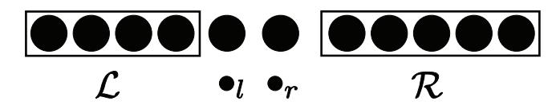
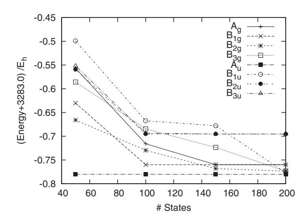
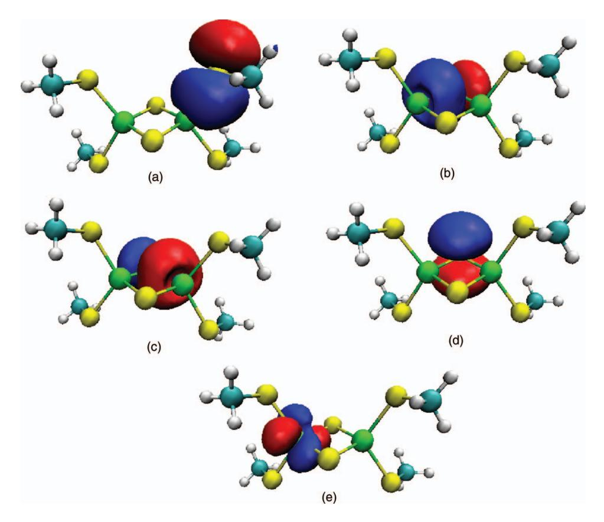
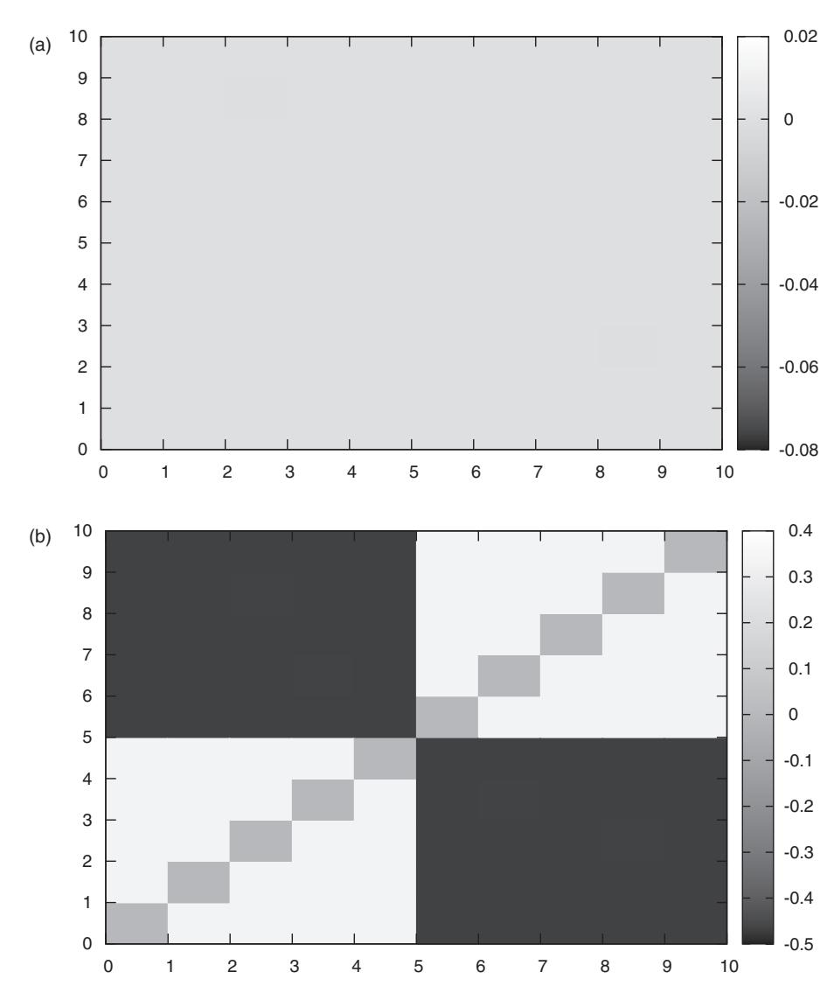
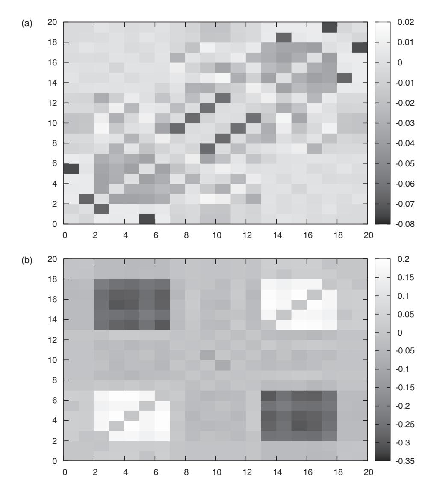
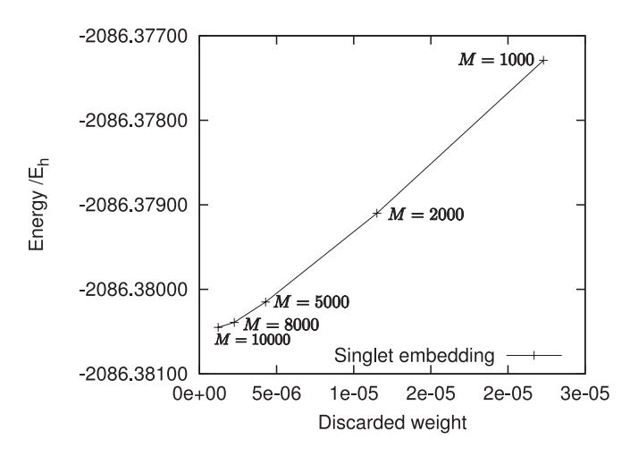
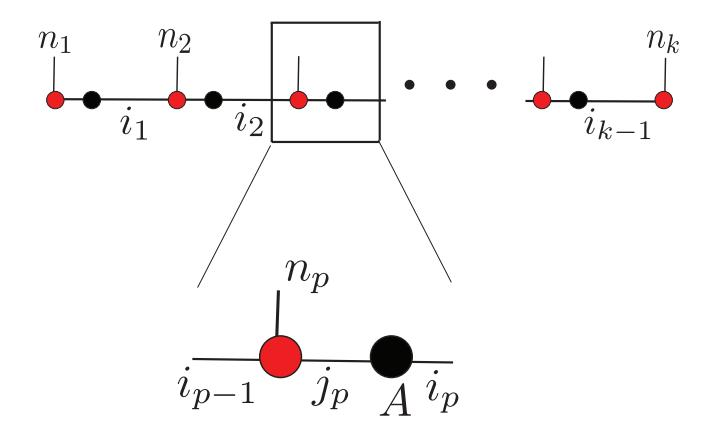
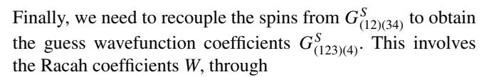

# **Spin-adapted density matrix renormalization group algorithms for quantum chemistry**

[Sandeep Sharma](http://aip.scitation.org/author/Sharma%2C+Sandeep) and [Garnet Kin-Lic Chan](http://aip.scitation.org/author/Chan%2C+Garnet+Kin-Lic)

Citation: [J. Chem. Phys.](/loi/jcp) **136**, 124121 (2012); doi: 10.1063/1.3695642

View online: <http://dx.doi.org/10.1063/1.3695642>

View Table of Contents: <http://aip.scitation.org/toc/jcp/136/12>

Published by the [American Institute of Physics](http://aip.scitation.org/publisher/)

# **[Spin-adapted density matrix renormalization group algorithms](http://dx.doi.org/10.1063/1.3695642) [for quantum chemistry](http://dx.doi.org/10.1063/1.3695642)**

Sandeep Sharma and Garnet Kin-Lic Cha[na\)](#page-1-0) *Department of Chemistry and Chemical Biology, Cornell University, Ithaca, New York 14853, USA* (Received 16 August 2011; accepted 2 March 2012; published online 30 March 2012)

We extend the spin-adapted density matrix renormalization group (DMRG) algorithm of McCulloch and Gulacsi [Europhys. Lett. **57**, 852 (2002)] to quantum chemical Hamiltonians. This involves using a quasi-density matrix, to ensure that the renormalized DMRG states are eigenfunctions of *S*ˆ2, and the Wigner-Eckart theorem, to reduce overall storage and computational costs. We argue that the spin-adapted DMRG algorithm is most advantageous for low spin states. Consequently, we also implement a singlet-embedding strategy due to Tatsuaki [Phys. Rev. E **61**, 3199 (2000)] where we target high spin states as a component of a larger fictitious singlet system. Finally, we present an efficient algorithm to calculate one- and two-body reduced density matrices from the spin-adapted wavefunctions. We evaluate our developments with benchmark calculations on transition metal system active space models. These include the Fe2S2, [Fe2S2(SCH3)4] 2−, and Cr2 systems. In the case of Fe2S2, the spin-ladder spacing is on the microHartree scale, and here we show that we can target such very closely spaced states. In [Fe2S2(SCH3)4] 2−, we calculate particle and spin correlation functions, to examine the role of sulfur bridging orbitals in the electronic structure. In Cr2 we demonstrate that spin-adaptation with the Wigner-Eckart theorem and using singlet embedding can yield up to an order of magnitude increase in computational efficiency. Overall, these calculations demonstrate the potential of using spin-adaptation to extend the range of DMRG calculations in complex transition metal problems. *© 2012 American Institute of Physics*. [\[http://dx.doi.org/10.1063/1.3695642\]](http://dx.doi.org/10.1063/1.3695642)

# **I. INTRODUCTION**

Since its introduction by Whit[e3,](#page-17-0) [4](#page-17-1) and its first application to quantum chemical systems[,5](#page-17-2) the density matrix renormalization group (DMRG) has been applied to a wide variety of problems in quantum chemistry.[6](#page-17-3)[–11](#page-17-4) After early attempts to use the DMRG as a full configuration interaction (FCI) method for small molecules,[7,](#page-17-5) [10,](#page-17-6) [12–](#page-17-7)[14](#page-17-8) it was recognised that DMRG is best used to describe non-dynamical correlation in active spaces. The DMRG algorithm exhibits a cost scaling of *O*(*k*3*M*3) + *O*(*k*4*M*2), where *k* is the number of active space orbitals, and *M* is the number of renormalized manybody states, which determines the accuracy of the method. In non-1D systems, the number of states *M* required to obtain a given error (relative to the FCI energy in the active space) depends on the correlation length of the system with the orbitals mapped onto an artificial 1D lattice, and this can increase quite rapidly with *k*. In addition, the shape of the orbitals and the order in which they are arranged can drastically affect the convergence of the DMRG.[15,](#page-17-9) [16](#page-17-10) Nonetheless, many examples have demonstrated that in practical applications, the DMRG describes active space correlations to high accuracy, for orbital spaces beyond the reach of complete active space non-dynamical correlation methods.

Transition metal chemistry typically involves partially filled *d* orbitals and is a rich source of difficult active space correlation problems. Increasing effort in recent times has been devoted to applications of the DMRG to transition metal chemistry[.8,](#page-17-11) [11,](#page-17-4) [17](#page-17-12)[–21](#page-17-13) Here, the ability to utilise spin symmetry is an important advantage. This is because the large number of unpaired electrons often leads to many low lying spin states in a very narrow energy window, which can only be efficiently resolved by targeting a specific spin sector. In addition, of course, the correct use of spin symmetry can lead to significant computational efficiency gains.

Spin symmetry is associated with the non-Abelian SU(2) Lie group. Spin adaptation in the DMRG can be achieved by working with states and operators (multiplets and irreducible tensor operators, respectively) that transform as irreducible representations of SU(2). This formulation resembles quantum chemistry approaches to spin adaptation which work directly in the configuration state function basis, rather than alternatives based on the symmetri[c22,](#page-17-14) [23](#page-17-15) or unitary groups[.24–](#page-17-16)[26](#page-17-17) The first DMRG algorithm to exploit non-Abelian spin symmetry was the interaction-round-a-face DMRG (IRF-DMRG) introduced by Sierra *et al.*[2,](#page-17-18) [27](#page-17-19) McCulloch and Gulacsi[1,](#page-17-20) [28,](#page-17-21) [29](#page-17-22) later proposed a highly efficient implementation of spinadapted DMRG. McCulloch's algorithm relied on two important ingredients. The first was the use of a quasi-density matrix to determine the renormalized DMRG basis. In general, the density matrix of a subsystem does not commute with the total spin operator of the subsystem, and thus the usual DMRG prescription, to use the density matrix eigenvectors as the many-body basis, is incompatible with spin adaptation. McCulloch and Gulacsi showed that the best states to retain in the decimation step of the DMRG are eigenvectors of a *quasi-density* matrix which commutes with the *S*ˆ2 operator. The second contribution was the use of the Wigner-Eckart theorem to efficiently store and compute matrix elements of

a)Author to whom correspondence should be addressed. Electronic mail: [gc238@cornell.edu.](mailto: gc238@cornell.edu)

irreducible tensor operators. This leads to significant improvements in the performance of DMRG. In this work, we closely follow McCulloch and Gulacsi and extend their algorithm to deal with the more complicated Hamiltonians in quantum chemical systems. We also describe the extension to compute one- and two-body density matrices, which are essential not only for interpreting DMRG calculations (e.g., through the analysis of correlation functions) but also in connecting the DMRG to treatments of dynamic correlation, such as canonical transformation theory, or perturbation theories. 30,31 We note that earlier work on spin-adapted DMRG in the context of quantum chemistry was carried out by Zgid and Nooijen. 10 Zgid and Nooijen used quasi-density matrices to ensure the proper spin symmetry of the renormalized states but did not use the Wigner-Eckart theorem to evaluate matrix elements. The cost of Zgid's algorithm was therefore (essentially) identical to the original non-spin-adapted DMRG algorithm. As we will show, while the Wigner-Eckart formulation complicates the DMRG implementation significantly, it also results in substantial performance gains.

We start with a brief summary of the DMRG algorithm in Sec. II. We assume that the reader has some familiarity with the DMRG algorithm as described in various articles, 7,11,32,33 thus we focus mainly on aspects of the DMRG that will be modified when spin adaptation is introduced. In Sec. III, we describe in some detail our implementation of spin adaptation in DMRG. For completeness, we review some concepts related to spin symmetry, such as the Wigner-Eckart theorem, Clebsch-Gordan coefficients, 6-j coefficients, and 9-j coefficients, although the reader will benefit from more detailed expositions, for example, in Refs. 34 and 35. In Sec. IV, we present our analysis of the main computational differences between the spin-adapted and non-spin-adapted algorithms and describe the singlet embedding approach to high spin states. In Sec. V, we present our algorithm to evaluate the one- and two-body reduced density matrices of the converged spin adapted wavefunctions. Finally in Sec. VI, we present some benchmark calculations on transition metal systems that demonstrate the potential advantages of using the spin-adapted DMRG algorithm. Here, we study the ability to target very closely spaced spin states in Fe2S2, the computation of correlation functions in  $[Fe_2S_2(SCH_3)_4]^{2-}$ , and the timings and computational efficiency of the algorithm in Cr2. Conclusions are presented in Sec. VII. The appendices summarise some of the relevant formulae, describes spin adaptation in the matrix product state (MPS) language, and gives the explicit formulae for wavefunction transformation and the tensor operator transposes.

### II. A SUMMARY OF THE DMRG ALGORITHM

To place the spin-adapted algorithm in context, we start with a description of the standard non-spin-adapted DMRG algorithm, and the inclusion of Abelian symmetries. Our later presentation of the spin-adapted algorithm and the handling of non-Abelian symmetries will closely parallel this description, to allow a clear comparison between the different steps.

FIG. 1. The one-dimensional arrangement of orbitals on a lattice and the subdivision into blocks, in the "two-dot" configuration. In the forward sweep the left block is termed the system block and the right block is termed the environment block and the reverse is true in the backward sweep. At each sweep iteration the system block increases in size by one orbital.

The DMRG algorithm consists of a set of sweeps over the k spatial orbitals of the problem. We imagine these orbitals to be arranged as a one dimensional lattice of sites. At every step of the algorithm, the lattice is conceptually divided into four parts: a left block  $\mathcal{L}$  consisting of sites  $1 \dots p-1$ , a left dot  $\bullet_l$ , consisting of site p, a right dot  $\bullet_r$  consisting of site p + 1, and a right block  $\mathcal{R}$  consisting of sites  $p + 2 \dots$ k; see Figure 1. (This corresponds to the "two-dot" formulation of the DMRG; in the "one-dot" formulation, only  $\bullet_l$  or  $\bullet_r$  is used, depending on the direction of the DMRG sweep. We will use the one-dot formulation later in the evaluation of reduced density matrices.) In the forward sweeps, the orbital index p increases from  $2 \dots k-2$ , and block  $\mathcal{L}$  increases in size to cover the lattice, while block R shrinks. During the backward sweeps, the index p iterates backward from k-2 $\dots$  2, and block  $\mathcal{R}$  increases in size to cover the lattice, while block  $\mathcal{L}$  shrinks. When it is necessary to refer to blocks at different sweep iterations, we will use additional subscripts to indicate the sites spanned by block. For example, in successive iterations in a forward sweep, the two  $\mathcal L$  blocks would be  $\mathcal{L}_{p-1}$  (sites 1 ... p-1) and  $\mathcal{L}_p$  (sites 1 ... p), and the two left dots would be  $\bullet_p$  and  $\bullet_{p+1}$ . We refer to the set of computations performed at each value of index p as a sweep iteration; a sweep thus contains k-4 sweep iterations. In total, the full calculation consists of multiple forward and backward sweeps (each containing multiple sweep iterations) until convergence in the energy is observed.

Blocks  $\mathcal{L}$  and  $\mathcal{R}$  are each associated with M many-body states, denoted by  $\{|l\rangle\}$  and  $\{|r\rangle\}$ , respectively, where the state labels range from  $l, r=1 \ldots M$ . If we need to be more specific about the nature of the block we will attach subscripts, e.g., block  $\mathcal{L}_{p-1}$  contains states  $|l_{p-1}\rangle$ . In successive sweeps of the DMRG algorithm, these many-body spaces are variationally improved. The left and right dots are associated with the complete Fock spaces of their respective orbitals  $\{|n_l\rangle\}$ ,  $\{|n_r\rangle\}$ , respectively, where  $|n\rangle \in \{|-\rangle, |\alpha\rangle, |\beta\rangle, |\alpha\beta\rangle\}$ .

During the calculation we wish to calculate observables, that is, expectation values of operators such as the Hamiltonian. In general such operators can be expressed as (sums of) products of operators partitioned between the four blocks. For example, a two particle density matrix element operator  $a_i^{\dagger}a_j^{\dagger}a_ka_l$  is partitioned amongst the blocks depending on the values of the indices i, j, k, l. (Note we use the indices to specify spin orbitals; later while describing the spin-adapted algorithm the indices will be used to specify spatial orbitals. The distinction will be clear from the context.) The Hamiltonian across the whole lattice involves sums of the density matrix element operators, and can thus be partitioned

TABLE I. Definitions of the operators used in the DMRG algorithm. Here the indices refer to spin orbital indices rather than spatial orbital indices.

| Operator                           | Definition                                                        |
|------------------------------------|-------------------------------------------------------------------|
| $rac{\hat{A}_{ij}}{\hat{B}_{ij}}$ | $a_i^\dagger a_i^\dagger$                                         |
| $\hat{B}_{ij}$                     | $a_i^\dagger a_j^{\ j}$                                           |
| $\hat{R}_i$                        | $\sum_{j} t_{ij} a_j + \sum_{jkl} v_{ijlk} a_j^{\dagger} a_k a_l$ |
| $\hat{P}_{ij}$ $\hat{Q}_{ij}$      | $\sum_{kl}v_{iilk}a_ka_l$                                         |
| $\hat{Q}_{ij}$                     | $\sum_{kl} (v_{ikjl} - v_{iklj}) a_k^{\dagger} a_l$               |

in multiple ways into operators on each of the different blocks.

$$\hat{H} = \sum_{ij} t_{ij} a_i^{\dagger} a_j + \frac{1}{2} \sum_{ijkl} v_{ijlk} a_i^{\dagger} a_j^{\dagger} a_k a_l. \tag{1}$$

The following set of operators and their adjoints, defined in Table I, provides an efficient partitioning:  $\hat{1}, a_i, \hat{A}_{ij}, \hat{B}_{ij}, \hat{R}_i, \hat{P}_{ij}, \hat{Q}_{ij}, \hat{H}^{36}$   $\hat{R}_i, \hat{P}_{ij}, \hat{Q}_{ij}$  are known as complementary operators, and their definitions involve the one- and two-electron integrals.

The computations in a sweep iteration consists of manipulations of states and operators in the spaces associated with the four blocks  $\mathcal{L}$ ,  $\bullet_l$ ,  $\bullet_r$ ,  $\mathcal{R}$ . These computations are divided into three steps blocking, wavefunction solution, and renormalization and decimation. We now describe these computations in the context of a forward sweep.

Blocking — This consists, conceptually, of adding the left dot to the left block and the right dot to the right block to form blocks  $\mathcal{A} = \mathcal{L} \bullet_l$  and  $\mathcal{B} = \bullet_r \mathcal{R}$ , respectively. Blocks  $\mathcal{A}$  and  $\mathcal{B}$  are each associated with many-body spaces  $\{|a\rangle\}$ ,  $\{|b\rangle\}$ , where the state labels range from  $a, b = 1 \dots 4M$ . They are product spaces, i.e.,  $\{|a\rangle\} = \{|l\rangle\} \otimes \{|n_l\rangle\}$  and  $\{|b\rangle\} = \{|n_r\rangle\} \otimes \{|r\rangle\}$ .

During blocking, the matrix elements of operators on block  $\mathcal{A}$  and block  $\mathcal{B}$  are formed from the matrix elements of constituent operators on the blocks  $\mathcal{L}$ ,  $\bullet_l$  and  $\bullet_r$ ,  $\mathcal{R}$ , respectively. Consider the operations to form the matrix representation of  $\hat{A}_{ij} = a_i^{\dagger} a_j^{\dagger}$  on block  $\mathcal{A}$ . We write this as  $\mathbf{A}_{ij}[\mathcal{A}]$ , where the bold font denotes matrix representation. Depending on the indices i, j, the matrix representation  $(\mathbf{A}_{ij}[\mathcal{A}])_{aa'} = \langle a|a_i^{\dagger}a_j^{\dagger}|a'\rangle$  is formed in one of three ways,

$$i, j \in \mathcal{L} \Rightarrow \mathbf{A}_{ij}[\mathcal{L}] \otimes \mathbf{1}[\bullet_{l}],$$

$$i \in \mathcal{L}, j \in \bullet_{l} \Rightarrow \mathbf{a}_{i}[\mathcal{L}] \otimes \mathbf{a}_{j}[\bullet_{l}],$$

$$i, j \in \bullet_{l} \Rightarrow \mathbf{1}[\mathcal{L}] \otimes \mathbf{A}_{ij}[\bullet_{l}].$$

$$(2)$$

Here  $\otimes$  denotes a tensor product between operators that is defined with a parity factor to take into account fermion statistics. For two operators  $\hat{X}$  and  $\hat{Y}$  with matrix elements  $\langle \mu | \hat{X} | \mu' \rangle$ ,  $\langle \nu | \hat{Y} | \nu' \rangle$ , the tensor product is defined through

$$\langle \mu \nu | \hat{X} \hat{Y} | \nu' \mu' \rangle = \mathcal{P}(\nu, \hat{X}) \langle \mu | \hat{X} | \mu' \rangle \langle \nu | \hat{Y} | \nu' \rangle, \tag{3}$$

where  $\mathcal{P}$  is the fermionic parity operator. Similarly, the Hamiltonian matrix  $\mathbf{H}[\mathcal{A}]$  is built from the matrix represen-

tations of operators in Table I acting on blocks  $\mathcal{L}$ ,  $\bullet_l$ ,

$$\mathbf{H}[\mathcal{A}] = \mathbf{H}[\mathcal{L}] \otimes \mathbf{1}[\bullet_{l}] + \mathbf{1}[\mathcal{L}] \otimes \mathbf{H}[\bullet_{l}]$$

$$+ \frac{1}{2} \sum_{i \in \mathcal{L}} \left( \mathbf{a}_{i}^{\dagger}[\mathcal{L}] \otimes \mathbf{R}_{i}[\bullet_{l}] + \mathbf{R}_{i}^{\dagger}[\bullet_{l}] \otimes \mathbf{a}_{i}[\mathcal{L}] \right)$$

$$+ \frac{1}{2} \sum_{i \in \bullet_{l}} \left( \mathbf{a}_{i}^{\dagger}[\bullet_{l}] \otimes \mathbf{R}_{i}[\mathcal{L}] + \mathbf{R}_{i}^{\dagger}[\mathcal{L}] \otimes \mathbf{a}_{i}[\bullet_{l}] \right)$$

$$+ \frac{1}{2} \sum_{ij \in \bullet_{l}} \left( \mathbf{A}_{ij}[\bullet_{l}] \otimes \mathbf{P}_{ij}[\mathcal{L}] + \mathbf{A}_{ij}^{\dagger}[\bullet_{l}] \otimes \mathbf{P}_{ij}^{\dagger}[\mathcal{L}] \right)$$

$$+ \frac{1}{2} \sum_{ij \in \bullet_{l}} \mathbf{B}_{ij}[\bullet_{l}] \otimes \mathbf{Q}_{ij}[\mathcal{L}]. \tag{4}$$

The representation of other operators in Table I for block  $\mathcal{A}$  may be constructed by formulae analogous to Eqs. (2) and (4). These formulae are summarised in Appendix A.

Wavefunction solution — Here we solve for a target eigenstate of  $\hat{H}$  for the full problem of k orbitals. In DMRG the corresponding Hilbert space is spanned by the product basis of  $\mathcal{A}$  and  $\mathcal{B}$ , which we refer to as the superblock space  $\{|ab\rangle\}$ . The corresponding matrix representation of  $\hat{H}$  is the superblock Hamiltonian  $\mathbf{H}[\mathcal{AB}]$ . The superblock Hamiltonian  $\mathbf{H}[\mathcal{AB}]$  is (formally) defined from Eq. (4), where  $\mathcal{A}$ ,  $\mathcal{B}$  replace the block labels  $\mathcal{L}$ ,  $\bullet_l$ . Note that we could also rewrite the Hamiltonian formula in Eq. (4) with the labels  $\mathcal{A}$  and  $\mathcal{B}$  swapped. For efficiency, we use the above definition when the number of orbitals in block  $\mathcal{A}$  is larger than that in block  $\mathcal{B}$ , and swap the labels  $\mathcal{A}$  and  $\mathcal{B}$  when the reverse is true.

The superblock Hamiltonian matrix is never built in practice, as we only wish to obtain one (or a few) eigenvectors. Instead the target wavefunction is expanded in the superblock basis  $\{|ab\rangle\}$ 

$$|\Psi\rangle = \sum_{ab} \mathbf{C}_{ab} |ab\rangle = \sum_{ln,n,r} \mathbf{C}_{ln_ln_rr} |ln_ln_rr\rangle,$$
 (5)

and we obtain the eigenvector  $\mathbf{C}$  using the Davidson algorithm. The main operation in the Davidson algorithm is the Hamiltonian wavefunction product  $\mathbf{H} \cdot \mathbf{C}$ . Since  $\mathbf{H}$  is partitioned into a sum of products of operators on blocks  $\mathcal{A}$  and  $\mathcal{B}$  as Eq. (4), this is carried out for each term in the sum, defining suitable intermediates. For example,

$$(\mathbf{A}_{ij}[\mathcal{A}] \otimes \mathbf{P}_{ij}[\mathcal{B}]) \cdot \mathbf{C} = \mathbf{A}_{ij}[\mathcal{A}] \mathbf{C} \mathbf{P}_{ij}^T[\mathcal{B}], \tag{6}$$

and the product is efficiently carried out by grouping the terms  $(\mathbf{A}_{ij}[\mathcal{A}]\mathbf{C})\mathbf{P}_{ij}^T[\mathcal{B}]$  or  $\mathbf{A}_{ij}[\mathcal{A}](\mathbf{C}\mathbf{P}_{ij}^T[\mathcal{B}])$ , where superscript T corresponds to the transpose of the operator.

Renormalization and decimation — Here the many-body space of block  $\mathcal{A}$  is truncated from dimension 4M to dimension M, to obtain the states and operators of the next  $\mathcal{L}$  block in the sweep. As argued by White,3 the optimal truncated space is formed by the eigenvectors of the density matrix of  $\mathcal{A}$  with the largest eigenvalues. The density matrix is defined by tracing out the contributions of the right block  $\mathcal{B}$  to the full density matrix,

$$\hat{\Gamma} = \text{Tr}_B |\Psi\rangle\langle\Psi|,\tag{7}$$

$$\Gamma = \mathbf{C}\mathbf{C}^{\dagger}.\tag{8}$$

The eigenvectors are obtained from

$$\hat{\Gamma}|l\rangle = \sigma_l|l\rangle,\tag{9}$$

and the M largest eigenvalues yield a set of eigenstates  $\{|l\rangle\}$ ,  $l=1\ldots M$ . We can collect the eigenvectors into a transformation matrix  $\mathbf{L}$ , where

$$\mathbf{\Gamma}\mathbf{L} = \mathbf{L}\operatorname{diag}[\sigma_1, \dots, \sigma_M]. \tag{10}$$

The remaining eigenvalues of the discarded eigenstates,  $\sigma_{M+1}$  ...  $\sigma_{4M}$  may be summed to give a total discarded weight, which measures the accuracy of the DMRG truncation and which can be used in DMRG extrapolations to the  $M=\infty$  limit. To complete the renormalization, we need to convert block  $\mathcal{A}$  into a new left block  $\mathcal{L}$ . To do this, we truncate the basis  $\{|a\rangle\}$  to the renormalized space  $\{|l\rangle\}$  of dimension M as above. We next project all the operators constructed on  $\mathcal{A}$  into this renormalized space. The projection is written in terms of the density matrix eigenvectors. For an operator  $\mathbf{X}[\mathcal{A}]$ , we have

$$\mathbf{X}[\mathcal{L}] = \mathbf{L}^{\dagger} \mathbf{X}[\mathcal{A}] \mathbf{L}. \tag{11}$$

At the end of the decimation step, we have constructed both the space and the operators of the new block  $\mathcal{L}$ , and we can proceed to the next sweep iteration.

# A. Abelian symmetries in the DMRG

Abelian symmetries, which include, for example, the axial spin component m, total particle number N, and Abelian point group symmetry, are taken into account in a straightforward manner in the DMRG. We label each block basis state  $|\mu\rangle$  by an additional set of quantum numbers q corresponding to the irreducible representations of all the applicable symmetries, i.e.,

$$|\mu\rangle \to |\mu q\rangle.$$
 (12)

For a product state, such as formed in the blocking step, Abelian symmetry means that the quantum numbers of the product state are just the "sum" of quantum numbers of the individual states

$$|\mu q\rangle = |\mu_1 q_1 \mu_2 q_2\rangle,$$

$$q = q_1 \oplus q_2.$$
(13)

In the case of N and m,  $\oplus$  is given by standard addition (i.e.,  $N = N_1 + N_2$ ) while in the case of point groups, it is given by modulo addition.

The target eigenstate obtained from DMRG transforms according to a desired irreducible representation. Consequently, only many-body states  $|a\rangle$  and  $|b\rangle$  whose quantum numbers sum to the target state quantum numbers need to appear in the wavefunction expansion,

$$|\Psi_{q}\rangle = \sum_{ab} \mathbf{C}_{aq_{a}bq_{b}} |aq_{a}bq_{b}\rangle,$$

$$q = q_{a} \oplus q_{b},$$
(14)

and thus Abelian symmetry can significantly reduce the number of coefficients in  ${\bf C}$ .

Operators on the blocks can also be labelled by Abelian symmetry representations or quantum numbers. For example,  $a_{i\beta}^{\dagger}$  is labelled by particle quantum number 1 and m quantum number -1/2, reflecting how the operator changes the quantum numbers of the states that it acts on. The labelling of operators by quantum numbers allows the use of selection rules to store and manipulate only the non-zero elements of the operators. These take the form

$$\langle \mu_1 q_1 | \hat{X}^q | \mu_2 q_2 \rangle = \delta_{q_1, q \oplus q_2} \langle \mu_1 q_1 | \hat{X}^q | \mu_2 q_2 \rangle.$$
 (15)

Labelling states and operators using Abelian symmetry thus leads to the following computational advantages: it reduces the number of states that need to be considered on each block, since they need to combine to yield the quantum numbers of the target wavefunction, it limits the coefficients **C** in the wavefunction expansion, and, selection rules allow us to work with only non-zero elements of the operators.

### III. SPIN ADAPTATION OF THE DMRG ALGORITHM

As discussed in the Introduction, the incorporation of spin symmetry can potentially yield significant computational advantages in the DMRG algorithm. The basic advantages are similar to those for Abelian symmetries: elimination of block states which cannot participate in the final target wavefunction, restriction of coefficients in the wavefunction expansion, and selection rules to work with only the non-zero operator elements. However, the non-Abelian nature of the SU(2) Lie group brings additional features into play. For example, associated with every spin state S is a 2S + 1 degenerate manifold of multiplet states, but if we are interested in the expectation value of a rotationally invariant operator such as the Hamiltonian, then we can work with multiplets as a single entity, rather than working with the individual states. The target wavefunction is then expanded in terms of a set of reduced coefficients labelled by multiplets, rather than states. Similarly, operators are represented by reduced matrix elements, labelled by multiplets rather than states. For a given particle number N in an orbital space of size k, the relative dimension of the number of multiplets of spin S versus the dimension of the state space with axial spin m = S is given by the ratio of the Weyl formula for the number of configuration state functions (with m = S) and the formulae for the number of determinants, namely

no. CSF = 
$$\frac{2S+1}{k+1} \binom{k+1}{n/2-S} \binom{k+1}{n/2+S+1}$$
no. dets = 
$$\binom{k}{n/2+m} \binom{k}{n/2-m}$$
. (16)

The computational advantage of using the multiplet space, versus the state space, is therefore a function of the particle number, number of orbitals, and spin. From the above formulae, it can be seen that the ratio of the number of CSFs to the number of determinants is most advantageous when *S* is small.

Of course, working with the reduced multiplet representations introduces some complications which involve the

algebra of SU(2). We now recap the theory of spin eigenstates and spin tensor operators as relevant to the DMRG, before describing the application to the steps of the sweep iteration.

# A. Spin eigenstates

Spin symmetry introduces two additional quantum numbers, S and m

$$|\mu\rangle \to |\mu Sm\rangle.$$
 (17)

Each S is associated with a degenerate multiplet of 2S+1 states, which transform amongst each other under rotation. The non-Abelian character of spin is apparent when we construct spin eigenstates from two underlying spins. In this case  $|Sm\rangle$  is not the product of spin eigenstates  $|S_1m_1S_2m_2\rangle$ , but instead a linear combination of product states with different  $m_1$  and  $m_2$ , coupled by Clebsch-Gordan coefficients  $c_{mm_1m_2}^{SS_1S_2}$ ,

$$|Sm\rangle = \sum_{m_1 m_2} c_{m m_1 m_2}^{SS_1 S_2} |S_1 m_1 S_2 m_2\rangle$$

$$m = m_1 + m_2,$$
(18)

$$S \in \{|S_1 - S_2|, |S_1 - S_2| + 1, \dots (S_1 + S_2)\}.$$
 (19)

Equation (19) generalizes Eq. (13) for Abelian symmetry, to spin symmetry. Because of the restriction in the range of allowed  $S_1$ ,  $m_1$ ,  $S_2$ ,  $m_2$  from Eqs. (18) and (19), we observe that spin confers a similar advantage to an Abelian symmetry in a DMRG calculation: block states on  $\mathcal{A}$ ,  $\mathcal{B}$  need not be considered if they cannot combine to yield the S, m quantum numbers in the target wavefunction.

As mentioned above when solving the Schrödinger equation with spin symmetry we can work with multiplets as a single entity, rather than individual states, because  $\hat{H}$  is invariant under rotation. *Reduced quantities* are labelled only by S, and the *reduced* wavefunction is written as

$$||\Psi_S\rangle = \sum_{aS_abS_b} \mathbf{C}_{aS_abS_b}||aS_abS_b\rangle. \tag{20}$$

The reduced coefficients in the multiplet representation are related to the coefficients  $\mathbf{C}_{aS_am_abS_bm_b}$  in the state representation,

$$|\Psi_{Sm}\rangle = \sum_{aS_am_abS_bm_b} \mathbf{C}_{aS_am_abS_bm_b} |aS_am_abS_bm_b\rangle, \qquad (21)$$

by

$$\mathbf{C}_{aS_am_abS_bm_b} = c_{m_am_bm}^{S_aS_bS} \mathbf{C}_{aS_abS_b}.$$
 (22)

The reduced coefficients  $\mathbf{C}_{aS_abS_b}$  are clearly smaller in number than the original set of wavefunction coefficients  $\mathbf{C}_{aS_am_abS_bm_b}$ .

### B. Spin tensor operators

With spin, symmetry operators can also acquire labels S, m. Operators which transform according to irreducible spin

TABLE II. Definitions of the operators used in the spin-adapted DMRG. Here the indices refer to spatial indices rather than spin indices.

|                   | Components             | Definition                                                                                                                                                                    |
|-------------------|------------------------|-------------------------------------------------------------------------------------------------------------------------------------------------------------------------------|
| $\hat{a}_i^{1/2}$ | $\hat{a}_i^{1/2,-1/2}$ | $\hat{a}^{\dagger}_{ieta}$                                                                                                                                                    |
|                   | $\hat{a}_i^{1/2,1/2}$  | $\hat{a}_{i\alpha}^{\dagger}$                                                                                                                                                 |
| $\hat{R}_k^{1/2}$ | $\hat{R}_k^{1/2,-1/2}$ | $rac{1}{\sqrt{2}}\sum_{ijl}  u_{ijkl} (\hat{a}^{\dagger}_{ilpha}\hat{a}^{\dagger}_{jlpha}\hat{a}_{llpha} + \hat{a}^{\dagger}_{ilpha}\hat{a}^{\dagger}_{jeta}\hat{a}_{leta})$ |
|                   | $\hat{R}_k^{1/2,1/2}$  | $rac{1}{\sqrt{2}}\sum_{ijl} v_{ijkl} (\hat{a}^{\dagger}_{ieta}\hat{a}^{\dagger}_{jlpha}\hat{a}_{llpha} + \hat{a}^{\dagger}_{ieta}\hat{a}^{\dagger}_{jeta}\hat{a}_{leta})$    |
| $\hat{A}^0_{ij}$  | $\hat{A}_{ij}^{0,0}$   | $rac{1}{\sqrt{2}}(\hat{a}_{ilpha}^{\dagger}\hat{a}_{jeta}^{\dagger}-\hat{a}_{ieta}^{\dagger}\hat{a}_{jlpha}^{\dagger})$                                                      |
|                   | $\hat{A}_{ij}^{1,-1}$  | $\hat{a}^{\dagger}_{i\beta}\hat{a}^{\dagger}_{j\beta}$                                                                                                                        |
| $\hat{A}^1_{ij}$  | $\hat{A}_{ij}^{1,0}$   | $rac{1}{\sqrt{2}}(\hat{a}_{ilpha}^{\dagger}\hat{a}_{jeta}^{\dagger}+\hat{a}_{ieta}^{\dagger}\hat{a}_{jlpha}^{\dagger})$                                                      |
|                   | $\hat{A}_{ij}^{1,1}$   | $\hat{a}^{\dagger}_{i\alpha}\hat{a}^{\dagger}_{j\alpha}$                                                                                                                      |
| $\hat{B}^0_{ij}$  | $\hat{B}_{ij}^{0,0}$   | $rac{1}{\sqrt{2}}(\hat{a}_{ilpha}^{\dagger}\hat{a}_{jlpha}+\hat{a}_{ieta}^{\dagger}\hat{a}_{jeta})$                                                                          |
|                   | $\hat{B}_{ij}^{1,-1}$  | $\hat{a}^{\dagger}_{i\beta}\hat{a}_{j\alpha}$                                                                                                                                 |
| $\hat{B}^1_{ij}$  | $\hat{B}_{ij}^{1,0}$   | $rac{1}{\sqrt{2}}(\hat{a}_{ilpha}^{\dagger}\hat{a}_{jlpha}-\hat{a}_{ieta}^{\dagger}\hat{a}_{jeta})$                                                                          |
|                   | $\hat{B}_{ij}^{1,1}$   | $-\hat{a}^{\dagger}_{ilpha}\hat{a}_{jeta}$                                                                                                                                    |
| $\hat{P}_{ij}^0$  | $\hat{P}_{ij}^{0,0}$   | $\frac{1}{\sqrt{2}}\sum_{kl}-v_{ijkl}(-\hat{a}_{l\alpha}\hat{a}_{k\beta}+\hat{a}_{l\beta}\hat{a}_{k\alpha})$                                                                  |
|                   | $\hat{P}_{ij}^{1,-1}$  | $\sum_{kl}  u_{ijkl} \hat{a}_{llpha} \hat{a}_{klpha}$                                                                                                                         |
| $\hat{P}^1_{ij}$  | $\hat{P}_{ij}^{1,0}$   | $\frac{1}{\sqrt{2}}\sum_{kl}-v_{ijkl}(-\hat{a}_{l\alpha}\hat{a}_{k\beta}-\hat{a}_{l\beta}\hat{a}_{k\alpha})$                                                                  |
|                   | $\hat{P}_{ij}^{1,1}$   | $\sum_{kl}  u_{ijkl} \hat{a}_{leta} \hat{a}_{keta}$                                                                                                                           |
| $\hat{Q}^0_{ij}$  | $\hat{Q}_{ij}^{0,0}$   | $\frac{1}{\sqrt{2}}\sum_{kl}(-\nu_{iklj}+2\nu_{ikjl})(\hat{a}_{k\alpha}^{\dagger}\hat{a}_{l\alpha}+\hat{a}_{k\beta}^{\dagger}\hat{a}_{l\beta})$                               |
|                   | $\hat{Q}_{ij}^{1,-1}$  | $\sum_{kl} -  u_{iklj} \hat{a}^{\dagger}_{keta} \hat{a}_{llpha}$                                                                                                              |
| $\hat{Q}^1_{ij}$  | $\hat{Q}_{ij}^{1,0}$   | $rac{1}{\sqrt{2}}\sum_{kl}- u_{iklj}(\hat{a}_{klpha}^{\dagger}\hat{a}_{llpha}-\hat{a}_{keta}^{\dagger}\hat{a}_{leta})$                                                       |
|                   | $\hat{Q}_{ij}^{1,1}$   | $\sum_{kl}  u_{iklj} \hat{a}^{\dagger}_{klpha} \hat{a}_{leta}$                                                                                                                |

representations are known as irreducible (spin) tensor operators. Similarly to a spin multiplet, tensor operators labelled by S are associated with a manifold of 2S+1 operators that transform amongst each other under rotation. A simple way to characterize a tensor operator is to observe its effect on a state with spin S=0. For example,  $a^{\dagger}_{i\alpha}$  and  $a^{\dagger}_{i\beta}$  are 2 components of a  $S=\frac{1}{2}$  (doublet) tensor operator  $a^{1/2}$ , because they act on a vacuum state (with spin S=0) to generate eigenstates of spin  $\frac{1}{2}$ . Considering the operators  $a^{\dagger}_{i\alpha}a_{j\alpha}$ ,  $a^{\dagger}_{i\alpha}a_{j\beta}$ ,  $a^{\dagger}_{i\beta}a_{j\alpha}$ ,  $a^{\dagger}_{i\beta}a_{j\beta}$ , they collectively span an S=0 singlet and an S=1 triplet manifold. The S=0 singlet operator is defined as

$$\hat{B}_{ij}^{0,0} = \frac{1}{\sqrt{2}} (a_{i\alpha}^{\dagger} a_{j\alpha} + a_{i\beta}^{\dagger} a_{j\beta}), \tag{23}$$

and the S = 1 triplet operators are defined as

$$\hat{B}_{ij}^{1,-1} = a_{i\beta}^{\dagger} a_{j\alpha}, \tag{24}$$

$$\hat{B}_{ij}^{1,0} = \frac{1}{\sqrt{2}} (a_{i\alpha}^{\dagger} a_{j\alpha} - a_{j\alpha}^{\dagger} a_{i\alpha}), \tag{25}$$

$$\hat{B}_{ij}^{1,1} = -a_{i\alpha}^{\dagger} a_{j\beta}. \tag{26}$$

A full list of the tensor operators used in the spin-adapted DMRG algorithm is given in Table II.

Tensor operators allow us to work with reduced operator matrix elements, labelled only by multiplets

$$\mathbf{X}_{\mu_1 S_1 \mu_2 S_2}^S = \langle \mu_1 S_1 || \hat{X}^S || \mu_2 S_2 \rangle. \tag{27}$$

The full matrix elements are obtained from the reduced matrix elements by the Wigner-Eckart theorem (analogously to Eq. (22))

$$\mathbf{X}_{\mu_1 S_1 m_1 \mu_2 S_2 m_2}^{Sm} = c_{m_2 m m_1}^{S_2 S S_1} \mathbf{X}_{\mu_1 S_1 \mu_2 S_2}^{S}. \tag{28}$$

The adjoint of a tensor operator is also a tensor operator. Here, we define the adjoint with a additional sign factor to preserve the Condon-Shortley phase convention used in the angular momentum ladder operators.34 To denote this adjoint with an additional phase, we use the symbol ±. For example,

$$\mathbf{X}^{S,m\ddagger} = (-1)^{S+m} \mathbf{X}^{S,-m\dagger}. \tag{29}$$

Note that the reduced matrix elements of the adjoint of a tensor operator are not the adjoint of the reduced matrix elements of the operator. The relationship between the reduced matrix elements of the tensor operators of spin  $S=0,\frac{1}{2},1$  and those of the corresponding adjoint operators, is given in Appendix D.

As is the case for spin eigenstates, a product tensor operator with quantum numbers S, m consists of a linear combination of tensor operators with quantum numbers  $S_1$ ,  $m_1$  and  $S_2$ ,  $m_2$ , coupled through Clebsch-Gordan coefficients

$$\left(\hat{X}_{1}^{S_{1}}\hat{X}_{2}^{S_{2}}\right)^{Sm} = \sum_{m_{1}m_{2}} c_{m_{1}m_{2}m}^{S_{1}S_{2}S} \hat{X}_{1}^{S_{1}m_{1}} \hat{X}_{2}^{S_{2}m_{2}}.$$
 (30)

We can obtain the reduced matrix elements of the product operator  $(\hat{X}_1^{S_1}\hat{X}_2^{S_2})^S$  directly from the reduced matrix elements of the operators  $\hat{X}$  and  $\hat{Y}$  using Wigner 9-j coefficients

$$\langle \mu \nu S_{\mu \nu} || (\hat{X}_{1}^{S_{1}} \hat{X}_{2}^{S_{2}})^{S} || \mu' \nu' S_{\mu' \nu'} \rangle$$

$$= \begin{bmatrix} S_{\mu'} & S_{\nu'} & S_{\mu \nu'} \\ S_{1} & S_{2} & S \\ S_{\mu} & S_{\nu} & S_{\mu \nu} \end{bmatrix} \langle \mu S_{\mu} || \hat{X}_{1}^{S_{1}} || \mu' S_{\mu'} \rangle \langle \nu S_{\nu} || \hat{X}_{2}^{S_{2}} || \nu' S_{\nu'} \rangle.$$
(31)

Here we define the spin-adapted tensor product  $\otimes_S$  as

$$\mathbf{X}_{1}^{S_{1}} \otimes_{S} \mathbf{X}_{2}^{S_{2}} = \left(\mathbf{X}_{1}^{S_{1}} \mathbf{X}_{2}^{S_{2}}\right)^{S}, \tag{32}$$

which is the reduced matrix analogue of Eq. (30) and the reduced matrix elements of  $(\mathbf{X}_1^{S_1}\mathbf{X}_2^{S_2})^S$  are calculated as shown in Eq. (31).

We now proceed to discuss how the spin algebra established above can be applied to the computations of the sweep iteration.

# C. Spin-adapted sweep iteration

Blocking — The two modifications to blocking when implementing spin-adaptation, are (i) instead of using the operators in Table I, we use tensor operators, defined in Table II, (ii) because we use tensor operators, we manipulate and store only the reduced matrix elements of the operators. This means that we replace the tensor multiplication  $\otimes$ , by the spin-adapted tensor multiplication  $\otimes$  S, defined in Eq. (32).

As an example, we consider the  $A_{ij}^S[\mathcal{A}]$  spin tensor operators, whose non-tensor analogues were considered in Eq. (2). The matrix of reduced matrix elements corresponding to  $A_{ij}^0[\mathcal{A}]$  is obtained by

$$i, j \in \mathcal{L} \implies \mathbf{A}_{ij}^{0}[\mathcal{L}] \otimes_{0} \mathbf{1}^{0}[\bullet_{l}],$$

$$i \in \mathcal{L}, j \in \bullet_{l} \implies \mathbf{a}_{i}^{1/2}[\mathcal{L}] \otimes_{0} \mathbf{a}_{j}^{1/2}[\bullet_{l}],$$

$$i, j \in \bullet_{l} \implies \mathbf{1}^{0}[\mathcal{L}] \otimes_{0} \mathbf{A}_{ij}^{0}[\bullet_{l}].$$
(33)

The partitioning of the superblock Hamiltonian similarly follows Eq. (4). Here we recall that the Hamiltonian is an S = 0 operator, i.e., we write  $\mathbf{H}^0$ . Then

$$\mathbf{H}^{0}[\mathcal{A}] = \mathbf{H}^{0}[\mathcal{L}] \otimes_{0} \mathbf{1}^{0}[\bullet_{l}] + \mathbf{1}^{0}[\mathcal{L}] \otimes_{0} \mathbf{H}^{0}[\bullet_{l}]$$

$$+2 \sum_{i \in \mathcal{L}} \left( \mathbf{a}_{i}^{1/2}[\mathcal{L}] \otimes_{0} \mathbf{R}_{i}^{1/2\ddagger}[\bullet_{l}] + \mathbf{a}_{i}^{1/2\ddagger}[\mathcal{L}] \otimes_{0} \mathbf{R}_{i}^{1/2}[\bullet_{l}] \right)$$

$$+2 \sum_{i \in \bullet_{l}} \left( \mathbf{a}_{i}^{1/2}[\bullet_{l}] \otimes_{0} \mathbf{R}_{i}^{1/2\ddagger}[\mathcal{L}] + \mathbf{a}_{i}^{1/2\ddagger}[\bullet_{l}] \otimes_{0} \mathbf{R}_{i}^{1/2}[\mathcal{L}] \right)$$

$$+ \sum_{ij \in \bullet_{l}} \left( -\sqrt{3}\mathbf{B}_{ij}^{1}[\bullet_{l}] \otimes_{0} \mathbf{Q}_{ij}^{1}[\mathcal{L}] + \mathbf{B}_{ij}^{0}[\bullet_{l}] \otimes_{0} \mathbf{Q}_{ij}^{0}[\mathcal{L}] \right)$$

$$+ \frac{\sqrt{3}}{2} \sum_{ij \in \bullet_{l}} \left( \mathbf{A}_{ij}^{1}[\bullet_{l}] \otimes_{0} \mathbf{P}_{ij}^{1}[\mathcal{L}] + \mathbf{A}_{ij}^{1\ddagger}[\bullet_{l}] \otimes_{0} \mathbf{P}_{ij}^{1\ddagger}[\mathcal{L}] \right)$$

$$+ \frac{1}{2} \sum_{ij \in \bullet_{l}} \left( \mathbf{A}_{ij}^{0}[\bullet_{l}] \otimes_{0} \mathbf{P}_{ij}^{0}[\mathcal{L}] + \mathbf{A}_{ij}^{0\ddagger}[\bullet_{l}] \otimes_{0} \mathbf{P}_{ij}^{0\ddagger}[\mathcal{L}] \right). \tag{34}$$

Wavefunction solution — In the wavefunction solution step, the spin-adapted Hamiltonian wavefunction product can be performed entirely in terms of the reduced operator matrix elements and reduced wavefunction coefficients. As in non-spin adapted DMRG algorithm, the full Hamiltonian matrix is never generated and the product is carried out for each term in the sum in the Hamiltonian in Eq. (34). For example, Eq. (6) becomes

$$\mathbf{C}_{a'S'_{a}b'S'_{b}} = \sum_{S_{a}S_{b}} \begin{bmatrix} S_{b} & S_{a} & S \\ S_{J} & S_{I} & 0 \\ S'_{b} & S'_{a} & S' \end{bmatrix} \times \langle S'_{b} || \mathbf{O}_{J}^{S_{J}}[\mathcal{B}] || S_{b} \rangle \langle S'_{a} || \mathbf{O}_{I}^{S_{I}}[\mathcal{A}] || S_{a} \rangle \mathbf{C}_{aS_{a}bS_{b}}.$$
(35)

Note, as in Eq. (6), this can be evaluated with the help of intermediates in  $O(M^3)$  cost. However, because of the summation over  $S_a$ ,  $S_b$ , the operator product does not separate into a single pair of decoupled matrix multiplications, as in the nonspin adapted case, but rather a pair of matrix multiplications must be carried out for each  $S_a$ ,  $S_b$  in the sum if the corresponding 9-j coefficient is non-zero. The overall operation is a constant times the cost of the non-spin-adapted operation Eq. (6), where the constant depends on the number of nonzero 9-j coefficients.

Renormalization and decimation — In the spin-adapted renormalization and decimation step we do not seek a

simple optimal truncation of the states of  $\mathcal{A}$ , but rather an optimal truncation to a set of states consistent with spin symmetry, i.e., to a set of pure spin states. These cannot be obtained as eigenvectors of the reduced density matrix of  $\mathcal{A}$ , because it does not commute with the spin operator  $\hat{S}^2$  of block  $\mathcal{A}$ . As shown in McCulloch and Gulacsi, 28 the density matrix to use in this case is the quasi-density matrix, which is obtained from the usual density matrix by setting off-diagonal blocks, that couple states of different spins, to zero. All operations of the renormalization and decimation step can be carried out in the multiplet representation, working in terms of reduced wavefunction coefficients and reduced matrix elements. The reduced matrix elements of the quasi-density matrix are obtained from the reduced wavefunction coefficients.

$$\Gamma_{aS_a,a'S_a} = \sum_{bS_b} \mathbf{C}_{aS_abS_b} \mathbf{C}_{a'S_abS_b}^*. \tag{36}$$

The eigenvectors of the quasi-density matrix yield the transformation matrices in reduced form, via its eigenvectors

$$\hat{\Gamma}||l_S\rangle = \sigma_{l,S}||l_S\rangle. \tag{37}$$

After obtaining the new renormalized basis, the operators in multiplet representation are transformed using the analogous formula to Eq. (11).

Note that when retaining *M* eigenvectors of the quasidensity matrix in the multiplet representation, we are retaining *M* sets of spin-multiplets. This corresponds to a much larger set of underlying states, which is of course, the advantage of working in a spin-adapted formulation. *However, we will still use the terminology "M states" to refer to the renormalized basis in the spin-adapted algorithm.* 

### IV. COMPUTATIONAL CONSIDERATIONS

The computational implementation of the spin-adapted DMRG algorithm is similar to the non-spin-adapted DMRG. Here we focus on computational differences between the two.

- The total number of operators stored in the spin-adapted DMRG is approximately half that in the non-spin-adapted DMRG. The most numerous kinds of operators in the DMRG algorithm are those with two orbital indices i and j, namely  $\hat{A}_{ij}$ ,  $\hat{B}_{ij}$ ,  $\hat{P}_{ij}$ ,  $\hat{Q}_{ij}$ . In the non-spin-adapted case there are four different  $\hat{A}_{ij}$  operators for every spatial pair ij, i.e.,  $\hat{A}_{i\alpha j\alpha}$ ,  $\hat{A}_{i\beta j\alpha}$ ,  $\hat{A}_{i\alpha j\beta}$ , and  $\hat{A}_{i\beta j\beta}$ . In the spin-adapted case, there are only two tensor operators:  $\hat{A}_{ij}^0$  and  $\hat{A}_{ij}^1$ .  $\hat{A}_{ij}^1$  contains three m components, but the Wigner-Eckart theorem (Eq. (28)) means we store only a single matrix of reduced matrix elements.
- The storage dependence of the spin-adapted algorithm is  $O(M^2)$  which is the same scaling as in the non-spin-adapted algorithm. However, the storage prefactor in the spin-adapted case is larger. This arises from the non-Abelian nature of the spin symmetry. For example, if we consider an operator such as  $\hat{B}^1_{ij}$ , the following reduced matrix elements are non-zero:  $\langle \mu_1 S || \hat{B}^1_{ij} || \mu_2 S 1 \rangle$ ,  $\langle \mu_1 S || \hat{B}^1_{ij} || \mu_2 S \rangle$  and

- $\langle \mu_1 S || \hat{B}_{ij}^1 || \mu_2 S + 1 \rangle$ , i.e., several different couplings between bra and ket are allowed. When Abelian symmetries are used,  $\hat{B}_{i\alpha j\beta}$  has non-zero matrix elements only between states of a single symmetry type, i.e.,  $\langle \mu_1 m |$  and  $|\mu_2 m \rangle$ .
- The main cost of the algorithm comes from the Hamiltonian wavefunction multiplication in the wavefunction solution step, and the operator transformation, in the renormalization and decimation step. In the spinadapted case, the cost of the Hamiltonian wavefunction multiplication is  $O(k^2M^3)$  per sweep step, similar to the non-spin-adapted algorithm. In the spin-adapted algorithm the presence of the 9*i* coupling coefficients prevents the Hamiltonian wavefunction multiplication from factoring into two stages as in Eq. (6). The prefactor of this step thus depends on the number of 9i couplings that must be accounted for. For singlet states, the spin-adapted computational prefactor is similar to that of the non-spin-adapted case but for higher spin states, it can be larger. The operator transformation in the spin-adapted algorithm is very similar to the nonspin-adapted case (and scales as  $O(k^2M^3)$  per sweep step), with the caveat that some of the operators are more dense as described in the previous paragraph.
- For large-scale calculations an efficient parallelization of the code is required. We have carried this out in the exact same way as in the non-spin-adapted DMRG algorithm described by Chan.37

# A. Singlet embedding

When using the spin-adapted DMRG algorithm to study higher spin states than the singlet, some disadvantages appear. First, the reduced coefficient matrix  $\mathbf{C}_{aS_abS_b}$  becomes more dense. In the case of the singlet, only quantum states of equal spins on blocks  $\mathcal{A}$  and  $\mathcal{B}$  can couple, while for say, a triplet state, additional couplings ( $S_b = S_a \pm 1$ ) are possible. A second disadvantage (related to the first) is that for non-singlet states, the eigenvalues of the quasi-density matrix of block  $\mathcal{A}$  and of block  $\mathcal{B}$  are not equivalent. A simple example illustrates this. Consider a reduced wavefunction written as

$$||\Psi_{S=1}\rangle = \frac{1}{\sqrt{2}}||aS_a = 1\rangle(||bS_b = 0\rangle + ||bS_b = 2\rangle).$$
 (38)

The quasi-density matrix of block  $\mathcal{A}$  has one non-zero eigenvalue, while that of block  $\mathcal{B}$  has two non-zero eigenvalues. This non-equivalence means that discarded weights obtained during the forward and backward sweeps of a calculation (which respectively arise from quasi-density matrices of blocks  $\mathcal{A}$  and  $\mathcal{B}$ ) are different, and this makes DMRG energy extrapolation using discarded weights ambiguous.

To overcome these disadvantages, it is clearly best to use the spin-adapted algorithm only to target singlet states. How then do we study systems in a higher spin state? One way is to use a technique which we call singlet embedding, originally introduced by Tatsuaki. Here we note that we can always add a set of auxiliary non-interacting orbitals to the end of the lattice which couple to the physical orbitals to overall

$$||\tilde{\Psi}_{S=0}\rangle = ||\Psi_S\rangle||\Phi_S\rangle,\tag{39}$$

where  $||\Phi_S\rangle$  is the state of the auxiliary non-interacting orbitals. Because the auxiliary orbitals do not energetically couple to the physical system, and have themselves no energy, they do not affect the energy of the physical system. We have implemented the singlet embedding technique as an option in our calculations, as described below.

### V. REDUCED DENSITY MATRIX EVALUATION

One- and two-body density matrices are important not only because they provide quantities which allow us to interpret the electronic structure, but also because they provide the link between active space correlation methods and dynamic correlation treatments, such as those based on perturbation theory, configuration interaction, or canonical transformations. 30,31,38-40 Algorithms to efficiently evaluate one- and two-body density matrices from DMRG wavefunctions have been described earlier41,42 and we refer the reader to those references for details. The efficient evaluation of the two-body reduced density matrix is most convenient in the "one-dot" formulation (see Sec. II) because it can easily be combined with the standard DMRG sweep algorithm. In this case, elements of the reduced density matrix can be evaluated using the same DMRG operators that are used in the evaluation of the energy (i.e., those in Table II) at different block configurations in a converged DMRG sweep. For example, to evaluate the element  $\Gamma_{iikl}$  of the two-body reduced density matrix (we assume i < j < k < l) we use a block configuration where indices  $i, j \in \mathcal{L}, k \in \bullet_{\mathcal{L}}$  and  $l \in \mathcal{R}$ . Indeed, for most elements of the two-body reduced density matrix, we can find a corresponding block configuration where no more than two indices are present on any of the blocks. (The exception is for the cases when more than two indices refer to the same spatial orbital, but these do not form part of the leading cost of the computation.) The memory cost of storing the necessary two index operators is of order  $O(k^2M^2)$ , which is the same as for the DMRG sweep algorithm.

In what follows, we use Roman letters  $i, j, \ldots$  to refer to spatial orbitals and Greek letters  $\tau, \beta, \ldots$  to refer to the spin of these orbitals. The spin orbital two-body reduced density matrix has  $(2k)^4$  matrix elements, i.e., the elements are  $\langle \hat{a}_{i\tau}^{\dagger} \hat{a}_{j\sigma}^{\dagger} \hat{a}_{k\gamma} \hat{a}_{l\delta} \rangle$ , while the spatial orbital two-

body reduced density matrix can be defined by integrating over the spin of the above expression, i.e., the elements are  $\sum_{\tau\sigma} \langle \hat{a}^{\dagger}_{i\tau} \hat{a}^{\dagger}_{j\sigma} \hat{a}_{k\sigma} \hat{a}_{l\tau} \rangle$ . Because we have spin-adapted wavefunctions and operators in the spin-adapted DMRG, it is possible to directly evaluate the spatial orbital two-body reduced density matrix using the operators in Table II without first constructing the spin-orbital two-body reduced density matrix.

Equations (40) and (41) illustrate how the spatial orbital two-body density matrix elements  $\Gamma_{ijkl}$  and  $\Gamma_{ikjl}$  are computed, where i < j < k < l and the indices are arranged in a 1, 1, 2 arrangement, 41 i.e., the first index  $i \in \mathcal{L}$ , the second index  $j \in \bullet_{\mathcal{L}}$ , i.e.,  $i, j \in \mathcal{A}$ , and the last two indices  $k, l \in \mathcal{B}$ .

$$\sum_{\tau\sigma} \langle \hat{a}_{i\tau}^{\dagger} \hat{a}_{j\sigma}^{\dagger} \hat{a}_{k\sigma} \hat{a}_{l\tau} \rangle = -\sqrt{3} \langle \hat{A}_{ij}^{1} [\mathcal{A}] \otimes_{0} \hat{A}_{kl}^{1,\dagger} [\mathcal{B}] \rangle$$

$$+ \langle \hat{A}_{ij}^{0} [\mathcal{A}] \otimes_{0} \hat{A}_{kl}^{0,\dagger} [\mathcal{B}] \rangle$$

$$\sum_{\tau\sigma} \langle \hat{a}_{i\tau}^{\dagger} \hat{a}_{k\sigma}^{\dagger} \hat{a}_{j\sigma} \hat{a}_{l\tau} \rangle = \sqrt{3} \langle \hat{B}_{ij}^{1} [\mathcal{A}] \otimes_{0} \hat{B}_{kl}^{1} [\mathcal{B}] \rangle$$

$$- \langle \hat{B}_{ii}^{0} [\mathcal{A}] \otimes_{0} \hat{B}_{kl}^{0} [\mathcal{B}] \rangle. \tag{40}$$

For the arrangement 1, 2, 1, i.e.,  $i \in \mathcal{L}$ ,  $j, k \in \bullet_{\mathcal{L}}$ , and  $l \in \mathcal{R}$ , a different formula is used, for example,

$$\sum_{\tau\sigma} \langle \hat{a}_{i\tau}^{\dagger} \hat{a}_{j\sigma}^{\dagger} \hat{a}_{k\sigma} \hat{a}_{l\tau} \rangle = 2 \langle \left( \hat{a}_{i}^{1/2} [\mathcal{L}] \otimes_{1/2} \hat{B}_{jk}^{0} [\bullet_{l}] \right) \otimes_{0} \hat{a}_{l}^{1/2,\ddagger} [\mathcal{R}] \rangle, \tag{41}$$

Other expressions for  $\Gamma_{ijkl}$  corresponding to different distributions of the indices amongst the blocks can be generated similarly.

Before discussing the spin orbital two-body reduced density matrix, we note that there are  $2^4=16$  elements for every spatial orbital element, but if the wavefunction conserves  $S_z$ , only 6 elements are non-zero, corresponding to  $\langle \hat{a}^{\dagger}_{i\alpha}\hat{a}^{\dagger}_{j\alpha}\hat{a}_{k\alpha}\hat{a}_{l\alpha}\rangle$ ,  $\langle \hat{a}^{\dagger}_{i\alpha}\hat{a}^{\dagger}_{j\beta}\hat{a}_{k\beta}\hat{a}_{l\alpha}\rangle$ ,  $\langle \hat{a}^{\dagger}_{i\beta}\hat{a}^{\dagger}_{j\beta}\hat{a}_{k\beta}\hat{a}_{l\alpha}\rangle$ ,  $\langle \hat{a}^{\dagger}_{i\beta}\hat{a}^{\dagger}_{j\alpha}\hat{a}_{k\beta}\hat{a}_{l\alpha}\rangle$ , and  $\langle \hat{a}^{\dagger}_{i\beta}\hat{a}^{\dagger}_{j\beta}\hat{a}_{k\beta}\hat{a}_{l\beta}\rangle$ . These spin orbital density matrix elements can be calculated using appropriate combinations of the tensor operators in Table II. For example, let us again use the indices i,j,k,l in a 1, 1, 2 arrangement, i.e., with  $i,j\in\mathcal{A},k,l\in\mathcal{B}$ . We first calculate the 6 expectation values shown on the right-hand side of Eq. (42). Then the 6 non-zero elements of the spin orbital reduced density matrix may be obtained by solving the linear equation,

$$\begin{pmatrix}
0 & -\frac{1}{2} & -\frac{1}{2} & \frac{1}{2} & \frac{1}{2} & 0 \\
\frac{1}{\sqrt{3}} & \frac{1}{\sqrt{12}} & \frac{1}{\sqrt{12}} & \frac{1}{\sqrt{12}} & \frac{1}{\sqrt{3}} \\
0 & -\frac{1}{2} & \frac{1}{2} & \frac{1}{2} & -\frac{1}{2} & 0 \\
0 & -\frac{1}{2} & \frac{1}{2} & -\frac{1}{2} & \frac{1}{2} & 0 \\
\frac{1}{\sqrt{2}} & 0 & 0 & 0 & 0 & -\frac{1}{\sqrt{2}} \\
\frac{1}{\sqrt{6}} & -\frac{1}{\sqrt{6}} & -\frac{1}{\sqrt{6}} & -\frac{1}{\sqrt{6}} & \frac{1}{\sqrt{6}}
\end{pmatrix}
\begin{pmatrix}
\langle \hat{a}_{i\alpha}^{\dagger} \hat{a}_{j\alpha}^{\dagger} \hat{a}_{k\alpha} \hat{a}_{l\alpha} \rangle \\
\langle \hat{a}_{i\beta}^{\dagger} \hat{a}_{j\alpha}^{\dagger} \hat{a}_{k\alpha} \hat{a}_{l\beta} \rangle \\
\langle \hat{a}_{i\beta}^{\dagger} \hat{a}_{j\alpha}^{\dagger} \hat{a}_{k\alpha} \hat{a}_{l\alpha} \rangle \\
\langle \hat{a}_{i\beta}^{\dagger} \hat{a}_{j\alpha}^{\dagger} \hat{a}_{k\alpha} \hat{a}_{l\beta} \rangle \\
\langle \hat{a}_{i\beta}^{\dagger} \hat{a}_{j\beta}^{\dagger} \hat{a}_{k\alpha} \hat{a}_{l\beta} \rangle \\
\langle \hat{a}_{i\beta}^{\dagger} \hat{a}_{j\beta}^{\dagger} \hat{a}_{k\alpha} \hat{a}_{l\beta} \rangle \\
\langle \hat{a}_{i\beta}^{\dagger} \hat{a}_{j\beta}^{\dagger} \hat{a}_{k\alpha} \hat{a}_{l\beta} \rangle \\
\langle \hat{a}_{i\beta}^{\dagger} \hat{a}_{j\beta}^{\dagger} \hat{a}_{k\alpha} \hat{a}_{l\beta} \rangle \\
\langle \hat{a}_{i\beta}^{\dagger} \hat{a}_{j\beta}^{\dagger} \hat{a}_{k\beta} \hat{a}_{l\beta} \rangle \end{pmatrix}
\end{pmatrix}
\begin{pmatrix}
\langle \hat{A}_{ij}^{0} | \mathcal{A} | \otimes_{0} \hat{A}_{ik}^{0,\dagger} | \mathcal{B} | \rangle \\
\langle \hat{A}_{ij}^{1} | \mathcal{A} | \otimes_{0} \hat{A}_{ik}^{1,\dagger} | \mathcal{B} | \rangle \\
\langle \hat{a}_{i\beta}^{\dagger} \hat{a}_{j\alpha}^{\dagger} \hat{a}_{k\alpha} \hat{a}_{l\beta} \rangle \\
\langle \hat{a}_{i\beta}^{\dagger} \hat{a}_{j\alpha}^{\dagger} \hat{a}_{k\alpha} \hat{a}_{l\beta} \rangle \\
\langle \hat{a}_{i\beta}^{\dagger} \hat{a}_{j\beta}^{\dagger} \hat{a}_{k\beta} \hat{a}_{l\beta} \rangle \\
\langle \hat{a}_{ij}^{\dagger} \hat{a}_{j\beta} \hat{a}_{k\beta} \hat{a}_{l\beta} \rangle \end{pmatrix}
\end{pmatrix}$$

For different arrangements of indices, a different set of linear equations is used. Note that this process is simplified for a singlet wavefunction, because the last 4 expectation values on right-hand side are zero.

# **VI. APPLICATIONS**

We now describe some benchmark applications of the spin-adapted DMRG algorithm in transition metal complexes, Fe2S2, [43,](#page-17-35) [44](#page-17-36) [Fe2S2(SCH3)4] 2−, and Cr2. [45](#page-17-37)[–47](#page-17-38) Unlike recent studies by ourselves and others, such as the DMRG-CT study of [Cu2O2] 2+ in Ref. [17,](#page-17-12) or the DMRG-CASPT2 study of Cr2 in Ref. [31,](#page-17-24) here we are not targeting chemical accuracy in these benchmarks. Rather our initial studies are designed to illustrate various aspects of the spin-adapted DMRG algorithm, such as the targeting of closely spaced spin states, the evaluation of reduced density matrices, and the computational performance of the spin-adapted algorithm relative to the traditional non-spin-adapted algorithm. Consequently, we study the electronic structure of the complexes within the active space approximation only. In future work, we will describe the combination of the spin-adapted DMRG algorithm with dynamic correlation methods, along the lines of Refs. [17](#page-17-12) and [31.](#page-17-24)

In our first application, to demonstrate the ability of the spin-adapted DMRG algorithm to target very closely spaced states of different spatial and spin symmetries, we calculate the spin ladder of the Fe2S2 molecule using an active space of 12 electrons in 12 orbitals (12*e*, 12*o*), where exact calculations can also be performed. In the second application, we study the [Fe2S2(SCH3)4] 2− in a 30 electron, 20 orbital active space (30*e*, 20*o*) that includes the S 3*p* orbitals. By examining the number and spin correlation functions, we can analyze the contributions of the S 3*p* orbitals to the electronic structure. Finally, in the third application, we study the singlet and triplet spin states of the Cr2 molecule. This is a benchmark calculation using a large active space (24*e*, 30*o*) but a small (double-zeta with polarization) basis set. This system has previously been studied by Kurashige and Yanai with the non-spin-adapted algorithm, and our results allow us to examine in detail the relative computational efficiency of the spin-adapted and non-spin-adapted algorithms.

# **A. Fe2S2**

We first carried out spin-adapted DMRG calculations on the Fe2S2 molecule at a *D*2*h* geometry (see supplementary information[58\)](#page-17-39). For simplicity, we used a minimal STO-3G (Ref. [48\)](#page-17-40) basis. The active space was identified by carrying out a high-spin UB3LYP/STO-3G (Refs. [48–](#page-17-40)[50\)](#page-17-41) calculation with multiplicity 9 (i.e., eight unpaired electrons), and then selecting 12 unrestricted natural orbitals (UNO) (Ref. [51\)](#page-17-42) with occupation numbers between 1.99 and 0.01 to make up the (12*e*, 12*o*) active space. The orbitals in the DMRG calculation were ordered by UNO occupation number. We then carried out calculations on 40 states (multiplicities 1, 3, 5, 7, 9, for each of the 8 irreducible representations of *D*2*h*). Because of

FIG. 2. Convergence of the DMRG energies for eight different singlet states of Fe2S2. Here "States" refer to the number of retained DMRG multiplets.

the small active space, with *M* = 200 the DMRG energies (in *Eh*) were already converged to 5 decimal places; these were checked against complete active space configuration interaction using the ORCA (Ref. [52\)](#page-17-43) package, which agreed to all digits. The convergence of the DMRG energies for the 8 singlet states is shown in Fig. [2,](#page-9-1) while the converged energies for all 40 states are given in Table [III.](#page-9-2) As can be seen from Fig. [2](#page-9-1) and Table [III,](#page-9-2) many of the states are almost degenerate - to within *<*10*μEh*. Naturally, such closely spaced states would be very hard to resolve without a method that takes into account spin symmetry.

#### **B. [Fe2S2(SCH3)4] 2−**

We now describe DMRG calculations performed on the [Fe2S2(SCH3)4] 2− molecule. The molecule is illustrated in Figure [3.](#page-10-0) We constructed the geometry (see supplementary information[58\)](#page-17-39) by replacing *p*-toluene groups with methyl groups in the crystal structure of the [Fe2S2(S-*p*-tol)4] 2− complex synthesized by Mayerle *et al.*[53](#page-17-44) To determine the active space, first we carried out an UBP86/SVP calculation[54](#page-17-45) on the high spin state of the molecule (*Sz* = 10). Next, the doubly occupied and singly occupied alpha valence molecular orbitals were localized by using the Pipek-Mezey localization

TABLE III. Energies (*E* + 3283.0) in *Eh* of various spin and symmetry states of Fe2S2 calculated using the spin-adapted DMRG algorithm. Note the very close spacing (*<*10*μEh*) of states of different spin, which would be very hard to resolve without a spin-adapted algorithm.

| Irreducible     | Multiplicity |          |          |          |          |  |  |
|-----------------|--------------|----------|----------|----------|----------|--|--|
| representations | 1            | 3        | 5        | 7        | 9        |  |  |
| Ag              | −0.75993     | −0.75990 | −0.75993 | −0.75993 | −0.75996 |  |  |
| B1g             | −0.75992     | −0.75992 | −0.75991 | −0.75993 | −0.75996 |  |  |
| B2g             | −0.77344     | −0.78351 | −0.78343 | −0.72207 | −0.78312 |  |  |
| B3g             | −0.77345     | −0.78007 | −0.77991 | −0.78662 | −0.78648 |  |  |
| Au              | −0.78028     | −0.77344 | −0.78678 | −0.78669 | −0.78656 |  |  |
| B1u             | −0.77686     | −0.77672 | −0.78333 | −0.72207 | −0.78301 |  |  |
| B2u             | −0.68761     | −0.75991 | −0.75990 | −0.75992 | −0.75995 |  |  |
| B3u             | −0.69535     | −0.75991 | −0.75993 | −0.69537 | −0.69614 |  |  |

FIG. 3. The [Fe2S2(SCH3)4] 2− molecule, obtained by replacing toluene groups with methyl groups in the [Fe2S2(S-*p*-tol)4] −2 complex synthesized by Mayerle *et al.*[53](#page-17-44)

scheme. From these localized orbitals, we constructed two active spaces (i) a (10*e*, 10*o*) Fe 3*d* only active space and (ii) a (30*e*, 20*o*) Fe 3*d* and S 3*p* active space. The S orbitals included three 3*p* orbitals on each bridging S atom and one 3*p* orbital pointing toward the Fe atom on each ligand S atom (see Figure [4\)](#page-10-1). For the purposes of counting electrons in the active space, the S orbitals were regarded as doubly occupied.

In the DMRG calculation, the 20 orbitals were ordered as follows: S4(3p), S5(3p), Fe1(3d), Fe1(3d), Fe1(3d), Fe1(3d), Fe1(3d), S1(3p1), S2(3p1), S1(3p0), S2(3p0), S1(3p2), S2(3p2), Fe2(3d), Fe2(3d), Fe2(3d), Fe2(3d), Fe2(3d), S3(3p), and S6(3p), where the atom labels are given in

TABLE IV. Energy in *Eh* and discarded weights of a spin-adapted DMRG calculation on the singlet state of the [Fe2S2(SCH3)4] −2 molecule.

| M    | Energy      | Discarded weight |  |  |
|------|-------------|------------------|--|--|
| 1024 | −5103.96332 | 7.24 × 10−5      |  |  |
| 2048 | −5103.96341 | 2.84 × 10−5      |  |  |
| 3200 | −5103.96342 | 1.50 × 10−5      |  |  |

Figure [3.](#page-10-0) Here orbitals 3p1, 3p0, and 3p2, respectively, point toward Fe1 (orbital label b of Figure [4\)](#page-10-1), in the north-south direction in the plane of the paper (orbital label d of Figure [4\)](#page-10-1) and toward Fe2 (orbital label c of Figure [4\)](#page-10-1), respectively. For the 10 orbital active space, the same ordering of the Fe 3*d* orbitals was used.

We carried out DMRG calculations targeting the singlet ground state. The DMRG calculations for the (10*e*, 10*o*) active space converged to *μEh* accuracy already at *M* = 200. In Table [IV,](#page-10-2) we report the energies and discarded weights for the (30*e*, 20*o*) active space. We find that the energy is converged to *μEh* accuracy by *M* = 3200. Subsequently, one-dot DMRG sweeps at the final *M* value were carried out to tight convergence, and the resulting wavefunctions were used to compute the one- and two-body spatial reduced density matrices.

To analyze the electronic structure in this molecule, we computed the number-number (Eq. [\(43\)\)](#page-11-0) and spin-spin (Eq. [\(44\)\)](#page-11-1) correlation functions in both the Fe 3*d* only active

FIG. 4. Five representative active space orbitals of [Fe2S2(SCH3)4] 2− are shown. Orbital "a" is the 3*p* orbital of ligand S pointing toward the Fe atom; four such orbitals, one from each ligand S, are included in the active space. Orbitals "b," "c," and "d" are the three 3*p* orbitals of bridging S; three more such orbitals from the other bridging S are also included in the active space. Orbital "e" is the Fe 3*d* orbital; ten such orbitals, five from each Fe atom, are included in the active space.

FIG. 5. Left: Number-number correlations in the Fe 3d active space. The correlations are almost vanishing (all < 0.01). Right: Spin-spin correlations in the Fe 3d active space. All the positive values in correlation matrix are equal to 1/3 and negative values are equal to -7/15. The electrons on the same Fe atom are ferromagnetically aligned but are antiferromagnetically aligned to electrons on different Fe atom. The above patterns of number and spin correlations can be explained by a very simple wavefunction, see text.

space and the Fe 3d, S 3p active space; here  $\hat{n}_i$  is the number operator  $\hat{a}_i^{\dagger}\hat{a}_i$ .

$$P_{ij} = (1 - \delta_{ij})(\langle \hat{n}_i \hat{n}_j \rangle - \langle \hat{n}_i \rangle \langle \hat{n}_j \rangle). \tag{43}$$

$$S_{ii} = 4(1 - \delta_{ii})(\langle \hat{S}_{7i} \hat{S}_{7i} \rangle - \langle \hat{S}_{7i} \rangle \langle \hat{S}_{7i} \rangle). \tag{44}$$

Note that these correlation functions are normalized such the maximum value of  $|P_{ij}|$  and  $|S_{ij}|$  is 1.

Figure 5 shows the number-number and spin-spin correlation plots for the 10 orbital Fe 3d active space. We find that the number-number correlation function is almost identically zero (all elements are <0.01), while the spin-spin correlation function takes only two values  $+\frac{1}{3} \approx 0.33$ , and  $-\frac{7}{15} \approx -0.47$ . The positive values of  $S_{ij}$  are between the 3d orbitals on the same atom (ferromagnetic alignment), while the negative values are between the 3d orbitals between atoms (antiferromagnetic alignment). (The values are not 1 and -1,

indicating that the wavefunction contains fluctuations in the relative angles of the spins on the different atoms.)

The above correlation functions can be seen to arise from a very simple wavefunction for the 10 orbital Fe 3d active space singlet. This consists of a singlet coupling between two Fe atoms which are each in a high spin state, with 5 singly occupied d orbitals,

$$|\Psi\rangle = \sqrt{\frac{1}{6}} \left[ \left| \frac{5}{2}, \frac{5}{2}; \frac{5}{2}, -\frac{5}{2} \right\rangle - \left| \frac{5}{2}, \frac{3}{2}; \frac{5}{2}, -\frac{3}{2} \right\rangle \right.$$

$$\left. + \left| \frac{5}{2}, \frac{1}{2}; \frac{5}{2}, -\frac{1}{2} \right\rangle - \left| \frac{5}{2}, -\frac{1}{2}; \frac{5}{2}, \frac{1}{2} \right\rangle \right.$$

$$\left. + \left| \frac{5}{2}, -\frac{3}{2}; \frac{5}{2}, \frac{3}{2} \right\rangle - \left| \frac{5}{2}, -\frac{5}{2}; \frac{5}{2}, \frac{5}{2} \right\rangle \right].$$
 (45)

Since each state in the above contains only Fe atoms with singly occupied d orbitals, the corresponding number-number correlation function vanishes, while the values  $\frac{1}{3}$ ,  $-\frac{7}{15}$  of the spin-spin correlation function arise from the pattern of spin couplings in Eq. (45). The correctness of the above wavefunction is also confirmed by its energy,  $-5103.14473 E_h$ , as

FIG. 6. Left: Number-number correlations in the Fe 3*d*,S3*p* active space. The Fe 3*d* orbitals are orbitals 2–6, 13–17. The bridging S 3*p* orbitals are orbitals 7–12. Note that compared to the 3*d* only active space, number correlations are increased, although they still are relatively small. Right: Spin-spin correlations in the Fe 3*d*,S3*p* active space. Spin-spin correlations between the Fe 3*d* orbitals are significantly reduced (by about 50%) from the minimal 3*d* active space, reflecting the strong influence of the bridging ligands.

compared to the exact DMRG wavefunction energy for the 10 orbital active space of −5103.14487 *Eh*.

What happens when we introduce ligand bridging orbitals to the active space? In Fig. [6](#page-12-0) we show the numbernumber and spin-spin correlation plots for the (30*e*, 20*o*) Fe 3*d* active space that includes the S ligand orbitals. We see that the inclusion of S orbitals promotes both number-number and spin-spin fluctuations as evidenced in the correlation plots. The number-number correlations still remain fairly small (the largest correlation between the Fe and S orbitals is only about 0.04). However, the spin-spin correlations are significantly altered from the 10 orbital active space. In particular, the spinspin correlations both between *d* orbitals on the same Fe atom, and between different Fe atoms, are significantly reduced, by about 50%, from the simple wavefunction in Eq. [\(45\).](#page-11-3) Further we have shown the occupation numbers of the active space orbitals and the natural orbitals in Table [V.](#page-13-0) Note that none of the active space orbitals have occupation numbers greater than 1.88. In addition, there are only 4 natural orbitals with occupation numbers greater than 1.98 which implies that a simple rotation of active space orbitals will not lead to an active space of fewer than 16 orbitals.

The strong effect of the S ligand orbitals on the spin correlations and the significant deviation of values of occupation numbers from 0 to 2 in Table [V](#page-13-0) suggests that the minimal *d* only active space may be insufficient for computations of spin states in bridged metal systems, even when dynamic correlation is included, say, at the second-order perturbation theory level.

# **C. Cr2**

Recently Kurashige and Yana[i11](#page-17-4) carried out large-scale DMRG calculations on the singlet ground state of Cr2 using an active space of (24*e*, 30*o*). These were benchmark rather than realistic calculations because they did not include

TABLE V. Occupation numbers of the active space orbitals and the natural orbitals of  $[Fe_2S_2(SCH_3)_4]^{2-}$  calculated using DMRG on (30e, 20o) active space. The order of the active space orbitals is given in the text. None of the active space orbitals have occupation numbers greater than 1.88 and there are only 4 natural orbitals with occupation numbers greater than 1.98, indicating the importance of including S 3p orbitals in the active space.

| Orbital | Active orbitals $\langle \hat{n}_i \rangle$ | Natural orbitals $\langle \hat{n}_i \rangle$ |  |  |
|---------|---------------------------------------------|----------------------------------------------|--|--|
| 1       | 1.869                                       | 0.686                                        |  |  |
| 2       | 1.878                                       | 0.794                                        |  |  |
| 3       | 1.277                                       | 0.846                                        |  |  |
| 4       | 1.212                                       | 0.901                                        |  |  |
| 5       | 1.193                                       | 0.999                                        |  |  |
| 6       | 1.284                                       | 1.013                                        |  |  |
| 7       | 1.209                                       | 1.175                                        |  |  |
| 8       | 1.775                                       | 1.271                                        |  |  |
| 9       | 1.776                                       | 1.451                                        |  |  |
| 10      | 1.518                                       | 1.511                                        |  |  |
| 11      | 1.520                                       | 1.824                                        |  |  |
| 12      | 1.783                                       | 1.829                                        |  |  |
| 13      | 1.782                                       | 1.877                                        |  |  |
| 14      | 1.215                                       | 1.907                                        |  |  |
| 15      | 1.276                                       | 1.972                                        |  |  |
| 16      | 1.205                                       | 1.980                                        |  |  |
| 17      | 1.199                                       | 1.982                                        |  |  |
| 18      | 1.281                                       | 1.986                                        |  |  |
| 19      | 1.878                                       | 1.998                                        |  |  |
| 20      | 1.869                                       | 1.997                                        |  |  |

dynamical correlation. (We note however, a later study, namely Ref. 55 also included a perturbation theory treatment of dynamical correlation on top of the DMRG, and this produced a highly accurate chromium dimer binding curve.) Here, we use the same  $Cr_2$  benchmark example as Kurashige and Yanai with exactly the same geometry (bond length 1.5 Å), basis set (the Ahlrichs SVP basis, a polarized double zeta quality basis54), molecular orbitals and ordering as in their original paper. Our purpose here will be to examine the accuracy and speed of the spin-adapted DMRG algorithm as compared to the original non-spin-adapted algorithm. We target the singlet ( ${}^{1}A_{g}$  in  $D_{2h}$  symmetry) and triplet ( ${}^{3}B_{1g}$  in  $D_{2h}$  symmetry) states of the molecule in our calculations.

### 1. Accuracy

The total DMRG energy of the singlet state as a function of the number of retained states (M), and discarded weight in the quasi-density matrix (i.e., the largest discarded weight during the DMRG sweep) is shown in Table VI. Kurashige and Yanai's converged DMRG energy with 10 000 non-spin-adapted states was -2086.42053  $E_h$  which is slightly *above* our spin-adapted M = 5000 energy of -2086.42061  $E_h$ . We see that the spin-adapted DMRG algorithm requires roughly only half the number of states as the non-spin-adapted DMRG to achieve a similar accuracy in the energy. The greater accuracy of the spin-adapted algorithm allows us to perform a more accurate extrapolation of the DMRG energy to  $M = \infty$ 

TABLE VI. Energy (E+2086) in  $E_h$  and discarded weights of a spin-adapted DMRG calculation on the singlet state of the Cr2 molecule. Note that our M=5000 spin-adapted energy is already lower than the M=10000 non-spin-adapted energy reported in Ref. 11.

| M        | Energy   | Discarded weight       |
|----------|----------|------------------------|
| 1000     | -0.41831 | $2.032 \times 10^{-5}$ |
| 2000     | -0.41979 | $1.006 \times 10^{-5}$ |
| 5000     | -0.42061 | $3.075 \times 10^{-6}$ |
| 8000     | -0.42078 | $1.608 \times 10^{-6}$ |
| 10000    | -0.42082 | $9.630 \times 10^{-7}$ |
| $\infty$ | -0.42100 |                        |

than in Ref. 11. Our final  $M = 10\,000$  spin-adapted DMRG energy is within 0.2  $mE_h$  of the extrapolated  $M = \infty$  result.

The total DMRG energy and the discarded weights of the triplet state using the spin-adapted (with and without spin embedding) and non-spin-adapted algorithms are shown in Table VII. Similarly to the singlet case, we find that the spinadapted algorithm requires roughly half the number of renormalized states as the non-spin-adapted algorithm to achieve the same accuracy. Singlet embedding (Sec. IV A), although formally increasing the number of orbitals in the problem, leads to no loss of accuracy as compared to the spin-adapted calculation on the triplet state, and indeed leads to a slight increase in accuracy. As observed in Sec. IV A, in the spinadapted calculation on the triplet state, the discarded weights obtained during the forward and backward sweeps are vastly different. This discrepancy vanishes when the triplet state energies are obtained via embedding in a singlet state. The singlet embedding allows us to perform energy extrapolation with respect to the discarded weights, as shown in Fig. 7. We find that the M = 10000 spin-adapted calculation is within  $0.3 \, mE_h$  of the extrapolated exact DMRG result. Thus in both the singlet and triplet states, we are able to use the DMRG to obtain the total electronic energy to within better than 1 kcal/mol  $(0.6 mE_h)$ .

FIG. 7. Spin-adapted DMRG energy in  $E_h$  of the  $Cr_2$  triplet state versus discarded weight. The triplet energy is calculated using the singlet embedding approach, which allows the definition of a consistent discarded weight.

TABLE VII. Energies (*E* + 2086) in *Eh* and discarded weights of a spin-adapted DMRG calculation on the triplet state of the Cr2 molecule. Columns 2 through 5 give data for the forward and backward sweeps of spin-adapted calculations, columns 6 and 7 give our results when we use the singlet embedding technique and finally the last two columns give our results for non-spin-adapted calculations.

| M     | Spin-adapted  |                  |                |                  |                   |                  |                  |                  |
|-------|---------------|------------------|----------------|------------------|-------------------|------------------|------------------|------------------|
|       | Forward sweep |                  | Backward sweep |                  | Singlet embedding |                  | Non-spin-adapted |                  |
|       | Energy        | Discarded weight | Energy         | Discarded weight | Energy            | Discarded weight | Energy           | Discarded weight |
| 1000  | −0.37682      | 1.5 × 10−4       | −0.37682       | 1.8 × 10−5       | −0.37729          | 2.2 × 10−5       | −0.37418         | 5.9 × 10−5       |
| 2000  | −0.37888      | 6.7 × 10−5       | −0.37888       | 1.1 × 10−5       | −0.37910          | 1.2 × 10−5       | −0.37736         | 2.8 × 10−5       |
| 5000  | −0.38011      | 2.5 × 10−5       | −0.38009       | 4.7 × 10−6       | −0.38015          | 4.3 × 10−6       | −0.37949         | 1.1 × 10−5       |
| 8000  | −0.38036      | 1.2 × 10−5       | −0.38036       | 2.8 × 10−6       | −0.38039          | 2.3 × 10−6       | −0.38000         | 5.9 × 10−6       |
| 10000 | −0.38043      | 8.6 × 10−6       | −0.38043       | 1.9 × 10−6       | −0.38045          | 1.2 × 10−6       | −0.38016         | 3.5 × 10−6       |
| ∞     |               |                  |                |                  | −0.38074          |                  | −0.38059         |                  |

### **2. Efficiency**

As explained in Sec. [IV](#page-7-0) the most expensive step in the DMRG algorithm is formation of the Hamiltonian wavefunction product, whose computational cost scales as *O*(*M*3), where *M* is the number of retained states. From the above results, we observe that the spin-adapted algorithm requires roughly half the number of renormalized states as the non-spin-adapted algorithm to achieve the same accuracy. This suggests that if the cost of a single Davidson iteration (for a given number of states) is comparable between the spinadapted and non-spin-adapted algorithms, then, to achieve a given accuracy in the DMRG energy, the spin-adapted algorithm should offer an 8-fold gain in computational speed.

To compare the performance of the spin-adapted and non-spin-adapted DMRG algorithms we show the wall times per Davidson iteration of the two algorithms in Table [VIII.](#page-14-1) For the singlet case, we notice that for example the *M* = 5000 timings are comparable for both the spin-adapted and nonspin-adapted calculations. However, moving to *M* = 10 000, the computational cost increases by a factor of 4 rather than 8, i.e., more like *O*(*M*2) rather than *O*(*M*3). This means that the spin-adapted algorithm yields (for a given accuracy) only a 4-fold gain in computational efficiency over the non-spin-

FIG. 8. The figure shows the graphical representation of the MPS wavefunction that can be obtained using the results of the spin-adpated DMRG calculation. The red dots represent a matrix of Clebsch-Gordan coefficients (**U***n*) and the black dots are the rotation matrices obtained from the renormalization step in DMRG (**L***,* **R** see text for details).

adapted algorithm. The quadratic scaling is a result of the high Abelian spatial symmetry (*D*2*h*) present in the molecule, which means that each of the non-zero blocks of the operators are so small that the corresponding basic linear algebra subprograms matrix multiplication operations are dominated by quadratic as opposed to cubic complexity terms. We expect, however, the computational scaling would approach *O*(*M*3) as *M* is increased further, or if the calculations were performed without the use of point group symmetry, as may be the case in other more complex molecules. In such cases the spin-adapted algorithm should offer even larger computational gains.

In the triplet state, as expected from the analysis in Sec. [IV,](#page-7-0) for any given *M*, the cost of the Davidson iteration is much higher for the spin-adapted algorithm than for the nonspin-adapted algorithm. However, with singlet embedding, the spin-adapted computational times are now similar to those of the non-spin-adapted case. Thus, with singlet embedding, the spin-adapted algorithm also provides a 4-fold efficiency gain for the triplet state. This we also expect to rise either as *M* is increased, or if we consider more complex molecules without high Abelian spatial symmetry. Overall, we conclude that the spin-adapted DMRG algorithm provides considerable advantages in terms of computational efficiency, which would only increase in larger calculations.

TABLE VIII. Wall-clock times for a single Davidson iteration performed with spin-adapted (denoted spin) and non-spin-adapted (denoted no-spin) DMRG algorithms. The calculations use 2 Intel quad-core Xeon E5420 processors (2.50 GHz). (ratio) is the ratio of the spin-adapted and non-spinadapted times, while spin (s.e.) denotes the singlet embedding technique, where we add a set of non-interacting orbitals and then target the *S* = 0 state of the combined system (see text for more details). Note that for the singlet state, the spin-adapted and non-spin-adapted calculations for given *M* are roughly the same cost. In the case of the triplet state, this is true if the spinadapted calculations are carried out using the singlet embedding technique.

|       |      | S = 0   |         |      | S = 1       |         |         |
|-------|------|---------|---------|------|-------------|---------|---------|
| M     | Spin | No spin | (Ratio) | Spin | Spin (s.e.) | No spin | (Ratio) |
| 2000  | 59   | 55      | 1.07    | 111  | 41          | 48      | 0.85    |
| 5000  | 329  | 292     | 1.13    | 707  | 248         | 267     | 0.93    |
| 8000  | 1003 | 794     | 1.26    | 2622 | 792         | 746     | 1.06    |
| 10000 | 1752 | 1363    | 1.29    | 4628 | 1782        | 1295    | 1.38    |

### VII. CONCLUSIONS

In this work, we described the implementation of spinadapted DMRG algorithms for quantum chemical Hamiltonians. Our formulation of spin-adaptation is based on the earlier work of McCulloch and Gulacsi for model Hamiltonians. We also described efficient reduced density matrix evaluation within the spin-adapted formalism. Spin-adaptation brings several advantages, including the correct treatment of spin symmetry within approximate calculations, the ability to resolve closely spaced spin states, and significant computational efficiency gains. We demonstrate these capabilities with active space studies of several transition metal complexes, including Fe2S2, where we study closely spaced spin states, [Fe2S2(SCH3)4]2-, where we compute the reduced density matrices to analyze the electronic structure, and Cr2, where we carry out detailed timing studies. In  $[Fe_2S_2(SCH_3)_4]^{2-}$ , we find that the inclusion of S 3p orbitals in the active space significantly modifies the spin-spin correlations between the Fe atoms, reducing them by about 50%. This argues for the importance of the bridging ligand orbitals in complete active space models. In Cr2 we find (i) that spin-adaptation reduces the number of renormalized states required for a given accuracy by a factor of 2, (ii) for nonsinglet states, we need to use the singlet embedding strategy of Tatsuaki to obtain maximum efficiency gains. From the above, we conclude that the theoretical computational speedup from spin-adaptation is a factor of 8, although we have only observed speedups close to a factor of 4 due to the small size and high point group symmetry of the molecules. Overall, the ability to target spin states and the computational efficiency advantages of the spin-adapted DMRG algorithm will be most important when studying larger transition metal complexes such as those which involve multiple metal centres. Such studies are currently in progress in our group.

### **ACKNOWLEDGMENTS**

This work was supported by the National Science Foundation (NSF) through Grant No. NSF-CHE-0645380.

### **APPENDIX A: BLOCKING**

In this section, we give the formulae for formation of operators R, P, and Q in the blocking step of the non-spin-adapted and spin-adapted DMRG algorithms.

# 1. Non-spin-adapted DMRG

$$\mathbf{R}_{i}[\mathcal{A}] = \mathbf{R}_{i}[\mathcal{L}] \otimes \mathbf{1}[\bullet_{l}] + \mathbf{R}_{i}[\bullet_{l}] \otimes \mathbf{1}[\mathcal{L}]$$

$$+ \sum_{j \in \bullet_{l}} 2\mathbf{P}_{ij}[\mathcal{L}] \otimes \mathbf{a}_{j}^{\dagger}[\bullet_{l}] + \mathbf{Q}_{ij}[\mathcal{L}] \otimes \mathbf{a}_{i}[\bullet_{l}]$$

$$+ \sum_{j \in \mathcal{L}} 2\mathbf{P}_{ij}[\bullet_{l}] \otimes \mathbf{a}_{j}^{\dagger}[\mathcal{L}] + \mathbf{Q}_{ij}[\bullet_{l}] \otimes \mathbf{a}_{i}[\mathcal{L}], \quad (A1)$$

$$\mathbf{Q}_{ij}[\mathcal{A}] = \mathbf{Q}_{ij}[\mathcal{L}] \otimes \mathbf{1}[\bullet_{l}] + \mathbf{Q}_{ij}[\bullet_{l}] \otimes \mathbf{1}[\mathcal{L}]$$

$$+ 2 \sum_{k \in \bullet_{l}} ((v_{ikjl} - v_{iklj}) \mathbf{a}_{k}^{\dagger}[\bullet_{l}] \otimes \mathbf{a}_{l}[\mathcal{L}]$$

$$+ (v_{iljk} - v_{ilki}) \mathbf{a}_{k}[\bullet_{l}] \otimes \mathbf{a}^{\dagger}[\mathcal{L}]), \tag{A2}$$

$$\mathbf{P}_{ij}[\mathcal{A}] = \mathbf{P}_{ij}[\mathcal{L}] \otimes \mathbf{1}[\bullet_{l}] + \mathbf{P}_{ij}[\bullet_{l}] \otimes \mathbf{1}[\mathcal{L}]$$

$$+ \sum_{k \in \bullet_{l} \atop l \in \mathcal{L}} (v_{ijlk} \mathbf{a}_{k}[\bullet_{l}] \otimes \mathbf{a}_{l}[\mathcal{L}] + v_{ijkl} \mathbf{a}_{k}[\bullet_{l}] \otimes \mathbf{a}_{l}[\mathcal{L}]).$$
(A3)

# 2. Spin-adapted DMRG

$$\mathbf{R}_{i}^{1/2}[\mathcal{A}] = \mathbf{R}_{i}^{1/2}[\mathcal{L}] \otimes_{1/2} \mathbf{1}^{0}[\bullet_{l}] + \mathbf{R}_{i}^{1/2}[\bullet_{l}] \otimes_{1/2} \mathbf{1}^{0}[\mathcal{L}]$$

$$+ \sum_{j \in \bullet_{l}} \frac{\sqrt{3}}{2} \mathbf{P}_{ji}^{1}[\mathcal{L}] \otimes_{1/2} \mathbf{a}_{j}^{1/2}[\bullet_{l}] + \frac{1}{2} \mathbf{P}_{ji}^{0}[\mathcal{L}] \otimes_{1/2} \mathbf{a}_{i}^{1/2}[\bullet_{l}]$$

$$+ \sum_{j \in \bullet_{l}} \frac{\sqrt{3}}{2} \mathbf{Q}_{ij}^{1\ddagger}[\mathcal{L}] \otimes_{1/2} \mathbf{a}_{j}^{1/2\ddagger}[\bullet_{l}] - \frac{1}{2} \mathbf{Q}_{ij}^{0\ddagger}[\mathcal{L}] \otimes_{1/2} \mathbf{a}_{i}^{1/2\ddagger}[\bullet_{l}]$$

$$+ \sum_{j \in \mathcal{L}} \frac{\sqrt{3}}{2} \mathbf{P}_{ji}^{1}[\bullet_{l}] \otimes_{1/2} \mathbf{a}_{j}^{1/2}[\mathcal{L}] + \frac{1}{2} \mathbf{P}_{ji}^{0}[\bullet_{l}] \otimes_{1/2} \mathbf{a}_{i}^{1/2}[\mathcal{L}]$$

$$+ \sum_{i \in \mathcal{L}} \frac{\sqrt{3}}{2} \mathbf{Q}_{ij}^{1\ddagger}[\bullet_{l}] \otimes_{1/2} \mathbf{a}_{j}^{1/2\ddagger}[\mathcal{L}] - \frac{1}{2} \mathbf{Q}_{ij}^{0\ddagger}[\bullet_{l}] \otimes_{1/2} \mathbf{a}_{i}^{1/2\ddagger}[\mathcal{L}], \tag{A4}$$

$$\mathbf{Q}_{ij}^{1}[\mathcal{A}] = \mathbf{Q}_{ij}^{1}[\mathcal{L}] \otimes_{1} \mathbf{1}^{0}[\bullet_{l}] + \mathbf{Q}_{ij}^{1}[\bullet_{l}] \otimes_{1} \mathbf{1}^{0}[\mathcal{L}]$$

$$- \sum_{l \in \bullet_{l} \atop k \in \mathcal{L}} \left( v_{kijl} \mathbf{a}_{l}^{1/2; \dagger}[\bullet_{l}] \otimes_{1} \mathbf{a}_{k}^{1/2}[\mathcal{L}] \right)$$

$$+ v_{lijk} \mathbf{a}_{l}^{1/2}[\bullet_{l}] \otimes_{1} \mathbf{a}_{l}^{1/2 \dagger}[\mathcal{L}] \right), \tag{A5}$$

$$\mathbf{Q}_{ij}^{0}[\mathcal{A}] = \mathbf{Q}_{ij}^{0}[\mathcal{L}] \otimes_{0} \mathbf{1}^{0}[\bullet_{l}] + \mathbf{Q}_{ij}^{0}[\bullet_{l}] \otimes_{0} \mathbf{1}^{0}[\mathcal{L}]$$

$$- \sum_{\substack{l \in \bullet_{l} \\ k \in \mathcal{L}}} \left( (2v_{ikjl} - v_{kijl}) \mathbf{a}_{l}^{1/2;\ddagger}[\bullet_{l}] \otimes_{0} \mathbf{a}_{k}^{1/2}[\mathcal{L}] \right)$$

$$+ (2v_{iljk} - v_{lijk}) \mathbf{a}_{l}^{1/2}[\bullet_{l}] \otimes_{0} \mathbf{a}_{l}^{1/2\ddagger}[\mathcal{L}], \quad (A6)$$

$$\mathbf{P}_{ij}^{1}[\mathcal{A}] = \mathbf{P}_{ij}^{1}[\mathcal{L}] \otimes_{1} \mathbf{1}^{0}[\bullet_{l}] + \mathbf{P}_{ij}^{1}[\bullet_{l}] \otimes_{1} \mathbf{1}^{0}[\mathcal{L}]$$
$$- \sum_{k \in \mathcal{L} \atop l \bullet_{l} \in \mathbb{N}} v_{ijlk} \mathbf{a}_{k}^{1/2\ddagger}[\bullet_{l}] \otimes_{1} \mathbf{a}_{l}^{1/2\ddagger}[\mathcal{L}], \tag{A7}$$

$$\mathbf{P}_{ij}^{0}[\mathcal{A}] = \mathbf{P}_{ij}^{0}[\mathcal{L}] \otimes_{1} \mathbf{1}^{0}[\bullet_{l}] + \mathbf{P}_{ij}^{0}[\bullet_{l}] \otimes_{1} \mathbf{1}^{0}[\mathcal{L}]$$

$$+ \sum_{k \in \mathcal{L} \atop l_{\bullet_{l} \in \mathbb{R}}} (v_{ijlk} - v_{ijkl}) \mathbf{a}_{k}^{1/2\ddagger}[\bullet_{l}] \otimes_{0} \mathbf{a}_{l}^{1/2\ddagger}[\mathcal{L}]. \quad (A8)$$

### **APPENDIX B: WAVEFUNCTION TRANSFORMATION**

In the DMRG wavefunction solution step, the convergence of the Davidson iterations is greatly improved if we use a suitable guess. Such a guess can be obtained by transforming the wavefunction from the previous sweep iteration. The transformation of the wavefunction in the case of the spin-adapted algorithm is very similar to that used in the non-spin-adapted algorithm with the exception that a spin-rescaling step must be performed, involving Racah coefficients. We start with the coefficients of the wavefunction for a given  $\mathcal{L} \bullet_{\mathcal{L}} \bullet_{\mathcal{R}} \mathcal{R}$  block configuration,

$$\begin{split} C^{S}_{(l_{p-1};S_{1}n_{p;S_{2}})S_{12}}(n_{p+1;S_{3}}r_{p+2;S_{4}})_{S_{34}} \\ &= \langle (l_{p-1};S_{1}n_{p;S_{2}})S_{12}||\langle (n_{p+1};S_{3}r_{p+2;S_{4}})S_{34}||\Psi_{S}\rangle. \ \ (\text{B1}) \end{split}$$

In the lhs expression, we have explicitly shown the order of the spin-couplings;  $l_{p-1;S_1}$  and  $n_{p;S_2}$  first couple to spin  $S_{12}$ ,  $n_{p+1;S_3}$  and  $r_{p+2;S_4}$  couple to spin  $S_{34}$ , and S is the target spin of the wavefunction obtained by coupling  $S_{12}$  and  $S_{34}$ . Next, we approximately transform these coefficients using the pseudoinverse of the forward transformation matrix  $\tilde{\mathbf{L}}$ , and the backward transformation matrix  $\mathbf{R}$ , to obtain the coefficients of the guess wavefunction

$$\begin{split} G^S_{l_{p;S_{12}}(n_{p+1;S_3}(n_{p+2;S_5}r_{p+3;S_6})_{S_4})_{S_{34}}} \\ &= \sum_{l_{p-1}n_pr_{p+2}} \bar{L}^{l_p;S_{12}}_{l_{p-1;S_1}n_{p;S_2}} C^S_{(l_{p-1;S_1}n_{p;S_2})_{S_{12}}(n_{p+1;S_3}r_{p+2;S_4})_{S_{34}}} R^{r_{p+2;S_4}}_{n_{p+2;S_5}r_{p+3;S_6}} \end{split}$$

$$\approx \langle l_{p;S_{12}}||\langle (n_{p+1;S_3}(n_{p+2;S_5}r_{p+3;S_6})_{S_4})_{S_{34}}||\Psi_S\rangle.$$
 (B2)

$$G_{(l_{p;S_{12}}n_{p+1;S_3})_{S_{123}}(n_{p+2;S_5}r_{p+3;S_6})_{S_4}}^{S}$$

$$= \sum_{S_{34}} W(S_{12}S_3SS_4; S_{123}S_{34})[(2S_{123} + 1)(2S_{34} + 1)]^{1/2}$$

$$\times G_{l_{p;S_{12}}(n_{p+1;S_2}(n_{p+2;S_5}r_{p+3;S_6})_{S_4})_{S_24}}^{S}.$$
(B3)

# APPENDIX C: MATRIX PRODUCT STATE FORMULATION

The wavefunction emerging from the usual non-spin-adapted DMRG has a MPS structure as described, for example in Refs. 33, 56, and 57. In the canonical form associated with a given block configuration, the MPS wavefunction is written as (using the one-dot formulation of the DMRG for simplicity56,57)

$$|\Psi\rangle = \sum_{\{\mathbf{n}\}} \mathbf{L}^{n_1} \mathbf{L}^{n_2} \dots \mathbf{C}^{n_p} \mathbf{R}^{n_{p+1}} \dots \mathbf{R}^{n_k} |\mathbf{n}\rangle, \qquad (C1)$$

where  $|\mathbf{n}\rangle$  denotes a Slater determinant in occupation number representation,  $\mathbf{L}^n$  is a left transformation matrix as defined in Eq. (10), obtained during the forwards DMRG sweep,  $\mathbf{R}^n$  is a right transformation matrix, obtained during the backward sweep, and  $\mathbf{C}^{n_p}$  is the wavefunction coefficient matrix.

In the case of the spin-adapted DMRG, the wavefunction also has a matrix product state form. However, the transformation matrices  $\mathbf{L}^n$ ,  $\mathbf{R}^n$  now assume a special restricted structure. In particular,

$$\mathbf{L}^n = \mathbf{U}^n \underline{\mathbf{L}},\tag{C2}$$

$$\mathbf{R}^n = \mathbf{R}\mathbf{U}^n. \tag{C3}$$

Here  $\mathbf{U}^n$  is a unitary matrix containing the Clebsch-Gordan coefficients that construct pure spin states out of the product states  $|l\rangle|n_l\rangle$ ,  $|n_r\rangle|r\rangle$ , and  $\underline{\mathbf{L}}$ ,  $\underline{\mathbf{R}}$  are transformation matrices that map from the complete basis of pure spin states to the renormalized spin state basis (see Figure 8). In addition,  $\underline{\mathbf{L}}$  and  $\underline{\mathbf{R}}$  also display a special block structure, namely states with different spins are not mixed. Overall, we can view the spin-adapted DMRG algorithm as carrying out an energy minimization within the space of matrix product states, subject to the above restrictions.

### **APPENDIX D: ADJOINT OF TENSOR OPERATORS**

The reduced matrix elements of the adjoint of a tensor operator are not the same as the adjoint of the reduced matrix elements of the tensor operator. The reduced matrix elements of the adjoint of tensor operators appearing in our spin-adapted DMRG implementation are shown below,

$$\langle \mu' S || \hat{X}^{0\ddagger} || \mu S \rangle = \langle \mu S || \hat{X}^0 || \mu' S \rangle, \tag{D1}$$

$$\langle \mu' S || \hat{X}^{1\ddagger} || \mu S \rangle = \langle \mu S || \hat{X}^1 || \mu' S \rangle, \tag{D2}$$

$$\langle \mu S + 1 || \hat{X}^{1\ddagger} || \mu' S \rangle = (-1) \sqrt{\frac{2S+3}{2S+1}} \langle \mu' S || \hat{X}^{1} || \mu S + 1 \rangle, \tag{D3}$$

$$\left\langle \mu S + \frac{1}{2} \left| \left| \hat{X}^{1/2\ddagger} \right| \left| \mu' S \right\rangle \right| = \sqrt{\frac{2S+2}{2S+1}} \left\langle \mu' S \left| \left| \hat{X}^{1/2} \right| \right| \mu S + \frac{1}{2} \right\rangle. \tag{D4}$$

- 1I. P. McCulloch and M. Gulacsi, Europhys. Lett. **57**, 852 (2002).
- 2W. Tatsuaki, Phys. Rev. E **61**, 3199 (2000), see top of p. 3202.
- 3S. R. White, Phys. Rev. Lett. **69**, 2863 (1992).
- 4S. R. White, Phys. Rev. B **48**, 10345 (1993).
- 5S. R. White and R. L. Martin, J. Chem. Phys. **110**, 4127 (1999).
- 6A. O. Mitrushenkov, G. Fano, F. Ortolani, R. Linguerri, and P. Palmieri, J. Chem. Phys. 115, 6815 (2001).
- 7G. K. L. Chan and M. Head-Gordon, J. Chem. Phys. **116**, 4462 (2002).
- 8K. H. Marti, I. M. Ondík, G. Moritz, and M. Reiher, J. Chem. Phys. 128, 014104 (2008).
- 9Ö. Legeza, J. Röder, and B. A. Hess, Phys. Rev. B **67**, 125114 (2003).
- 10D. Zgid and M. Nooijen, J. Chem. Phys. **128**, 014107 (2008).
- 11Y. Kurashige and T. Yanai, J. Chem. Phys. **130**, 234114 (2009).
- 12S. Daul, I. Ciofini, C. Daul, and S. R. White, Int. J. Quantum Chem. **79**, 331 (2000).
- 13A. O. Mitrushenkov, R. Linguerri, P. Palmieri, and G. Fano, J. Chem. Phys. 119, 4148 (2003).
- 14Ö. Legeza, J. Röder, and B. A. Hess, Mol. Phys. **101**, 2019 (2003).
- 15J. Rissler, R. M. Noack, and S. R. White, Chem. Phys. **323**, 519 (2006).
- 16Ö. Legeza and J. Sólyom, Phys. Rev. B **68**, 195116 (2003).
- 17T. Yanai, Y. Kurashige, E. Neuscamman, and G. K.-L. Chan, J. Phys. Chem. 132, 24105 (2010).
- 18G. Moritz, B. A. Hess, and M. Reiher, J. Chem. Phys. **122**, 024107 (2005).
- 19G. Moritz and M. Reiher, J. Chem. Phys. **124**, 034103 (2006).
- 20G. Moritz, A. Wolf, and M. Reiher, J. Chem. Phys. **123**, 184105 (2005).
- 21G. Moritz and M. Reiher, J. Chem. Phys. **126**, 244109 (2007).
- 22W. Duch and J. Karwowski, Int. J. Quantum Chem. **22**, 783 (1982).
- 23K. Ruedenberg, Phys. Rev. Lett. **27**, 1105 (1971).
- 24J. Paldus and P. E. S. Wormer, Int. J. Quantum Chem. **16**, 1321 (1979).
- 25I. Shavitt, Int. J. Quantum Chem. **14**, 5 (1978).
- 26B. R. Brooks and H. F. I. Schaefer, J. Chem. Phys. **70**, 5092 (1979).

- 27G. Sierra and T. Nishino, Nucl. Phys. B **495**, 505 (1997).
- 28I. P. McCulloch and M. Gulacsi, Aust. J. Phys. **53**, 597 (2000).
- 29I. P. McCulloch and M. Gulacsi, Philos. Mag. Lett. **81**, 447 (2001).
- 30E. Neuscamman, T. Yanai, and G. K.-L. Chan, Int. Rev. Phys. Chem. 29, 231 (2010).
- 31Y. Kurashige and T. Yanai, J. Chem. Phys. **135**, 094104 (2011).
- 32U. Schollwöck, Rev. Mod. Phys. **77**, 259 (2005).
- 33G. K.-L. Chan and S. Sharma, Annu. Rev. Phys. Chem. **62**, 465 (2011).
- 34A. R. Edmonds, Angular Momentum in Quantum Mechanics, 3rd ed. (Oxford University Press, New York, 1994).
- 35D. M. Brink and G. R. Satchler, *Angular Momentum*, 2nd ed. (Princeton University Press, Princeton, NJ, 1974).
- 36T. Xiang, Phys. Rev. B **53**, 10445 (1996).
- 37G. K. L. Chan, J. Chem. Phys. **120**, 3172 (2004).
- 38H.-J. Werner and E. A. Reinsch, J. Chem. Phys. **76**, 3144 (1982).
- 39B. O. Roos, P. Linse, P. E. Siegbahn, and M. R. Blomberg, Chem. Phys. 66, 197 (1982).
- 40B. O. Roos, Collect. Czech. Chem. Commun. **68**, 265 (2003).
- 41D. Ghosh, J. Hachmann, T. Yanai, and G. K. L. Chan, J. Chem. Phys. **128**, 144117 (2008).
- 42D. Zgid and M. Nooijen, J. Chem. Phys. **128**, 144115 (2008).
- 43L. Banci, I. Bertini, G. Gori Savellini, and C. Luchinat, Inorg. Chem. **35**, 4248 (1996).
- 44O. Hubner and J. Sauer, Phys. Chem. Chem. Phys. **4**, 5234 (2002).
- 45P. Celani, H. Stoll, H.-J. Werner, and P. Knowles, Mol. Phys. **102**, 2369 (2004).
- 46K. Andersson, B. O. Roos, P. A. Malmqvist, and P. O. Widmark, Chem. Phys. Lett. **230**, 391 (1994).
- 47A. O. Mitrushenkov and P. Palmieri, Chem. Phys. Lett. **278**, 285 (1997).
- 48W. J. Hehre, R. F. Stewart, and J. A. Pople, J. Chem. Phys. **51**, 2657 (1969).
- 49A. Becke, J. Chem. Phys. **98**, 5648 (1993).
- 50C. Lee, W. Yang, and R. G. Parr, Phys. Rev. B **37**, 785 (1988).
- 51J. M. Bofill and P. Pulay, J. Chem. Phys. **90**, 3637 (1989).
- 52F. Neese, ORCA, version 2.8.0, an *ab initio*, dft and semiempirical scf-mo package.
- 53J. J. Mayerle, S. E. Denmark, B. V. DePamphilis, J. A. Ibers, and R. H. Holm, J. Am. Chem. Soc. **97**, 1032 (1975).
- 54A. Schafer, H. Horn, and R. Ahlrichs, J. Chem. Phys. **97**, 2571 (1992).
- 55Y. Kurashige and Y. Takeshi, J. Chem. Phys. **135**, 094104 (2011).
- 56S. Östlund and S. Rommer, Phys. Rev. Lett. **75**, 3537 (1995).
- 57U. Schollwöck, Ann. Phys. **326**, 96 (2011).
- 58 See supplementary material at http://dx.doi.org/10.1063/1.3695642 for the geometries of the two iron sulphur molecules.

