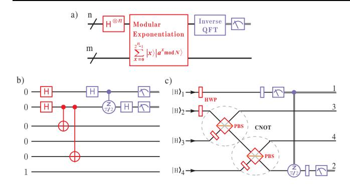
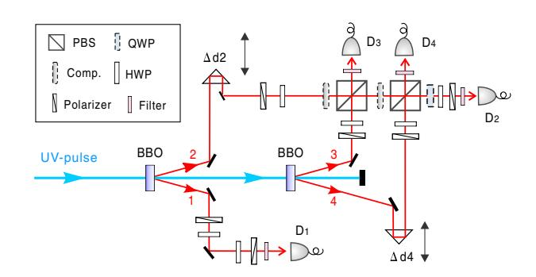
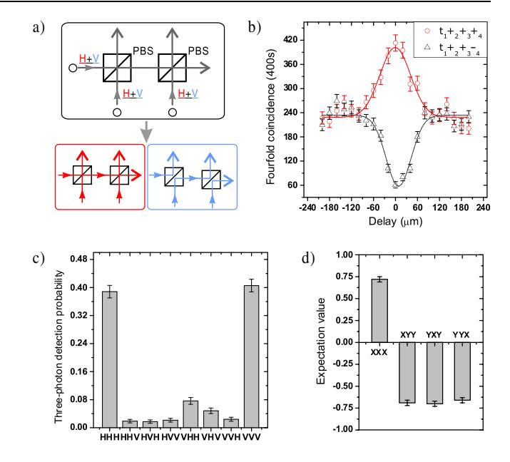
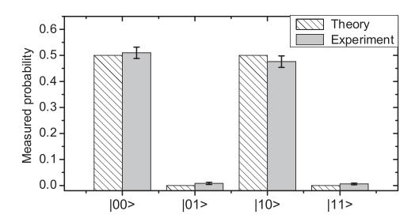

## Demonstration of a Compiled Version of Shor's Quantum Factoring Algorithm Using Photonic Qubits

Chao-Yang Lu, Daniel E. Browne, Tao Yang, and Jian-Wei Pan 1,3

1Hefei National Laboratory for Physical Sciences at Microscale and Department of Modern Physics, University of Science and Technology of China, Hefei, Anhui 230026, P.R. China 2Department of Materials and Department of Physics, Oxford University, Parks Road, Oxford, OX1 3PU, United Kingdom 3Physikalisches Institut, Universität Heidelberg, Philosophenweg 12, 69120 Heidelberg, Germany (Received 17 April 2007; published 19 December 2007)

We report an experimental demonstration of a complied version of Shor's algorithm using four photonic qubits. We choose the simplest instance of this algorithm, that is, factorization of N=15 in the case that the period r=2 and exploit a simplified linear optical network to coherently implement the quantum circuits of the modular exponential execution and semiclassical quantum Fourier transformation. During this computation, genuine multiparticle entanglement is observed which well supports its quantum nature. This experiment represents an essential step toward full realization of Shor's algorithm and scalable linear optics quantum computation.

DOI: 10.1103/PhysRevLett.99.250504 PACS numbers: 03.67.Lx, 42.50.Dv

Shor's algorithm [1,2] for factoring large numbers is arguably the most prominent quantum algorithm to date. It provides a way of factorizing large integers in polynomial time using a quantum computer, a task for which no efficient classical method is known. Such a capacity would be able to break widely used cryptographic codes, such as the RSA public key system [3,4]. Experimental realization of Shor's algorithm has been a central goal in quantum information science. Owing to its high experimental demands, however, this algorithm has so far only been demonstrated in a nuclear magnetic resonance (NMR) experiment [5]. Since the NMR experiments cannot prepare pure quantum states and exhibits no entanglement during computation, concerns have arisen on its quantum nature [6]. In particular, it has been proved that the presence of entanglement is a necessary condition for quantum computational speedup over classical computation [6].

The approach of using photons to implement quantum algorithms is appealing due to the long decoherence times and precise single-qubit operations [7–9]. Along this line, the Deutsch-Josza algorithm and Grover algorithm have been realized (see, e.g., [10–14]). In this Letter, we use the photonic qubits to demonstrate the easiest meaningful instance of Shor's algorithm, that is, factorization of N=15 in the case that the period r=2. A simplified linear optics network is designed to implement the quantum circuit. We have observed genuine multiparticle entanglement and multipath interference during computation, which thus for the first time prove the quantum nature of the implementation of Shor's algorithm [6].

Suppose we wish to find a nontrivial prime factor of an l-digit integer N. Even using the best known classical algorithm, prime factorization takes exponentially many operations, which quickly becomes intractable as l increases. Shor's algorithm, in contrast, offers a new powerful way to solve this problem in only polynomial time

[1,2]. The strategy for the quantum factoring of a composite number N=pq, with both p and q being odd primes, is as follows. First, we pick a random number a (0 < a < N) with no factor in common with N. Then we quantum compute the period r of the modular exponential function (MEF):  $f(x) = a^x \text{mod} N$ , which is the smallest positive satisfying  $a^r \text{mod} N = 1$ . From this period r, at least one nontrivial factor of N is given by the greatest common denominator (GCD) of  $a^{r/2} \pm 1$  and N with probability greater than 1/2.

Shor's algorithm provided an efficient quantum circuit [see Fig. 1(a)] to find the period r. Generally, two registers of qubits are used [1,15]: the first register with  $n=2\lceil\log_2 N\rceil$  qubits and the second one with  $m=\lceil\log_2 N\rceil$  qubits. Applying Hadamard (H) transformations on the first register which was initialized in the state  $|0\rangle^{\otimes n}$ , it becomes  $2^{-n/2}\sum_{x=0}^{2^n-1}|x\rangle$ , an equally weighted coherent superposition of all n-qubit computational basis. Then, the MEF unitarily implements  $a^x \mod N$  on the second register when the first register is in state  $|x\rangle$ , giving

$$\frac{1}{\sqrt{2^n}} \sum_{x=0}^{2^n - 1} |x\rangle |a^x \bmod N\rangle. \tag{1}$$

The highly entangled state Eq. (1) exhibits what Deutsch called "massive quantum parallelism" [15,16], as although the execution has run for only once, it entangles all the  $2^n$  input value x with the corresponding value of f(x) in parallel. Next, the quantum Fourier transformation (QFT) is applied on the first register, yielding

$$\frac{1}{2^n} \sum_{y=0}^{2^n - 1} \sum_{x=0}^{2^n - 1} e^{2\pi i x y/2^n} |y\rangle |a^x \bmod N\rangle, \tag{2}$$

where interference leads to peaks in the probability amplitudes for terms  $|y\rangle$  with  $y=c2^n/r$  (for integer c). Thus, the

FIG. 1 (color online). Quantum circuit for the order-finding routine of Shor's algorithm. (a) Outline of the quantum circuit. (b) Quantum circuit for *N* 15 and *a* 11. The MEF is implemented by two CNOT gates, and the QFT is implemented by Hadamard rotations and two-qubit conditional phase gates. The gate-labeling scheme denotes the axis about which the conditional rotation takes place and the angle of rotation. (c) The simplified linear optics network using HWPs and PBSs to implement the MEF circuit and the semiclassical version of the QFT circuit. The double lines denote classical information.

period *r* can be deduced with high probability [[1](#page-3-0)]. The QFT on 2*n* elements can be efficiently performed on a quantum computer with *On*2 gates.

Implementations of this algorithm, even for factorization of a small number, place a lot of challenging experimental demands, e.g., coherent manipulations of multiple qubits and creations of highly-entangled multiqubit registers. Here, we aim to demonstrate the simplest instance of Shor's algorithm, i.e., the factorization of 15. Quantum networks for evaluating the MEF have been designed which involve *On*3 operations [[15](#page-3-10),[17](#page-3-12)]. Since *ax a*2*n*1*xn*1 *a*2*x*1*ax*0 , the execution of MEF can be decomposed into a sequence of controlled multiplications. A general purpose algorithm to factorize 15 would require at least *n* 8, *m* 4, thus, totaling 12 qubits [\[15\]](#page-3-10). Several observations allow us to reduce the resources substantially for the purpose of a proof-of-principle demonstration. First, we choose to implement the algorithm with *a* 11; this was identified in [[5](#page-3-4)] as the ''easy'' case. Since *a*2mod15 1, MEF can be simplified to multiplications controlled only by *x*0, which can be implemented by two controlled-NOT (CNOT) gates [[18\]](#page-3-13). A QFT then follows to read out the period *r*. Such a circuit is shown in Fig. [1\(b\)](#page-1-0). We note there are two qubits in the second register which evolve trivially during computation and thus can be left out.

To demonstrate the circuit of Fig. [1\(b\)](#page-1-0), we use single photons as qubits, where j0i and j1i are encoded with the photon's horizontal (*H*) and vertical (*V*) polarization, respectively. The difficulty in implementing this circuit lies in the CNOT gates and conditional *=*2-phase shift gate. Although such entangling gates are possible for photons in

principle using measurement-induced nonlinearity [[7\]](#page-3-6), currently they are still experimentally expensive [[9,](#page-3-7)[19\]](#page-3-14). Here, we note that since the target qubits of the CNOT gates are always fixed at j*H*i, so the gate could be realized in an easier and more efficient fashion. Such a CNOT gate uses only a polarizing beam splitter (PBS) and a half-wave plate (HWP), through which an arbitrary control qubit (j*H*i j*V*i) and the target qubit j*H*i evolve into j*H*ij*H*i j*V*ij*V*i upon post-selection [[20\]](#page-3-15), that is, conditioned on that there is one and only one photon out of each output [see Fig. [1\(c\)\]](#page-1-0). Furthermore, the QFT circuit can also be implemented with a more efficient method. It was observed by Griffiths and Niu [[21](#page-3-16)] that when immediately followed by measurements, the fully coherent QFT can be replaced by a semiclassical version that employs only single-qubit rotations conditioned on measurement outcomes. This eliminates the need for entangling gates and reduces the numbers of gates quadratically. Thus, we finally arrive at the simplified linear optics MEF and QFT network in Fig. [1\(c\)](#page-1-0). We note despite of these simplifications, our circuit suffices to demonstrate the underlying principles of this algorithm.

Now we proceed with the experimental demonstration. Our experimental setup is illustrated in Fig. [2](#page-1-1), where a pulsed ultraviolet laser passes through two -barium borate (BBO) crystals to create two pairs of entangled photon [\[22\]](#page-3-17). We use polarizers to disentangle the photons and prepare them in the states j*H*i*i* with *i* denoting the spatial modes [see Fig. [1\(c\)\]](#page-1-0). The photons pass through the HWPs and are superposed on the PBSs (see Fig. [2\)](#page-1-1) to implement the necessary single- and two-qubit gates. To ensure good spatial and temporal overlap, the photons are spectrally filtered (FWHW 3*:*2 nm) and coupled by single-mode fibers [[23](#page-3-18)].

How could one experimentally verify a valid demonstration of Shor's algorithm? First, let us see the theoreti-

FIG. 2 (color online). Experimental setup. Femtosecond laser pulses (394 nm, 120 fs, 76 MHz) pass through two BBO crystals to produce two pairs of entangled photons with an average count of 7*:*8 104 s1. Fine adjustments of the delays between path 2, 3, 4 are made by translation stages *d*2 and *d*4. We incorporate in front of each PBS a compensator (Comp.) to counter the additional phase shifts of the PBS. The final measurement results are then read out using polarizers and single-photon detectors.

cal predictions. After a = 11 is chosen, the first step of this algorithm, the MEF should evolve as  $(1/2) \times$  $\sum_{x=0}^{3} |x\rangle |11^x \mod 15\rangle = (1/2)(|0\rangle |1\rangle + |1\rangle |11\rangle + |2\rangle |1\rangle +$  $|3\rangle|11\rangle$ ). As we rewrite it in binary representation  $(|000001\rangle + |011011\rangle + |100001\rangle + |111011\rangle)/2$ , it shows that a nontrivial Greenberger-Horne-Zeilinger (GHZ) [24] entangled state  $|\psi\rangle = (1/\sqrt{2})(|0\rangle_2|0\rangle_3|0\rangle_4 + |1\rangle_2|1\rangle_3|1\rangle_4$ is created between the two registers. For Shor's algorithm as well as some others, multiqubit entanglement is a necessary condition if the quantum algorithm is to offer an exponential speedup over classical computation [6]. In our experiment, as the photons pass through the MEF circuit, we first observe the Hong-Ou-Mandel type interference [25] of three photons in arms 2-3-4 [see Fig. 3(b)]. Then, after fixing the delays at the zero positions, we expect to determine the fidelity of the three-photon GHZ state and detect its genuine entanglement. The fidelity is judged by the overlap of the experimentally produced state with the ideal one:  $F_{\psi} = \langle \psi | \rho_{\rm exp} | \psi \rangle$ . Here,  $\rho$  can be decomposed  $\rho = |\psi\rangle\langle\psi| = (1/2)[(|HHH\rangle\langle HHH| +$ as  $|VVV\rangle\langle VVV|$  + (1/4)(XXX - XYY - YXY - YYX) [26], where X and Y denote Pauli matrices  $\sigma_x$  and  $\sigma_y$  which correspond to measurements in basis  $|+/-\rangle = (1/\sqrt{2}) \times$  $(|H\rangle \pm |V\rangle)$  and  $|R/L\rangle = (1/\sqrt{2})(|H\rangle \pm i|V\rangle)$ , respectively. Figure 3(c) and 3(d) shows the measurement results, which yield  $F_{\psi} = 0.74 \pm 0.02$ . It is proved that a fidelity above 50% is sufficient to show genuine entanglement of the GHZ states [26]. Thus, the presence of genuine entanglement created between the two registers of our quantum computer is confirmed by 12 standard deviations.

Now we move to the next step—execution of the semiclassical QFT, as illustrated in Fig. 1(c). We measure all possible correlations in the state of the qubit 1 and 2, which is the simplest way to simulate feedforward as used in Ref. [13]. In the case, photon 1 is measured in the state 1), an additional quarter wave plate is inserted in the arm 2 to implement the  $\pi/2$  rotation. Each measurement is flagged by a fourfold event where all four detectors fire simultaneously. The experimental results are shown in Fig. 4. With a probability of  $\sim 50\%$ , the output is in  $|00\rangle$ corresponding to a failure. Another ~50% probability yields  $|10\rangle$ , which determines the period  $r = 2^2/2 = 2$ ; thus, the GCD $(11^{2/2} \pm 1, 15) = 3$ , 5, giving a successful factorization. To further quantitatively evaluate the performance, we use the squared statistical overlap [27] of experimental data with the ideal values, which is defined as  $\gamma = (\sum_{y=0}^{3} m_y^{1/2} e_y^{1/2})^2$ , where  $m_y$  and  $e_y$  are the measured and expected output-state probabilities of the state  $|y\rangle$ , respectively. From the data in Fig. 4, we find  $\gamma = 0.99 \pm$ 0.02, indicating a near perfect experimental accuracy.

It is noticeable that the performance of the algorithm is considerably better than the quality of the entanglement created between the registers. The imperfections of our experiment mainly arise from high-order photon emissions and partial distinguishability of independent photons [28],

FIG. 3 (color online). Principle of three-photon interference and data of genuine triplet entanglement. (a) Hong-Ou-Mandel type [25] interference of three photons. Three  $|+\rangle$  polarized photons are directed to two PBSs from three spatial modes. As the PBSs transmit H and reflect V polarizations, a coincidence detection of three outputs can only originate from either the case that all photons are transmitted or all reflected. (b) Three-photon interference as a function of the temporal delay. Outside the coherent regime, the terms  $|H\rangle_2|H\rangle_3|H\rangle_4$  and  $|V\rangle_2|V\rangle_3|V\rangle_4$  are distinguishable. At the zero delay, an optimal superposition of  $|H\rangle_2|H\rangle_3|H\rangle_4$  and  $|V\rangle_2|V\rangle_3|V\rangle_4$  is achieved; thus, the  $|+\rangle_2|+\rangle_3|+\rangle_4$  events show a maximal enhancement while the  $|+\rangle_2|+\rangle_3|-\rangle_4$  events show a dip. The raw visibility is 0.75  $\pm$ 0.03, which after subtraction of the contribution of the double pair emission can be improved to  $0.88 \pm 0.05$ , indicating good spatial and temporal overlap have been achieved. This is, to our knowledge, the first observation of Hong-Ou-Mandel type interference which involves three photons from three different paths. (c) The multiphoton detection probabilities in the H/V measurement basis. (d) Measured expectation value of the observables XXX, XYY, YXY, and YYX. The error bars denote 1 standard deviation, deduced from propagated Poissonian counting statistics of the raw detection events.

which cause undesired mixtures in the GHZ state and degrade its fidelity. However, for the execution of the algorithm, such mixtures happen to have the same effect as the desired mixtures which could have been resulted from the ideal circuit anyway (after the qubits 2, 3, and 4 are entangled in the GHZ state, the qubit 2 is in a complete mixture tracing out of the qubit 3 and 4).

Some further remarks are warranted here. In this experiment, we have used the simplified optical two-qubit PBS gates which are probabilistic and upon post-selection [20]; thus, scalability is not directly implied in the present work. However, they can in principle be improved to be deterministic using the scheme by Knill *et al.* [7] given more

FIG. 4. Experimental result of the output-state probabilities after application of the QFT on the first register. Each measurement takes 120 s and yields a maximum 270 fourfold coincidence counts for the j00i projection.

photon source and complicated linear optics network. Furthermore, an alternative approach, known as the cluster-state model [[29,](#page-3-26)[30](#page-3-27)] provides a more efficient realization of scalable photonic quantum computation [\[8,](#page-3-28)[13](#page-3-22)[,31\]](#page-3-29). In this model, universal quantum computation is achieved by single-qubit measurements on a prepared highly entangled cluster state.

Above, we described a number of steps by which our MEF circuit was brought to a simpler form. While these steps may seem at first sight *ad hoc*, in fact they are an example of a general simplification method in the clusterstate model. It has been shown that measurements of Pauli operator observables on cluster states transform the state via a set of simple (and computationally efficient) rules [\[30\]](#page-3-27) to a cluster state with a different graphical description. Classical preprocessing can thus produce a cluster-state implementation with a smaller number of qubits, which, as demonstrated here, can simplify the experimental realization. Thus, our approach can be seen as a hybrid of cluster-state based and circuit-based models of quantum computation, adopting the most suitable model for the implementation of MEF and QFT circuits, respectively.

In summary, we have completed a proof-of-principle demonstration of a complied version of Shor's algorithm using photonic qubits. Genuine multiparticle entanglement is observed during computation, which proves its unambiguous quantum nature. Our experiment presents an important step toward full realization of Shor's algorithm and scalable linear optics quantum computation. To factorize larger numbers in the future, significant challenges ahead may include coherent manipulations of more qubits, constructions of complex multiqubit gates, and quantum error correction [\[32\]](#page-3-30).

We are grateful to L. M. K. Vandersypen, A. White, and B. Zhao for helpful discussions. This work was supported by the NNSF of China, CAS, NFRP (under Grant No. 2006CB921900), the Alexander von Humboldt Foundation and Marie Curie Excellence Grant of the EU. This work was also supported by Merton College, Oxford and the EPSRC's QIPIRC programme.

*Note added.—*After submission of our manuscript, we became aware of a related work [\[33\]](#page-3-31).

- [1] P. Shor, in *Proc. 35th Annu. Symp. on the Foundations of Computer Science*, edited by S. Goldwasser (IEEE Computer Society Press, Los Alamitos, California, 1994), p. 124–134.
- [2] P. Shor, SIAM J. Comput. **26**, 1484 (1997).
- [3] A. Ekert and R. Jozsa, Rev. Mod. Phys. **68**, 733 (1996); E. Gerjuoy, Am. J. Phys. **73**, 521 (2005).
- [4] The RSA algorithm is named after R. Rivest, A. Shamir, and L. Adleman, who invented it in 1977. It is one of the most commonly used public key systems nowadays (see http://en.wikipedia.org/wiki/RSA).
- [5] L. M. K. Vandersypen *et al.*, Nature (London) **414**, 883 (2001); L. M. K. Vandersypen and I. L. Chuang, Rev. Mod. Phys. **76**, 1037 (2005).
- [6] S. L. Braunstein *et al.*, Phys. Rev. Lett. **83**, 1054 (1999); N. Linden and S. Popescu, Phys. Rev. Lett. **87**, 047901 (2001); R. Jozsa *et al.*, Proc. R. Soc. A **459**, 2011 (2003); G. Vidal, Phys. Rev. Lett. **91**, 147902 (2003).
- [7] E. Knill *et al.*, Nature (London) **409**, 46 (2001).
- [8] M. A. Nielsen, Phys. Rev. Lett. **93**, 040503 (2004); D. E. Browne *et al.*, Phys. Rev. Lett. **95**, 010501 (2005).
- [9] P. Kok *et al.*, Rev. Mod. Phys. **79**, 135 (2007).
- [10] M. Mohseni *et al.*, Phys. Rev. Lett. **91**, 187903 (2003).
- [11] M. S. Tame *et al.*, Phys. Rev. Lett. **98**, 140501 (2007).
- [12] P. G. Kwiat *et al.*, J. Mod. Opt. **47**, 257 (2000).
- [13] P. Walther *et al.*, Nature (London) **434**, 169 (2005).
- [14] R. Prevedel *et al.*, Nature (London) **445**, 65 (2007).
- [15] D. Beckman *et al.*, Phys. Rev. A **54**, 1034 (1996).
- [16] D. Deutsch, Proc. R. Soc. Lond., Ser. A. **400**, 97 (1985).
- [17] V. Vedral *et al.*, Phys. Rev. A **54**, 147 (1996).
- [18] L. M. K. Vandersypen, Ph.D. thesis, Standford University, 2001.
- [19] J. L. O'Brien *et al.*, Nature (London) **426**, 264 (2003).
- [20] This method has been used in quantum optics experiments where the projection and the exploration of quantum states could be performed simultaneously, see, e.g., D. Bouwmeester *et al.*, Nature (London) **390**, 575 (1997).
- [21] R. B. Griffiths *et al.*, Phys. Rev. Lett. **76**, 3228 (1996).
- [22] P. G. Kwiat *et al.*, Phys. Rev. Lett. **75**, 4337 (1995).
- [23] M. Zukowski *et al.*, Ann. N.Y. Acad. Sci. **755**, 91 (1995).
- [24] D. M. Greenberger *et al.*, Am. J. Phys. **58**, 1131 (1990).
- [25] C. K. Hong *et al.*, Phys. Rev. Lett. **59**, 2044 (1987).
- [26] C. A. Sackett *et al.*, Nature (London) **404**, 256 (2000); M. Seevinck *et al.*, Phys. Rev. A **65**, 012107 (2001); M. Bourennane *et al.*, Phys. Rev. Lett. **92**, 087902 (2004).
- [27] C. A. Fuchs, Ph.D. thesis, Univ. of New Mexico, 1996.
- [28] V. Scarani *et al.*, Eur. Phys. J. D **32**, 129 (2005); M. Barbieri, Phys. Rev. A **76**, 043825 (2007).
- [29] R. Raussendorf *et al.*, Phys. Rev. Lett. **86**, 5188 (2001).
- [30] M. Hein *et al.*, Phys. Rev. A **69**, 062311 (2004).
- [31] N. Kiesel *et al.*, Phys. Rev. Lett. **95**, 210502 (2005); C.-Y. Lu *et al.*, Nature Phys. **3**, 91 (2007).
- [32] I. L. Chuang *et al.*, Science **270**, 1633 (1995).
- [33] B. P. Lanyon *et al.*, Phys. Rev. Lett. (to be published).