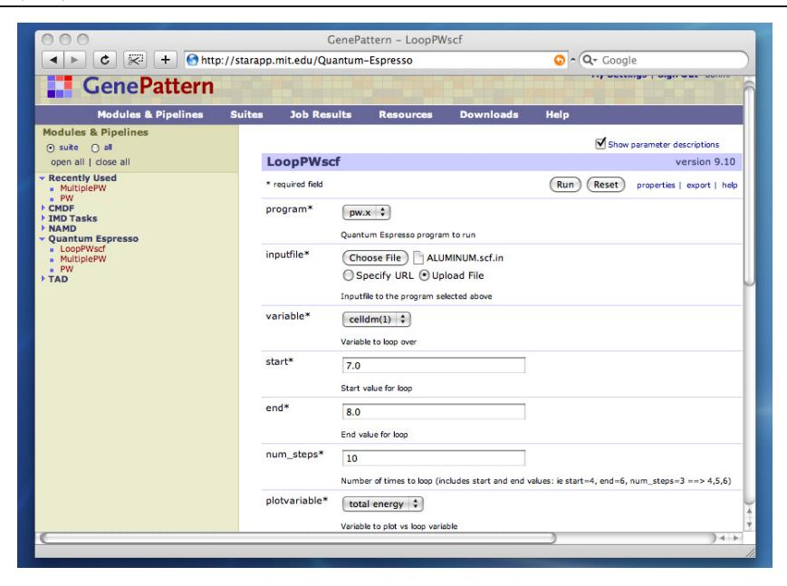
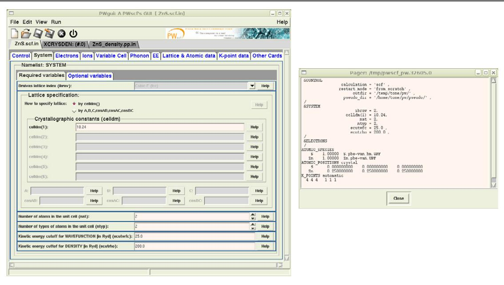
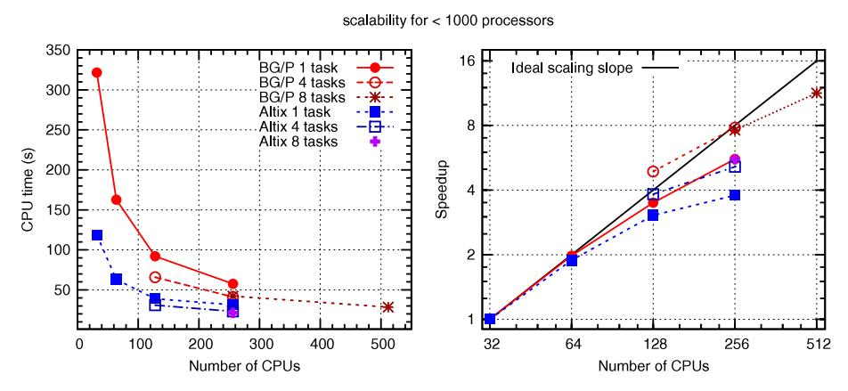
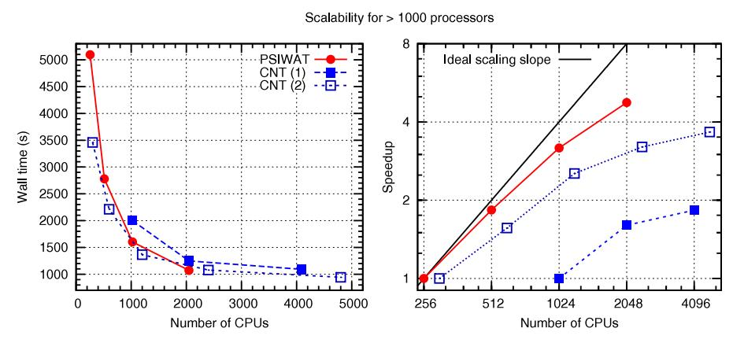

[Home](http://iopscience.iop.org/) [Search](http://iopscience.iop.org/search) [Collections](http://iopscience.iop.org/collections) [Journals](http://iopscience.iop.org/journals) [About](http://iopscience.iop.org/page/aboutioppublishing) [Contact us](http://iopscience.iop.org/contact) [My IOPscience](http://iopscience.iop.org/myiopscience)

QUANTUM ESPRESSO: a modular and open-source software project for quantum simulations of materials

This article has been downloaded from IOPscience. Please scroll down to see the full text article.

2009 J. Phys.: Condens. Matter 21 395502

(http://iopscience.iop.org/0953-8984/21/39/395502)

View [the table of contents for this issue](http://iopscience.iop.org/0953-8984/21/39), or go to the [journal homepage](http://iopscience.iop.org/0953-8984) for more

Download details:

IP Address: 128.178.13.107

The article was downloaded on 01/03/2011 at 13:55

Please note that [terms and conditions apply.](http://iopscience.iop.org/page/terms)

J. Phys.: Condens. Matter **21** (2009) 395502 (19pp)

# QUANTUM ESPRESSO: a modular and open-source software project for quantum simulations of materials

Paolo Giannozzi1,2, Stefano Baroni1,3, Nicola Bonini4, Matteo Calandra5, Roberto Car6, Carlo Cavazzoni7,8, Davide Ceresoli4, Guido L Chiarotti9, Matteo Cococcioni10, Ismaila Dabo11, Andrea Dal Corso1,3, Stefano de Gironcoli1,3, Stefano Fabris1,3, Guido Fratesi12, Ralph Gebauer1,13, Uwe Gerstmann14, Christos Gougoussis5, Anton Kokalj1,15, Michele Lazzeri5, Layla Martin-Samos1, Nicola Marzari4, Francesco Mauri5, Riccardo Mazzarello16, Stefano Paolini3,9, Alfredo Pasquarello17,18, Lorenzo Paulatto1,3, Carlo Sbraccia1,†, Sandro Scandolo1,13, Gabriele Sclauzero1,3, Ari P Seitsonen5, Alexander Smogunov13, Paolo Umari1 and Renata M Wentzcovitch10,19

- 1 CNR-INFM Democritos National Simulation Center, 34100 Trieste, Italy
- 2 Dipartimento di Fisica, Università degli Studi di Udine, via delle Scienze 208, 33100 Udine, Italy
- 3 SISSA—Scuola Internazionale Superiore di Studi Avanzati, via Beirut 2-4, 34151 Trieste Grignano, Italy
- 4 Department of Materials Science and Engineering, Massachusetts Institute of Technology, Cambridge, MA 02139, USA
- 5 Institut de Minéralogie et de Physique des Milieux Condensés, Université Pierre et Marie Curie, CNRS, IPGP, 140 rue de Lourmel, 75015 Paris, France
- 6 Department of Chemistry, Princeton University, Princeton, NJ 08544, USA
- 7 CINECA National Supercomputing Center, Casalecchio di Reno, 40033 Bologna, Italy
- 8 CNR-INFM S3 Research Center, 41100 Modena, Italy
- 9 SPIN s.r.l., via del Follatoio 12, 34148 Trieste, Italy
- $^{\rm 10}$  Department of Chemical Engineering and Materials Science, University of Minnesota,
- 151 Amundson Hall, 421 Washington Avenue SE, Minneapolis, MN 55455, USA
- 11 Université Paris-Est, CERMICS, Projet Micmac ENPC-INRIA, 6-8 avenue Blaise Pascal, 77455 Marne-la-Vallée Cedex 2, France
- 12 Dipartimento di Scienza dei Materiali, Università degli Studi di Milano-Bicocca, via Cozzi 53, 20125 Milano, Italy
- 13 The Abdus Salam International Centre for Theoretical Physics, Strada Costiera 11, 34151 Trieste Grignano, Italy
- 14 Theoretische Physik, Universität Paderborn, D-33098 Paderborn, Germany
- 15 Jožef Stefan Institute, Jamova 39, SI-1000 Ljubljana, Slovenia
- 16 Computational Science, Department of Chemistry and Applied Biosciences, ETH Zurich,
- USI Campus, via Giuseppe Buffi 13, CH-6900 Lugano, Switzerland
- 17 Ecole Polytechnique Fédérale de Lausanne (EPFL), Institute of Theoretical Physics, CH-1015 Lausanne, Switzerland
- 18 Institut Romand de Recherche Numérique en Physique des Matériaux (IRRMA), CH-1015 Lausanne, Switzerland
- 19 Minnesota Supercomputing Institute for Advanced Computational Research, University of Minnesota, Minneapolis, MN 55455, USA

Received 18 May 2009, in final form 26 July 2009 Published 1 September 2009

Online at stacks.iop.org/JPhysCM/21/395502

1

† Present address: Constellation Energy Commodities Group, 7th Floor, 61 Aldwich, London, WC2B 4AE, UK.

#### **Abstract**

QUANTUM ESPRESSO is an integrated suite of computer codes for electronic-structure calculations and materials modeling, based on density-functional theory, plane waves, and pseudopotentials (norm-conserving, ultrasoft, and projector-augmented wave). The acronym ESPRESSO stands for *opEn Source Package for Research in Electronic Structure, Simulation, and Optimization*. It is freely available to researchers around the world under the terms of the GNU General Public License. QUANTUM ESPRESSO builds upon newly-restructured electronic-structure codes that have been developed and tested by some of the original authors of novel electronic-structure algorithms and applied in the last twenty years by some of the leading materials modeling groups worldwide. Innovation and efficiency are still its main focus, with special attention paid to massively parallel architectures, and a great effort being devoted to user friendliness. QUANTUM ESPRESSO is evolving towards a distribution of independent and interoperable codes in the spirit of an open-source project, where researchers active in the field of electronic-structure calculations are encouraged to participate in the project by contributing their own codes or by implementing their own ideas into existing codes.

(Some figures in this article are in colour only in the electronic version)

## **1. Introduction**

The combination of methodological and algorithmic innovations and ever-increasing computer power is delivering a *simulation revolution* in materials modeling, starting from the nanoscale up to bulk materials and devices [\[1\]](#page-17-0). Electronic-structure simulations based on density-functional theory (DFT) [\[2–4\]](#page-17-1) have been instrumental to this revolution, and their application has now spread outside a restricted core of researchers in condensed-matter theory and quantum chemistry, involving a vast community of end users with very diverse scientific backgrounds and research interests. Sustaining this revolution and extending its beneficial effects to the many fields of science and technology that can capitalize on it represents a multifold challenge. In our view it is also a most urgent, fascinating and fruitful endeavor, able to deliver new forms for scientific exploration and discovery, where a very complex infrastructure—made of software rather than hardware—can be made available to any researcher, and whose capabilities continue to increase thanks to the methodological innovations and computing power scalability alluded to above.

Over the past few decades, innovation in materials simulation and modeling has resulted from the concerted efforts of many individuals and groups worldwide, often of small size. Their success has been made possible by a combination of competences, ranging from the ability to address meaningful and challenging problems, to a rigorous insight into theoretical methods, ending with a marked sensibility to matters of numerical accuracy and algorithmic efficiency. The readiness to implement new algorithms that utilize novel ideas requires total control over the software being used—for this reason, the physics community has long relied on in-house computer codes to develop and implement new ideas and algorithms. Transitioning these development codes to production tools is nevertheless essential, both to extensively validate new methods and to speed up their acceptance by the scientific community. At the same time, the dissemination of codes has to be substantial, to justify the learning efforts of PhD students and young postdocs who would soon be confronted with the necessity of deploying their competences in different research groups. In order to sustain innovation in numerical simulation, we believe there should be little, if any, distinction between development and production codes; computer codes should be easy to maintain, to understand by different generations of young researchers, to modify and extend; they should be easy to use by the layman, as well as general and flexible enough to be enticing for a vast and diverse community of end users. One easily understands that such conflicting requirements can only be tempered, if anything, within organized and *modular* software projects.

Software modularity also comes as a necessity when complex problems in complex materials need to be tackled with an array of different methods and techniques. Multiscale approaches, in particular, strive to combine methods with different accuracy and scope to describe different parts of a complex system, or phenomena occurring at different time and/or length scales. Such approaches will require software packages that can perform different kinds of computations on different aspects of the same problem and/or different portions of the same system, and that allow for interoperability or joint usage of the different modules. Different packages should, at the very least, share the same input/output data formats; ideally they should also share a number of mathematical and application libraries, as well as the internal representation of some of the data structures on which they operate. Individual researchers or research groups find it increasingly difficult to meet all these requirements and to continue to develop and maintain in-house software projects of increasing complexity. Thus, different and possibly collaborative solutions should be sought.

A successful example comes from the software for simulations in quantum chemistry, that has often (but not always) evolved towards *commercialization*: the development and maintenance of most well-known packages is devolved to non-profit [\[5–8\]](#page-17-2) or commercial [\[9–12\]](#page-17-3) companies. The software is released (for purchase) under some proprietary license that may impose several restrictions to the availability of sources (computer code in a high-level language) and to what can be done with the software. This model has worked well, and is also used by some of the leading development groups in the condensed-matter electronicstructure community [\[13,](#page-17-4) [14\]](#page-17-5), while some proprietary projects allow for some free academic usage of their products [\[14–19\]](#page-17-5). A commercial endeavor also brings the distinctive advantage of a professional approach to software development, maintenance, documentation, and support.

We believe however that a more interesting and fruitful alternative can be pursued, and one that is closer to the spirit of science and scientific endeavor, modeled on the experience of the open-source software community. Under this model, a large community of users has full access to the source code and the development material, under the coordination of a smaller group of core developers. In the long term, and in the absence of entrenched monopolies, this strategy could be more effective in providing good software solutions and in nurturing a community engaged in providing those solutions, as compared to the proprietary software strategy. In the case of software for scientific usage, such an approach has the additional, and by no means minor, advantage to be in line with the tradition and best practice of science, that require reproducibility of other people's results, and where collaboration is no less important than competition.

In this paper we will shortly describe our answer to the above-mentioned problems, as embodied in our QUANTUM ESPRESSO project (indeed, ESPRESSO stands for *opEn Source Package for Research in Electronic Structure, Simulation, and Optimization*). First, in section [2,](#page-3-0) we describe the guiding lines of our effort. In section [3,](#page-5-0) we give an overview of the current capabilities of QUANTUM ESPRESSO. In section [4,](#page-6-0) we provide a short description of each software component presently distributed within QUANTUM ESPRESSO. In section [5](#page-11-0) we give an overview of the parallelization strategies followed and implemented in QUANTUM ESPRESSO. Finally, section [6](#page-13-0) describes current developments and offers a perspective outlook. The appendix sections discuss some of the more specific technical details of the algorithms used, that have not been documented elsewhere.

## **2. The QUANTUM ESPRESSO project**

QUANTUM ESPRESSO is an integrated suite of computer codes for electronic-structure calculations and materials modeling based on density-functional theory, plane waves basis sets and pseudopotentials to represent electron–ion interactions. QUANTUM ESPRESSO is *free*, open-source software distributed under the terms of the GNU General Public License (GPL) [\[20\]](#page-17-6).

The two main goals of this project are to foster methodological innovation in the field of electronic-structure simulations and to provide a wide and diverse community of end users with highly efficient, robust, and userfriendly software implementing the most recent innovations in this field. Other open-source projects [\[21–25\]](#page-17-7) exist, besides QUANTUM ESPRESSO, that address electronicstructure calculations and various materials simulation techniques based on them. Unlike some of these projects, QUANTUM ESPRESSO does not aim at providing a single monolithic code able to perform several different tasks by specifying different input data to the same executable. Our general philosophy is rather that of an *open distribution*, i.e. an integrated suite of codes designed to be interoperable, much in the spirit of a Linux distribution, and thus built around a number of *core components* designed and maintained by a small group of core developers, plus a number of auxiliary/complementary codes designed, implemented, and maintained by members of a wider community of users. The distribution can even be redundant, with different applications addressing the same problem in different ways; at the end, the sole requirements that QUANTUM ESPRESSO components must fulfil are that: (i) they are distributed under the same GPL license agreement [\[20\]](#page-17-6) as the other QUANTUM ESPRESSO components; (ii) they are fully interoperable with the other components. Of course, they need to be scientifically sound, verified and validated. External contributors are encouraged to join the QUANTUM ESPRESSO project, if they wish, while maintaining their own individual distribution and advertisement mode for their software (for instance, by maintaining individual web sites with their own brand names [\[154\]](#page-19-0)). To facilitate this, a web service called qe-forge [\[27\]](#page-17-8), described in the next subsection, has been recently put in place.

Interoperability of different components within QUANTUM ESPRESSO is granted by the use of common formats for the input, output, and work files. In addition, external contributors are encouraged, but not by any means forced, to use the many numerical and application libraries on which the core components are built. Of course, this general philosophy must be seen more as an objective to which a very complex software project tends, rather than a starting point.

One of the main concerns that motivated the birth of the QUANTUM ESPRESSO project is high performance, both in serial and in parallel execution. High serial performance across different architectures is achieved by the systematic use of standardized mathematical libraries (BLAS, LAPACK [\[28\]](#page-17-9), and FFTW [\[29\]](#page-17-10)) for which highly optimized implementations exist on many platforms; when proprietary optimizations of these libraries are not available, the user can compile the library sources distributed with QUANTUM ESPRESSO. Optimal performance in parallel execution is achieved through the design of several parallelization levels, using sophisticated communication algorithms, whose implementation often does not need to concern the developer, being embedded and concealed in appropriate software layers. As a result the performance of the key engines, PWscf (section [4.1\)](#page-7-0) and CP (section [4.2\)](#page-7-1), may scale efficiently on massively parallel computers up to thousands of processors.

The distribution is organized into a basic set of modules, libraries, installation utilities, plus a number of directories, each containing one or more executables, performing specific tasks. The communications between the different executables take place via data files. We think that this kind of approach lowers the *learning barrier* for those who wish to contribute to the project. The codes distributed with QUANTUM ESPRESSO, including many auxiliary codes for the post-processing of the data generated by the simulations, are easy to install and to use. The GNU configure and make utilities ensure a straightforward installation on many different machines. Applications are run through text input files based on Fortran namelists, that require the users to specify only an essential, usually small, subset of the many control variables available; a specialized graphical user interface (GUI), that is provided with the distribution, facilitates this task for most component programs. It is foreseen that in the near future the design of special APIs (application programming interfaces) will make it easier to glue different components of the distribution together and with external applications, as well as to interface them to other, custom-tailored, GUIs and/or scripting interfaces.

The QUANTUM ESPRESSO distribution is written, mostly, in Fortran-95, with some parts in C or in Fortran-77. Fortran-95 offers the possibility to introduce advanced programming techniques without sacrificing performance. Moreover Fortran is still the language of choice for high-performance computing and it allows for easy integration of legacy codes written in this language. A single source tree is used for all architectures, with C preprocessor options selecting a small subset of architecturedependent code. Parallelization is achieved using the messagepassing paradigm and calls to standard MPI (message-passing interface) [\[30\]](#page-17-11) libraries. Most calls are hidden in a few routines that act as an intermediate layer, accomplishing e.g. the tasks of summing a distributed quantity over processors, of collecting distributed arrays or distributing them across processors, and of performing parallel three-dimensional fast Fourier transforms (FFT). This allows the straightforward and transparent development of new modules and functionalities that preserve the efficient parallelization backbone of the codes.

## *2.1. QE-forge*

The ambition of the QUANTUM ESPRESSO project is not limited to providing highly efficient and user-friendly software for large-scale electronic-structure calculations and materials modeling. QUANTUM ESPRESSO aims at promoting active cooperation among a vast and diverse community of scientists developing new methods and algorithms in electronic-structure theory and of end users interested in their application to the numerical simulation of materials and devices.

As mentioned, the main source of inspiration for the model we want to promote is the successful cooperative experience of the *GNU/Linux* developers' and users' community. One of the main outcomes of this community has been the incorporation within the *GNU/Linux* operating system distributions of thirdparty software components, which, while being developed and maintained by autonomous, and often very small, groups of users, are put at the disposal of the entire community under the terms of the GPL. The community, in turn, provides positive feedback and extensive validation by benchmarking new developments, reporting bugs, and requesting new features. These developments have largely benefited from the *SourceForge* code repository and software development service [\[31\]](#page-17-12), or by other similar services, such as RubyForge, Tigris.org, BountySource, BerliOS, JavaForge, and GNU Savannah.

Inspired by this model, the QUANTUM ESPRESSO developers' and users' community has set up its own web portal, named qe-forge [\[27\]](#page-17-8). The goal of qe-forge is to complement the traditional web sites of individual scientific software projects, which are passive instruments of information retrieval, with a dynamical space for active content creation and sharing. Its aim is to foster and simplify the coordination and integration of the programming efforts of heterogeneous groups and to ease the dissemination of the software tools thus obtained.

qe-forge provides, through a user-friendly web interface, an integrated development environment, whereby researchers can freely upload, manage and maintain their own software, while retaining full control over it, including the right of not releasing it. The services so far available include sourcecode management software (CVS or SVN repository), mailing lists, public forums, bug tracking facilities, up/down-load space, and wiki pages for projects' documentation. qe-forge is expected to be the main tool by which QUANTUM ESPRESSO end users and external contributors can maintain QUANTUM ESPRESSO-related projects and make them available to the community.

## *2.2. Educational usage of QUANTUM ESPRESSO*

Training on advanced simulation techniques using the QUANTUM ESPRESSO distribution is regularly offered at SISSA to first-year graduate students within the *electronicstructure* course. The scope of this course is not limited to the opportunities that modern simulation techniques based on electronic-structure theory offer to molecular and materials modeling. Emphasis is put onto the skills that are necessary to turn new ideas into new algorithms and onto the methods that are needed to validate the implementation and application of computer simulation methods. Based on this experience, the QUANTUM ESPRESSO developers' group offers, on a regular basis, training courses to graduate students and young researchers worldwide, also in collaboration with the *Abdus Salam* International Centre for Theoretical Physics, which operates under the aegis of UNESCO and IAEA agencies of the UNO.

The QUANTUM ESPRESSO distribution is used not only for graduate, but also for undergraduate training. At MIT, for example, it is one of the teaching tools in the class *Introduction to Modeling and Simulations*—an institute-wide course offered to undergraduates from the School of Science and the School of Engineering. The challenge here is to provide students of different backgrounds with an overview of numerical simulations methods to study properties of real materials. For many undergraduates, this represents the first experience of computers used as scientific tools. To facilitate the access and use of QUANTUM ESPRESSO, a user-friendly web interface has been developed at MIT, based on the GenePattern portal, that allows direct access to the code, thus

**Figure 1.** Snapshot of the web interface used for undergraduate teaching at MIT. The software has been developed at the MIT's Office of Educational Innovation and Technology.

removing the need to use a Unix/Linux environment or the details of the job queuing and submission procedure. The user utilizes a web browser (see figure [1\)](#page-5-1) to build input files and view the outputs of simulations, and to perform calculations from wherever Internet access is available. The calculations run on dedicated computer clusters where the code has been previously installed and tested.

Using a web interface to easily access computational resources and share them among different users naturally points to the concept of cloud computing, and the previous model was tested at MIT in Spring 2009, wholly based on a cluster of virtual machines on Amazon's Elastic Compute Cloud (EC2) web service. Our experience shows that, when compared to the cost of purchasing, maintaining and administering computer clusters, the use of web-based computational resources becomes a very appealing and affordable option. It is particularly suited for classroom instruction, where advanced computational performance is not required, and it allows for easy transferability of this resource across universities.

## **3. Short description of QUANTUM ESPRESSO**

QUANTUM ESPRESSO implements a variety of methods and algorithms aimed at a chemically realistic modeling of materials from the nanoscale upwards, based on the solution of the density-functional theory (DFT) [\[2,](#page-17-1) [3\]](#page-17-13) problem, using a plane waves (PWs) basis set and pseudopotentials (PPs) [\[32\]](#page-17-14) to represent electron–ion interactions.

The codes are constructed around the use of periodic boundary conditions, which allows for a straightforward treatment of infinite crystalline systems, and an efficient convergence to the thermodynamic limit for aperiodic but extended systems, such as liquids or amorphous materials. Finite systems are also treated using supercells; if required, open-boundary conditions can be used through the use of the density-countercharge method [\[33\]](#page-17-15). QUANTUM ESPRESSO can thus be used for any crystal structure or supercell, and for metals as well as for insulators. The atomic cores can be described by separable [\[34\]](#page-18-0) norm-conserving (NC) PPs [\[35\]](#page-18-1), ultrasoft (US) PPs [\[36\]](#page-18-2), or by projector-augmented wave (PAW) sets [\[37\]](#page-18-3). Many different exchange–correlation functionals are available in the framework of the local-density (LDA) or generalized-gradient approximation (GGA) [\[38\]](#page-18-4), plus advanced functionals like Hubbard *U* corrections and a few meta-GGA [\[39\]](#page-18-5) and hybrid functionals [\[40–42\]](#page-18-6). The latter is an area of very active development, and more details on the implementation of hybrid functionals and related Fock exchange techniques are given in appendix [A.5.](#page-16-0)

The basic computations/simulations that can be performed include:

- calculation of the Kohn–Sham (KS) orbitals and energies [\[43\]](#page-18-7) for isolated or extended/periodic systems, and of their ground-state energies;
- complete structural optimizations of the microscopic (atomic coordinates) and macroscopic (unit cell) degrees of freedom, using Hellmann–Feynman forces [\[44,](#page-18-8) [45\]](#page-18-9) and stresses [\[46\]](#page-18-10);
- ground state of magnetic or spin-polarized systems, including spin–orbit coupling [\[47\]](#page-18-11) and noncollinear magnetism [\[48,](#page-18-12) [49\]](#page-18-13);
- *ab initio* molecular dynamics (MD), using either the Car–Parrinello Lagrangian [\[50\]](#page-18-14) or the Hellmann– Feynman forces calculated on the Born–Oppenheimer (BO) surface [\[51\]](#page-18-15), in a variety of thermodynamical ensembles, including *NPT* variable-cell [\[52,](#page-18-16) [53\]](#page-18-17) MD;
- density-functional perturbation theory (DFPT) [\[54–56\]](#page-18-18), to calculate second and third derivatives of the total energy at

any arbitrary wavelength, providing phonon dispersions, electron–phonon and phonon–phonon interactions, and static response functions (dielectric tensors, Born effective charges, infrared spectra, Raman tensors);

- location of saddle points and transition states via transition-path optimization using the nudged elastic band (NEB) method [\[57–59\]](#page-18-19);
- ballistic conductance within the Landauer–B¨uttiker theory using the scattering approach [\[60\]](#page-18-20);
- generation of maximally localized Wannier functions [\[61,](#page-18-21) [62\]](#page-18-22) and related quantities;
- calculation of nuclear magnetic resonance (NMR) and electronic paramagnetic resonance (EPR) parameters [\[63,](#page-18-23) [64\]](#page-18-24);
- calculation of K-edge x-ray absorption spectra [\[65\]](#page-18-25).

Other more advanced or specialized capabilities are described in the next sections, while ongoing projects (e.g. timedependent DFT and many-body perturbation theory) are mentioned in section [6.](#page-13-0) Selected applications were described in [\[66\]](#page-18-26). Several utilities for data post-processing and interfacing to advanced graphic applications are available, allowing e.g. to calculate scanning tunneling microscopy (STM) images [\[67\]](#page-18-27), the electron localization function (ELF) [\[68\]](#page-18-28), L¨owdin charges [\[69\]](#page-18-29), the density of states (DOS), and planar [\[70\]](#page-18-30) or spherical averages of the charge and spin densities and potentials.

## *3.1. Data file format*

The interoperability of different software components within a complex project such as QUANTUM ESPRESSO relies on the careful design of file formats for data exchange. A rational and open approach to data file formats is also essential for interfacing applications within QUANTUM ESPRESSO with third-party applications, and more generally to make the results of lengthy and expensive computer simulations accessible to, and reproducible by, the scientific community at large. The need for data file formats that make data exchange easier than it is now is starting to be widely appreciated in the electronicstructure community. This problem has many aspects and likely no simple, 'one-size-fits-all', solution. Data files should ideally be

- *extensible*: one should be able to add some more information to a file without breaking all codes that read that file;
- *self-documenting*: it should be possible to understand the contents of a file without too much effort;
- *efficient*: with data size in the order of GBytes for largescale calculations, slow or wasteful I/O should be avoided.

The current trend in the electronic-structure community seems to be the adoption of one of the following approaches:

- structured file formats, notably Hierarchical Data Format (HDF) [\[71\]](#page-18-31) and network Common Data Form (netCDF) [\[72\]](#page-18-32), that have been widely used for years in other communities;
- file formats based on the Extensible Markup Language (XML) [\[73\]](#page-18-33).

It is unlikely that a common, standardized data format will ever prevail in our community. We feel that we should focus, rather than on standardization, on an approach that allows an easy design and usage of simple and reliable converters among different data formats. Prompted by these considerations, QUANTUM ESPRESSO developers have opted for a simple solution that tries to combine the advantages of both the abovementioned approaches. A single file containing all the data of a simulation is replaced by a *data directory*, containing several files and subdirectories, much in the same way as it is done in the Mac OS X operating system. The 'head' file contains data written with ordinary Fortran formatted I/O, identified by XML tags. Only data of small size, such as atomic positions, parameters used in the calculation, one-electron and total energies, are written in the head file. Data of potentially large size, such as PW coefficients of KS orbitals, charge density, and potentials, are present as links to separate files, written using unformatted Fortran I/O. Data for each **k**-point are written to a separate subdirectory. A lightweight library called iotk, standing for Input/Output ToolKit [\[74\]](#page-18-34), is used to read and write the data directory.

Another problem affecting interoperability of PW–PP codes is the availability of data files containing atomic PPs one of the basic ingredients of the calculation. There are many different types of PPs, many different codes generating PPs (see e.g. [\[75–77\]](#page-18-35)), each one with its own format. Again, the choice has fallen on a simple solution that makes it easy to write converters from and to the format used by QUANTUM ESPRESSO. Each atomic PP is contained in a formatted file (efficiency is not an issue here), described by an XML-like syntax. The resulting format has been named Unified Pseudopotential File (UPF). Several converters from other formats to the UPF format are available in QUANTUM ESPRESSO.

## **4. QUANTUM ESPRESSO packages**

The complete QUANTUM ESPRESSO distribution is rather large. The current 4.1 version includes about 310 000 lines of Fortran-90 code, 1000 lines of Fortran-77 code, 1000 lines of C code, 30000 lines of Tcl code, plus parts of external libraries such as FFTW, BLAS, LAPACK and the external toolkit iotk [\[74\]](#page-18-34). In addition, there are approx. 10 000 lines of specific documentation (not counting different formats), more than 100 different examples and more than 100 tests of the different functionalities. Overall the complete distribution includes more than 3000 files, organized into 200 directories, and takes 22 Mb in compressed format.

With such a sizable code basis, modularization becomes necessary. QUANTUM ESPRESSO is presently divided into several executables, performing different types of calculations, although some of them have overlapping functionalities. Typically there is a single set of functions/subroutines or a single Fortran 90 module that performs each specific task (e.g. matrix diagonalizations, or potential updates), but there are still important exceptions to this rule, reflecting the different origin and different styles of the original components. QUANTUM ESPRESSO has in fact been built out of the merging and re-engineering of different packages, that had been previously developed independently. In the following, the main components are briefly described.

## *4.1. PWscf*

PWscf implements an iterative approach to reach selfconsistency, using at each step iterative diagonalization techniques, in the framework of the plane-wave pseudopotential method. An early version of PWscf is described in [\[78\]](#page-18-36).

Both separable NC PPs and US PPs are implemented; recently, also the projector-augmented wave method [\[37\]](#page-18-3) has been added, largely following the lines of [\[79\]](#page-18-37) for its implementation. In the case of US PPs, the electronic wavefunctions can be made smoother at the price of having to augment their square modulus with additional contributions to recover the actual physical charge densities. For this reason, the charge density has much finer spatial variations around the nuclei than the square of the wavefunctions, and requires a larger energy cutoff for its plane-wave expansion (typically, 6–12 times larger; for a NC-PP, a factor of 4 would be mathematically sufficient). Hence, different real-space Fourier grids are introduced—a 'soft' one to represent the square of electronic wavefunctions, and a 'hard' one to represent the charge density [\[80,](#page-18-38) [81\]](#page-18-39). The augmentation terms can be added either in reciprocal space (using an exact but expensive algorithm) or directly in real space (using an approximate but faster algorithm that exploits the local character of the augmentation charges).

PWscf can use the well established LDA and GGA exchange–correlation functionals, including spin-polarization within the scheme proposed in [\[82\]](#page-18-40) and can treat noncollinear magnetism [\[48,](#page-18-12) [49\]](#page-18-13) as e.g. induced by relativistic effects (spin– orbit interactions) [\[83,](#page-18-41) [84\]](#page-18-42) or by complex magnetic interactions (e.g. in the presence of frustration). DFT + Hubbard *U* calculations [\[85\]](#page-18-43) are implemented for a simplified ('no-*J* ') rotationally invariant form [\[86\]](#page-18-44) of the Hubbard term. Other advanced functionals include TPSS meta-GGA [\[39\]](#page-18-5), functionals with finite-size corrections [\[87\]](#page-18-45), and the PBE0 [\[40\]](#page-18-6) and B3LYP [\[41,](#page-18-46) [42\]](#page-18-47) hybrids.

Self-consistency is achieved via the modified Broyden method of [\[88\]](#page-18-48), with some further refinements that are detailed in appendix [A.1.](#page-13-1) The sampling of the Brillouin zone (BZ) can be performed using either special [\[89,](#page-18-49) [90\]](#page-18-50) **k**-points provided in input or those automatically calculated starting from a uniform grid. Crystal symmetries are automatically detected and exploited to reduce computational costs, by restricting the sampling of the BZ to the irreducible wedge alone (see appendix [A.4\)](#page-16-1). When only the point (**k** = 0) is used, advantage is taken of the real character of the KS orbitals, allowing one to store just half of the Fourier components. BZ integrations in metallic systems can be performed using a variety of smearing/broadening techniques, such as Fermi– Dirac, Gaussian, Methfessel–Paxton [\[91\]](#page-18-51), and Marzari– Vanderbilt cold smearing [\[92\]](#page-18-52). The tetrahedron method [\[93\]](#page-18-53) is also implemented. Finite-temperature effects on the electronic properties can be easily accounted for by using the Fermi– Dirac smearing as a practical way of implementing the Mermin finite-temperature density-functional approach [\[94\]](#page-18-54).

Structural optimizations are performed using the Broyden– Fletcher–Goldfarb–Shanno (BFGS) algorithm [\[95–97\]](#page-18-55) or damped dynamics; these can involve both the internal, microscopic degrees of freedom (i.e. the atomic coordinates) and/or the macroscopic ones (shape and size of the unit cell). The calculation of minimum-energy paths, activation energies, and transition states uses the nudged elastic band (NEB) method [\[57\]](#page-18-19). Potential energy surfaces as a function of suitably chosen collective variables can be studied using Laio– Parrinello metadynamics [\[98\]](#page-18-56).

Microcanonical (NVE) MD is performed on the BO surface, i.e. achieving electron self-consistency at each time step, using the Verlet algorithm [\[99\]](#page-18-57). Canonical (*NVT* ) dynamics can be performed using velocity rescaling, or Anderson's or Berendsen's thermostats [\[100\]](#page-18-58). Constantpressure (*NPT* ) MD is performed by adding additional degrees of freedom for the cell size and volume, using either the Parrinello–Rahman Lagrangian [\[101\]](#page-18-59) or the so-called *invariant* Lagrangian of Wentzcovitch [\[53\]](#page-18-17).

The effects of finite macroscopic electric fields on the electronic structure of the ground state can be accounted for either through the method of [\[102,](#page-18-60) [103\]](#page-18-61) based on the Berry phase, or (for slab geometries only) through a sawtooth external potential [\[104,](#page-18-62) [105\]](#page-18-63). A quantum fragment can be embedded in a complex electrostatic environment that includes a model solvent [\[106\]](#page-18-64) and a counterion distribution [\[107\]](#page-18-65), as is typical of electrochemical systems.

## *4.2. CP*

The CP code is the specialized module performing Car– Parrinello *ab initio* MD. CP can use both NC PPs [\[108\]](#page-18-66) and US PPs [\[80,](#page-18-38) [109\]](#page-18-67). In the latter case, the electron density is augmented through a Fourier interpolation scheme in real space ('box grid') [\[80,](#page-18-38) [81\]](#page-18-39) that is particularly efficient for large-scale calculations. CP implements the same functionals as PWscf, with the exception of hybrid functionals; a simplified one-electron self-interaction correction (SIC) [\[110\]](#page-18-68) is also available. The Car–Parrinello Lagrangian can be augmented with Hubbard *U* corrections [\[111\]](#page-18-69), or Hubbard-based penalty functionals to impose arbitrary oxidation states [\[112\]](#page-18-70).

Since the main applications of CP are for large systems without translational symmetry (e.g. liquids, amorphous materials), Brillouin zone sampling is restricted to the point of the supercell, allowing for real instead of complex wavefunctions. Metallic systems can be treated in the framework of 'ensemble DFT' [\[113\]](#page-18-71).

In the Car–Parrinello algorithm, microcanonical (NVE) MD is performed on both electronic and nuclear degrees of freedom, treated on the same footing, using the Verlet algorithm. The electronic equations of motion are accelerated through a preconditioning scheme [\[114\]](#page-18-72). Constant-pressure (*NPT* ) MD is performed using the Parrinello–Rahman Lagrangian [\[101\]](#page-18-59) and additional degrees of freedom for the cell. Nos´e–Hoover thermostats [\[115\]](#page-18-73) and Nos´e–Hoover chains [\[116\]](#page-18-74) allow simulations to be performed in the different canonical ensembles.

CP can also be used to directly minimize the electronic energy functional to self-consistency while keeping the nuclei fixed, or to perform structural minimizations of nuclear positions, using the 'global minimization' approaches of [\[117,](#page-18-75) [118\]](#page-18-76), and damped dynamics or conjugate-gradients on the electronic or ionic degrees of freedom. It can also perform NEB and metadynamics calculations.

Finite homogeneous electric fields can be accounted for using the Berry-phase method, adapted to systems with the point only [\[102\]](#page-18-60). This advanced feature can be used in combination with MD to obtain the infrared spectra of liquids [\[102,](#page-18-60) [119\]](#page-19-1), the low- and high-frequency dielectric constants [\[102,](#page-18-60) [120\]](#page-19-2) and the coupling factors required for the calculation of vibrational properties, including infrared, Raman [\[121–123\]](#page-19-3), and hyper-Raman [\[124\]](#page-19-4) spectra.

#### *4.3. PHonon*

The PHonon package implements density-functional perturbation theory (DFPT) [\[54–56\]](#page-18-18) for the calculation of second- and third-order derivatives of the energy with respect to atomic displacements and to electric fields. The global minimization approach [\[125,](#page-19-5) [126\]](#page-19-6) is used for the special case of normal modes in finite (molecular) systems, where no BZ sampling is required (Gamma code). In the general case a self-consistent procedure [\[55\]](#page-18-77) is used, with the distinct advantage that the response to a perturbation of any arbitrary wavelength can be calculated with a computational cost that is of the same order as that of the unperturbed system. Thus, the response at any wavevector, including very small (long-wavelength) ones, can be inexpensively calculated. This latter approach, and the technicalities involved in the calculation of effective charges and interatomic force constants, are described in detail in [\[55,](#page-18-77) [127\]](#page-19-7) and implemented in the PH code.

Symmetry is fully exploited in order to reduce the amount of computation. Lattice distortions transforming according to irreducible representations of small dimensions are generated first. The charge-density response to these lattice distortions is then sampled at a number of discrete **k**-points in the BZ, which is reduced according to the symmetry of the small group of the phonon wavevector **q**. The grid of the **q** points needed for the calculation of interatomic force constants reduces to one wavevector per star: the dynamical matrices at the other **q** vectors in the star are generated using the symmetry operations of the crystal. This approach allows us to speed up the calculation without the need to store too much data for symmetrization.

The calculation of second-order derivatives of the energy works also for US PPs [\[128,](#page-19-8) [129\]](#page-19-9) and for all GGA flavors [\[130,](#page-19-10) [131\]](#page-19-11) used in PWscf and in CP. The extension of PHonon to PAW [\[132\]](#page-19-12), to noncollinear magnetism and to fully relativistic US PPs which include spin–orbit coupling [\[133\]](#page-19-13) will be available by the time this paper is printed.

Advanced features of the PHonon package include the calculation of third-order energy derivatives and of electron– phonon or phonon–phonon interaction coefficients. Electron– phonon interactions are straightforwardly calculated from the response of the self-consistent potential to a lattice distortion. This involves a numerically-sensitive 'doubledelta' integration at the Fermi energy, that is performed using interpolations on a dense **k**-point grid. Interpolation techniques based on Wannier functions [\[134\]](#page-19-14) will considerably speed up these calculations. The calculation of the anharmonic force constants from third-order derivatives of the electronic ground-state energy is described in [\[135\]](#page-19-15) and is performed by a separate code called d3. Static Raman coefficients are calculated using the second-order response approach of [\[136,](#page-19-16) [137\]](#page-19-17). Both third-order derivatives and Ramancoefficients calculations are currently implemented only for NC PPs.

## *4.4. Atomic*

The atomic code performs three different tasks: (i) solution of the self-consistent all-electron radial KS equations (with a Coulomb nuclear potential and spherically symmetric charge density); (ii) generation of NC PPs, US PPs, or PAW datasets; (iii) test of the above PPs and data-sets. These three tasks can be either separately executed or performed in a single run. Three different all-electron equations are available: (i) the nonrelativistic radial KS equations, (ii) the scalar relativistic approximation to the radial Dirac equations [\[138\]](#page-19-18), (iii) the radial Dirac-like equations derived within relativistic densityfunctional theory [\[139,](#page-19-19) [140\]](#page-19-20). For (i) and (ii) atomic magnetism is dealt with within the local spin-density approximation, i.e. assuming an axis of magnetization. The atomic code uses the same exchange and correlation energy routines of PWscf and can deal with the same functionals.

The code is able to generate NC PPs directly in separable form (also with multiple projectors per angular momentum channel) via the Troullier–Martins [\[141\]](#page-19-21) or the Rappe–Rabe– Kaxiras–Joannopoulos [\[142\]](#page-19-22) pseudization. US PPs can be generated by a two-step pseudization process, starting from NC PPs, as described in [\[143\]](#page-19-23), or using the solutions of the all-electron equation and pseudizing the augmentation functions [\[80\]](#page-18-38). The latter method is used also for the PAW data-set generation. The generation of fully relativistic NC and US PPs including spin–orbit coupling effects is also available. Converters are available to translate pseudopotentials encoded in different formats (e.g. according to the Fritz–Haber [\[75\]](#page-18-35) or Vanderbilt [\[76\]](#page-18-78) conventions) into the UPF format adopted by QUANTUM ESPRESSO.

Transferability tests can be made simultaneously for several atomic configurations, with or without spin-polarization, by solving the nonrelativistic radial KS equations generalized for separable nonlocal PPs and for the presence of an overlap matrix.

#### *4.5. PWcond*

The PWcond code implements the scattering approach proposed by Choi and Ihm [\[60\]](#page-18-20) for the study of coherent electron transport in atomic-sized nanocontacts within the Landauer–B¨uttiker theory. Within this scheme the linear response ballistic conductance is proportional to the quantummechanical electron transmission at the Fermi energy for an open quantum system consisting of a scattering region (e.g., an atomic chain or a molecule with some portions of left and right leads) connected ideally from both sides to semi-infinite metallic leads. The transmission is evaluated by solving the KS equations, with the boundary conditions that an electron coming from the left lead and propagating rightwards gets partially reflected and partially transmitted by the scattering region. The total transmission is obtained by summing all transmission probabilities for all the propagating channels in the left lead. As a by-product of the method, the PWcond code provides the complex band structure of the leads, which includes, besides propagating Bloch waves, also states with complex *kz* in the direction of transport, describing wavefunctions exponentially growing or decaying in the *z* direction. The original method formulated with NC PPs has been generalized to US PPs both in the scalar relativistic [\[144\]](#page-19-24) and in the fully relativistic forms [\[145\]](#page-19-25).

#### *4.6. GIPAW*

The GIPAW code allows for the calculation of physical parameters measured in (i) nuclear magnetic resonance (NMR) spectroscopy in insulators (the electric-field-gradient (EFG) tensors and the chemical shift tensors), and by (ii) electronic paramagnetic resonance (EPR) spectroscopy for paramagnetic defects in solids or in radicals (the hyperfine tensors and the *g*tensor). The code also computes the magnetic susceptibility of nonmagnetic insulators. GIPAW is based on the PW– PP method, and uses many subroutines of PWscf and of PHonon. The code is currently restricted to NC PPs. All the NMR and EPR parameters depend on the detailed shape of the electronic wavefunctions near the nuclei and thus require the reconstruction of the all-electron wavefunctions from the pseudo wavefunctions. For the properties defined at zero external magnetic field, namely the EFG and the hyperfine tensors, such reconstruction is performed as a postprocessing step of a self-consistent calculation using the PAW reconstruction, as described for the EFG in [\[146\]](#page-19-26) and for the hyperfine tensor in [\[147\]](#page-19-27). The *g*-tensor, the NMR chemical shifts and the magnetic susceptibility are obtained from the orbital linear response to an external uniform magnetic field. In the presence of a magnetic field the PAW method is no longer gauge- and translationally invariant. Gauge and translational invariances are restored by using the gauge including projectoraugmented wave (GIPAW) method [\[63,](#page-18-23) [64\]](#page-18-24) both (i) to describe in the PP Hamiltonian the coupling of orbital degrees of freedom with the external magnetic field, and (ii) to reconstruct the all-electron wavefunctions, in the presence of the external magnetic field. In addition, the description of a uniform magnetic field within periodic boundary conditions is achieved by considering the long-wavelength limit of a sinusoidally modulated field in real space [\[148,](#page-19-28) [149\]](#page-19-29). The NMR chemical shifts are computed following the method described in [\[63\]](#page-18-23), the *g*-tensor following [\[150\]](#page-19-30) and the magnetic susceptibility following [\[63,](#page-18-23) [148\]](#page-19-28). Recently, a 'converse' approach to calculate chemical shifts has also been introduced [\[151\]](#page-19-31), based on recent developments on the Berry-phase theory of orbital magnetization; since it does not require a linear response calculation, it can be straightforwardly applied to arbitrarily complex exchange–correlation functionals, and to very-large systems, albeit at a computational cost that is proportional to the number of chemical shifts that need to be calculated.

# *4.7. XSPECTRA*

The XSPECTRA code allows for the calculation of K-edge x-ray absorption spectra (XAS). The code calculates the XAS cross-section including both dipolar and quadrupolar matrix elements. The code uses the self-consistent charge density produced by PWscf and acts as a post-processing tool. The all-electron wavefunctions are constructed using the PAW method and its implementation in the GIPAW code. The presence of a core–hole in the final state of the x-ray absorption process is simulated by using a pseudopotential for the absorbing atom with a hole in the 1s state. The calculation of the charge density is performed on a supercell with one absorbing atom. From the self-consistent charge density, the xray absorption spectra are obtained using the Lanczos method and a continued fraction expansion [\[65,](#page-18-25) [152\]](#page-19-32). The advantage of this approach is that, once the charge density is known, it is not necessary to calculate empty bands to describe very high energy features of the spectrum. Correlation effects can be simulated in a mean-field way using the Hubbard *U* correction [\[86\]](#page-18-44) that has been included in the XSPECTRA code in [\[153\]](#page-19-33). Currently the code is limited to collinear magnetism. Its extension to noncollinear magnetism is under development.

## *4.8. Wannier90*

Wannier90 [\[26,](#page-17-16) [154\]](#page-19-0) is a code that calculates maximally localized Wannier functions in insulators or metals—according to the algorithms described in [\[61,](#page-18-21) [62\]](#page-18-22)—and a number of properties that can be conveniently expressed in a Wannier basis. The code is developed and maintained independently by a Wannier development group [\[26\]](#page-17-16) and can be taken as a representative example of the philosophy described earlier, where a project maintains its own individual distribution but provides full interoperability with the core components of QUANTUM ESPRESSO, in this case PWscf or CP. These codes are in fact used as 'quantum engines' to produce the data onto which Wannier90 operates. The need to provide transparent protocols for interoperability has in turn facilitated the interfacing of Wannier90 with other quantum engines [\[14,](#page-17-5) [21\]](#page-17-7), fostering a collaborative engagement with the broader electronic-structure community that is also in the spirit of QUANTUM ESPRESSO.

Wannier90 requires as input the scalar products between the periodic parts of wavefunctions at neighboring *k*-points, where these latter form uniform meshes in the Brillouin zone. Often, it is also convenient to provide scalar products between wavefunctions and trial, localized real-space orbitals—these are used to guide the localization procedure towards a desired, physical minimum. As such, the code is not tied to a representation of the wavefunctions in any particular basis for PWscf and CP a post-processing utility is in charge of calculating these scalar products using the plane-wave basis set of QUANTUM ESPRESSO and either NC PPs or US PPs. Whenever sampling is used, the simplified algorithm of [\[155\]](#page-19-34) is adopted.

Besides calculating maximally-localized Wannier functions, the code is able to construct the Hamiltonian matrix in this localized basis, providing a chemically accurate, and transferable, tight-binding representation of the electronic

**Figure 2.** Snapshot of the PWgui application. Left: PWgui's main window; right: preview of specified input data in text mode.

structure of the system. This, in turn, can be used to construct Green's functions and self-energies for ballistic transport calculations [\[156,](#page-19-35) [157\]](#page-19-36), to determine the electronic structure and DOS of very large-scale structures [\[157\]](#page-19-36), to interpolate accurately the electronic band structure (i.e. the Hamiltonian) across the Brillouin zone [\[157,](#page-19-36) [158\]](#page-19-37), or to interpolate any other operator [\[158\]](#page-19-37). These latter capabilities are especially useful for the calculation of integrals that depend sensitively on a submanifold of states; common examples come from properties that depend sensitively on the Fermi surface, such as electronic conductivity, electron–phonon couplings, Knight shifts, or the anomalous Hall effect. A related by-product of Wannier90 is the capability of downfolding a selected, physically significant manifold of bands into a minimal but accurate basis, to be used for model Hamiltonians that can be treated with complex many-body approaches.

## *4.9. PostProc*

The PostProc module contains a number of codes for postprocessing and analysis of data files produced by PWscf and CP. The following operations can be performed:

- Interfacing to graphical and molecular graphics applications. Charge and spin density, potentials, ELF [\[68\]](#page-18-28) and STM images [\[67\]](#page-18-27) are extracted or calculated and written to files that can be directly read by most common plotting programs, such as xcrysden [\[159\]](#page-19-38) and VMD [\[160\]](#page-19-39).
- Interfaces to other codes that use DFT results from QUANTUM ESPRESSO for further calculations, such as e.g.: pw2wannier90, an interface to the wannier90 library and code [\[26,](#page-17-16) [154\]](#page-19-0) (also included in the QUANTUM ESPRESSO distribution); pw2casino.f90, an interface to the casino quantum Monte Carlo code [\[161\]](#page-19-40); wannier ham.f90, a tool to build a tight-binding representation of the KS Hamiltonian to be used by

- the dmft code [\[163\]](#page-19-41) (available at the qe-forge site); pw export.f90, an interface to the GW code SaX [\[162\]](#page-19-42); pw2gw.f90, an interface to code DP [\[164\]](#page-19-43) for dielectric property calculations, and to code EXC [\[165\]](#page-19-44) for excitedstate properties.
- Calculation of various quantities that are useful for the analysis of the results. In addition to the already mentioned ELF and STM, one can calculate projections over atomic states (e.g. L¨owdin charges [\[69\]](#page-18-29)), DOS and Projected DOS (PDOS), planar and spherical averages, and the complex macroscopic dielectric function in the random-phase approximation (RPA).

#### *4.10. PWgui*

PWgui is the graphical user interface (GUI) for the PWscf, PHonon, and atomic packages as well as for some of the main codes in PostProc (e.g. pp.x and projwfc.x). PWgui is an input file builder whose main goal is to lower the learning barrier for the newcomer, who would otherwise have to struggle with the input syntax. Its event-driven mechanism automatically adjusts the display of required input fields (i.e. enables certain sets of widgets and disables others) to the specific cases selected (see figure [2,](#page-10-0) left panel). It enables a preview of the format of the (required) input file records for a given type of calculation (see figure [2,](#page-10-0) right panel). The input files created by PWgui are guaranteed to be syntactically correct (although they can still be physically meaningless). It is possible to upload previously generated input files for syntax checking and/or to modify them. It is also possible to run calculations from within the PWgui. In addition, PWgui can also use the external xcrysden program [\[159\]](#page-19-38) for the visualization of molecular and/or crystal structures from the specified input data and for the visualization of properties (e.g. charge densities or STM images).

**Table 1.** Summary of parallelization levels in QUANTUM ESPRESSO.

| Group                  | Distributed quantities                                                      | Communications    | Performance                                                                           |
|------------------------|-----------------------------------------------------------------------------|-------------------|---------------------------------------------------------------------------------------|
| Image                  | NEB images                                                                  | Very low          | Linear CPU scaling, Fair to good load balancing; Does not distribute RAM        |
| Pool                   | k-points                                                                    | Low               | Almost linear CPU scaling, Fair to good load balancing; Does not distribute RAM |
| Plane-wave             | Plane waves, G-vector coefficients, R-space FFT arrays                | High              | Good CPU scaling, Good load balancing, Distributes most RAM                     |
| Task Linear algebra | FFT on electron states Subspace Hamiltonians and constraints matrices | High Very high | Improves load balancing Improves scaling, Distributes more RAM                  |

As the QUANTUM ESPRESSO codes evolve, the input file syntax expands as well. This implies that PWgui has to be continuously adapted. To effectively deal with such issue, PWgui uses the GUIB concept [\[166\]](#page-19-45). GUIB builds on the consideration that the input files for numerical simulation codes have a rather simple structure, and it exploits this simplicity by defining a special meta-language with two purposes: the first is to define the input file syntax, and the second is to simultaneously automate the construction of the GUI on the basis of such a definition.

A similar strategy has been recently adopted for the description of the QUANTUM ESPRESSO input file formats. A single definition/description of a given input file serves (i) as a documentation *per-se*, (ii) as a PWgui help documentation, and (iii) as a utility to synchronize the PWgui with up-to-date input file formats.

# **5. Parallelization**

Keeping pace with the evolution of high-end supercomputers is one of the guiding lines in the design of QUANTUM ESPRESSO, with a significant effort being dedicated to porting it to the latest available architectures. This effort is motivated, not only by the need to stay at the forefront of architectural innovation for large to very-large scale materials science simulations, but also by the speed at which hardware features specifically designed for supercomputers find their way into commodity computers.

The architecture of today's supercomputers is characterized by multiple levels and layers of inter-processor communication: the bottom layer is the one affecting the instruction set of a single core (simultaneous multithreading, hyperthreading); then one has parallel processing at the processor level (many CPU cores inside a single processor sharing caches) and at the node level (many processors sharing the same memory inside the node); at the top level, many nodes are finally interconnected with a highperformance network. The main components of the QUANTUM ESPRESSO distribution are designed to exploit this highly structured hardware hierarchy. High performance on massively parallel architectures is achieved by distributing both data and computations in a hierarchical way across available processors, ending up with multiple parallelization levels [\[167\]](#page-19-46) that can be tuned to the specific application and to the specific architecture. This remarkable characteristic makes it possible for the main codes of the distribution to run in parallel on most or all parallel machines with very good performance in all cases.

In more detail, the various parallelization levels are geared into a hierarchy of processor groups, identified by different MPI communicators. In this hierarchy, groups implementing coarser-grained parallel tasks are split into groups implementing finer-grained parallel tasks. The first level is *image* parallelization, implemented by dividing processors into *n*image groups, each taking care of one or more images (i.e. a point in the configuration space, used by the NEB method). The second level is *pool* parallelization, implemented by further dividing each group of processors into *n*pool pools of processors, each taking care of one or more **k**-points. The third level is *plane-wave* parallelization, implemented by distributing real- and reciprocal-space grids across the *n*PW processors of each pool. The final level is *task group* parallelization [\[168\]](#page-19-47), in which processors are divided into *n*task task groups of *n*FFT = *n*PW/*n*task processors, each one taking care of different groups of electron states to be Fourier transformed, while each FFT is parallelized inside a task group. A further parallelization level, *linear algebra*, coexists side-to-side with plane-wave parallelization, i.e. they take care of different sets of operations, with different data distribution. Linear algebra parallelization is implemented both with custom algorithms and using ScaLAPACK [\[169\]](#page-19-48), which on massively parallel machines yields much superior performance. Table [1](#page-11-1) contains a summary of the five levels currently implemented. With the recent addition of the two last levels, most parallelization bottlenecks have been removed, while both computations and data structures are fully distributed.

This being said, the size and nature of the specific application set quite natural limits to the maximum number of processors up to which the performances of the various codes are expected to scale. For instance, the number of **k**points sets a natural limit to the size of each pool, or the number of electronic bands sets a limit for the parallelization of the linear algebra operations. Moreover some numerical algorithms scale better than others. For example, the use of norm-conserving pseudopotentials allows for a better scaling than ultrasoft pseudopotentials for the same system, because

**Figure 3.** Scalability for medium-size calculations (CP code). CPU time (s) per electronic time step (left panel) and speedup with respect to 32 processors (right panel) as a function of the number of processors and for different numbers  $n_{\text{task}}$  of task groups, on an IBM BlueGene/P (BG/P) and on an SGI Altix. The system is a fragment of an  $A\beta$ -peptide in water containing 838 atoms and 2311 electrons in a  $22.1 \times 22.9 \times 19.9 \text{ Å}^3$  cell, ultrasoft pseudopotentials, Γ point, 25 and 250 Ry cutoff for the orbitals and the charge density respectively.

Figure 4. Scalability for large-scale calculations: wall time (left panel) and speedup (right panel) as a function of the number of processors. PSIWAT: PWscf code,  $n_{\text{pool}} = 4$ ,  $n_{\text{task}} = 4$ , on a Cray XT 4. The system is a gold surface covered by thiols in interaction with water, 4 **k**-points,  $10.59 \times 20.53 \times 32.66 \text{ Å}^3$  cell, 587 atoms, 2552 electrons. CNT (1): PWscf code,  $n_{\text{task}} = 4$ , on a Cray XT 4. The system is a porphyrin-functionalized nanotube, Γ point, 1532 atoms, 5232 electrons. CNT (2): CP code on a Cray XT3, same system as for CNT (1), Times for PSIWAT and CNT (1) are for 10 and 2 self-consistency iterations, respectively; times for CNT (2) are for 10 electronic steps plus 1 Car–Parrinello step, divided by 2 so that they fall in the same range as for CNT (1).

larger plane-wave basis set and a larger real- and reciprocalspace grids are required in the former case. On the other hand, using ultrasoft pseudopotentials is generally faster because the use of a smaller basis set is obviously more efficient, even though the overall parallel performance may not be as good.

Simulations on systems containing several hundreds of atoms are by now quite standard (see figure 3 for an example). Scalability does not yet extend to tens of thousands of processors as in especially-crafted codes like QBox [170], but excellent scalability on up to 4800 processors has been demonstrated (see figure 4), even for cases where coarse-grained parallelization does not help, using only MPI parallelization. We remark that the results for CNT (2) in figure 4 were obtained with an earlier version of the CP code that did not use ScaLAPACK; the current version performs better in terms of scalability.

The efforts of the QUANTUM ESPRESSO developers' team are not limited to the performance on massively parallel

architectures. Special attention is also paid to optimize the performances for simulations of intermediate size (on systems ranging from several tens to a few hundreds of inequivalent atoms), to be performed on medium-size clusters, readily available to many groups [81]. In particular, the QUANTUM ESPRESSO developers' team is now working to better exploit new hardware trends, particularly in the field of multicore architectures. The current version implements a partial but fully functional OpenMP parallelization [171] that is especially suitable for modern multicore CPUs. Mixing OpenMP with MPI also allows scalability to be extended towards a higher number of processors, by adding a parallelization level on top of what can already be achieved using MPI. Preliminary tests on realistic physical systems demonstrate scalability up to 65 536 cores, so far.

Looking ahead, future developments will likely focus on hybrid systems with hardware accelerators (GPUs and cell coprocessors).

## **6. Perspectives and outlook**

Further developments and extensions of QUANTUM ESPRESSO will be driven by the needs of the community using it and working on it. Many of the soon-to-come additions will deal with excited-state calculations within time-dependent DFT (TDDFT [\[172,](#page-19-51) [173\]](#page-19-52)) and/or many-body perturbation theory [\[174\]](#page-19-53). A new approach to the calculation of optical spectra within TDDFT has been recently developed [\[175\]](#page-19-54), based on a finite-frequency generalization of densityfunctional perturbation theory [\[54,](#page-18-18) [55\]](#page-18-77), and implemented in QUANTUM ESPRESSO. Another important development presently under way is an efficient implementation of GW calculations for large systems (whose size is of the order of a few hundreds of inequivalent atoms) [\[176\]](#page-19-55). The implementation of efficient algorithms for calculating correlation energies at the RPA level is also presently under way [\[177–179\]](#page-19-56). It is foreseen that by the time this paper appears, some of these developments will have been publicly released.

It is hoped that many new functionalities will be made available to QUANTUM ESPRESSO users by external groups who will make their own software compatible/interfaceable with QUANTUM ESPRESSO. At the time of the writing of the present paper, third-party scientific software compatible with QUANTUM ESPRESSO and available to its users' community include: yambo, a general-purpose code for excited-state calculations within many-body perturbation theory [\[180\]](#page-19-57); casino, a code for electronic-structure quantum Monte Carlo simulations [\[161\]](#page-19-40); want, a code for the simulation of ballistic transport in nanostructures, based on Wannier functions [\[181\]](#page-19-58); xcrysden, a molecular graphics application, especially suited for periodic structures [\[159\]](#page-19-38). The qe-forge portal is expected to boost the production and availability of thirdparty software compatible with QUANTUM ESPRESSO. Among the projects already available, or soon-to-be available, on qe-forge, we mention: SaX [\[162\]](#page-19-42), an open-source project implementing state-of-the-art many-body perturbation theory methods for excited states; dmft [\[163\]](#page-19-41), a code to perform dynamical mean-field theory calculations on top of a tightbinding representation of the DFT band structure; qha, a set of codes for calculating thermal properties of materials within the quasi-harmonic approximation [\[182\]](#page-19-59); pwtk, a fully functional Tcl scripting interface to PWscf [\[183\]](#page-19-60).

Efforts towards better interoperability with third-party software will be geared towards releasing accurate specifications for data structures and data file formats and providing interfaces to and from other codes and packages used by the scientific community. Further work will also be devoted to the extension to the US PPs and PAW schemes of the parts of QUANTUM ESPRESSO that are now limited to NC PPs.

The increasing availability of massively parallel machines will likely lead to an increased interest towards large-scale calculations. The ongoing effort in this field will continue. Special attention will be paid to the requirements imposed by the architecture of the new machines, in particular multicore CPUs, for which a mixed OpenMP-MPI approach seems to be the only viable solution yielding maximum performances. Grid computing and the commoditization of computer clusters will also lead to great improvements in high-throughput calculations for materials design and discovery.

The new trend towards distributed computing is exemplified by the recent development of the *VLab* cyber infrastructure (CI) [\[184,](#page-19-61) [185\]](#page-19-62), a service-oriented architecture (SOA) that uses QUANTUM ESPRESSO as the back-end computational package plus a web portal [\[186\]](#page-19-63). This SOA consists of scientific workflows for calculations of high-pressure (*P*) and temperature (*T* ) properties of materials [\[187\]](#page-19-64), programmed as a collection of web services running in distributed environments, plus analysis tools to monitor workflow execution and visualization tools. Comprehensive or systematic studies of the high *PT* properties of minerals are essential for the interpretation of seismic data and as input for geodynamic simulations. The *VLab*-CI was developed to: (1) handle massive job submissions created by the large number of points (102–104) in the parameter space (pressures, strains, phonon **q**-points, composition) sampled by these calculations, each point consisting of a first-principles task (PWscf or PHonon execution); (2) handle the information flow between multi-leveled groups of tasks, with outputs from one level used to generate inputs for the next level; (3) harness the scalable aggregated throughput power of scattered computational resources.

# **Acknowledgments**

The QUANTUM ESPRESSO project is an initiative of the CNR-INFM DEMOCRITOS National Simulation Center in Trieste (Italy) and its partners, in collaboration with MIT, Princeton University, the University of Minnesota, the Ecole Polytechnique F´ed´erale de Lausanne, the Universit´e Pierre et Marie Curie in Paris, the Joˇzef Stefan Institute in Ljubljana, and the S3 research center in Modena. Many of the ideas embodied in the QUANTUM ESPRESSO codes have flourished in the very stimulating environment of the International School of Advanced Studies, SISSA, where Democritos is hosted, and have benefited from the ingenuity of generations of graduate students and young postdocs. SISSA and the CINECA National Supercomputing Center are currently providing valuable support to the QUANTUM ESPRESSO project.

## **Appendix**

This appendix contains the description of some algorithms used in QUANTUM ESPRESSO that have not been documented elsewhere.

#### *A.1. Self-consistency*

The problem of finding a self-consistent solution to the KS equations can be recast into the solution of a nonlinear problem

$$\mathbf{x} = F[\mathbf{x}], \qquad \mathbf{x} = (x_1, x_2, \dots, x_N),$$
 (A.1)

where vector **x** contains the *N* Fourier components or realspace values of the charge density ρ or the KS potential *V* (the sum of Hartree and exchange–correlation potentials); *F*[**x**(in) ] is a functional of the input charge density or potential  $\mathbf{x}^{(\text{in})}$ , yielding the output vector  $\mathbf{x}^{(\text{out})}$  via the solution of KS equations. A solution can be found via an iterative procedure. PWscf uses an algorithm based on the modified Broyden method [88] in which  $\mathbf{x}$  contains the components of the charge density in reciprocal space. Mixing algorithms typically find the optimal linear combination of a few  $\mathbf{x}^{(\text{in})}$  from previous iterations, that minimizes some suitably defined norm  $||\mathbf{x}^{(\text{out})} - \mathbf{x}^{(\text{in})}||$ , vanishing at convergence, that we will call in the following 'scf norm'.

Ideally, the scf norm is a measure of the self-consistency error on the total energy. Let us write an estimate of the latter for the simplest case: an insulator with NC PPs and simple LDA or GGA. At a given iteration we have

$$\left(-\frac{\hbar^2}{2m}\nabla^2 + V_{\text{ext}}(\mathbf{r}) + V^{(\text{in})}(\mathbf{r})\right)\psi_i(\mathbf{r}) = \epsilon_i\psi_i(\mathbf{r}), \quad (A.2)$$

where  $\epsilon_i$  and  $\psi_i$  are KS energies and orbitals respectively, i labels the occupied states,  $V_{\rm ext}$  is the sum of the PPs of atomic cores (written for simplicity as a local potential), the input Hartree and exchange–correlation potential  $V^{(\rm in)}({\bf r}) = V_{\rm Hxc}[\rho^{(\rm in)}({\bf r})]$  is a functional of the input charge density  $\rho^{(\rm in)}$ . The output charge density is given by

$$\rho^{(\text{out})}(\mathbf{r}) = \sum_{i} |\psi_{i}(\mathbf{r})|^{2}.$$
 (A.3)

Let us compare the DFT energy calculated in the standard way:

$$E = \sum_{i} \int \psi_{i}^{*}(\mathbf{r}) \left( -\frac{\hbar^{2}}{2m} \nabla^{2} + V_{\text{ext}}(\mathbf{r}) \right) \psi_{i}(\mathbf{r}) \, d\mathbf{r}$$

$$+ E_{\text{Hxc}}[\rho^{(\text{out})}], \tag{A.4}$$

where  $E_{\rm Hxc}$  is the Hartree and exchange–correlation energy, with the Harris–Weinert–Foulkes functional form, which does not use  $\rho^{\rm (out)}$ :

$$E' = \sum_{i} \int \psi_{i}^{*}(\mathbf{r}) \left( -\frac{\hbar^{2}}{2m} \nabla^{2} + V_{\text{ext}}(\mathbf{r}) + V^{(\text{in})}(\mathbf{r}) \right) \psi_{i}(\mathbf{r}) d\mathbf{r}$$
$$- \int \rho^{(\text{in})} V^{(\text{in})}(\mathbf{r}) + E_{\text{Hxc}}[\rho^{(\text{in})}]. \tag{A.5}$$

Both forms are variational, i.e. the first-order variation of the energy with respect to the charge density vanish, and both converge to the same result when self-consistency is achieved. Their difference can be approximated by the following expression, in which only the dominant Hartree term is considered:

$$E - E' \simeq \frac{e^2}{2} \int \frac{\Delta \rho(\mathbf{r}) \Delta \rho(\mathbf{r}')}{|\mathbf{r} - \mathbf{r}'|} d\mathbf{r} d\mathbf{r}'$$
$$= \frac{1}{2} \int \Delta \rho(\mathbf{r}) \Delta V_H(\mathbf{r}') d\mathbf{r}, \tag{A.6}$$

where  $\Delta \rho = \rho^{(\text{out})} - \rho^{(\text{in})}$  and  $\Delta V_H$  is the Hartree potential energy distribution generated by  $\Delta \rho$ . Moreover it can be shown that, when exchange and correlation contributions to the electronic screening do not dominate over the electrostatic ones, this quantity is an upper bound to the self-consistent error incurred when using the standard form for the DFT energy. We

therefore take this term, which can be trivially calculated in reciprocal space, as our squared scf norm:

$$||\rho^{\text{(out)}} - \rho^{\text{(in)}}||^2 \equiv \frac{4\pi e^2}{\Omega} \sum_{\mathbf{G}} \frac{|\Delta \rho(\mathbf{G})|^2}{G^2},$$
 (A.7)

where G are the vectors in reciprocal space and  $\Omega$  is the volume of the unit cell.

Once the optimal linear combination of  $\rho^{(in)}$  from previous iterations (typically 4 to 8) is determined, one adds a step in the new search direction that is, in the simplest case, a fraction of the optimal  $\Delta\rho$  or, taking advantage of some approximate electronic screening [188], a preconditioned  $\Delta\rho$ . In particular, the simple, Thomas–Fermi, and local Thomas–Fermi mixing described in [188] are implemented and used.

The above algorithm has been extended to more sophisticated calculations, in which the **x** vector introduced above may contain additional quantities: for DFT + U, occupancies of atomic correlated states; for meta-GGA, kinetic energy density; for PAW, the quantities  $\sum_i \langle \psi_i | \beta_n \rangle \langle \beta_m | \psi_i \rangle$ , where the  $\beta$  functions are the atomic-based projectors appearing in the PAW formalism. The scf norm is modified accordingly in such a way to include the additional variables in the estimated self-consistency error.

## A.2. Iterative diagonalization

During self-consistency one has to solve the generalized eigenvalue problem for all *N* occupied states

$$H\psi_i = \epsilon_i S\psi_i, \qquad i = 1, \dots, N$$
 (A.8)

in which both H (the Hamiltonian) and S (the overlap matrix) are available as operators (i.e.  $H\psi$  and  $S\psi$  products can be calculated for a generic state  $\psi$ ). Eigenvectors are normalized according to the generalized orthonormality constraints  $\langle \psi_i | S | \psi_j \rangle = \delta_{ij}$ . This problem is solved using iterative methods. Currently PWscf implements a block Davidson algorithm and an alternative algorithm based on band-by-band minimization using conjugate gradient.

A.2.1. Davidson. One starts from an initial set of orthonormalized trial orbitals  $\psi_i^{(0)}$  and of trial eigenvalues  $\epsilon_i^{(0)} = \langle \psi_i^{(0)} | H | \psi_i^{(0)} \rangle$ . The starting set is typically obtained from the previous scf iteration, if available, and if not, from the previous time step, or optimization step, or from a superposition of atomic orbitals. We introduce the *residual vectors* 

$$g_i^{(0)} = (H - \epsilon_i^{(0)} S) \psi_i^{(0)}, \tag{A.9}$$

a measure of the error on the trial solution, and the *correction vectors*  $\delta\psi_i^{(0)} = Dg_i^{(0)}$ , where D is a suitable approximation to  $(H - \epsilon_i^{(0)}S)^{-1}$ . The eigenvalue problem is then solved in the 2N-dimensional subspace spanned by the *reduced basis set*  $\phi^{(0)}$ , formed by  $\phi_i^{(0)} = \psi_i^{(0)}$  and  $\phi_{i+N}^{(0)} = \delta\psi_i^{(0)}$ :

$$\sum_{k=1}^{2N} (H_{jk} - \epsilon_i S_{jk}) c_k^{(i)} = 0, \tag{A.10}$$

where

$$H_{ik} = \langle \phi_i^{(0)} | H | \phi_k^{(0)} \rangle, \qquad S_{ik} = \langle \phi_i^{(0)} | S | \phi_k^{(0)} \rangle.$$
 (A.11)

Conventional algorithms for matrix diagonalization are used in this step. A new set of trial eigenvectors and eigenvalues is obtained:

$$\psi_i^{(1)} = \sum_{i=1}^{2N} c_j^{(i)} \phi_j^{(0)}, \qquad \epsilon_i^{(1)} = \langle \psi_i^{(1)} | H | \psi_i^{(1)} \rangle \quad (A.12)$$

and the procedure is iterated until a satisfactory convergence is achieved. Alternatively, one may enlarge the reduced basis set with the new correction vectors  $\delta \psi_i^{(1)} = D g_i^{(1)}$ , solve a 3N-dimensional problem, and so on, until a prefixed size of the reduced basis set is reached. The latter approach is typically slightly faster at the expense of a larger memory usage.

The operator D must be easy to estimate. A natural choice in the PW basis set is a diagonal matrix, obtained keeping only the diagonal term of the Hamiltonian:

$$\langle \mathbf{k} + \mathbf{G} | D | \mathbf{k} + \mathbf{G}' \rangle = \frac{\delta_{\mathbf{G}\mathbf{G}'}}{\langle \mathbf{k} + \mathbf{G} | H - \epsilon S | \mathbf{k} + \mathbf{G} \rangle}$$
 (A.13)

where  $\mathbf{k}$  is the Bloch vector of the electronic states under consideration,  $|\mathbf{k}+\mathbf{G}'\rangle$  denotes PWs,  $\epsilon$  an estimate of the highest occupied eigenvalue. Since the Hamiltonian is a diagonally dominant operator and the kinetic energy of PWs is the dominant part at high  $\mathbf{G}$ , this simple form is very effective.

A.2.2. Conjugate gradient. The eigenvalue problem of equation (A.8) can be recast into a sequence of constrained minimization problems:

$$\min\left[\langle \psi_i | H | \psi_i \rangle - \sum_{j \leq i} \lambda_j \left( \langle \psi_i | S | \psi_j \rangle - \delta_{ij} \right) \right], \quad (A.14)$$

where the  $\lambda_j$  are Lagrange multipliers. This can be solved using a preconditioned conjugate-gradient algorithm with minor modifications to ensure constraint enforcement. The algorithm here described was inspired by the conjugate-gradient algorithm of [189], and is similar to one of the variants described in [190].

Let us assume that eigenvectors  $\psi_j$  up to j=i-1 have already been calculated. We start from an initial guess  $\psi^{(0)}$  for the ith eigenvector, such that  $\langle \psi^{(0)}|S|\psi^{(0)}\rangle=1$  and  $\langle \psi^{(0)}|S|\psi_j\rangle=0$ . We introduce a diagonal precondition matrix P and auxiliary functions  $y=P^{-1}\psi$  and solve the equivalent problem

$$\min[\langle y|\tilde{H}|y\rangle - \lambda(\langle y|\tilde{S}|y\rangle - 1)], \tag{A.15}$$

where  $\tilde{H}=PHP$ ,  $\tilde{S}=PSP$ , under the additional orthonormality constraints  $\langle y|PS|\psi_j\rangle=0$ . The starting gradient of equation (A.15) is given by

$$g^{(0)} = (\tilde{H} - \lambda \tilde{S}) \gamma^{(0)}. \tag{A.16}$$

By imposing that the gradient is orthonormal to the starting vector:  $\langle g^{(0)}|\tilde{S}|y^{(0)}\rangle=0$ , one determines the value of the Lagrange multiplier:

$$\lambda = \frac{\langle y^{(0)} | \tilde{S} \tilde{H} | y^{(0)} \rangle}{\langle y^{(0)} | \tilde{S}^2 | y^{(0)} \rangle}.$$
 (A.17)

The remaining orthonormality constraints are imposed on  $Pg^{(0)}$  by explicit orthonormalization (e.g. Gram-Schmid) to the  $\psi_j$ . We introduce the *conjugate gradient*  $h^{(0)}$ , which for the first step is set equal to  $g^{(0)}$  (after orthonormalization), and the normalized direction  $n^{(0)} = h^{(0)}/\langle h^{(0)}|\tilde{S}|h^{(0)}\rangle^{1/2}$ . We search for the minimum of  $\langle y^{(1)}|\tilde{H}|y^{(1)}\rangle$  along the direction  $y^{(1)}$ , defined as: [189]

$$y^{(1)} = y^{(0)}\cos\theta + n^{(0)}\sin\theta. \tag{A.18}$$

This form ensures that the constraint on the norm is correctly enforced. The calculation of the minimum can be analytically performed and yields

$$\theta = \frac{1}{2} \operatorname{atan} \left( \frac{a^{(0)}}{\epsilon^{(0)} - b^{(0)}} \right),$$
 (A.19)

where  $a^{(0)}=2\operatorname{Re}\langle y^{(0)}|\tilde{H}|n^{(0)}\rangle$ ,  $b^{(0)}=\langle n^{(0)}|\tilde{H}|n^{(0)}\rangle$ , and  $\epsilon^{(0)}=\langle y^{(0)}|\tilde{H}|y^{(0)}\rangle$ . The procedure is then iterated; at each step the conjugate gradient is calculated from the gradient and the conjugate gradient at the previous step, using the Polak–Ribière formula:

$$h^{(n)} = g^{(n)} + \gamma^{(n-1)}h^{(n-1)},$$
 (A.20)

$$\gamma^{(n-1)} = \frac{\langle g^{(n)} - g^{(n-1)} | \tilde{S} | g^{(n)} \rangle}{\langle g^{(n-1)} | \tilde{S} | g^{(n-1)} \rangle}.$$
 (A.21)

 $h^{(n)}$  is subsequently re-orthogonalized to  $y^{(n)}$ . We remark that in the practical implementation only Pg and Ph need to be calculated and that only  $P^2$ —the analogous of the D matrix in the Davidson algorithm—is actually used. A kinetic-only form of  $P^2$  has proved satisfactory:

$$\langle \mathbf{k} + \mathbf{G} | P^2 | \mathbf{k} + \mathbf{G}' \rangle = \frac{2m}{\hbar^2 (\mathbf{k} + \mathbf{G})^2} \delta_{\mathbf{G}\mathbf{G}'}.$$
 (A.22)

#### A.3. Wavefunction extrapolation

In molecular dynamics runs and in structural relaxations, extrapolations are employed to generate good initial guesses for the wavefunctions at time  $t + \mathrm{d}t$  from wavefunctions at previous time steps. The extrapolation algorithms used are similar to those described in [189]. The alignment procedure, needed when wavefunctions are the results of a self-consistent calculation, is as follows. The overlap matrix  $O_{ij}$  between wavefunctions at consecutive time steps:

$$O_{ij} = \langle \psi_i(t + dt) | S(t + dt) | \psi_j(t) \rangle, \tag{A.23}$$

can be used to generate the unitary transformation U [191] that aligns  $\psi(t+\mathrm{d}t)$  to  $\psi(t)$ :  $\psi_i^{\parallel}(t+\mathrm{d}t)=\sum_j U_{ij}\psi_j(t+\mathrm{d}t)$ . Since O is not unitary, it needs to be made unitary via e.g. the unitarization procedure

$$U = (O^{\dagger}O)^{-1/2}O^{\dagger}. \tag{A.24}$$

The operation above is performed using a singular value decomposition: let the overlap matrix be O = vDw, where v and w are unitary matrices and D is a diagonal non-negative definite matrix, whose eigenvalues are close to 1 if the two

sets of wavefunctions are very similar. The required unitary transformation is then simply given by  $U \simeq w^\dagger v^\dagger$ . This procedure is simpler than the original proposal and prevents the alignment algorithm from breaking in the occasional situation where, due to level crossing in the band structure between subsequent time steps, one or more of the eigenvalues of the D matrix vanish.

#### A.4. Symmetry

Symmetry is exploited almost everywhere, with the notable exception of CP. The latter is devised to study aperiodic systems or large supercells where symmetry is either absent or of little use even if present.

In addition to lattice translations, the space group of a crystal contains symmetry operations  $\hat{S}$  combining rotations and translations that leave the crystal unchanged:  $\hat{S} \equiv \{R | \mathbf{f} \}$ , where R is a 3 × 3 orthogonal matrix,  $\mathbf{f}$  is a vector (called fractional translation) and symmetry requires that any atomic position,  $\tau_s$  is transformed into an equivalent one,  $\hat{S}\tau_s \equiv R(\tau_s + \mathbf{f}) = \tau_{\hat{S}(s)}$ . The rotational part of these operations defines the crystal point group.

As a consequence of symmetry, roto-translated KS orbitals are KS orbitals with the rotated Bloch vector:  $\hat{S}\psi_{i,\mathbf{k}}(\mathbf{r}) \equiv \psi_{i,\mathbf{k}}(R^{-1}\mathbf{r} - \mathbf{f}) = \psi_{i,R\mathbf{k}}(\mathbf{r})$ , where, strictly speaking, the resulting wavefunction at  $R\mathbf{k}$  does not necessarily have the same band index as the original one but could be some unitary transformation of states at  $R\mathbf{k}$  that share with it the same single-particle eigenvalue. Since quantities of physical interest are invariant for unitary rotations among degenerate states this additional complication has no effect on the final result.

This is the basis for the *symmetrization* procedure used in PWscf. One introduces a non-symmetrized charge density (labeled by superscript (ns)) calculated on the irreducible BZ (IBZ):

$$\rho^{(\text{ns})}(\mathbf{r}) = \sum_{i} \sum_{\mathbf{k} \in \text{IBZ}} w_{\mathbf{k}} |\psi_{i,\mathbf{k}}(\mathbf{r})|^{2}.$$
 (A.25)

The factors  $w_{\mathbf{k}}$  ('weights') are proportional to the number of vectors in the star (i.e. inequivalent  $\mathbf{k}$  vectors among all the  $\{R\mathbf{k}\}$  vectors generated by the point-group rotations) and are normalized to 1:  $\sum_{\mathbf{k} \in \text{IBZ}} w_{\mathbf{k}} = 1$ . Weights can either be calculated or deduced from the literature on the special-point technique [89, 90]. The charge density is then symmetrized as:

$$\rho(\mathbf{r}) = \frac{1}{N_s} \sum_{\hat{s}} \hat{S} \rho^{(\text{ns})}(\mathbf{r}) = \frac{1}{N_s} \sum_{\hat{s}} \rho^{(\text{ns})}(R^{-1}\mathbf{r} - \mathbf{f}) \quad (A.26)$$

where the sum runs over all  $N_s$  symmetry operations.

The symmetrization technique can be extended to all quantities that are expressed as sums over the BZ. Hellmann–Feynman forces  $\mathbf{F}_s$  on atom s are thus calculated as follows:

$$\mathbf{F}_{s} = \frac{1}{N_{s}} \sum_{\hat{S}} \hat{S} \mathbf{F}_{s}^{(\text{ns})} = \frac{1}{N_{s}} \sum_{\hat{S}} R \mathbf{F}_{\hat{S}^{-1}(s)}^{(\text{ns})}, \tag{A.27}$$

where  $\hat{S}^{-1}(s)$  labels the atom into which the *s*th atom transforms (modulo a lattice translation vector) after application of  $\hat{S}^{-1}$ , the symmetry operation inverse of  $\hat{S}$ . In a similar way one

determines the symmetrized stress, using the rule for matrix transformation under a rotation:

$$\sigma_{\alpha\beta} = \frac{1}{N_s} \sum_{\hat{s}} \sum_{\gamma,\delta=1}^{3} R_{\alpha\gamma} R_{\beta\delta} \sigma_{\gamma\delta}^{(\text{ns})}.$$
 (A.28)

The PHonon package supplements the above technique with a further strategy. Given the phonon wavevector q, the small group of  $\mathbf{q}$  (the subgroup  $\hat{S}_{\mathbf{q}}$  of crystal symmetry operations that leave  $\mathbf{q}$  invariant) is identified and the reducible representation defined by the  $3N_{\rm at}$  atomic displacements along Cartesian axis is decomposed into  $n_{irr}$  irreducible representations (irreps)  $\gamma_j^{(\mathbf{q})}$ ,  $j=1,\ldots,n_{\mathrm{irr}}$ . The dimensions of the irreducible representations are small, with  $v_i \leq 3$  in most cases, up to 6 in some special cases (zone-boundary wavevectors  $\mathbf{q}$  in nonsymmorphic groups). Each irrep, j, is therefore defined by a set of  $v_i$  linear combinations of atomic displacements that transform into each other under the symmetry operations of the small group of  $\mathbf{q}$ . In the self-consistent solution of the linear response equations, only perturbations associated to a given irrep need to be treated together and different irreps can be solved independently. This feature is exploited to reduce the amount of memory required by the calculation and is suitable for coarse-grained parallelization and for execution on a Grid infrastructure [192].

The wavefunction response,  $\Delta \psi_{\mathbf{k}+\mathbf{q},i}^{(j,\alpha)}(\mathbf{r})$ , to displacements along irrep j,  $\gamma_{j,\alpha}^{(\mathbf{q})}$  (where  $\alpha=1,\ldots,\nu_j$  labels different partners of the given irrep), is then calculated. The lattice-periodic unsymmetrized charge response,  $\Delta \rho_{\mathbf{q},j,\alpha}^{(\mathrm{ns})}(\mathbf{r})$ , has the form:

$$\Delta \rho_{\mathbf{q},j,\alpha}^{(\mathrm{ns})}(\mathbf{r}) = \mathrm{e}^{-\mathrm{i}\mathbf{q}\cdot\mathbf{r}} 4 \sum_{i} \sum_{\mathbf{k} \in \mathrm{IBZ}(\mathbf{q})} w_{\mathbf{k}} \psi_{\mathbf{k},i}^{*}(\mathbf{r}) \Delta \psi_{\mathbf{k}+\mathbf{q},i}^{(j,\alpha)}(\mathbf{r}), \tag{A.29}$$

where the notation  $IBZ(\mathbf{q})$  indicates the IBZ calculated assuming the small group of  $\mathbf{q}$  as symmetry group, and the weights  $w_{\mathbf{k}}$  are calculated accordingly. The symmetrized charge response is calculated as

$$\Delta \rho_{\mathbf{q},j,\alpha}(\mathbf{r}) = \frac{1}{N_s(\mathbf{q})} \sum_{\hat{S}_{\mathbf{q}}} e^{-i\mathbf{q}\mathbf{f}} \sum_{\beta=1}^{\nu_j} D(\hat{S}_q)_{\beta\alpha} \Delta \rho_{\mathbf{q},j,\beta}^{(\mathrm{ns})}(R^{-1}\mathbf{r} - \mathbf{f})$$
(A 30)

where  $D(\hat{S}_q)$  is the matrix representation of the action of the symmetry operation  $\hat{S}_{\mathbf{q}} \equiv \{R|\mathbf{f}\}\$  for the jth irrep  $\gamma_j^{(\mathbf{q})}$ . At the end of the self-consistent procedure, the force constant matrix  $C_{s\alpha,t\beta}(\mathbf{q})$  (where s,t label atoms,  $\alpha,\beta$  Cartesian coordinates) is calculated. Force constants at all vectors in the star of  $\mathbf{q}$  are then obtained using symmetry:

$$C_{s\alpha,t\beta}(R\mathbf{q}) = \sum_{\gamma,\delta} R_{\alpha\delta} R_{\beta\gamma} C_{\hat{S}^{-1}(s)\delta,\hat{S}^{-1}(t)\gamma}(\mathbf{q}), \qquad (A.31)$$

where  $\hat{S} \equiv \{R|\mathbf{f}\}$  is a symmetry operation of the crystal group, but not of the small group of  $\mathbf{q}$ .

#### A.5. Fock exchange

Hybrid functionals are characterized by the inclusion of a fraction of *exact* (i.e. nonlocal) Fock exchange in the definition

of the exchange–correlation functional. For a periodic system, the Fock exchange energy per unit cell is given by:

$$E_{x} = -\frac{e^{2}}{N} \sum_{\substack{\mathbf{k}v\\\mathbf{k}'v'}} \int \frac{\psi_{\mathbf{k}v}^{*}(\mathbf{r})\psi_{\mathbf{k}'v'}(\mathbf{r})\psi_{\mathbf{k}'v'}^{*}(\mathbf{r}')\psi_{\mathbf{k}v}(\mathbf{r}')}{|\mathbf{r} - \mathbf{r}'|} d\mathbf{r} d\mathbf{r}',$$
(A.32)

where an insulating and nonmagnetic system is assumed for simplicity. Integrals and wavefunction normalizations are defined over the whole crystal volume,  $V = N\Omega$  ( $\Omega$  being the unit cell volume), and the summations run over all occupied bands and all N k-points defined in the BZ by Born-von Kármán boundary conditions. The calculation of this term is performed exploiting the dual-space formalism: auxiliary codensities,  $\rho_{\mathbf{k}',\nu'}(\mathbf{r}) = \psi_{\mathbf{k}',\nu'}^*(\mathbf{r})\psi_{\mathbf{k},\nu}(\mathbf{r})$  are computed in real space and transformed to reciprocal space by FFT, where the associated electrostatic energies are accumulated. The application of the Fock exchange operator to a wavefunction involves additional FFTs and real-space array multiplications. These basic operations need to be repeated for all the occupied bands and all the points in the BZ grid. For this reason the computational cost of the exact exchange calculation is very high, at least an order of magnitude larger than for non-hybrid functional calculations.

In order to limit the computational cost, an auxiliary grid of **q**-points in the BZ, centered at the  $\Gamma$  point, can be introduced and the summation over  $\mathbf{k}'$  be limited to the subset  $\mathbf{k}' = \mathbf{k} + \mathbf{q}$ . Of course convergence with respect to this additional parameter needs to be checked, but often a grid coarser than the one used for computing densities and potentials is sufficient.

The direct evaluation of the Fock energy on regular grids in the BZ is however problematic due to an integrable divergence that appears in the  $\mathbf{q} \rightarrow 0$  limit. This problem is addressed resorting to a procedure, first proposed by Gygi and Baldereschi [193], where an integrable term that displays the same divergence is subtracted from the expression for the exchange energy and its analytic integral over the BZ is separately added back to it. Some care must still be paid [177] in order to estimate the contribution of the  $\mathbf{q} = 0$  term in the sum, which contains a 0/0 limit that cannot be calculated from information at  $\mathbf{q} = 0$  only. This term is estimated [177] assuming that the grid of **q**-points used for evaluating the exchange integrals is dense enough that a coarser grid, including only every second point in each direction, would also be equally accurate. Since the limiting term contributes to the integral with different weights in the two grids, one can extract its value from the condition that the two integrals give the same result. This procedure removes an error proportional to the inverse of the unit cell volume  $\Omega$  that would otherwise appear if this term were simply neglected.

## References

- [1] Marzari N 2006 MRS Bull. 31 681
- [2] Parr R G and Yang W 1989 Density Functional Theory of Atoms and Molecules (Oxford: Oxford University Press)
- [3] Dreizler R M and Gross E K U 1990 Density Functional Theory (Berlin: Springer)
- [4] Martin R M 2004 Electronic Structure: Basic Theory and Practical Methods (Cambridge: Cambridge University Press)

- [5] Baerends E J et al 1995 ADF2008.01, SCM, Theoretical Chemistry Vrije Universiteit, Amsterdam, The Netherlands http://www.scm.com
- [6] Dovesi R, Civalleri B, Orlando R, Roetti C and Saunders V R 2005 Reviews in Computational Chemistry vol 21, ed K B Lipkowitz, R Larter and T R Cundari (New York: Wiley) chapter 1
- [7] Karlström G et al 2003 Comput. Mater. Sci. 28 222
- [8] Ahlrichs R, Furche F, Hättig C, Klopper W M, Sierka M and Weigend F 1988 TURBOMOLE http://www. turbomole-gmbh.com
- [9] Frisch M J et al 2004 Gaussian 03, Revision C.02 (Wallingford, CT: Gaussian, Inc.) http://www.gaussian.com
- [10] Materials Studio http://accelrys.com/products/materials-studio
- [11] Jaguar: rapid ab initio electronic structure package, Schrödinger, LLC http://www.schrodinger.com/
- [12] Spartan, Wavefunction, Inc. http://www.wavefun.com/ products/spartan.html
- [13] Kresse G and Furthmuller J 1996 Comput. Mater. Sci. 6 15–50 http://cmps.mpi.univie.ac.at/vasp
- [14] http://www.castep.org, http://accelrys.com/products/ materials-studio/modules/CASTEP.html
- [15] The CPMD consortium page, coordinated by M Parrinello and W Andreoni, Copyright IBM Corp 1990–2008, Copyright MPI für Festkörperforschung Stuttgart 1997–2001 http://www.cpmd.org
- [16] Bylaska E J et al 2008 Nwchem, a computational chemistry package for parallel computers Version 5.1 Pacific Northwest National Laboratory, Richland, Washington 99352-0999, USA http://www.emsl.pnl.gov/docs/nwchem/ nwchem.html
- [17] Kendall R A et al 2000 High performance computational chemistry: an overview of nwchem a distributed parallel application Comput. Phys. Commun. 128 260–83
- [18] Schmidt M W et al 1993 General atomic and molecular electronic structure system J. Comput. Chem. 14 1347–63
- [19] Gordon M S and Schmidt M W 2005 Advances in electronic structure theory: GAMESS a decade later *Theory and Applications of Computational Chemistry, the First Forty Years* ed C E Dykstra, G Frenking, K S Kim and G E Scuseria (Amsterdam: Elsevier) chapter 41, pp 1167–89 http://www.msg.chem.iastate.edu/GAMESS/ GAMESS.html
- [20] http://www.gnu.org/licenses/
- [21] Gonze X et al 2002 First-principles computation of material properties: the abinit software project Comput. Mater. Sci. 25 478 http://www.abinit.org
- [22] Vande Vondele J, Krack M, Mohamed F, Parrinello M, Chassaing T and Hutter J 2005 Comput. Phys. Commun. 167 103 http://cp2k.berlios.de
- [23] Bahn S R and Jacobsen K W 2002 An object-oriented scripting interface to a legacy electronic-structure code Comput. Sci. Eng. 4 56 http://www.fysik.dtu.dk/campos
- [24] Mortensen J J, Hansen L B and Jacobsen K W 2005 *Phys. Rev.* B **71** 035109 https://wiki.fysik.dtu.dk/gpaw
- [25] Daniel Crawford T et al 2007 J. Comput. Chem. 28 1610–6 http://www.psicode.org
- [26] http://www.wannier.org/
- [27] http://qe-forge.org
- [28] Anderson E *et al* 1999 *LAPACK Users' Guide* 3rd edn (Philadelphia, PA: Society for Industrial and Applied Mathematics)
- [29] Frigo M and Johnson S G 2005 The design and implementation of FFTW3 Proc. IEEE 93 216–31 (special issue on 'Program Generation, Optimization, and Platform Adaptation')
- [30] Message Passing Interface Forum 1994 Int. J. Supercomput. Appl. 8 159–416
- [31] http://en.wikipedia.org/wiki/SourceForge
- [32] Pickett W E 1989 Comput. Phys. Rep. 9 115
- [33] Dabo I, Kozinsky B, Singh-Miller N E and Marzari N 2008 Phys. Rev. B 77 115139

- [34] Kleinman L and Bylander D M 1982 *Phys. Rev. Lett.* **48** [1425](http://dx.doi.org/10.1103/PhysRevLett.48.1425)
- [35] Hamann D R, Schl¨uter M and Chiang C 1979 *Phys. Rev. Lett.* **43** [1494](http://dx.doi.org/10.1103/PhysRevLett.43.1494)
- [36] Vanderbilt D 1990 *Phys. Rev.* B **41** [7892](http://dx.doi.org/10.1103/PhysRevB.41.7892)
- [37] Bl¨ochl P E 1994 *Phys. Rev.* B **50** [17953](http://dx.doi.org/10.1103/PhysRevB.50.17953)
- [38] Perdew J P, Chevary J A, Vosko S H, Jackson K A, Singh D J and Fiolhais C 1992 *Phys. Rev.* B **46** [6671](http://dx.doi.org/10.1103/PhysRevB.46.6671)
- [39] Tao J, Perdew J P, Staroverov V N and Scuseria G E 2003 *Phys. Rev. Lett.* **91** [146401](http://dx.doi.org/10.1103/PhysRevLett.91.146401)
- [40] Perdew J P, Ernzerhof M and Burke K 1996 *J. Chem. Phys.* **105** [9982](http://dx.doi.org/10.1063/1.472933)
- [41] Becke A D 1993 *J. Chem. Phys.* **98** [1372](http://dx.doi.org/10.1063/1.464304)
- [42] Stephens P J, Devlin F J, Chabalowski C F and Frisch M J 1994 *J. Phys. Chem.* **98** [11623](http://dx.doi.org/10.1021/j100096a001)
- [43] Kohn W and Sham L J 1965 *Phys. Rev.* **140** [A1133](http://dx.doi.org/10.1103/PhysRev.140.A1133)
- [44] Hellmann H 1937 *Einf¨uhrung in die Quantenchemie* (Vienna: Franz Deuticke)
- [45] Feynman R P 1939 *Phys. Rev.* **56** [340](http://dx.doi.org/10.1103/PhysRev.56.340)
- [46] Nielsen O H and Martin R M 1985 *Phys. Rev.* B **32** [3780](http://dx.doi.org/10.1103/PhysRevB.32.3780)
- [47] Pyykk¨o P 1988 *Chem. Rev.* **88** [563](http://dx.doi.org/10.1021/cr00085a006)
- [48] Oda T, Pasquarello A and Car R 1998 *Phys. Rev. Lett.* **80** [3622](http://dx.doi.org/10.1103/PhysRevLett.80.3622)
- [49] Gebauer R and Baroni S 2000 *Phys. Rev.* B **61** [R6459](http://dx.doi.org/10.1103/PhysRevB.61.R6459)
- [50] Car R and Parrinello M 1985 *Phys. Rev. Lett.* **55** [2471](http://dx.doi.org/10.1103/PhysRevLett.55.2471)
- [51] Wentzcovitch R M and Martins J L 1991 *Solid State Commun.* **78** [831](http://dx.doi.org/10.1016/0038-1098(91)90629-A)
- [52] Parrinello M and Rahman A 1980 *Phys. Rev. Lett.* **45** [1196–9](http://dx.doi.org/10.1103/PhysRevLett.45.1196)
- [53] Wentzcovitch R M 1991 *Phys. Rev.* B **44** [2358–61](http://dx.doi.org/10.1103/PhysRevB.44.2358)
- [54] Baroni S, Giannozzi P and Testa A 1987 *Phys. Rev. Lett.* **58** [1861](http://dx.doi.org/10.1103/PhysRevLett.58.1861)
- [55] Baroni S, de Gironcoli S, Dal Corso A and Giannozzi P 2001 *Rev. Mod. Phys.* **73** [515](http://dx.doi.org/10.1103/RevModPhys.73.515)
- [56] Gonze X 1995 *Phys. Rev.* A **52** [1096](http://dx.doi.org/10.1103/PhysRevA.52.1096)
- [57] Henkelman G and J´onsson H 1999 *J. Chem. Phys.* **111** [7010](http://dx.doi.org/10.1063/1.480097)
- [58] E W, Ren W and Vanden-Eijnden E 2002 *Phys. Rev.* B **66** [052301](http://dx.doi.org/10.1103/PhysRevB.66.052301)
- [59] Caspersen K J and Carter E A 2005 *Proc. Natl Acad. Sci. USA* **102** [6738–43](http://dx.doi.org/10.1073/pnas.0408127102)
- [60] Choi H J and Ihm J 1999 *Phys. Rev.* B **59** [2267](http://dx.doi.org/10.1103/PhysRevB.59.2267)
- [61] Marzari N and Vanderbilt D 1997 *Phys. Rev.* B **56** [12847](http://dx.doi.org/10.1103/PhysRevB.56.12847)
- [62] Souza I, Marzari N and Vanderbilt D 2001 *Phys. Rev.* B **65** [035109](http://dx.doi.org/10.1103/PhysRevB.65.035109)
- [63] Pickard C J and Mauri F 2001 *Phys. Rev.* B **63** [245101](http://dx.doi.org/10.1103/PhysRevB.63.245101)
- [64] Pickard C J and Mauri F 2003 *Phys. Rev. Lett.* **91** [196401](http://dx.doi.org/10.1103/PhysRevLett.91.196401)
- [65] Taillefumier M, Cabaret D, Flank A M and Mauri F 2002 *Phys. Rev.* B **66** [195107](http://dx.doi.org/10.1103/PhysRevB.66.195107)
- [66] Scandolo S, Giannozzi P, Cavazzoni C, de Gironcoli S, Pasquarello A and Baroni S 2005 *Z. Kristallogr.* **[220](http://dx.doi.org/10.1524/zkri.220.5.574.65062)** 574
- [67] Tersoff J and Hamann D R 1985 *Phys. Rev.* B **31** [805–13](http://dx.doi.org/10.1103/PhysRevB.31.805)
- [68] Becke A D and Edgecombe K E 1990 *J. Chem. Phys.* **92** [5397–403](http://dx.doi.org/10.1063/1.458517)
- [69] Szabo A and Ostlund N 1996 *Modern Quantum Chemistry* (New York: Dover)
- [70] Baldereschi A, Baroni S and Resta R 1988 *Phys. Rev. Lett.* **61** [734](http://dx.doi.org/10.1103/PhysRevLett.61.734)
- [71] The HDF Group <http://www.hdfgroup.org>
- [72] <http://www.unidata.ucar.edu/software/netcdf>
- [73] <http://www.quantum-simulation.org>
- [74] Bussi G <http://www.s3.infm.it/iotk>
- [75] Fuchs M and Scheffler M 1999 *Comput. Phys. Commun.* **[119](http://dx.doi.org/10.1016/S0010-4655(98)00201-X)** 67
- [76] [http://www.physics.rutgers.edu/](http://www.physics.rutgers.edu/~dhv/uspp/)[∼](http://www.physics.rutgers.edu/~dhv/uspp/)[dhv/uspp/](http://www.physics.rutgers.edu/~dhv/uspp/)
- [77] OPIUM—pseudopotential generation project [http://opium.](http://opium.sourceforge.net) [sourceforge.net](http://opium.sourceforge.net)
- [78] Dal Corso A 1996 A pseudopotential plane waves program (pwscf) and some case studies *Lecture Notes in Chemistry* vol 67, ed C Pisani (Berlin: Springer)
- [79] Kresse G and Joubert D 1999 *Phys. Rev.* B **59** [1758–75](http://dx.doi.org/10.1103/PhysRevB.59.1758)
- [80] Laasonen K, Pasquarello A, Car R, Lee C and Vanderbilt D 1993 *Phys. Rev.* B **47** [10142](http://dx.doi.org/10.1103/PhysRevB.47.10142)

- [81] Giannozzi P, de Angelis F and Car R 2004 *J. Chem. Phys.* **120** [5903](http://dx.doi.org/10.1063/1.1652017)
- [82] White J A and Bird D M 1994 *Phys. Rev.* B **50** [4954](http://dx.doi.org/10.1103/PhysRevB.50.4954)
- [83] Dal Corso A and Mosca Conte A 2005 *Phys. Rev.* B **71** [115106](http://dx.doi.org/10.1103/PhysRevB.71.115106)
- [84] Mosca Conte A 2007 Quantum mechanical modeling of nano magnetism: new tools based on density-functional theory with case applications to solids, surfaces, wires, and molecules *PhD Thesis* SISSA/ISAS, Trieste, Italy
- [85] Anisimov V I, Zaanen J and Andersen O K 1991 *Phys. Rev.* B **44** [943](http://dx.doi.org/10.1103/PhysRevB.44.943)
- [86] Cococcioni M and de Gironcoli S 2005 *Phys. Rev.* B **71** [035105](http://dx.doi.org/10.1103/PhysRevB.71.035105)
- [87] Kwee H, Zhang S and Krakauer H 2008 *Phys. Rev. Lett.* **100** [126404](http://dx.doi.org/10.1103/PhysRevLett.100.126404)
- [88] Johnson D D 1988 *Phys. Rev.* B **38** [12807](http://dx.doi.org/10.1103/PhysRevB.38.12807)
- [89] Chadi D J and Cohen M L 1973 *Phys. Rev.* B **8** [5747](http://dx.doi.org/10.1103/PhysRevB.8.5747)
- [90] Monkhorst H J and Pack J D 1976 *Phys. Rev.* B **13** [5188](http://dx.doi.org/10.1103/PhysRevB.13.5188)
- [91] Methfessel M and Paxton A 1989 *Phys. Rev.* B **40** [3616](http://dx.doi.org/10.1103/PhysRevB.40.3616)
- [92] Marzari N, Vanderbilt D, de Vita A and M C Payne 1999 *Phys. Rev. Lett.* **82** [3296](http://dx.doi.org/10.1103/PhysRevLett.82.3296)
- [93] Bl¨ochl P E, Jepsen O and Andersen O K 1994 *Phys. Rev.* B **49** [16223](http://dx.doi.org/10.1103/PhysRevB.49.16223)
- [94] David Mermin N 1965 *Phys. Rev.* **137** [A1441–3](http://dx.doi.org/10.1103/PhysRev.137.A1441)
- [95] Fletcher R 1987 *Practical Methods of Optimization* (New York: Wiley)
- [96] Billeter S R, Turner A J and Thiel W 2000 *Phys. Chem. Chem. Phys.* **2** [2177](http://dx.doi.org/10.1039/a909486e)
- [97] Billeter S R, Curioni A and Andreoni W 2003 *Comput. Mater. Sci.* **27** [437](http://dx.doi.org/10.1016/S0927-0256(03)00043-0)
- [98] Micheletti C, Laio A and Parrinello M 2004 *Phys. Rev. Lett.* **92** [170601](http://dx.doi.org/10.1103/PhysRevLett.92.170601)
- [99] Verlet L 1967 *Phys. Rev.* **[159](http://dx.doi.org/10.1103/PhysRev.159.98)** 98
- [100] Allen M P and Tildesley D J 1986 *Computer Simulations of Liquids* (Oxford: Clarendon)
- [101] Bernasconi M, Chiarotti G L, Focher P, Scandolo S, Tosatti E and Parrinello M 1995 *J. Phys. Chem. Solids* **56** [501–5](http://dx.doi.org/10.1016/0022-3697(94)00228-2)
- [102] Umari P and Pasquarello A 2002 *Phys. Rev. Lett.* **89** [157602](http://dx.doi.org/10.1103/PhysRevLett.89.157602)
- [103] Souza I, ´I˜niguez J and Vanderbilt D 2002 *Phys. Rev. Lett.* **89** [117602](http://dx.doi.org/10.1103/PhysRevLett.89.117602)
- [104] Kunc K and Resta R 1983 *Phys. Rev. Lett.* **51** [686](http://dx.doi.org/10.1103/PhysRevLett.51.686)
- [105] Tobik J and Dal Corso A 2004 *J. Chem. Phys.* **120** [9934](http://dx.doi.org/10.1063/1.1729853)
- [106] Scherlis D A, Fattebert J-L, Gygi F, Cococcioni M and Marzari N 2006 *J. Chem. Phys.* **124** [074103](http://dx.doi.org/10.1063/1.2168456)
- [107] Dabo I, Cances E, Li Y and Marzari N 2009 First-principles simulation of electrochemical systems at fixed applied voltage: vibrational stark effect for co on platinum electrodes arXiv[:0901.0096v2](http://arxiv.org/abs/0901.0096v2)
- [108] Cavazzoni C and Chiarotti G L 1999 *Comput. Phys. Commun.* **[123](http://dx.doi.org/10.1016/S0010-4655(99)00418-X)** 56
- [109] Pasquarello A, Laasonen K, Car R, Lee C and Vanderbilt D 1992 *Phys. Rev. Lett.* **69** [1982](http://dx.doi.org/10.1103/PhysRevLett.69.1982)
- [110] d'Avezac M, Calandra M and Mauri F 2005 *Phys. Rev.* B **71** [205210](http://dx.doi.org/10.1103/PhysRevB.71.205210)
- [111] Sit H-L, Cococcioni M and Marzari N 2007 *J. Electroanal. Chem.* **607** [107–12](http://dx.doi.org/10.1016/j.jelechem.2007.01.008)
- [112] Sit H-L, Cococcioni M and Marzari N 2006 *Phys. Rev. Lett.* **97** [028303](http://dx.doi.org/10.1103/PhysRevLett.97.028303)
- [113] Marzari N, Vanderbilt D and Payne M C 1997 *Phys. Rev. Lett.* **79** [1337](http://dx.doi.org/10.1103/PhysRevLett.79.1337)
- [114] Tassone F, Mauri F and Car R 1994 *Phys. Rev.* B **50** [10561](http://dx.doi.org/10.1103/PhysRevB.50.10561)
- [115] Tobias D J, Martyna G J and Klein M L 1993 *J. Phys. Chem.* **97** [12959](http://dx.doi.org/10.1021/j100151a052)
- [116] Martyna G J, Klein M L and Tuckerman M 1992 *J. Chem. Phys.* **97** [2635–43](http://dx.doi.org/10.1063/1.463940)
- [117] Payne M C, Teter M P, Allen D C, Arias T A and Joannopoulos J D 1992 *Rev. Mod. Phys.* **64** [1045](http://dx.doi.org/10.1103/RevModPhys.64.1045)
- [118] Marx D and Hutter J 2000 *Modern Methods and Algorithms of Quantum Chemistry* (FZ J¨ulich: John von Neumann Institute for Computing) pp 301–449

- [119] Dubois V, Umari P and Pasquarello A 2004 *Chem. Phys. Lett.* **[390](http://dx.doi.org/10.1016/j.cplett.2004.04.021)** 193
- [120] Giustino F and Pasquarello A 2005 *Phys. Rev. Lett.* **95** [187402](http://dx.doi.org/10.1103/PhysRevLett.95.187402)
- [121] Umari P and Pasquarello A 2005 *Diamond Relat. Mater.* **14** [1255](http://dx.doi.org/10.1016/j.diamond.2004.12.007)
- [122] Umari P and Pasquarello A 2005 *Phys. Rev. Lett.* **95** [137401](http://dx.doi.org/10.1103/PhysRevLett.95.137401)
- [123] Giacomazzi L, Umari P and Pasquarello A 2005 *Phys. Rev. Lett.* **95** [075505](http://dx.doi.org/10.1103/PhysRevLett.95.075505)
- [124] Umari P and Pasquarello A 2007 *Phys. Rev. Lett.* **98** [176402](http://dx.doi.org/10.1103/PhysRevLett.98.176402)
- [125] Giannozzi P and Baroni S 1994 *J. Chem. Phys.* **100** [8537](http://dx.doi.org/10.1063/1.466753)
- [126] Gonze X 1997 *Phys. Rev.* B **55** [10337](http://dx.doi.org/10.1103/PhysRevB.55.10337)
- [127] Gonze X and Lee C 1997 *Phys. Rev.* B **55** [10355](http://dx.doi.org/10.1103/PhysRevB.55.10355)
- [128] Dal Corso A, Pasquarello A and Baldereschi A 1997 *Phys. Rev.* B **56** [R11369](http://dx.doi.org/10.1103/PhysRevB.56.R11369)
- [129] Dal Corso A 2001 *Phys. Rev.* B **64** [235118](http://dx.doi.org/10.1103/PhysRevB.64.235118)
- [130] Favot F and Dal Corso A 1999 *Phys. Rev.* B **60** [11427](http://dx.doi.org/10.1103/PhysRevB.60.11427)
- [131] Dal Corso A and de Gironcoli S 2000 *Phys. Rev.* B **62** [273](http://dx.doi.org/10.1103/PhysRevB.62.273)
- [132] Dal Corso A 2009 submitted
- [133] Dal Corso A 2007 *Phys. Rev.* B **76** [054308](http://dx.doi.org/10.1103/PhysRevB.76.054308)
- [134] Giustino F, Cohen M L and Louie S G 2007 *Phys. Rev.* B **76** [165108](http://dx.doi.org/10.1103/PhysRevB.76.165108)
- [135] Lazzeri M and de Gironcoli S 2002 *Phys. Rev.* B **65** [245402](http://dx.doi.org/10.1103/PhysRevB.65.245402)
- [136] Lazzeri M and Mauri F 2003 *Phys. Rev. Lett.* **90** [036401](http://dx.doi.org/10.1103/PhysRevLett.90.036401)
- [137] Lazzeri M and Mauri F 2003 *Phys. Rev.* B **68** 161101(R)
- [138] Koelling D D and Harmon B N 1977 *J. Phys. C: Solid State Phys.* **10** [3107–14](http://dx.doi.org/10.1088/0022-3719/10/16/019)
- [139] MacDonald A H and Vosko S H 1979 *J. Phys. C: Solid State Phys.* **12** [2977–90](http://dx.doi.org/10.1088/0022-3719/12/15/007)
- [140] Rajagopal A K and Callaway J 1973 *Phys. Rev.* B **7** [1912–9](http://dx.doi.org/10.1103/PhysRevB.7.1912)
- [141] Troullier N and Martins J L 1991 *Phys. Rev.* B **43** [1993–2006](http://dx.doi.org/10.1103/PhysRevB.43.1993)
- [142] Rappe A M, Rabe K M, Kaxiras E and Joannopoulos J D 1990 *Phys. Rev.* B **41** [1227–30](http://dx.doi.org/10.1103/PhysRevB.41.1227)
- [143] Kresse G and Hafner J 1994 *J. Phys.: Condens. Matter* **6** [8245](http://dx.doi.org/10.1088/0953-8984/6/40/015)
- [144] Smogunov A, Dal Corso A and Tosatti E 2004 *Phys. Rev.* B **70** [045417](http://dx.doi.org/10.1103/PhysRevB.70.045417)
- [145] Dal Corso A, Smogunov A and Tosatti E 2006 *Phys. Rev.* B **74** [045429](http://dx.doi.org/10.1103/PhysRevB.74.045429)
- [146] Profeta M, Mauri F and Pickard C J 2003 *J. Am. Chem. Soc.* **[125](http://dx.doi.org/10.1021/ja027124r)** 541
- [147] van de Walle C G and Bl¨ochl P E 1993 *Phys. Rev.* B **47** [4244](http://dx.doi.org/10.1103/PhysRevB.47.4244)
- [148] Mauri F and Louie S G 1996 *Phys. Rev. Lett.* **76** [4246](http://dx.doi.org/10.1103/PhysRevLett.76.4246)
- [149] Mauri F, Pfrommer B and Louie S G 1996 *Phys. Rev. Lett.* **77** [5300](http://dx.doi.org/10.1103/PhysRevLett.77.5300)
- [150] Pickard C J and Mauri F 2002 *Phys. Rev. Lett.* **88** [086403](http://dx.doi.org/10.1103/PhysRevLett.88.086403)
- [151] Thonhauser T, Ceresoli D, Mostofi A, Marzari N, Resta R and Vanderbilt D 2009 arXiv[:0709.4429v1](http://arxiv.org/abs/0709.4429v1)
- [152] Gougoussis C, Calandra M, Seitsonen A P and Mauri F 2009 *Phys. Rev.* B **80** [075102](http://dx.doi.org/10.1103/PhysRevB.80.075102)
- [153] Gougoussis C, Calandra M, Seitsonen A, Brouder Ch, Shukla A and Mauri F 2009 *Phys. Rev.* B **79** [045118](http://dx.doi.org/10.1103/PhysRevB.79.045118)
- [154] Mostofi A A, Yates J R, Lee Y-S, Souza I, Vanderbilt D and Marzari N 2008 Wannier90: a tool for obtaining maximally-localised wannier functions *Comput. Phys. Commun.* **[178](http://dx.doi.org/10.1016/j.cpc.2007.11.016)** 685
- [155] Silvestrelli P L, Marzari N, Vanderbilt D and Parrinello M 1998 *Solid State Commun.* **[107](http://dx.doi.org/10.1016/S0038-1098(98)00175-6)** 7
- [156] Calzolari A, Souza I, Marzari N and Buongiorno Nardelli M 2004 *Phys. Rev.* B **69** [035108](http://dx.doi.org/10.1103/PhysRevB.69.035108)
- [157] Lee Y-S, Buongiorno Nardelli M and Marzari N 2005 *Phys. Rev. Lett.* **95** [076804](http://dx.doi.org/10.1103/PhysRevLett.95.076804)
- [158] Yates J R, Wang X, Vanderbilt D and Souza I 2007 *Phys. Rev.* B **75** [195121](http://dx.doi.org/10.1103/PhysRevB.75.195121)
- [159] Kokalj A 1999 Xcrysden-a new program for displaying crystalline structures and electron densities *J. Mol. Graph. Modelling.* **17** [176–9](http://dx.doi.org/10.1016/S1093-3263(99)00028-5)<http://www.xcrysden.org/>
- [160] Humphrey W, Dalke A and Schulten K 1996 VMD—visual molecular dynamics *J. Mol. Graph. Modelling.* **14** [33–8](http://dx.doi.org/10.1016/0263-7855(96)00018-5)
- [161] [http://www.tcm.phy.cam.ac.uk/](http://www.tcm.phy.cam.ac.uk/~mdt26/casino2.html)[∼](http://www.tcm.phy.cam.ac.uk/~mdt26/casino2.html)[mdt26/casino2.html](http://www.tcm.phy.cam.ac.uk/~mdt26/casino2.html)
- [162] Martin-Samos L and Bussi G 2009 Sax: an open source package for electronic-structure and optical-properties

- calculations in the GW approximation *Comput. Phys. Commun.* **180** [1416](http://dx.doi.org/10.1016/j.cpc.2009.02.005) <http://sax-project.org>
- [163] Korotin D, Kozhevnikov A V, Skornyakov S L, Leonov I, Binggeli N, Anisimov V I and Trimarchi G 2008 *Eur. Phys. J.* B **65** [91–8](http://dx.doi.org/10.1140/epjb/e2008-00326-3)<http://dmft.qe-forge.org>
- [164] <http://dp-code.org>
- [165] <http://www.bethe-salpeter.org>
- [166] Kokalj A 2003 Computer graphics and graphical user interfaces as tools in simulations of matter at the atomic scale *Comput. Mater. Sci.* **28** [155](http://dx.doi.org/10.1016/S0927-0256(03)00104-6) [http://www-k3.ijs.si/](http://www-k3.ijs.si/kokalj/guib/) [kokalj/guib/](http://www-k3.ijs.si/kokalj/guib/)
- [167] Giannozzi P and Cavazzoni C 2009 Large-scale computing with Quantum-Espresso *Nuovo Cimento* C **32** at press [doi:10.1393/ncc/i2009-10368-9](http://dx.doi.org/10.1393/ncc/i2009-10368-9)
- [168] Hutter J and Curioni A 2005 Car–Parrinello molecular dynamics on massively parallel computers *ChemPhysChem* **6** [1788](http://dx.doi.org/10.1002/cphc.200500059)
- [169] Blackford L S *et al* 1996 Scalapack: a portable linear algebra library for distributed memory computers—design issues and performance *Proc. of the 1996 ACM/IEEE Conf. on Supercomput.* (Washington, DC: IEEE Computer Society) p 5
- [170] Gygi F *et al* 2008 *IBM J. Res. Dev.* **52** 137
- [171] *Using OpenMP: Portable Shared Memory Parallel Programming* 2007 (Cambridge, MA: MIT Press)
- [172] Runge E and Gross E K U 1984 *Phys. Rev. Lett.* **52** [997–1000](http://dx.doi.org/10.1103/PhysRevLett.52.997)
- [173] Marques M A L, Ullrich C L, Nogueira F, Rubio A, Burke K and Gross E K U (ed) 2006 *Time-Dependent Density Functional Theory* (*Lecture notes in Physics* vol 706) (Berlin: Springer) [doi:10.1007/3-540-35426-3-17](http://dx.doi.org/10.1007/3-540-35426-3-17)
- [174] Onida G, Reining L and Rubio A 2002 *Rev. Mod. Phys.* **74** [601–59](http://dx.doi.org/10.1103/RevModPhys.74.601)
- [175] Rocca D, Gebauer R, Saad Y and Baroni S 2008 *J. Chem. Phys.* **128** [154105](http://dx.doi.org/10.1063/1.2899649)
- [176] Umari P, Stenuit G and Baroni S 2009 *Phys. Rev.* B **79** [201104\(R\)](http://dx.doi.org/10.1103/PhysRevB.79.201104)
- [177] Nguyen H-V and de Gironcoli S 2009 *Phys. Rev.* B **79** [205114](http://dx.doi.org/10.1103/PhysRevB.79.205114)
- [178] Nguyen H-V and de Gironcoli S 2009 *Phys. Rev.* B **79** [115105](http://dx.doi.org/10.1103/PhysRevB.79.115105)
- [179] Nguyen H-V 2008 *PhD Thesis* SISSA [http://www.sissa.it/cm/](http://www.sissa.it/cm/thesis/2008/VietHuyNguyen_PhDthesis.pdf) [thesis/2008/VietHuyNguyen](http://www.sissa.it/cm/thesis/2008/VietHuyNguyen_PhDthesis.pdf) [PhDthesis.pdf](http://www.sissa.it/cm/thesis/2008/VietHuyNguyen_PhDthesis.pdf)
- [180] Marini A, Hogan C, Gr¨uning M and Varsano D 2009 *Comput. Phys. Commun.* **180** [1392](http://dx.doi.org/10.1016/j.cpc.2009.02.003) <http://www.yambo-code.org>
- [181] Calzolari A, Souza I, Marzari N and Buongiorno Nardelli M 2004 *Phys. Rev.* B **69** [035108](http://dx.doi.org/10.1103/PhysRevB.69.035108) [http://www.](http://www.wannier-transport.org) [wannier-transport.org](http://www.wannier-transport.org)
- [182] Isaev E qha: Calculation of Thermodynamic Properties using the Quasi-Harmonic Approximation <http://qha.qe-forge.org>
- [183] Kokalj A pwtk: a Tcl scripting interface to PWscf [http://pwtk.](http://pwtk.qe-forge.org/) [qe-forge.org/](http://pwtk.qe-forge.org/)
- [184] da Silveira P, da Silva C R S and Wentzcovitch R M 2008 *Comput. Phys. Commun.* **[178](http://dx.doi.org/10.1016/j.cpc.2007.09.001)** 186
- [185] da Silva C R S, da Silveira P R C, Karki B B, Wentzcovitch R M, Jensen P A, Bollig E F, Pierce M, Erlebacher G and Yuen D A 2007 *Phys. Earth Planet. Inter.* **[163](http://dx.doi.org/10.1016/j.pepi.2007.04.018)** 321 (Special Issue: Computational Challenges)
- [186] [http://dasilveira.cems.umn.edu:8080/gridsphere/gridsphere,](http://dasilveira.cems.umn.edu:8080/gridsphere/gridsphere) <http://www.vlab.msi.umn.edu>
- [187] Wentzcovitch R M, Karki B B, Cococcioni M and de Gironcoli S 2004 *Phys. Rev. Lett.* **92** [018501](http://dx.doi.org/10.1103/PhysRevLett.92.018501)
- [188] Raczkowski D, Canning A and Wang L W 2001 *Phys. Rev.* B **64** [R121101](http://dx.doi.org/10.1103/PhysRevB.64.121101)
- [189] Arias T A, Payne M C and Joannopoulos J D 1992 *Phys. Rev.* B **45** [1538](http://dx.doi.org/10.1103/PhysRevB.45.1538)
- [190] Qteish A 1995 *Phys. Rev.* B **52** [14497–504](http://dx.doi.org/10.1103/PhysRevB.52.14497)
- [191] Alden Mead C 1992 *Rev. Mod. Phys.* **[64](http://dx.doi.org/10.1103/RevModPhys.64.51)** 51
- [192] di Meo R, Dal Corso A, Giannozzi P and Cozzini S 2009 Calculation of phonon dispersions on the grid using Quantum ESPRESSO *Proc. COST School (Trieste)* at press
- [193] Gygi F and Baldereschi A 1986 *Phys. Rev.* B **34** [4405](http://dx.doi.org/10.1103/PhysRevB.34.4405)