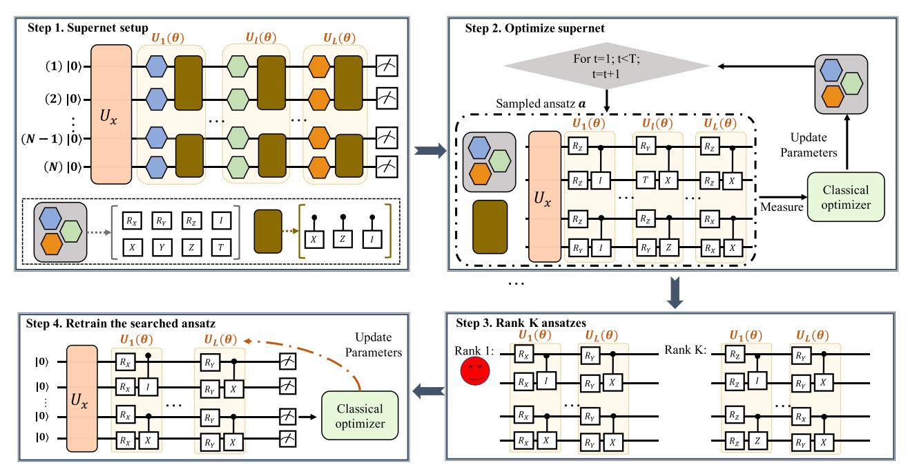
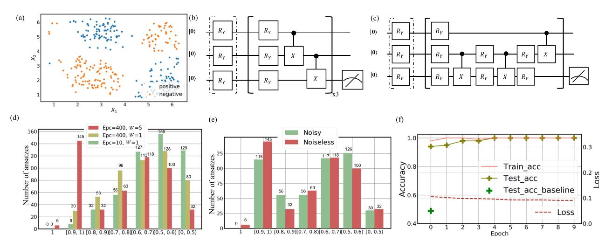
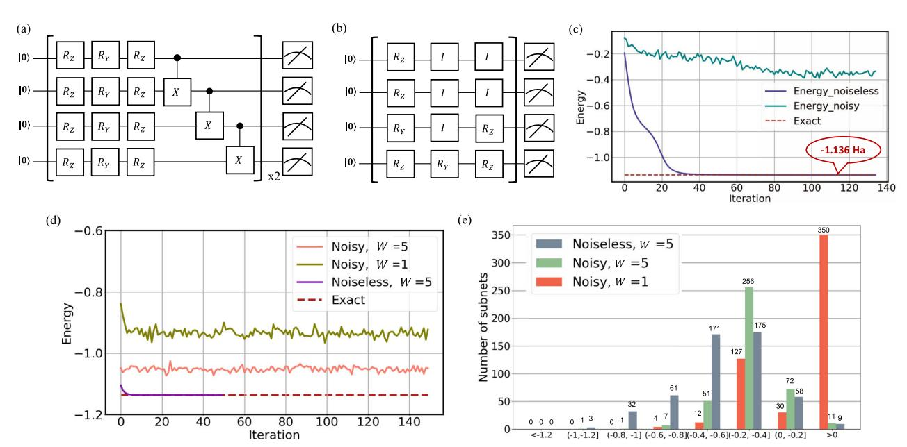
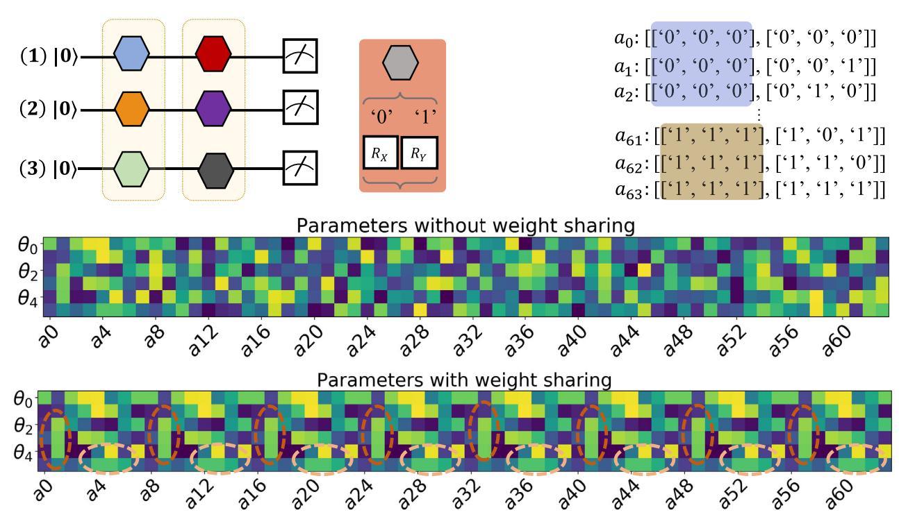

# ARTICLE OPEN

# Quantum circuit architecture search for variational quantum algorithms

Yuxuan Du1,2, ™, Tao Huang2,6, Shan You3, Min-Hsiu Hsieh (1,2, ™ and Dacheng Tao (1,2, ™ and Dacheng Tao (1,2, ™ and Dacheng Tao (1,2, ™ and Dacheng Tao (1,2, ™ and Dacheng Tao (1,2, ™ and Dacheng Tao (1,2, ™ and Dacheng Tao (1,2, ™ and Dacheng Tao (1,2, ™ and Dacheng Tao (1,2, ™ and Dacheng Tao (1,2, ™ and Dacheng Tao (1,2, ™ and Dacheng Tao (1,2, ™ and Dacheng Tao (1,2, ™ and Dacheng Tao (1,2, ™ and Dacheng Tao (1,2, ™ and Dacheng Tao (1,2, ™ and Dacheng Tao (1,2, ™ and Dacheng Tao (1,2, ™ and Dacheng Tao (1,2, ™ and Dacheng Tao (1,2, ™ and Dacheng Tao (1,2, ™ and Dacheng Tao (1,2, ™ and Dacheng Tao (1,2, ™ and Dacheng Tao (1,2, ™ and Dacheng Tao (1,2, ™ and Dacheng Tao (1,2, ™ and Dacheng Tao (1,2, ™ and Dacheng Tao (1,2, ™ and Dacheng Tao (1,2, ™ and Dacheng Tao (1,2, ™ and Dacheng Tao (1,2, ™ and Dacheng Tao (1,2, ™ and Dacheng Tao (1,2, ™ and Dacheng Tao (1,2, ™ and Dacheng Tao (1,2, ™ and Dacheng Tao (1,2, ™ and Dacheng Tao (1,2, ™ and Dacheng Tao (1,2, ™ and Dacheng Tao (1,2, ™ and Dacheng Tao (1,2, ™ and Dacheng Tao (1,2, ™ and Dacheng Tao (1,2, ™ and Dacheng Tao (1,2, ™ and Dacheng Tao (1,2, ™ and Dacheng Tao (1,2, ™ and Dacheng Tao (1,2, ™ and Dacheng Tao (1,2, ™ and Dacheng Tao (1,2, ™ and Dacheng Tao (1,2, ™ and Dacheng Tao (1,2, ™ and Dacheng Tao (1,2, ™ and Dacheng Tao (1,2, ™ and Dacheng Tao (1,2, ™ and Dacheng Tao (1,2, ™ and Dacheng Tao (1,2, ™ and Dacheng Tao (1,2, ™ and Dacheng Tao (1,2, ™ and Dacheng Tao (1,2, ™ and Dacheng Tao (1,2, ™ and Dacheng Tao (1,2, ™ and Dacheng Tao (1,2, ™ and Dacheng Tao (1,2, ™ and Dacheng Tao (1,2, ™ and Dacheng Tao (1,2, ™ and Dacheng Tao (1,2, ™ and Dacheng Tao (1,2, ™ and Dacheng Tao (1,2, ™ and Dacheng Tao (1,2, ™ and Dacheng Tao (1,2, ™ and Dacheng Tao (1,2, ™ and Dacheng Tao (1,2, ™ and Dacheng Tao (1,2, ™ and Dacheng Tao (1,2, ™ and Dacheng Tao (1,2, ™ and Dacheng Tao (1,2, ™ and Dacheng Tao (1,2, ™ and Dacheng Tao (1,2, ™ and Dacheng Tao (1,2, ™ and Dacheng Tao (1,2, ™ and Dacheng Tao (1,2, ™ and Dacheng Tao (1,2, ™ and Dacheng Tao (1,2, ™ and Da

Variational quantum algorithms (VQAs) are expected to be a path to quantum advantages on noisy intermediate-scale quantum devices. However, both empirical and theoretical results exhibit that the deployed ansatz heavily affects the performance of VQAs such that an ansatz with a larger number of quantum gates enables a stronger expressivity, while the accumulated noise may render a poor trainability. To maximally improve the robustness and trainability of VQAs, here we devise a resource and runtime efficient scheme termed quantum architecture search (QAS). In particular, given a learning task, QAS automatically seeks a near-optimal ansatz (i.e., circuit architecture) to balance benefits and side-effects brought by adding more noisy quantum gates to achieve a good performance. We implement QAS on both the numerical simulator and real quantum hardware, via the IBM cloud, to accomplish data classification and quantum chemistry tasks. In the problems studied, numerical and experimental results show that QAS cannot only alleviate the influence of quantum noise and barren plateaus but also outperforms VQAs with pre-selected ansatze.

npj Quantum Information (2022)8:62; https://doi.org/10.1038/s41534-022-00570-y

#### INTRODUCTION

The variational quantum learning algorithms (VQAs)1,2, including quantum neural network3-5 and variational quantum eigensolvers (VQEs)6-9, are a class of promising candidates to use noisy intermediate-scale quantum (NISQ) devices to solve practical tasks that are beyond the reach of classical computers 10. Recently, the effectiveness of VOAs toward small-scale learning problems such as low-dimensional synthetic data classification, image generation, and energy estimation for small molecules has been validated by experimental studies11–14. Despite the promising achievements, the performance of VQAs will degrade significantly when the qubit number and circuit depth become large, caused by the tradeoff between the expressivity and trainability15. More precisely, under the NISQ setting, involving more quantum resources (e.g., quantum gates) to implement the ansatz results in both a positive and negative aftermath. On the one hand, the expressivity of the ansatz, which determines whether the target concept will be covered by the represented hypothesis space, will be strengthened by increasing the number of trainable gates 16-19. On the other hand, a deep circuit depth implies that the gradient information received by the classical optimizer is full of noise and the valid information is exponentially vanished, which may lead to divergent optimization or barren plateaus20–24. With this regard, it is of great importance to design an efficient approach to dynamically control the expressivity and trainability of VQAs to attain good performance.

Initial studies have developed two leading strategies to address the above issue. The first one is quantum error mitigation techniques. Representative methods to suppress the noise effect on NISQ machines are quasi-probability25,26, extrapolation27, quantum subspace expansion28, and data-driven methods29,30. In parallel to quantum error mitigation, another way is constructing ansatz with a variable structure. Compared with traditional

VQAs with the fixed ansatz, this approach cannot only maintain a shallow depth to suppress noise and trainability issues, but also keep sufficient expressibility to contain the solution. Current literature generally adopts brute-force strategies to design such a variable ansatz31–33. This implies that the required computational overhead is considerable, since the candidates of possible ansatze scale exponentially with respect to the qubits count and the circuit depth. How to efficiently seek a near-optimal ansatz remains largely unknown.

In this study, we devise a quantum architecture search scheme (QAS) to effectively generate variable structure ansatze, which considerably improves the learning performance of VQAs. The advantage of QAS is ensured by unifying the noise inhibition and the enhancement of trainability for VQAs as a learning problem. In doing so, QAS does not request any ancillary quantum resource and its runtime is almost the same as conventional VQA-based algorithms. Moreover, QAS is compatible with all quantum platforms, e.g., optical, trapped-ion, and superconducting quantum machines, since it can actively adapt to physical restrictions and weighted noise of varied quantum gates. In addition, QAS can seamlessly integrate with other quantum error mitigation methods25–27 and solutions for resolving barren plateaus21,34–36. Celebrated by the universality and efficacy, QAS contributes to a broad class of VQAs on various quantum machines.

#### **RESULTS**

#### The mechanism of VQAs

Before moving on to present QAS, we first recap the mechanism of VQAs. Given an input  $\mathcal Z$  and an objective function  $\mathcal L$ , VQA employs a gradient-based classical optimizer that continuously updates parameters in an ansatz (i.e., a parameterized quantum

&lt;sup>1JD Explore Academy, Beijing 101111, China. 2School of Computer Science, Faculty of Engineering, The University of Sydney, Sydney, NSW 2008, Australia. 3SenseTime Research, Beijing 100080, China. 4Hon Hai Quantum Computing Research Center, Taipei 114, Taiwan. 5Centre for Quantum Software and Information, Faculty of Engineering and Information Technology, University of Technology Sydney, Sydney, NSW 2007, Australia. 6Present address: SenseTime Research, Beijing 100080, China. ™email: duyuxuan123@gmail.com; min-hsiu.hsieh@foxconn.com; dacheng.tao@sydney.edu.au

Fig. 1 Paradigm of the quantum architecture search scheme (QAS). In Step 1, QAS sets up supernet  $\mathcal{A}$ , which defines the ansatze pool  $\mathcal{S}$  to be searched and parameterizes each ansatz in  $\mathcal{S}$  via the specified weight sharing strategy. All possible single-qubit gates are highlighted by hexagons and two-qubit gates are highlighted by the brown rectangle. The unitary  $U_x$  refers to the data encoding layer. In Step 2, QAS optimizes the trainable parameters for all candidate ansatzes. Given the specified learning task  $\mathcal{L}$ , QAS iteratively samples an ansatz  $\mathbf{a}^{(t)} \in \mathcal{S}$  from  $\mathcal{A}$  and optimizes its trainable parameters to minimize  $\mathcal{L}$ .  $\mathcal{A}$  correlates parameters among different ansatzes via weight sharing strategy. After T iterations, QAS moves to Step 3 and exploits the trained parameters  $\mathbf{\theta}^{(T)}$  and the predefined  $\mathcal{L}$  to compare the performance among K ansatze. The ansatz with the best performance is selected as the output, indicated by a red smiley face. Last, in Step 4, QAS utilizes the searched ansatz and the parameters  $\mathbf{\theta}^{(T)}$  to retrain the quantum solver with few iterations.

circuit)  $U(\boldsymbol{\theta})$  to find the optimal  $\boldsymbol{\theta}^*$ , i.e.,

$$\label{eq:theta_state} \pmb{\theta}^* = \arg\min_{\pmb{\theta} \in \mathcal{C}} \mathcal{L}(\pmb{\theta}, \mathcal{Z}), \tag{1}$$

where  $\mathcal{C} \subseteq \mathbb{R}^d$  is a constraint set, and  $\boldsymbol{\theta}$  are adjustable parameters of quantum gates16,18. For instance, when VQA is specified as an eigen-solver6,  $\mathcal{Z}$  refers to a Hamiltonian and the objection function could be chosen as  $\mathcal{L} = \text{Tr}(\mathcal{Z}|\psi(\boldsymbol{\theta})\rangle\langle\psi(\boldsymbol{\theta})|)$ , where  $|\psi(\boldsymbol{\theta})\rangle$  is the quantum state generated by  $U(\boldsymbol{\theta})$ . For compatibility, throughout the whole study, we focus on exploring how QAS enhances the trainability of one typical heuristic ansatz—hardware-efficient ansatz11,13. Such an ansatz is supposed to obey a multi-layer layout,

$$U(\boldsymbol{\theta}) = \prod_{l=1}^{L} U_l(\boldsymbol{\theta}) \in SU(2^N), \tag{2}$$

where  $U_l(\theta)$  consists of a sequence of parameterized single-qubit and two-qubit quantum gates, and L denotes the layer number. Note that the arrangement of quantum gates in  $U_l(\theta)$  is flexible, enabling VQAs to adequately use available quantum resources and to accord with any physical restriction. Remarkably, the achieved results can be effectively extended to other representative ansatze.

## The scheme of quantum architecture search

Let us formalize the noise inhibition and trainability enhancement for VQAs as a learning task. Denote the set  $\mathcal{S}$  as the ansatze pool that contains all possible ansatze (i.e., circuit architectures) to build  $U(\boldsymbol{\theta})$  in Eq. (2). The size of  $\mathcal{S}$  is determined by the qubits count N, the maximum circuit depth L, and the number of allowed types of quantum gates Q, i.e.,  $|\mathcal{S}| = O(Q^{NL})$ . Throughout the whole study, when no confusion occurs, we denote  $\boldsymbol{a}$  as the ath ansatz  $U(\boldsymbol{\theta}, \boldsymbol{a})$  in  $\mathcal{S}$ . Notably, the performance of VQAs heavily relies on the employed ansatz selected from  $\mathcal{S}$ . Suppose the quantum system noise, induced by  $\boldsymbol{a}$ , is modeled by the quantum channel  $\mathcal{E}_{\boldsymbol{q}}$ .

Taking into account of the circuit architecture information and the related noise, the objective of VQAs can be rewritten as

$$(\boldsymbol{\theta}^*, \boldsymbol{a}^*) = \arg\min_{\boldsymbol{\theta} \in \mathcal{C}. \boldsymbol{a} \in \mathcal{S}} \mathcal{L}(\boldsymbol{\theta}, \boldsymbol{a}, \mathcal{Z}, \mathcal{E}_{\boldsymbol{a}}). \tag{3}$$

The learning problem formulated in Eq. (3) forces the optimizer to output the best quantum circuit architecture  $a^*$  by assessing both the effect of noise and the trainability. Notably, Eq. (3) is intractable via the two-stage optimization strategy that is broadly used in previous literature31–33, i.e., individually optimizing all possible ansatze from scratch and then ranking them to obtain  $(\theta^*, a^*)$ . This is because the classical optimizer needs to store and update  $O(dQ^{NL})$  parameters, which forbids its applicability toward large-scale problems in terms of N and L.

The proposed QAS belongs to the one-stage optimization strategy. Different from the two-state optimization strategy that suffers from the computational bottleneck, this strategy ensures the efficiency of QAS. In particular, for the same number of iterations T, the memory cost of QAS is at most T times more than that of conventional VQAs. Meanwhile, their runtime complexity is identical. The protocol of QAS is shown in Fig. 1. Two key elements of QAS are supernet and weight sharing strategy. Both of them contribute to locate a good estimation of  $(\boldsymbol{\theta}^*, \boldsymbol{a}^*)$  within a reasonable runtime and memory usage. Intuitively, weight sharing strategy in QAS refers to correlating parameters among different ansatze. In this way, the parameter space, which amounts to the total number of trainable parameters required to be optimized in Eq. (3), can be effectively reduced. As for supernet, it plays two significant roles in QAS: (1) supernet serves as the ansatz indicator, which defines the ansatze pool S (e.g., determined by the maximum circuit depth and the choices of quantum gates) to be searched and (2) supernet parameterizes each ansatz in S via the specified weight sharing strategy. QAS includes four steps, i.e., initialization (supernet setup), optimization, ranking, and fine tuning. We now elucidate these four steps.

(1) Initialization: QAS employs a supernet  $\mathcal{A}$  as an indicator for the ansatze pool  $\mathcal{S}$ . Concretely, the setup of the supernet  $\mathcal{A}$  amounts to leveraging the indexing technique to track  $\mathcal{S}$  using a linear memory cost. For instance, when N=4, L=1, and the choices of the quantum gates are  $\{R_{X}, R_{Y}, R_{Z}\}$  with Q=3,  $\mathcal{A}$  indexes  $R_{X}, R_{Y}, R_{Z}$  as "0", "1", "2", respectively. With setting the range of a, b, c, d as  $\{0, 1, 2\}$ , the index list ["a", "b", "c", "d"] tracks  $\mathcal{S}$ , e.g., ["0", "0", "0", "0", "0"] describes the ansatz  $\otimes_{i=1}^4 R_{\mathcal{X}}(\boldsymbol{\theta}_i)$  and ["2", "2", "2", "2"] describes the ansatz  $\otimes_{i=1}^4 R_{\mathcal{X}}(\boldsymbol{\theta}_i)$ . See Method for the construction of the ansatze pool  $\mathcal{S}$  involving two-qubit gates. Meantime, as detailed below,  $\mathcal{A}$  parameterizes all candidate ansatze via weight sharing strategy to reduce parameter space.

(2) Optimization: QAS jointly optimizes  $\{(\boldsymbol{a},\boldsymbol{\theta})\}$  in Eq. (3). Similar to conventional VQAs, QAS optimizes trainable parameters in an iterative manner. At the tth iteration, QAS uniformly samples an ansatz  $\boldsymbol{a}^{(t)}$  from  $\mathcal{S}$  (i.e., an index list indicated by  $\mathcal{A}$ ). To minimize  $\mathcal{L}$  in Eq. (3), the parameters attached to the ansatz  $\boldsymbol{a}^{(t)}$  are updated to  $\boldsymbol{\theta}^{(t+1)} = \boldsymbol{\theta}^{(t)} - \eta \partial \mathcal{L}(\boldsymbol{\theta}^{(t)}, \boldsymbol{a}^{(t)}, \mathcal{Z}, \mathcal{E}_{\boldsymbol{a}^{(t)}}) / \partial \boldsymbol{\theta}^{(t)}$ , with  $\eta$  being the learning rate. The total number of updating is set as T. Note that since the optimization of VQAs is NP-hard37, empirical studies generally restrict T to be less than O(poly(QNL)) to obtain an estimation within a reasonable runtime cost.

To avoid the computational issue encountered by the two-stage optimization method, QAS leverages the weight sharing strategy developed in deep neural architecture search38 to parameterize ansatze in S via a specified correlation rule. Concretely, for any ansatz  $\mathbf{a}' \in \mathcal{S}$ , if the layout of the single-qubit gates of the *l*th layer between  $\mathbf{a}'$  and  $\mathbf{a}^{(t)}$  is identical with  $\forall I \in [L]$ , then A uses the training parameters  $\boldsymbol{\theta}^{(t)}$  assigned to  $U_l(\boldsymbol{\theta}^{(t)}, \boldsymbol{a}^{(t)})$  to parametrize  $U_l(\boldsymbol{\theta}', \boldsymbol{a}')$ , regardless of variations in the layout of other layers. We remark that the parameterization shown above is efficient, which can be accomplished by comparing the generated index list and the stored index lists. In addition, the above-correlated updating rule implies that the parameters of unsampled ansatze are never stored in classical memory. To this end, even though the size of the ansatze pool exponentially scales in terms of N and L, QAS harnesses supernet and weight sharing strategy to guarantee its applicability toward large-scale problems.

(3) Ranking: after T iterations, QAS uniformly samples K ansatze from  $\mathcal S$  (i.e., K index lists generated by  $\mathcal A$ ), ranks their performance, and then assigns the ansatz with the best performance as the output to estimate  $\boldsymbol a^*$ . Mathematically, denoted  $\mathcal K$  as the set collecting the sampled K ansatze, the output ansatz is

$$\arg\min_{\boldsymbol{a}\in\mathcal{K}}\mathcal{L}(\boldsymbol{\theta}^{(T)},\boldsymbol{a},\mathcal{Z},\mathcal{E}_{\boldsymbol{a}}). \tag{4}$$

In QAS, K is a hyper-parameter to balance the tradeoff the efficiency and performance. To avoid the exponential runtime complexity of QAS, the setting of K should polynomially scale with N, L, and Q. Besides random sampling, other methods such as evolutionary algorithms can also be used to establish K with better performance. See Supplementary D for details.

(4) Fine tuning: QAS employs the trained parameters  $\boldsymbol{\theta}^{(T)}$  to fine tune the output ansatz in Eq. (4).

We empirically observe fierce competition among different ansatze in  $\mathcal S$  when optimizing QAS (see Supplementary B for details). Namely, suppose  $\mathcal S$  can be decomposed into two subsets  $\mathcal S_{\rm good}$  and  $\mathcal S_{\rm bad}$ , where the subset  $\mathcal S_{\rm good}$  ( $\mathcal S_{\rm bad}$ ) collects ansatze in the sense that they all attain relatively good (bad) performance via independently training. For instance, in the classification task, the ansatz in  $\mathcal S_{\rm good}$  ( $\mathcal S_{\rm bad}$ ) promises a classification accuracy above (below) 99%. However, when we apply QAS to accomplish the same classification task, some ansatze in  $\mathcal S_{\rm bad}$  may outperform certain ansatze in  $\mathcal S_{\rm good}$ . This observation hints the hardness of optimizing correlated trainable parameters among all ansatze accurately, where the learning performance of a portion of ansatze in  $\mathcal S_{\rm good}$  is no better than training them independently.

To relieve fierce competition among ansatze in  $\mathcal S$  and further boost performance of QAS, we slightly modify the initialization and optimization steps of QAS. Specifically, instead of exploiting a single supernet, QAS involves W supernets to optimize the objective function in Eq. (3). The weight sharing strategy applied to W supernets is independent of each other, where the parameters corresponding to W supernets are separately initialized and updated. At the training and ranking stages, W supernets separately utilize a weight sharing strategy to parameterize the sampled ansatz  $\mathbf{a}^{(t)}$  to obtain W values of  $\mathcal{L}(\mathbf{b}^{(t,w)},\mathbf{a}^{(t)},\mathcal{Z},\mathcal{E}_{\mathbf{a}})$ , where  $\mathbf{b}^{(t,w)}$  refers to the parameters corresponding to the W supernet. Then, the parameters applied to the ansatz  $\mathbf{a}^{(t)}$  is categorized into the Wth supernet when W'= arg  $\min_{t \in \mathcal{L}} \mathcal{L}(\mathbf{b}^{(t,w)},\mathbf{a}^{(t)},\mathcal{Z},\mathcal{E}_{\mathbf{a}})$ .

We last emphasize how  $\overrightarrow{QAS}$  enhances the learning performance of hardware-efficient ansatz  $U(\theta)$  in Eq. (2). Recall that the central aim of QAS is to seek a good ansatz associated with optimized parameters to minimize  $\mathcal{L}(\pmb{\theta},\pmb{a},\mathcal{Z},\mathcal{E}_{\pmb{a}})$  in Eq. (3). In other words, given  $U = \prod_{l=1}^{L} U_{l}(\boldsymbol{\theta})$ , a good ansatz is located by dropping some unnecessary multi-qubit gates and substituting single-qubit gates in  $U_l(\boldsymbol{\theta})$  for  $\forall l \in [L]$ . Following this routine, several studies have proved that removing multi-qubit gates to reduce the entanglement of the ansatz contributes to alleviate barren plateaus39,40. In addition, a recent study41 unveiled that the choice of the quantum circuit architecture can significantly affect the expressive power of the ansatz and the learning performance. Since the objective function of QAS implicitly evaluates the effect of different ansatze, our proposal can be employed as a powerful tool to enhance the learning performance of VQAs. Refer to Method for further explanation about the role of supernet, weight sharing, and analysis of the memory cost and runtime complexity of QAS.

## Simulation and experimental results

The proposed QAS is universal and facilitates a wide range of VQA-based learning tasks, e.g., machine learning42–45, quantum chemistry6,14, and quantum information processing46,47. In the following, we separately apply QAS to accomplish a classification task and a VQE task to confirm its capability toward the performance enhancement. All numerical simulations are implemented in Python in conjunction with the PennyLane and the Qiskit packages48,49. Specifically, PennyLane is the backbone to implement QAS and Qiskit supports different types of noisy models. We defer the explanation of basic terminologies in machine learning and quantum chemistry in Appendices B and C. Here we first apply QAS to achieve a binary classification task under both the poisiless and paint scanarios.

under both the noiseless and noisy scenarios. Denote  $\mathcal{D}$  as the synthetic dataset, where its construction rule follows the proposal of the quantum kernel classifier11. The dataset  $\mathcal{D}$  contains n=300 samples. For each example  $\{\mathbf{x}^{(i)}, \mathbf{y}^{(i)}\}$ , the feature dimension of the input  $\mathbf{x}^{(i)}$  is 3 and the corresponding label  $\mathbf{y}^{(i)} \in \{0, 1\}$  is binary. Examples of  $\mathcal{D}$  are shown in Fig. 2. At the data preprocessing stage, we split the dataset  $\mathcal{D}$  into the training set  $\mathcal{D}_{tr}$ , validation set  $\mathcal{D}_{va}$ , and test set  $\mathcal{D}_{te}$  with size  $n_{tr} = 100$ ,  $n_{va} = 100$ , and  $n_{te} = 100$ . The explicit form of the objective function is

$$\mathcal{L} = \frac{1}{n_{tr}} \sum_{i=1}^{n_{tr}} \left( \tilde{y}^{(i)}(\mathcal{A}, \boldsymbol{x}^{(i)}, \boldsymbol{\theta}) - y^{(i)} \right)^{2}, \tag{5}$$

where  $\{ {m x}^{(i)}, {m y}^{(i)} \} \in \mathcal{D}_{tr}$  and  $\tilde{{m y}}^{(i)}(\mathcal{A}, {m x}^{(i)}, {m heta}) \in [0,1]$  is the output of the quantum classifier (i.e., a function taking the input  ${m x}^{(i)}$ , the supernet  $\mathcal{A}$ , and the trainable parameters  ${m heta}$ ). The training (validation and test) accuracy is measured by  $\sum_i \mathbb{1}_{g(\tilde{{m y}}^{(i)})={m y}^{(i)}}/n_{tr}$  ( $\sum_i \mathbb{1}_{g(\tilde{{m y}}^{(i)})={m y}^{(i)}}/n_{va}$  and  $\sum_i \mathbb{1}_{g(\tilde{{m y}}^{(i)})={m y}^{(i)}}/n_{te}$ ) with  $g(\tilde{{m y}}^{(i)})$  being the predicted label for  ${m x}^{(i)}$ . We also apply the quantum kernel classifier proposed by  ${m y}^{(i)}$  to learn  $\mathcal D$  and compare its performance with QAS, where the implementation of such a quantum classifier is shown

Fig. 2 Simulation results for the classification task. a The illustration of some examples in  $\mathcal{D}$  with first two features. b The implementation of the quantum kernel classifier for benchmarking. The quantum gates highlighted by dashed box refer to the encoding layer that transforms the classical input  $\mathbf{x}^{(l)}$  into the quantum state. The quantum gates located in the solid box refer to  $U_l(\boldsymbol{\theta})$  in Eq. (2) with L=3.  $\boldsymbol{c}$  The output ansatz of QAS under the noisy setting. **d** The validation accuracy of QAS under the noiseless case. The label "Epc = a, W = b" represents that the number of epochs and supernets is T = a and W = b, respectively. The x-axis means that the validation accuracy of the sampled ansatz is in the range of [c, d), e.g., c = 0.5, and d = 0.6. **e** The comparison of QAS between the noiseless and noisy cases. The hyper-parameters setting for both cases is T = 400, K = 500, and W = 5. The labeling of x-axis is identical to subfigure (**d**). **f** The performance of the quantum kernel classifier (labeled by "Test\_acc\_baseline") and QAS (labeled by "Train/Test\_acc") at the fine tuning stage under the noisy setting.

in Fig. 2b. See Supplementary B for more discussion about the construction of  $\mathcal{D}$  and the employed quantum kernel classifier.

The hyper-parameters for QAS are as follows. The number of supernets is W = 1 and W = 5, respectively. The circuit depth for all supernets is set as L = 3. The search space of QAS is formed by two types of quantum gates. Specifically, at each layer  $U_i(\theta)$ , the parameterized gates are fixed to be the rotational quantum gate along Y-axis  $R_{Y}$ . For the two-qubit gates, denoted the index of three gubits as (0, 1, 2), QAS explores whether applying CNOT gates to the gubits pair (0, 1), (0, 2), (1, 2) or not. Hence, the size of  $\mathcal{S}$  equals to  $|\mathcal{S}| = 8^3$ . The number of sampled ansatze for ranking is set as K = 500. The setting  $K \approx |\mathcal{S}|$  enables us to understand how the number of supernets W, the number of epochs T, and the system noise affect the learning performance of different ansatze in the ranking stage.

Under the noiseless scenario, the performance of QAS with three different settings is exhibited in Fig. 2d. In particular, QAS with W =1 and T = 10 attains the worst performance, where the validation accuracy for most ansatze concentrates on 50-60%, highlighted by the green bar. With increasing the number of epochs to T = 400and fixing W = 1, the performance is slightly improved, i.e., the number of ansatze that achieves validation accuracy above 90% is 30, highlighted by the yellow bar. When W=5 and T=400, the performance of QAS is dramatically enhanced, where the validation accuracy of 151 ansatze is above 90%. The comparison between the first two settings indicates the correctness of utilizing QAS to accomplish VQA-based learning tasks in which QAS learns useful feature information and achieves better performance with respect to the increased epoch number T. The varied performance of the last two settings reflects the fierce competition phenomenon among ansatze and validates the feasibility to adopt W > 1 to boost the performance of QAS. We retrain the output ansatz of QAS under the setting: W = 5 and T = 400, both the training and test accuracies converge to 100% within 15 epochs, which is identical to the original quantum kernel classifier.

The performance of the original quantum kernel classifier is evidently degraded when the depolarizing error for the singlequbit and two-qubit gates is set as 0.05 and 0.2, respectively. As shown in the lower plot of Fig. 2f, the training and test accuracies of the original quantum kernel classifier drop to 50% (almost conduct a random guess) under the noisy setting. The degraded performance is caused by the large amount of accumulated noise, where the classical optimizer fails to receive the valid optimization information. By contrast, QAS can achieve good performance under the same noise setting. As shown in Fig. 2e, with setting W = 5 and T = 400, the validation accuracy of 115 ansatze is above 90% under the noisy setting. The ansatz that attains the highest validation accuracy is shown in Fig. 2c. Notably, compared with the original quantum kernel classifier in Fig. 2b, the searched ansatz contains fewer CNOT gates. This implies that, under the noisy setting formulated above, QAS suppresses the noise effect and improves the training performance by adopting a few CNOT gates. When we retrain the obtained ansatz with 10 epochs, both the train and test accuracies achieve 100%, as shown in the upper plot of Fig. 2f. These results indicate the feasibility to apply QAS to achieve noise inhibition and trainability enhancement.

We defer the omitted simulation results and the exploration of fierce competition to Supplementary B. In particular, we assess the learning performance of the quantum classifier with the hardwareefficient ansatz and the ansatz searched by QAS under the noise model extracted from the real quantum device, i.e., "Ibmq\_lima". The achieved simulation result indicates that the ansatz obtained by QAS outperforms the conventional quantum classifier.

We next apply QAS to find the ground state energy of the Hydrogen molecule13,50 under both the noiseless and noisy scenarios. The molecular hydrogen Hamiltonian is formulated as

$$H_{h} = g + \sum_{i=0}^{3} g_{i}Z_{i} + \sum_{i=1,k=1,i< k}^{3} g_{i,k}Z_{i}Z_{k} + g_{a}Y_{0}X_{1}X_{2}Y_{3}$$

$$+g_{b}Y_{0}Y_{1}X_{2}X_{3} + g_{c}X_{0}X_{1}Y_{2}Y_{3} + g_{d}X_{0}Y_{1}Y_{2}X_{3},$$
(6)

where  $\{X_i, Y_i, Z_i\}$  denote the Pauli matrices acting on the *i*th qubit and the real scalars q with or without subscripts are efficiently computable functions of the hydrogen-hydrogen bond length (see Supplementary C for details about  $H_h$  and q). The ground state energy calculation amounts to computing the lowest energy eigenvalues of  $H_h$ , where the accurate value is  $E_m = -1.136 \,\mathrm{Ha}^{48}$ . To tackle this task, the conventional VQE6 and its variants7–9 optimize the trainable parameters in  $U(\boldsymbol{\theta})$  to prepare the ground state  $|\psi^*\rangle =$  $U(\boldsymbol{\theta}^*)|0\rangle^{\otimes 4}$  of  $H_h$ , i.e.,  $E_m=\langle \psi^*|H_h|\psi^*\rangle$ . The implementation

Fig. 3 Simulation results for the ground state energy estimation of Hydrogen. a The implementation of the conventional VQE. b The output ansatz of QAS under the noisy setting. c The training performance of VQE under noisy and noiseless settings. The label "Exact" refers to the accurate result  $E_m$ . d The performance of the output ansatz of QAS under both the noisy and noiseless settings. e The performance of QAS at the ranking state. The label "W = b" refers to the number of supernets, i.e., W = b. The x-axis means that the estimated energy of the sampled ansatz is in the range of (c, d], e.g., c = -0.6 Ha, and d = -0.8 Ha.

of  $U(\theta)$  is illustrated in Fig. 3a. Under the noiseless setting, the estimated energy of VQE fast converges to the target result  $E_m$ within 40 iterations, as shown in Fig. 3c.

The hyper-parameters of QAS to compute the lowest energy eigenvalues of  $H_h$  are as follows. The number of supernets has two settings, i.e., W = 1 and W = 5, respectively. The layer number for all ansatze is L=3. The number of iterations and sampled ansatze for ranking is T = 500 and K = 500, respectively. The search space of QAS for the single-qubit gates is fixed to be the rotational quantum gates along Y and Z axis. For the two-gubit gates, denoted by the index of four qubits as (0, 1, 2, 3), QAS explores whether applying CNOT gates to the qubits pair (0, 1), (1, 2), (2, 3)or not. Therefore, the total number of ansatze equals to  $|S| = 128^3$ . The performance of QAS with W = 5 is shown in Fig. 3d. Through retraining the obtained ansatz of QAS with 50 iterations, the estimated energy converges to  $E_m$ , which is the same as the conventional VQE.

The performance between the conventional VQE and QAS is largely distinct when the noisy model described in the classification task is deployed. Due to a large amount of gate noise, the estimated ground energy of the conventional VQE converges to -0.4 Ha, as shown in Fig. 3c. In contrast, the estimated ground energy of QAE with W=1 and W=5 achieves -0.93 and -1.05 Ha, respectively. Both of them are closer to the target result  $E_m$  compared with the conventional VQE. Moreover, as shown in Fig. 3e, a larger W implies a better performance of QAS, since the estimated energy of most ansatze is below  $-0.6\,\mathrm{Ha}$ when W = 5, while the estimated energy of 350 ansatze is above 0 Ha when W = 1. We illustrate the generated ansatz of QAS with W = 5 in Fig. 3b. In particular, to mitigate the effect of gate noise, this generated ansatz does not contain any CNOT gate, which is applied to a very large noise level. Recall that a central challenge in quantum computational chemistry is whether NISQ devices can outperform classical methods already available51. The achieved results in QAS can provide good guidance to answer this issue. Concretely, the searched ansatz in Fig. 3, which only produces the separable states that can be efficiently simulated by classical devices, suggests that VQE method may not outperform classical methods when NISQ devices contain large gate noise.

Note that more simulation results are deferred to Supplementary. Specifically, in Supplementary C, we exhibit more results of the above task. Furthermore, we implement VQE with the hardware-efficient ansatz and the ansatz searched by QAS on the real superconducting quantum hardware, i.e., "Ibmg ourense", to estimate the ground state energy of  $H_h$ . Due to the runtime issue, we complete the optimization and ranking using the classical backend and perform the final runs on the IBMQ cloud. The experimental result indicates that the ansatz obtained by QAS outperforms the conventional VQE, where the estimated energy of the former is  $-0.96\,\mathrm{Ha}$  while the latter is  $-0.61\,\mathrm{Ha}$ . Then, in Supplementary D, we exhibit that utilizing the evolutionary algorithms to establish  ${\mathcal K}$  can dramatically improve the performance of QAS. Subsequently, in Supplementary E, we provide numerical evidence that QAS can alleviate the influence of barren plateaus. Last, we present a variant of QAS to tackle large-scale problems with the enhanced performance in Supplementary F.

#### DISCUSSION

In this study, we devise QAS to dynamically and automatically design ansatz for VQAs. Both simulation and experimental results validate the effectiveness of QAS. Besides good performance, QAS only requests similar computational resources to conventional VQAs with fixed ansatze and is compatible with all quantum systems. Through incorporating QAS with other advanced error mitigation and trainability enhancement techniques, it is possible to seek more applications that can be realized on NISQ machines with potential advantages.

There are many critical questions remaining in the study of QAS. Our future work includes the following several directions. First, we will explore better strategies to sample ansatz at each iteration. For example, the reinforcement learning techniques, which are used to construct optimal sequences of unitaries to accomplish quantum simulation tasks52, may contribute to this goal. Next, we will design a more advanced strategy to shrink the parameter space while not degrading the learning performance. Subsequently, to further boost the performance of QAS, we will leverage some prior information on the learning problem such as the

**Fig. 4** A visualization of weight sharing strategy. The upper left panel depicts the potential ansatze when N=3, L=2, and the choices of quantum gates are  $\{R_{Xi}, R_{Yi}\}$  with Q=2. The total number of ansatze is  $Q^{NL}=64$ . The upper right panel illustrates how to use the indexing technique to accomplish the weight sharing. The label " $a_i$ " refers to the ansatz  $a^{(i)}$ . Namely, for any two ansatze, if the indexes in the lth array are identical (highlighted by the blue and brown regions), then their trainable parameters in the lth layer are the same. The two heatmaps demonstrated in the lower panel visualize the trainable parameters of 64 ansatze. The label " $a_i$ " refers to the parameter assigned to the i-th rotational quantum gate. Note that when the weight sharing strategy is applied, the trainable parameters are reused for different ansatze, as indicated by the dashed circles.

symmetric property and some post-processing strategies that remove redundant gates of the searched ansatz. In addition, we will delve into theoretically understanding the fierce competition. In the end, it is intriguing to explore applications of QAS beyond VQAs such as optimal quantum control and the approximation of the target unitary using the limited quantum gates.

#### **METHODS**

#### The classical analog of QAS

The classical analog of the learning problem in Eq. (3) is the neural network architecture search38. Recall that the success of deep learning is largely attributed to novel neural architectures for specific learning tasks, e.g., the convolutional neural networks for image processing tasks53. However, deep neural networks designed by human experts are generally timeconsuming and error-prone38. To tackle this issue, the neural architecture search approach, i.e., the process of automating architecture engineering, has been widely explored, and achieved state-of-the-art performances in many learning tasks 54–58. Despite having a similar aim, naively generalizing classical results to the quantum scenario to accomplish Eq. (3) is infeasible due to the distinct basic components: neurons versus quantum gates, classical correlation versus entanglement, the barren plateau phenomenon, the quantum noise effect, and physical hardware restrictions. These differences and extra limitations further intensify the difficulty of searching the optimal quantum circuit architecture  $\boldsymbol{a}^*$ , compared with the classical setting. In the following, we explain the omitted implementation details of OAS.

#### Weight sharing strategy

The role of the weight sharing strategy is to reduce the parameter space to enhance the learning performance of QAS within a reasonable runtime and memory usage. Intuitively, this strategy correlates parameters among different ansatze in  $\mathcal S$  based on a specified rule. In this way, we can jointly

optimize  $(\theta, a)$  to estimate  $(\theta^*, a^*)$ , where the updated parameters for one ansatz can also enhance the learning performance of other ansatze when the correlation criteria are satisfied. As explained in Fig. 4, the weight sharing strategy adopted in QAS squeezes the parameter space from  $O(dQ^{NL})$  to  $O(dLQ^N)$ . Meantime, our simulation results indicate that the reduction of parameter space enables QAS to achieve good performance within a reasonable runtime complexity.

We remark that through adjusting the correlation criteria applied to the weight sharing strategy, the parameter space can be further reduced. For instance, when all parameters in an ansatz are correlated, the size of the parameter space reduces to O(1). With this regard, another feasible correlation rule for QAS is unifying the single-qubit gates for all ansatze as  $U_3 = R_Z(\alpha)R_Y(\beta)R_Z(\gamma)$ . In other words, QAS only adjusts the arrangement of two-qubit gates to enhance the learning performance. From the practical perspective, this setting is reasonable since the gate error introduced by the single-qubit gates is much less than that of two-qubit gates.

#### Supernet

We next elucidate supernet used in QAS. As explained in the main text, supernet has two important roles, which are constructing the ansatze pool  $\mathcal S$  and parameterizing each ansatz in  $\mathcal S$  via the specified weight sharing strategy. In other words, supernet defines the search space, which subsumes all candidate ansatze, and the candidate ansatze in  $\mathcal S$  are evaluated through inheriting weights from the supernet. Rather than training numerous separate ansatze from scratch, QAS trains supernet just once (Step 2 in Fig. 1), which significantly cuts down the search cost.

We next explain how QAS leverages the indexing technique to construct  $\mathcal S$  when the available quantum gates include both single-qubit and two-qubit gates. Following notation in the main text, suppose that N=5, L=1, and the choices of single-qubit gates and two-qubit gates are  $\{R_Y,R_Z\}$  and  $\{CNOT,\mathbb I_4\}$ , respectively. In QAS, supernet  $\mathcal A$  indexes  $\{R_Y,R_Z,CNOT,\mathbb I_4\}$  as  $\{"0","1","T","F"\}$ . Moreover, we suppose that the topology of the deployed quantum machine yields a chain structure, i.e.,  $Q1 \leftrightarrow Q2 \leftrightarrow Q3 \leftrightarrow Q4 \leftrightarrow Q5$ . With setting  $a,b,c,d,e\in\{"0","1"\}$  and  $A,B,C,D\in\{"T","F"\}$ , the index list ["a","b","c","d","e","8","8","C","0"] tracks all candidate ansatze in  $\mathcal S$ , e.g.,

["0", "0", "0", "0", "0", "T", "T", "T",

### Memory cost and runtime complexity

We first analyze the runtime complexity of QAS. In particular, at the first step, the setup of supernet, i.e., configuring out the ansatze pool and the correlating rule, takes O(1) runtime. In the second step, QAS proceeds T iterations to optimize trainable parameters. The runtime cost of QAS at each iteration scales with O(d), where d refers to the number of trainable parameters in Eq. (1). Such cost origins from the calculation of gradients via parameter shift rule, which is similar to the optimization of VQAs with a fixed ansatz. To this end, the total runtime cost of the second step is O(dT). In the ranking step, QAS samples K ansatze and compares their objective values using the optimized parameters. This step takes at most O(K) runtime. In the last step, QAS fine tunes the parameters based on the searched ansatz with few iterations (i.e., a very small constant). The required runtime is identical to conventional VQAs, which satisfies O(d). The total runtime complexity of QAS is hence O(dT + K).

We next analyze the memory cost of QAS. Specifically, the first step requests O(QNL) memory to specify the ansatze pool via the indexing technique. Recall the memory cost in this step is dominated by configuring the index space, which requests at most O(ONL) memory. This is because in the worst case, the allowed Q choices of quantum gates for the varied qubit at the varied layer are exactly different. To store information that describes choices of gates for different qubits at a different position, the memory cost scales with O(QNL). In the second step, QAS totally outputs Tindex lists corresponding to the architecture of T ansatze. This requires at most O(TNL) memory cost. Moreover, QAS explicitly updates at most Td parameters (we omit those parameters that are implicitly updated via weight sharing strategy, since they do not consume the memory cost). To this end, the memory cost of the second step is O(TNL + Td). In the third step. OAS samples K index lists that describe the circuit architecture of K ansatze. This requires at most O(KNL) cost. Moreover, according to the weight sharing strategy, the memory cost of storing the corresponding parameters is O(Kd). The memory cost of the last step is identical to the conventional VQAs with a fixed ansatz, which is O(d). The total memory cost of OAS is hence O(Td + TNL + Kd).

To better understand how the computational complexity scales with N, L, and Q, in the following, we set the total number of iterations in Step 2 and the number of sampled ansatze in Step 3 as T = O(QNL) and K = O(QNL), respectively. Note that since the size of S becomes indefinite, it is reasonable to set K as O(QNL) instead of a constant used in the numerical simulations. Under the above settings, we conclude that the runtime complexity and the memory cost of QAS are O(dQNL) and  $O(dQNL + QN^2L^2)$ , respectively.

We remark that when W supernets are involved, the required memory cost and runtime complexity of QAS linearly scales with respect to W. Moreover, employing adversarial bandit learning techniques59 can exactly remove this overhead (see Supplementary A for details).

#### **DATA AVAILABILITY**

The datasets generated and/or analyzed during the current study are available from Y.D. on reasonable request.

#### **CODE AVAILABILITY**

The source code of QAS to reproduce all numerical experiments is available on the GitHub repository (https://github.com/yuxuan-du/Quantum\_architecture\_search/).

Received: 31 December 2020; Accepted: 20 April 2022; Published online: 23 May 2022

## **REFERENCES**

- Cerezo, M. et al. Variational quantum algorithms. Nat. Rev. Phys. 3, 625–644 (2021).
- 2. Bharti, K. et al. Noisy intermediate-scale quantum algorithms. *Rev. Mod. Phys.* **94**, 015004 (2022).
- 3. Beer, K. et al. Training deep quantum neural networks. *Nat. Commun.* **11**, 1–6 (2020).

- Farhi, E. & Neven, H. Classification with quantum neural networks on near term processors. Preprint at arXiv:1802.06002 (2018).
- Schuld, M. & Killoran, N. Quantum machine learning in feature hilbert spaces. Phys. Rev. Lett. 122, 040504 (2019).
- Peruzzo, A. et al. A variational eigenvalue solver on a photonic quantum processor. Nat. Commun. 5, 4213 (2014).
- Wang, D., Higgott, O. & Brierley, S. Accelerated variational quantum eigensolver. Phys. Rev. Lett. 122, 140504 (2019).
- Stokes, J., Izaac, J., Killoran, N. & Carleo, G. Quantum natural gradient. Quantum 4, 269 (2020).
- Mitarai, K., Yan, T. & Fujii, K. Generalization of the output of a variational quantum eigensolver by parameter interpolation with a low-depth ansatz. *Phys. Rev. Appl.* 11, 044087 (2019).
- Preskill, J. Quantum computing in the NISQ era and beyond. Quantum 2, 79 (2018)
- Havlícek, V. et al. Supervised learning with quantum-enhanced feature spaces. Nature 567, 209 (2019).
- Huang, H.-L. et al. Experimental quantum generative adversarial networks for image generation. Phys. Rev. Appl. 16, 024051 (2021).
- Kandala, A. et al. Hardware-efficient variational quantum eigensolver for small molecules and quantum magnets. *Nature* 549, 242–246 (2017).
- Google Al Quantum and Collaborators. Hartree-Fock on a superconducting qubit quantum computer. Science 369, 1084–1089 (2020).
- 15. Holmes, Z., Sharma, K., Cerezo, M. & Coles, P. J. Connecting ansatz expressibility to gradient magnitudes and barren plateaus. *PRX Quantum* **3**, 010313 (2022).
- Benedetti, M., Lloyd, E., Sack, S. & Fiorentini, M. Parameterized quantum circuits as machine learning models. *Quantum Sci. Technol.* 4, 043001 (2019).
- Caro, M. C. et al. Generalization in quantum machine learning from few training data. Preprint at arXiv:2111.05292 (2021).
- 18. Du, Y., Hsieh, M.-H., Liu, T. & Tao, D. Expressive power of parametrized quantum circuits. *Phys. Rev. Res.* **2**, 033125 (2020).
- Du, Y., Tu, Z., Yuan, X. & Tao, D. Efficient measure for the expressivity of variational quantum algorithms. *Phys. Rev. Lett.* 128, 080506 (2022).
- Du, Y., Hsieh, M.-H., Liu, T., You, S. & Tao, D. Learnability of quantum neural networks. PRX Quantum 2, 040337 (2021).
- Cerezo, M., Sone, A., Volkoff, T., Cincio, L. & Coles, P. J. Cost function dependent barren plateaus in shallow parametrized quantum circuits. *Nat. Commun.* 12, 1–12 (2021).
- McClean, J. R., Boixo, S., Smelyanskiy, V. N., Babbush, R. & Neven, H. Barren plateaus in quantum neural network training landscapes. *Nat. Commun.* 9, 1–6 (2018).
- 23. Sweke, R. et al. Stochastic gradient descent for hybrid quantum-classical optimization. *Quantum* **4**, 314 (2020).
- 24. Wang, S. et al. Noise-induced barren plateaus in variational quantum algorithms. *Nat. Commun.* **12**, 1–11 (2021).
- Temme, K., Bravyi, S. & Gambetta, J. M. Error mitigation for short-depth quantum circuits. Phys. Rev. Lett. 119, 180509 (2017).
- Endo, S., Benjamin, S. C. & Li, Y. Practical quantum error mitigation for near-future applications. *Phys. Rev. X* 8, 031027 (2018).
- Li, Y. & Benjamin, S. C. Efficient variational quantum simulator incorporating active error minimization. *Phys. Rev. X* 7, 021050 (2017).
- McClean, J. R., Kimchi-Schwartz, M. E., Carter, J. & De Jong, W. A. Hybrid quantumclassical hierarchy for mitigation of decoherence and determination of excited states. *Phys. Rev. A* 95, 042308 (2017).
- Strikis, A., Qin, D., Chen, Y., Benjamin, S. C. & Li, Y. Learning-based quantum error mitigation. PRX Quantum 2, 040330 (2021).
- 30. Czarnik, P., Arrasmith, A., Coles, P. J. & Cincio, L. Error mitigation with clifford quantum-circuit data. *Quantum* **5**, 592 (2021).
- 31. Chivilikhin, D. et al., Mog-vqe: multiobjective genetic variational quantum eigensolver. Preprint at arXiv:2007.04424 (2020).
- 32. Li, L. et al. Quantum optimization with a novel gibbs objective function and ansatz architecture search. *Phys. Rev. Res.* **2**, 023074 (2020).
- 33. Ostaszewski, M., Grant, E. & Benedetti, M. Structure optimization for parameterized quantum circuits. *Quantum* **5**, 391 (2021).
- Grant, E., Wossnig, L., Ostaszewski, M. & Benedetti, M. An initialization strategy for addressing barren plateaus in parametrized quantum circuits. *Quantum* 3, 214 (2019).
- 35. Skolik, A., McClean, J. R., Mohseni, M., van der Smagt, P. & Leib, M. Layerwise learning for quantum neural networks. *Quantum Mach. Intell.* **3**, 1–11 (2021).
- 36. Zhang, K., Hsieh, M.-H., Liu, L. & Tao, D. Toward trainability of deep quantum neural networks. Preprint at arXiv:2112.15002 (2021).
- Bittel, L. & Kliesch, M. Training variational quantum algorithms is np-hard. Phys. Rev. Lett. 127, 120502 (2021).
- Elsken, T., Metzen, J. H. & Hutter, F. Neural architecture search: a survey. J. Mach. Learn. Res. 20, 1–21 (2019).

- 39. Marrero, C. O., Kieferová, M. & Wiebe, N. Entanglement-induced barren plateaus. PRX Quantum 2, 040316 (2021).
- 40. Patti, T. L., Najafi, K., Gao, X. & Yelin, S. F. Entanglement devised barren plateau mitigation. Phys. Rev. Res. 3, 033090 (2021).
- 41. Haug, T., Bharti, K. & Kim, M. S. Capacity and quantum geometry of parametrized quantum circuits. PRX Quantum 2, 040309 (2021).
- 42. Huang, H.-Y. et al. Power of data in quantum machine learning. Nat. Commun. 12, 1–9 (2021).
- 43. Du, Y., Hsieh, M.-H., Liu, T. & Tao, D. A grover-search based quantum learning scheme for classification. N. J. Phys. 23, 023020 (2021).
- 44. Cong, I., Choi, S. & Lukin, M. D. Quantum convolutional neural networks. Nat. Phys. 15, 1273–1278 (2019).
- 45. Wang, X., Du, Y., Luo, Y. & Tao, D. Towards understanding the power of quantum kernels in the nisq era. Quantum 5, 531 (2021).
- 46. LaRose, R., Tikku, A., O'Neel-Judy, É., Cincio, L. & Coles, P. J. Variational quantum state diagonalization. npj Quantum Inf. 5, 1–10 (2019).
- 47. Yin, X.-F. et al. Efficient bipartite entanglement detection scheme with a quantum adversarial solver. Phys. Rev. Lett. 128, 110501 (2022).
- 48. Bergholm, V. et al. Pennylane: automatic differentiation of hybrid quantumclassical computations. Preprint at arXiv:1811.04968 (2018).
- 49. Qiskit: an open-source framework for quantum computing (2019).
- 50. O'Malley, P. J. J. et al. Scalable quantum simulation of molecular energies. Phys. Rev. X 6, 031007 (2016).
- 51. McArdle, S., Endo, S., Aspuru-Guzik, A., Benjamin, S. C. & Yuan, X. Quantum computational chemistry. Rev. Mod. Phys. 92, 015003 (2020).
- 52. Yao, J., Lin, L. & Bukov, M. Reinforcement learning for many-body ground-state preparation inspired by counterdiabatic driving. Phys. Rev. X 11, 031070 (2021).
- 53. Goodfellow, I., Bengio, Y. & Courville, A. Deep Learning. (MIT Press, 2016).
- 54. Pham, H., Guan, M., Zoph, B., Le, Q. & Dean, J. Efficient neural architecture search via parameters sharing. In Proceedings of Machine Learning Research. 4095–4104 (2018).
- 55. Huang, T. et al. Greedynasv2: greedier search with a greedy path filter. Preprint at arXiv:2111.12609 (2021).
- 56. Liu, C. et al. Progressive neural architecture search. In Proceedings of the European Conference on Computer Vision (ECCV). Springer, Cham, 19–34 (2018).
- 57. You, S., Huang, T., Yang, M., Wang, F., Qian, C. & Zhang, C. Greedynas: towards fast one-shot nas with greedy supernet. In Proceedings of the IEEE/CVF Conference on Computer Vision and Pattern Recognition. Computer Vision Foundation/IEEE 1999–2008 (2020).
- 58. Yang, Y., Li, H., You, S., Wang, F., Qian, C. & Lin, Z. Ista-nas: efficient and consistent neural architecture search by sparse coding. Adv. Neural Inf. Process. Syst. 33, 10503–10513 (2020).

59. Bubeck, S. & Cesa-Bianchi, N. Regret analysis of stochastic and nonstochastic multi-armed bandit problems. Mach. Learn. 5, 1–122 (2012).

## AUTHOR CONTRIBUTIONS

Y.D. and D.T. conceived this work. Y.D., S.Y., and M.-H.H. accomplished the theoretical analysis. Y.D. and T.H. conducted numerical simulations. All authors reviewed and discussed the analysis and results, and contributed to writing the manuscript.

## COMPETING INTERESTS

The authors declare no competing interests.

## ADDITIONAL INFORMATION

Supplementary information The online version contains supplementary material available at <https://doi.org/10.1038/s41534-022-00570-y>.

Correspondence and requests for materials should be addressed to Yuxuan Du, Min-Hsiu Hsieh or Dacheng Tao.

Reprints and permission information is available at [http://www.nature.com/](http://www.nature.com/reprints) [reprints](http://www.nature.com/reprints)

Publisher's note Springer Nature remains neutral with regard to jurisdictional claims in published maps and institutional affiliations.

Open Access This article is licensed under a Creative Commons Attribution 4.0 International License, which permits use, sharing, adaptation, distribution and reproduction in any medium or format, as long as you give appropriate credit to the original author(s) and the source, provide a link to the Creative Commons license, and indicate if changes were made. The images or other third party material in this article are included in the article's Creative Commons license, unless indicated otherwise in a credit line to the material. If material is not included in the article's Creative Commons license and your intended use is not permitted by statutory regulation or exceeds the permitted use, you will need to obtain permission directly from the copyright holder. To view a copy of this license, visit [http://creativecommons.](http://creativecommons.org/licenses/by/4.0/) [org/licenses/by/4.0/.](http://creativecommons.org/licenses/by/4.0/)

© Crown 2022