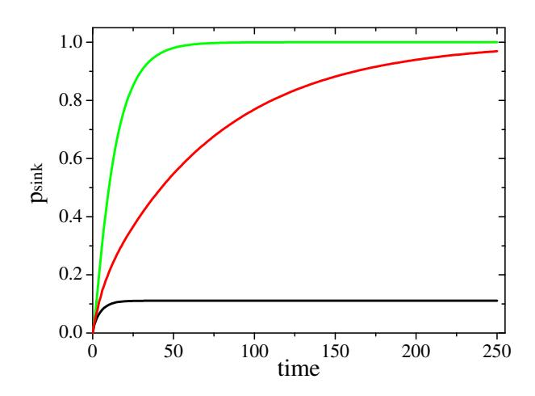
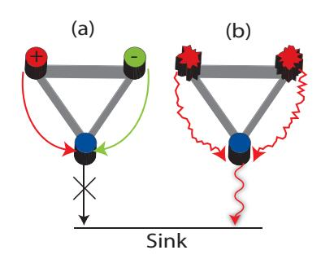
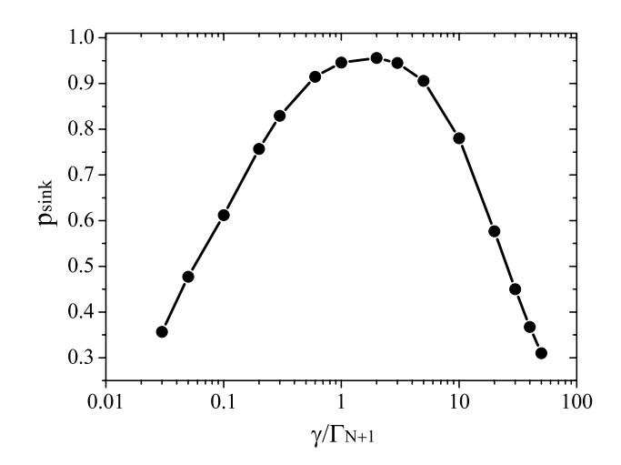
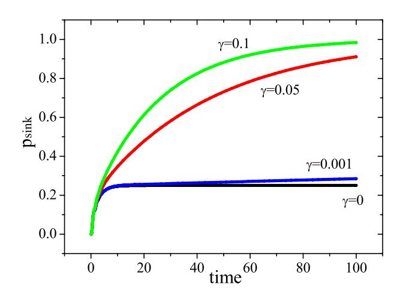
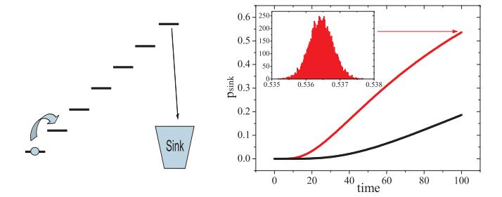
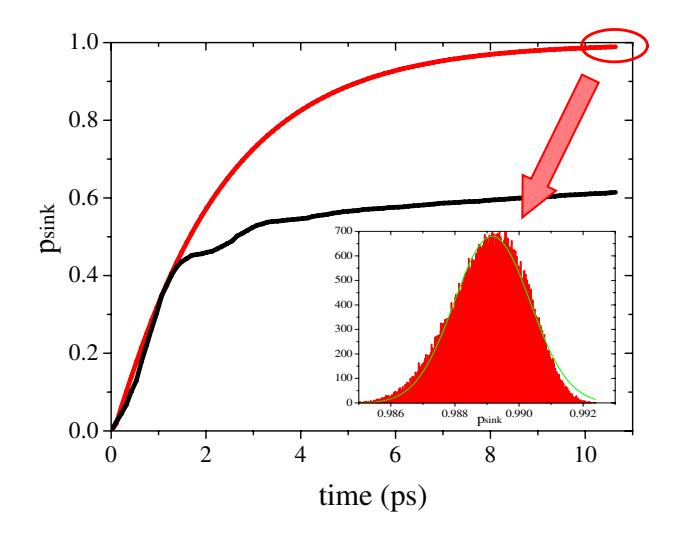
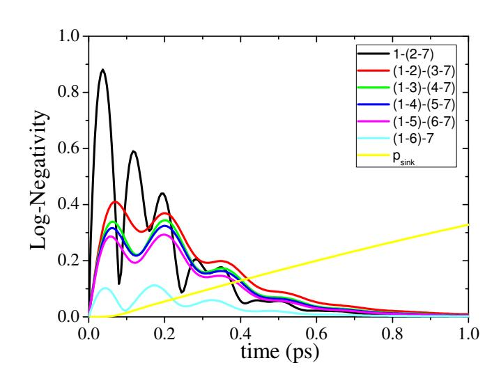
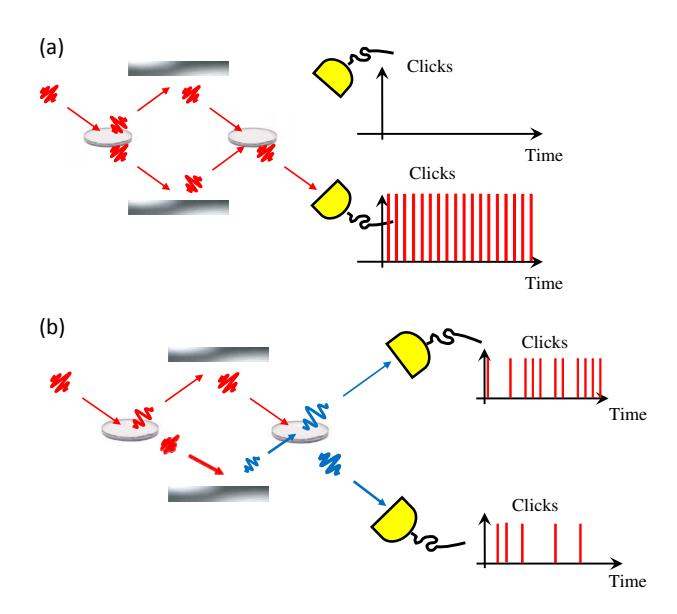
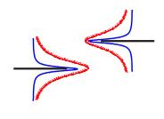
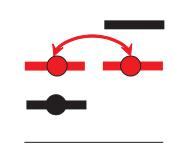

## **Highly efficient energy excitation transfer in light-harvesting complexes: The fundamental role of noise-assisted transport**

F. Caruso1,2 , A.W. Chin3 , A. Datta1,2 , S.F. Huelga3 , and M.B. Plenio1,2 1 *Institute for Mathematical Sciences, 53 Prince's Gate, Imperial College, London, SW7 2PG, UK* 2*QOLS, The Blackett Laboratory, Imperial College, London, Prince Consort Road, SW7 2BW, UK and* 3*Quantum Physics Group, Department of Physics, Astronomy & Mathematics, University of Hertfordshire, Hatfield, Herts AL10 9AB, UK*

Excitation transfer through interacting systems plays an important role in many areas of physics, chemistry, and biology. The uncontrollable interaction of the transmission network with a noisy environment is usually assumed to deteriorate its transport capacity, especially so when the system is fundamentally quantum mechanical. Here we identify key mechanisms through which noise such as dephasing, perhaps counter intuitively, may actually aid transport through a dissipative network by opening up additional pathways for excitation transfer. We show that these are processes that lead to the inhibition of destructive interference and exploitation of line broadening effects. We illustrate how these mechanisms operate on a fully connected network by developing a powerful analytical technique that identifies the invariant (excitation trapping) subspaces of a given Hamiltonian. Finally, we show how these principles can explain the remarkable efficiency and robustness of excitation energy transfer from the light-harvesting chlorosomes to the bacterial reaction center in photosynthetic complexes and present a numerical analysis of excitation transport across the Fenna-Matthew-Olson (FMO) complex together with a brief analysis of its entanglement properties. Our results show that, in general, it is the careful interplay of quantum mechanical features and the unavoidable environmental noise that will lead to an optimal system performance.

Transport phenomena have been central to quantum mechanics since its early days [\[1\]](#page-15-0). This pivotal role has been recently renewed by the prospect of transferring quantum information across quantum networks [\[2\]](#page-15-1) and the recurring interest in understanding the fundamental processes influencing energy transport in photosynthetic molecules [\[3\]](#page-15-2). Light harvesting complexes can harness the available light energy at efficiencies well above 90% in conditions that are often defined as *hot and wet* [\[4,](#page-15-3) [5](#page-15-4)]. Understanding the workings of such a process has the potential to be immensely valuable from a technological point of view, potentially paving the way for the design of novel nanofabricated structures for quantum transport and optimized solar cells. There is already an important body of work analyzing energy transport in these systems [\[6](#page-15-5), [7](#page-15-6), [8,](#page-15-7) [9,](#page-15-8) [10,](#page-15-9) [11\]](#page-15-10). However, the clear identification of the basic mechanisms underlying this remarkably efficient natural transfer scheme has remained elusive. Recently, a sequence of beautiful experiments using very effective nonlinear spectroscopic techniques probed the dynamics of delocalized exciton states in light-harvesting complexes [\[12\]](#page-15-11), the Fenna-Matthew-Olson (FMO) complex [\[13,](#page-15-12) [14\]](#page-15-13) and conjugated polymer samples [\[15\]](#page-15-14), the latter modeling multichromophoric systems. Based on these experimental observations, quantum coherence across multiple chromophoric sites has been suggested as the probable cause of the highly efficient energy transfer in photosynthetic systems. The influence of initial exciton delocalization in the efficiency of excitation transfer was investigated by [\[16\]](#page-15-15) and it has been suggested that the enhanced transfer rates may be attributed to the exploitation of principles of quantum search algorithms by the quantum dynamics of the FMO complex [\[3,](#page-15-2) [14\]](#page-15-13). At the same time, however, excitations in chromophoric complexes are subject to strong dephasing noise from a quasi-continuum of environmental phonon modes, which, in turn, suggests that quantum coherence will be short-ranged rather than extending across the entire complex. This short ranged nature of quantum correlations may suggest that concepts from quantum computation will not play as decisive a role as it is generally accepted. In fact, efficient pure state quantum computation requires long range entanglement [\[17](#page-15-16)]. It therefore remains unclear whether the presence of quantum entanglement has any specific functional role in the process of energy transport across biological systems, or it can simply be viewed as the unavoidable by-product of the existence of a coherent quantum evolution during a certain time scale in such systems.

Inspired by these experimental results and their interpretations, further theoretical studies of energy transport in light harvesting complexes have been carried out recently [\[18](#page-15-17), [19](#page-15-18)]. They investigate the role of noise, and in particular dephasing, in the process of exciton transport in these complexes. Contrary to the conventional wisdom that noise always deteriorates the performance of a system, several instances are known, in classical as well as quantum mechanics, where noise is known to be of advantage in enhancing the system's response. In the classical phenomenon of stochastic resonance [\[20](#page-15-19)], a non-linear system may benefit from the presence of noise to achieve an enhanced sensitivity to a weak signal. Motivated by this observation, it was successfully demonstrated that noise may have the capacity to generate genuinely quantum mechanical features such as quantum coherence and entanglement [21, 22, 23]. Taking this further, it was shown recently that noise, in the form of local dephasing, has the ability to enhance the rate and efficiency of energy transfer when compared to a perfectly quantum coherent system [18, 19]. Indeed, the highly effective exciton transfer in light harvesting complexes requires the simultaneous presence of quantum coherent evolution and dephasing noise. Simulations have also shown that, in the competition between coherent dynamics and incoherent energy dissipation (population decay), the former regime lasts for about several hundreds of fs [24] at the beginning of the exciton transfer process that spans about 5 ps [11]. As a result, in addition to the expectation that the quantum coherence is short-ranged, it is in fact short-lived as well, and so will be any entanglement across the systems.

In spite of these qualitative and quantitative successes based on numerical work, the underlying mechanisms by which noise supports transport have yet to be precisely identified and exemplified in simple models. Achieving this may assist us in replicating in artificial structures what nature does so well energy transfer in light-harvesting complexes.

In this paper we identify two fundamental mechanisms underlying dephasing-assisted transport and elucidate them in the context of two basic models. We will show that these are firstly, the suppression of destructive interference by adding local decohering noise such as dephasing or static disorder, and secondly, the enhancement of transfer by line broadening caused, for example, by the fluctuation of energy levels. Both mechanisms have the principal effect of opening additional channels for transport in the system; channels that would be inhibited under solely coherent evolution.

We start by presenting in section I an abstract network model for quantum transport where local sites are subject to both local dissipation and dephasing and the excitation transfer to a reaction center is modeled via an irreversible coupling to a privileged trapping site, an excitation sink. In section II we introduce a simplified model in terms of a fully connected network, where all sites are coupled to each other with equal coupling strength. This model will allow us to develop a powerful analytical technique to elucidate whether a given Hamiltonian is susceptible to support noise assisted transport. This will be done by characterizing the invariant (excitation trapping) subspaces of the Hamiltonian. With the aim of making the pace of the paper reasonably fluid, the detailed procedure is presented in a separate Appendix where we develop a technique for solving the complete master equation for the fully connected network. Using these analytical results, we show in sections II.A-II.D that dephasing assists transport in fully connected networks while dissipation only does so in some cases. We provide examples when pure dissipation may assist the transport through a network. Section II.E revises line broadening as a classical effect. In section III we extend the model to account for forms of spatially correlated noise. This theoretical analysis allows for the identification of the fundamental mechanisms underlying dephasingassisted transport which are then applied in section IV to the specific example of energy transfer across a light harvesting system, the FMO complex, which may be modelled as a network of seven nodes, fully connected, albeit with non-uniform coupling strengths. We show how experimental results concerning exciton transfer cannot be reproduced in the absence of dephasing while the inclusion of this form of local noise boosts energy transfer towards the observed values in the correct time scale. We show that the two mechanisms presented here by which dephasing assists excitation transfer are very robust against variations of the detailed structure of the system. The theoretically expected and numerically observed weak dependence on the noise strength suggests that experimental results which have been obtained at 77 K should remain broadly valid at higher temperature [14] and that these processes will be robust against perturbations due to different environments. We conclude section IV with an evaluation of entanglement generation and transmission within this simple noise model, including local and correlated dephasing, and show that quantum correlations are expected to be confined to the initial steps of the transport process and die out well before the excitation is fully transferred. In section V, we summarize the main physical ideas behind our approach in an intuitive form and we conclude in section VI by suggesting that the principles outlined here may find broad applicability in understanding the dynamics of biological complexes and transport phenomena and discuss future work in this direction.

#### I. THE NETWORK MODEL

Light-harvesting complexes are typically constituted of multiple chromophores which transform photons into excitons and transport them to a reaction center [25]. Experimental studies of the exciton dynamics in such systems reveal rich transport dynamics consisting of short-time coherent quantum dynamics which evolve, in the presence of noise into an incoherent population transport which irreversibly transfers excitations to the reaction center. In order to elucidate the basic phenomena clearly without overburdening the description with detail, we consider the relevant complexes as systems composed of several distinct sites, one of which is connected to the chromosomes while another is connected to the reaction center. This complex effective dynamics will then be modelled by a combination of simple Hamiltonian dynamics which describe the coherent exchange of excitations between sites, and local Lindblad terms that take into account the dephasing and dissipation caused by the external environment. A network of N sites will be described by the Hamiltonian,

$$H = \sum_{j=1}^{N} \hbar \omega_{j} \sigma_{j}^{+} \sigma_{j}^{-} + \sum_{j \neq l} \hbar v_{j,l} (\sigma_{j}^{-} \sigma_{l}^{+} + \sigma_{j}^{+} \sigma_{l}^{-}), \quad (1)$$

where  $\sigma_i^+$  ( $\sigma_i^-$ ) are the raising and lowering operators for site j,  $\hbar\omega_i$  is the local site excitation energy and  $v_{k,l}$  denotes the hopping rate of an excitation between the sites k and l. We will also designate a site 0 representing the zero exciton state of the complex, which appears in operators such as  $\sigma_i^+ = |j\rangle\langle 0|$ , where the state  $|j\rangle$  denotes one excitation in the site j. We will assume that the system is susceptible simultaneously to two distinct types of noise processes, a dissipative process that transfers the excitation energy in site j to the environment (with rate  $\Gamma_i$ ) and a pure dephasing process (with rate  $\gamma_i$ ) that destroys the phase coherence of any superposition state in the system, i.e randomizing the local excitation phase in site j. Following previous studies on dephasingassisted transport [18, 19], we describe both processes using a Markovian master equation with local dephasing and dissipation terms [26]. As we shall see, the mechanisms that we discuss here are quite insensitive to the details of the noise model. In the Markovian master equation approach, the dissipative and the energy-conserving dephasing processes are captured, respectively, by the Lindblad super-operators

$$\mathcal{L}_{diss}(\rho) = \sum_{j=1}^{N} \Gamma_{j} [-\{\sigma_{j}^{+} \sigma_{j}^{-}, \rho\} + 2\sigma_{j}^{-} \rho \sigma_{j}^{+}], \qquad (2)$$

$$\mathcal{L}_{deph}(\rho) = \sum_{j=1}^{N} \gamma_{j} [-\{\sigma_{j}^{+} \sigma_{j}^{-}, \rho\} + 2\sigma_{j}^{+} \sigma_{j}^{-} \rho \sigma_{j}^{+} \sigma_{j}^{-}] . (3)$$

Finally, the total transfer of excitation is measured by the population in the 'sink', numbered N+1, which is populated by an irreversible decay process (with rate  $\Gamma_{N+1}$ ) from a chosen site k as described by the Lindblad operator

$$\mathcal{L}_{sink}(\rho) = \Gamma_{N+1}[2\sigma_{N+1}^{+}\sigma_{k}^{-}\rho\sigma_{k}^{+}\sigma_{N+1}^{-} - \{\sigma_{k}^{+}\sigma_{N+1}^{-}\sigma_{N+1}^{+}\sigma_{k}^{-}, \rho\}].$$
 (4)

For definitiveness and simplicity, the initial state of the network at t=0 will be assumed to be a single excitation in site 1 (i.e., state  $|1\rangle$ ), unless stated otherwise. The model is completed by introducing the quantity by which we measure the efficiency of network's transport properties, that is the population transferred to the sink  $p_{sink}(t)$ , which is given by  $p_{sink}(t)=2\Gamma_{N+1}\int_0^t \rho_{kk}(t')\mathrm{d}t'$ .

#### II. THE FULLY CONNECTED NETWORK (FCN)

The FMO complex can be described by a Hamiltonian in which every site in the network is coupled to every other sites but with site dependent coupling strength [11, 19]. The dominant couplings are the nearest neighbour terms, but significant hopping matrix elements exist also between more distant sites. This motivates the study of networks with a high level of connectivity (see also Ref. [27] for quantum state transfer), and in this section, for simplicity, we will look in detail at a fully

FIG. 1:  $p_{sink}$  vs. time is shown for a fully connected graph of N=10 nodes with  $\Gamma_i=0$  for  $i=1,\ldots N, J=1, \Gamma_{N+1}=1$ . At t=0 one excitation is in the site 1 and the energy transfer evolves according to the quantum dynamics investigated in the text. The cases of an energy mismatch, i.e.  $\omega_1=1, \omega_{i\neq 1}=0$  (red line), a dephasing mismatch, i.e.  $\gamma_1=1, \gamma_{i\neq 1}=0$  (green line), and the basic case  $\gamma_i=\omega_i=0$  (black line)  $\forall i$  are shown. For the latter, the population in the sink asymptotically reaches  $p_{sink}=1/9$ . Note that both the red and the green lines reach unit transfer asymptotically, but at considerably different rates.

connected network (FCN). The FCN is characterised by equal hopping strengths between all sites, i.e.  $\hbar v_{i,l} = J$  for any  $j \neq l$ . Remarkably, for the case of a uniform network, i.e. one in which  $\omega_j$ ,  $\gamma_j$ , and  $\Gamma_j$  are the same on every site, an exact analytical solution can be found for the density matrix of arbitrarily large networks. These exact solutions are obtained by defining a set of collective variables, and the formal development of the solutions is given in the Appendix. These exact solutions provide insight into the real-time transport dynamics of the FCN, and, by considering different scenarios in which various noise effects are present or absent, we can isolate the various mechanisms that contribute to the dephasing-assisted transport, as discussed below. Moreover, having isolated these mechanisms, we find that they can be described in an intuitive wave mechanics picture which highlights the relevance of these processes in a much wider range of quantum network models.

## A. No dissipation, no dephasing: Destructive interference

This case is described by  $\gamma_j=\Gamma_j=0$  and, for simplicity,  $\omega_j=0$  for any  $j=1,\ldots,N$ . The only irreversible process left in this system is the decay of population to the sink from site N. The exact solution (in the Appendix) predicts the striking result that as  $t\to\infty$  the total amount of the excitation that

is transferred to the sink is given by

$$p_{sink}(\infty) = \frac{1}{N-1} \ . \tag{5}$$

In Fig. (1), the time evolution of the sink population is shown (black line), for the case of N=10. For any reasonably large network the transfer to the sink is very small, even in the limit  $t\to\infty$ . This should be contrasted with classical hopping, e.g. a random walk, model, in which the excitation can be shown to be completely transferred to the sink as  $t\to\infty$ . The difference between these results is a consequence of the wave-like nature of the quantum dynamics in the FCN and the presence of destructive interference. This can be seen by considering the final (i.e.,  $t\to\infty$ ) state of the network given by

$$\rho(t \to \infty) = \frac{N-2}{N-1} |\Psi\rangle\langle\Psi| + \frac{1}{N-1} |N+1\rangle\langle N+1| \quad (6)$$

where

$$|\Psi\rangle = \frac{1}{\sqrt{(N-1)(N-2)}} \sum_{j \neq N,1} (|1\rangle - |j\rangle), \tag{7}$$

and  $|1\rangle$  is the initially occupied site. Even though each individual site has a finite amplitude J for transfer to site N, the amplitudes coming from  $|1\rangle$  cancel those from  $|j\rangle$  due to the minus sign in the superposition. As a result of this *destructive interference*, the net amplitude connecting  $|\Psi\rangle$  and  $|N\rangle$  must be zero, which means that the excitation stored in  $|\Psi\rangle$  is unaffected by any process that acts locally at N. Thus a quantum FCN can protectively store some of the excitation in superpositions that have no effective overlap with site N, as illustrated in Fig. (2(a)). A powerful way of understand-

FIG. 2: A fully-connected three-site network. In (a) the excitation wave function is delocalised over two sites (red and green) with equal probability of being found at either site. However, as the wavefunction is antisymmetric with respect to the interchange of red and green, this state has no overlap with the dissipative site (blue) due to the destructive interference of the tunnelling amplitudes from each site in the superposition. The network can therefore store an excitation in this state indefinitely. In (b) pure dephasing causes the loss of this phase coherence and the two amplitudes no longer cancel, leading to total transfer of the excitation to the sink.

ing how this final state emerges without actually solving the full dynamics is to invoke the notion of an invariant subspace. We define an invariant subspace to consist of a set of states which are both eigenstates of H and have no overlap with site N. The eigenstates of the FCN consist of a state of the form  $|\phi\rangle=N^{-\frac{1}{2}}\sum_{j=1}^N|j\rangle$  with energy E=J(N-1) and N-1 degenerate eigenstates with E=-J. Due to the degeneracy of these states, they can be represented in several ways. One particularly useful representation consists of anti-symmetric superpositions of pairs of sites of the form  $|\psi_j\rangle=|1\rangle-|j\rangle$  where  $j=2\ldots N$ . We now expand the initial system state in terms of the invariant subspace and the remaining states to find

$$|1\rangle = \left(\frac{1}{N-1}\right) \left[ \overbrace{\sum_{j=2}^{N-1} (|\psi_j\rangle)}^{\text{Invariant}} + \sqrt{N}|\phi\rangle - |N\rangle \right].$$
 (8)

The subsequent time evolution of the system is very simple. The states in the invariant subspace are eigenstates of the Hamiltonian and are not affected by the open-system dynamics that only acts at site N. Therefore, their evolution is purely coherent and, being degenerate, can be described by a simple global phase. The remaining components of the initial state expansion evolve in the non-invariant subspace defined by having a finite overlap with site N and are therefore transferred into the sink. The net result is that at long times the weight held in the network is simply that contained in the invariant part of the initial state expansion. A further consequence of this analysis is the prediction that, if the system is initially prepared in one of the invariant states, then there are no dynamics: the excitation is completely trapped in a noiseprotected stationary state and  $p_{sink}(\infty) = 0$ , as illustrated in Fig. (2(a)). Note that this phenomenon is reminiscent of coherent population trapping in quantum optical [28] and condensed matter [29, 30] systems.

The power of this approach is that the argument given above must also be valid for other Hamiltonians provided they contain an invariant subspace. Invariant subspaces turn out to be rather easy to find, and can be systematically generated for any network with some degeneracy. This would naturally imply that large invariant subspaces can be found in systems of high symmetry, and the larger the invariant subspace is, the larger is the spectral weight retained by the network. A brief discussion of more general networks within the invariant subspace approach can be found in the Appendix. These results are independent of the noise model provided that it only acts locally at N. However, under non-local noise it may also be possible to find invariant subspaces as well.

## B. Static disorder: Suppressing destructive interference

Another advantage of the invariant subspace approach is that it can be extended to situations in which the uniformity of the network is perturbed and allows us to study one of the key mechanisms for suppressing destructive interference. Changes to the local site energies are local perturbations, and it should once again be possible to construct an invariant subspace that does not feel their influence. This requires that we define a new invariant subspace that is spanned by all eigenstates that do not have any overlap with either site N, connected to the sink, or the perturbed sites. For the FCN this amounts to a reduction of the previous invariant subspace by the number of perturbed sites, that is, we now exclude all  $|\psi_i\rangle$ corresponding to the perturbed sites j. The final state of the system now consists of the part of the initial state expansion that lies in the reduced invariant subspace, which for FCN immediately implies

$$p_{sink}(\infty) = \frac{1}{N - D - 1} \tag{9}$$

where D is the number of sites with different site energies [31]. This implies that a network where all the site energies differ (D=N-2) results in  $p_{sink}(\infty)=1$ , i.e. complete excitation transfer. A natural consequence of this result is that a network with randomly disordered energies always leads to perfect transfer as  $t\to\infty$ .

While in the FMO complex and biological complexes in general other mechanisms may also play a role, the above strongly suggests that it is not an accident that in many of those complexes a moderate amount of disorder is present in the distribution of the site energies.

The significance of this observation should not be underestimated. It contrasts with the idea that disorder leads to either weak or Anderson localization in the system [32, 33], and that static disorder always inhibits transfer. That this is not the case in the FCN is already demonstrated by the above results where at least a certain amount of disorder is essential for achieving complete population transfer. The origin of this perhaps surprising behavior is that, unlike systems described by the Anderson tight-binding Hamiltonian, the FCN transport to the sink is already strongly suppressed in the absence of disorder due to destructive interference of transition amplitudes to the state coupled to the sink. As we have shown, this destructive interference is inhibited by any finite amount of disorder and thus disorder can initially lead to an enhancement of transport in the FCN. However, while finite disorder leads to  $p_{sink}(\infty) = 1$ , the rate at which the excitation is transferred to the sink is not a monotonic function of the disorder strength - see Fig. (3). For weak disorder the spectrum of the FCN still contains states that are fairly close to the uncoupled subspace, i.e. they couple only weakly to the sink, and transport through the network will be slow. As the size

of the disorder increases, the eigenstates become increasingly distant from the uncoupled subspace and should lead to an increase in the transport rate. Increasing the magnitude of the disorder further eventually causes the transfer through the network to become slower again due to the reduction in overlap between the sites, as will be discussed later on.

## C. Local dephasing without dissipation: Suppressing destructive interference

The previous sections showed that the noise-free FCN can trap a large part of the initial excitation within a manifold of states that do not overlap with site N and hence do not lead to transfer to the sink. These states are coherent superpositions of excitons in different sites, and are invariant in time due to destructive interference of the transition amplitudes. Static disorder however may suppress this destructive interference, thus releasing all or part of the trapped excitons. Here we show that local dephasing noise has a very similar effect because it affects the relative phase in the states that are invariant under the Hamiltonian dynamics, e.g. mapping the invariant state  $(|1\rangle - |2\rangle)/\sqrt{2}$  to the evolving state  $(|1\rangle + |2\rangle)/\sqrt{2}$ (in the master equation picture presented above for example through the action of the operator  $\sigma_2^+\sigma_2^-$ ), and thus perturbing the important destructive interference. This observation is quite general and may be made for arbitrary dephasing mechanisms both due to classical or quantum environments. Indeed, in the presence of local dephasing on all sites the size of the invariant subspace discussed there vanishes and one finds that as  $t \to \infty$ ,  $p_{sink}$  tends to unity for any finite  $\gamma$ . This may be confirmed analytically for the case of a uniform local dephas-

FIG. 3: Dependence of  $p_{sink}(t)$  at a fixed time t=20 as a function of  $\gamma/\Gamma_{N+1}$ , in the case of N=5, J=1, and  $\omega=0$ . The initially sharp rise is due to the increasing rapidity at which the invariant subspace is destroyed, whilst the decreasing part is due to quantum Zeno effects.

FIG. 4: Population of the sink  $p_{sink}(t)$  as a function of time t for increasing dephasing rates  $\gamma$ , in the case of  $\Gamma_{N+1}=1$ . For short times, the system dynamics are identical to the case of zero dephasing, and for very weak dephasing a significant fraction of the excitation can be trapped in invariant subspace for a time of approximately  $\gamma^{-1}$ .

ing rate  $\gamma_i = \gamma$ , for which the dynamical equations can again be solved exactly, as shown in the Appendix. This demonstrates the same fundamentally quantum mechanical aspect of dephasing-assisted transport as the Mach-Zender interferometer in Sec. V.A: the removal of destructive interference and the creation of new pathways for transport (see Fig. (2(b))). Given that all physical realisations of network models are subject to some dephasing, one might wonder why we have laboured to develop the notion of invariant subspaces, spaces which are anything but invariant in a realistic network. One reason is that the dynamics of the excitation transfer can still be strongly influenced by the presence of destructive interference. This is shown in Fig. (4) which shows the evolution of  $p_{sink}(t)$  for N=5 and J=1 as a function of time for various pure dephasing rates. For  $\gamma \ll \Gamma_{N+1}$  the early time evolution is identical to the case of no dephasing. This implies that the system evolves into the final state found in the last section and then slowly dephases leading to a gradual transfer of the remaining spectral weight to the bath. Interestingly, the speed at which the excitation is transferred is not a monotonic function of the dephasing rate. This is illustrated in Fig. (3) which shows  $p_{sink}(t)$  as a function of  $\gamma/\Gamma_{N+1}$  at a fixed time of t=20. The initial sharp increase in the transport rate is due to the destruction of the invariant subspace as discussed above, whilst the slowing of the transfer rate for large dephasing rates can be ascribed to either a quantum Zeno effect or, equivalently, an effect of line broadening. We will discuss the latter in more detail below.

In Fig. (1), we compare our base case ( $\gamma=\omega=\Gamma=0$ ) to two other cases both of which lead to  $p_{sink}=1$ . One is the case of just a local dephasing on the site of injection ( $\gamma=0$  elsewhere), while in the other case we have a different site

energy at the site of injection ( $\omega=0$  elsewhere). We can see very clearly that pure dephasing leads to a faster transfer than pure energy mismatch. An insight of this nature could help us control the transport behaviour in laboratory and real systems much more effectively. As shown above by using the invariant subspace argument, one may increase the transfer to the sink in small controlled steps, thus carrying us to a limit where we can almost direct the flow of energy in systems at the microscopic level by engineering macroscopic parameters.

## D. Only local dissipation, no dephasing

Dissipation of the exciton by the environment also leads to the suppression of destructive interference, which raises the natural question whether relaxation alone can enhance transport in the absence of pure dephasing or static disorder of site energies. The answer depends on the system and initial state. To address this question, we consider the case of  $\gamma_j=0$  and  $\Gamma_j=\Gamma.$  The exact solution is presented in the Appendix and predicts

$$p_{sink}(\infty) = \frac{J^2 \Gamma_{N+1} (2\Gamma + \Gamma_{N+1})}{\phi(\Gamma, \Gamma_{N+1}, J, N)},$$
 (10)

where  $\phi$  is given by  $\phi(\Gamma, \Gamma_{N+1}, J, N) = 4\Gamma^4 + 8\Gamma^3\Gamma_{N+1} + 5\Gamma^2\Gamma_{N+1}^2 + \Gamma\Gamma_{N+1}^3 + \Gamma_{N+1}^2J^2(N-1) + \Gamma^2J^2N^2 + \Gamma\Gamma_{N+1}J^2N^2$ . From Eq. (10) we find  $\frac{\partial p_{sink}(\infty)}{\partial \Gamma} \leq 0$  and hence that pure relaxation always yields  $p_{sink}(\infty) < (N-1)^{-1}$ . Here, the losses to the environment always offset any increase in the transport efficiency due to dephasing of the invariant states. For the case of both pure dephasing and relaxation, the transfer is always sub-optimal as losses to the environment always lead to  $p_{sink}(\infty) < 1$ .

Interestingly, it should be noted that the conclusion that pure dissipation does not enhance transport to the sink is not always valid. To see this, consider a system as in Fig. (2(a)) that is initially prepared in one of the invariant states such as  $(|1\rangle - |2\rangle)/\sqrt{2}$  so that one finds  $p_{sink}(\infty) = 0$  for  $\Gamma = 0$ . Now let us assume that only site 2 suffers dissipation,  $\Gamma_2 > 0$ . The time evolution is now composed of two contributions. In one part, the excitation is lost to the environment leading to no successful transport. The other part in which the exciton is not being lost is more interesting. This branch of the time evolution is described by a conditional Hamiltonian that is the original Hamiltonian supplemented, crucially, with the non-Hermitean additional term  $-i\Gamma_2|2\rangle\langle 2|$  [34]. Then the initial state  $(|1\rangle - |2\rangle)/\sqrt{2}$  is not invariant under the conditional time evolution anymore and the relative weight of state  $|2\rangle$  increases compared to state  $|1\rangle$ . This in turn affects the destructive interference for transitions to level  $|3\rangle$  as the interfering amplitudes then do not have the same weight anymore. This releases the trapped population and leads to some transfer to site  $|3\rangle$ .

FIG. 5: Transport in a classical ladder like system of N=7 sites, with steps of unit size  $(\Delta E_{i,i+1}=1)$ , with a dissipation term (with rate  $\Gamma_{N+1}$ ) into a sink, connected to the site 7. The energy levels fluctuate with a Lorentzian distribution (with width 1) to take into account line broadening effects and a symmetric hopping rate given by  $f(j,j+1)=1/(4\pi)\ 1/(\Delta E_{j,j+1}^2+1/16)$  between the sites j and j+1 and  $\Gamma_{N+1}=1$  (red line), while also the noiseless case is shown (black line). Inset: Pdf distribution for  $p_{sink}$  for t=100 over a sample of  $10^4$  instances in both hopping scenarios. Notice that it is very narrow around the central  $p_{sink}$  value. In both cases, it is clearly shown that line broadening dramatically enhances the transport.

Thus in the absence of pure dephasing, it is possible to find instances of both positive and negative contributions to the transport as a result of relaxation.

## E. Line broadening as a classical effect

So far we have placed an emphasis on the effect of suppression of destructive interference, hence addressing the wave-like feature of the exciton transport. Dephasing may also be seen to broaden the resonance lines of the individual sites. This effect has a purely classical component as well. Indeed, fluctuating excitation energies of sites leads to stronger coupling between sites whose energy difference becomes small or even changes their energy ordering thanks to fluctuations in time [19]. In order to clearly separate this mechanism from possible quantum interference effects discussed before, we exemplify it here using the purely classical model of N sites in an ascending ladder of sites as displayed in Fig (5) with the highest energy site connected to a sink. The probability of finding the excitation on the site  $i, i = 1, \ldots, N$  at a time t,  $p_i(t)$ , is given by the Pauli master equation as

$$\frac{\mathrm{d}p_{i}(t)}{\mathrm{d}t} = k_{i,i+1} p_{i+1}(t) + k_{i,i-1} p_{i-1}(t) - (k_{i+1,i} + k_{i-1,i} + \Gamma_{N+1} \delta_{iN}) p_{i}(t)$$

$$(11)$$

 $\frac{\mathrm{d}p_{sink}(t)}{\mathrm{d}t} = \Gamma_{N+1} p_N(t) , \qquad (12)$ 

where  $k_{i,j}$  are the hopping rates from sites j into site i, respectively,  $\Gamma_{N+1}$  is the irreversible decay from the site N into the sink and we assume that the energy differences between neighboring sites is  $\Delta E_{i,i+1} = 1$ . We take account of line broadening by adding to this level spacing a noise

term leading to a Lorentzian distribution of energy levels with width 1. Now, we consider two very closely related scenarios: namely (i) we consider thermal hopping, i.e.  $k_{i,j}/k_{j,i}=e^{-\Delta(E_i-E_j)/T}$  and (ii) the hopping is symmetric  $k_{i,j}=k_{j,i}$ , with an hopping rate obeying a Lorentzian in the energy difference of two neighboring sites. Notice that the latter is perhaps closer to the quantum case where the coupling between neighboring levels with an energy mismatch is better approximated by case (ii). In Fig. (5) the dramatic rise in transport due to line broadening is shown for the case of Lorentzian hopping rates. A similar behaviour was found also for other cases. Hence, we observe that energy mismatch in a system with static disorder inhibits the transfer of an excitation up the ladder and the transport may be supported by addition of dephasing.

#### III. CORRELATED NOISE

The considerations so far have assumed Markovian local noise. In photosynthetic complexes that will be discussed in the following section it is however known that such a model is not fully accurate both due to the small size of the complex compared to the correlation length of the relevant bath and due to the fact that the time scales for interactions may be of the order of the bath correlation time. To gain an understanding of how spatial correlations affect decoherence, we study a Markovian master equation

$$\frac{d\rho}{dt} = -i[H, \rho] + \mathcal{L}_{deph}(\rho) + \mathcal{L}_{diss}(\rho) , \qquad (13)$$

where the Hamiltonian and the dissipative term are chosen as Eq. (1) and Eq. (2) respectively while the Lindblad operator describing the correlated dephasing is given by

$$\mathcal{L}_{deph}(\rho) = \sum_{mn} \gamma_{mn} \left( -\sigma_{m}^{+} \sigma_{m}^{-} \sigma_{n}^{+} \sigma_{n}^{-} \rho - \rho \sigma_{n}^{+} \sigma_{n}^{-} \sigma_{m}^{+} \sigma_{m}^{-} + \sigma_{m}^{+} \sigma_{n}^{-} \rho \sigma_{m}^{+} \sigma_{n}^{-} + \sigma_{n}^{+} \sigma_{n}^{-} \rho \sigma_{m}^{+} \sigma_{m}^{-} \right).$$
(14)

Note that the Hermitian matrix of the  $\gamma_{mn}$  must be positive semidefinite to describe a completely positive dynamics. The effect of the noise correlations can now be seen quite clearly by considering the special case of a two site system where  $\gamma_{11}=\gamma_{22}=\gamma,\,\gamma_{12}=\gamma_{21}=\alpha\gamma,\,\Gamma_k=0$  for  $k=1,\ldots,N$  and H=0. With the initial state  $\rho=\frac{1}{2}(|1\rangle-|2\rangle)(\langle 1|-\langle 2|),$  which led to destructive interference in Fig. (2), we find

$$\frac{d\rho}{dt} = 2(1-\alpha)\gamma(|2\rangle\langle 2| + |2\rangle\langle 1| + |1\rangle\langle 2| + |1\rangle\langle 1|). \quad (15)$$

For  $\alpha=1$ , i.e. perfectly correlated noise, we find  $\dot{\rho}=0$ , i.e. the state  $\rho$  remains stable. For anti-correlated noise  $\alpha=-1$  however this state would be decaying more rapidly than under uncorrelated noise. Hence, spatial correlations in the dephasing noise may act both to stabilize or destabilize specific coherent superpositions and the related destructive interference

effects explained earlier in this work. Generally, of course the spatial correlations in the noise will not be perfect and depend for example on the distance between sites – more distant sites will tend to suffer weaker noise-correlations. Needless to say, the above master equation picture does not encompass all possible environments and also neglects non-Markovian effects which may however be easily included for example by using time convolved master equations with a memory kernel that nevertheless preserve complete positivity [35]. A thorough discussion of such effects goes well beyond the scope of this work as it would require us to take into account the details of the environment in our simulations. However, the present paper is aimed at clarifying fundamental mechanisms and we will therefore present a detailed study of the environment in a future publication.

## IV. LIGHT HARVESTING - THE FMO COMPLEX

#### A. Excitation transfer

Having elucidated the fundamental mechanisms that lead to enhanced transport in abstract, fully connected, networks, we will now consider them in the context of transport properties in the FMO complex [36] that has been the subject of several theoretical [18, 19, 24] and experimental [14] studies recently. We will consider both local and non-local noise and will also compare the two settings to assess the impact of noise correlations. The FMO complex is a pigment-protein complex that funnels the excitation energy from the light-harvesting chlorosomes to the bacterial reaction center in green sulfur bacteria. It is a trimer of three identical units, each composed of seven chlorophyll a molecules embedded in a scaffolding of protein molecules. We model the FMO complex as a completely connected network, albeit with site dependent coupling strengths and site energies [11]. Specifically, the dynamics describing the FMO complex is composed of a Hamiltonian part describing the coherent dynamics where the site energies and coupling constants have been taken from tables 2 and 4 of reference [11]. We then find, in matrix form

$$H = \begin{pmatrix} 215 & -104.1 & 5.1 & -4.3 & 4.7 & -15.1 & -7.8 \\ -104.1 & 220.0 & 32.6 & 7.1 & 5.4 & 8.3 & 0.8 \\ 5.1 & 32.6 & 0.0 & -46.8 & 1.0 & -8.1 & 5.1 \\ -4.3 & 7.1 & -46.8 & 125.0 & -70.7 & -14.7 & -61.5 \\ 4.7 & 5.4 & 1.0 & -70.7 & 450.0 & 89.7 & -2.5 \\ -15.1 & 8.3 & -8.1 & -14.7 & 89.7 & 330.0 & 32.7 \\ -7.8 & 0.8 & 5.1 & -61.5 & -2.5 & 32.7 & 280.0 \end{pmatrix}$$

where the zero of energy has been shifted by 12230 for all sites, corresponding to a wavelength of  $\cong 800 \text{ nm}$  (all numbers are given in units of cm-1 =1.988865  $\cdot$  10-23 Nm = 1.2414 10-4 eV). The non-unitary part of the evolution is then described by Eq.(13). Recent work [11] suggests that it is this

FIG. 6:  $p_{sink}$  vs. time (in ps) for the FMO complex. We show the noiseless case (black line) and the transfer for optimal dephasing (red line). The optimal dephasing values are given by by  $\{0.157, 9.432, 7.797, 9.432, 7.797, 0.922, 9.433\}$  ps-1. The inset shows the very narrow probability distribution of transfer probabilities at  $t \sim 10$  ps from  $10^5$  samples, in the case of optimal dephasing but with a 20% static disorder in energy and coupling rates. This suggests that dephasing assisted enhanced transport is also robust against variations in the system parameters.

site 3 that couples to the reaction centre at site 8. For this rate, somewhat arbitrarily, we chose  $\Gamma_{3,8}=62.8/1.88~{\rm cm}^{-1}$ , corresponding to about  $6.283~{\rm ps}^{-1}$  (note the equivalence  $\hbar\sim5.3~{\rm cm}^{-1}$  ps). The measured lifetime of excitons is of the order of 1 ns, which determines a dissipative decay rate of  $2\Gamma_k=1/188~{\rm cm}^{-1}$  and that we assume to be the same for each site [11].

As shown earlier, a completely coherent dynamics is often not most ideal for the transfer of excitons from the chlorosomes to the reaction center and does not match with experimentally observed transfer efficiencies. Indeed, the transfer in the FMO complex *Prosthecochloris aestuarii* undergoing completely coherent dynamics caps at about 57%, shown in black in Fig. (6). The same figure shows the effect of local dephasing on all the sites. The enhanced transport is obtained with dephasing rates that were optimized numerically for a transfer time of about 5 ps [11, 19]. The dynamical simulation of energy transfer in our model of the FMO complex is shown online through two movies in [37].

In the following we use the basic principles that we have formulated in the previous sections to understand where and how dephasing will be beneficial for the exciton transport in the FMO complex. These expectations will then be corroborated by determining numerically the optimized local dephasing rates that will indeed be broadly in-line with the choices suggested below. When studying the dephasing-free evolution, one observes a behaviour quite similar to that shown in

the black curve of Fig. [\(6\)](#page-7-0). After a rapid rise in transfer probability the system then enters a phase of slowed transfer that is due to the system having evolved into a state that is almost invariant in time, i.e. it belongs to an approximate (due to the non-uniform nature of the FMO complex) invariant subspace whose concepts have been discussed here in the context of fully connected networks. Indeed, a numerical simulation shows that after a time t ∼ 1 ps, the system rapidly evolves into a pure state where the main population is approximately evenly distributed in the sites 1 and 2 and where the amplitudes have a relative phase close to π which in turn leads to destructive interference for transitions to level 3. It is this destructive interference that needs to be disrupted by a moderate level of dephasing noise on the sites 1 and 2. Indeed, for t = 5 ps, the noiseless evolution yields psink = 0.566, while dephasing noise only on site 1 with γ11 = 2.985 ps−1 yields psink = 0.730, while dephasing noise only site 2 with γ22 = 20.111 ps−1 yields psink = 0.772.

Furthermore, it is crucial to note that the energy of site 3 differs from that of sites 1 and 2 to an extent that the Hamiltonian matrix elements between sites 1 and 2 are not sufficient to lead to strong transfer to site 3. This is why a moderate amount of dephasing on site 1, 2 or 3 may assist the transfer process using line broadening to strengthen this transfer channel. Indeed, for t = 5 ps, dephasing only on site 3 alone, of γ33 = 35.623 ps−1 , already yields psink = 0.658.

It should be noted that it is not desirable for the system to transfer population into the sites 4, 5, 6 and 7 as this will lengthen the time until eventual transfer into the reaction center via site 3. Hence strong dephasing on those sites would be ideal to suppress this undesired exploration of the sites 4, 5, 6 and 7. As both sites 1 and 2 are most strongly coupled to level 6, amongst these levels the strongest dephasing would be expected for that site. For t = 5 ps, a dephasing on site 4 alone, with rate γ44 = 20.551 ps−1 , would yield psink = 0.644, while dephasing on site 5 alone, with rate γ55 = 32.076 ps−1 , would yield psink = 0.718, and dephasing on site 6 alone, with rate γ66 = 25.43 ps−1 , would yield psink = 0.626.

We have also determined numerically the optimized dephasing rates for t = 5 ps, where the optimal dephasing rates yield psink = 0.903 as compared to psink = 0.566 in the dephasing free case. Those are given by {0.157, 9.432, 7.797, 9.432, 7.797, 0.922, 9.433} ps−1

Finally, we would like to explore briefly to what extent nonlocal, i.e. correlated, noise, may lead to further enhancements of the transport performance of the system. To this end, we perform a numerical optimization for t = 5 ps, now making use of all the γmn in Eq. [\(14\)](#page-6-2) rather than simply the diagonal elements that describe local dephasing only. We find that with non-local dephasing noise the best transport probability into the reaction center is given by psink = 0.931 as compared to psink = 0.903 without correlations. This small additional transfer probability suggests that, while non-local effects may play some role for exciton transfer in the FMO complex, it is not expected to lead to decisive improvements in this setting. As a final remark, the basic mechanisms that we have elucidated in previous sections all suggest a weak or moderate dependency on the noise level where only vanishing or extremely strong dephasing noise lead to a deterioration of performance. For a broad intermediate level of noise and static disorder, the effects of suppression of destructive interference and the enhanced coupling due to line broadening are active. This is corroborated here where we show that these optimal dephasing values are highly resilient under variations in the system parameters, like site energies, coupling strengths and dephasing rates. This is proved by the fact that enhanced transport in the FMO complex remains essentially unaffected in the presence of random variations (20%) in site and bond energies, as shown in Fig. [\(6\)](#page-7-0). As already demonstrated in Fig. [\(3\)](#page-4-0) for the fully connected network, a numerical study of the FMO complex also shows that variations in the dephasing rates around the optimal values do not affect the transfer probabilities significantly. This strongly suggests that the experimental results recorded for samples at 77 K would also be observable at higher temperatures.

## **B. Entanglement dynamics**

Let us consider the presence of entanglement in the FMO complex in the presence of dephasing noise. We study the dynamics of a single excitation, initially injected in site 1,

FIG. 7: Entanglement, as quantified by the logarithmic negativity [\[38\]](#page-15-37), across different bipartitions, as specified in the inset, for optimized local dephasing rates at each site. The curves are for the 6 splits of the form (1, · · · , k)-vs-(k + 1, · · · , 7), with k ∈ {1, · · · , 6}, of the FMO complex sites. Under the action of local dephasing, entanglement in our model persists up to 1 ps and therefore quantum correlations are dissipated well before the excitation transfer (yellow line) is completed.

employing the master equation and Hamiltonian introduced in the previous subsections, in both the cases of local and spatially correlated dephasing. For the case of local dephasing, we use the optimized dephasing rates as above, while for spatially correlated case the diagonal elements of the matrix  $\gamma_{mn}$  are again the optimized local dephasing rates and the offdiagonal elements are random numbers. Results for the local dephasing case are presented in Fig. (7). The initial exciton delocalization rapidly creates entanglement, quantified by the logarithmic negativity of the state, between site 1 and the rest of the complex (black line), which degrades as time elapses. Let us remind that the logarithmic negativity of a state  $\rho$  of a bipartite system AB is defined as  $\log ||\rho^{\Gamma_A}||_1$ , where  $\Gamma_A$  is the partial transpose operation with respect to the subsystem A and  $||\cdot||_1$  denotes the trace norm [38]. There is also entanglement across other bipartitions, with a profile that is consistent with the expectation of limited spatial distribution of the quantum correlations. The time evolution under spatially correlated noise is broadly comparable to the uncorrelated case shown in Fig. (7), although there is slightly more and longer lived entanglement in the correlated case. These results are in qualitative agreement with recent studies on entanglement dynamics in bipartite qubit systems subject to forms of correlated (non-Markovian) noise [39].

Notice, however, that the constraint on the matrix  $\gamma_{mn}$  (which has to be positive semidefinite), i.e.  $\gamma \geq 0$ , is essential here, while violation of this constraint leads to a time evolution in which entanglement persists for much longer time but it does not preserve positivity and is hence not physical. This highlights the importance of considering only time evolutions that are completely positive and trace preserving and that even minor violations may lead to significant deviations in the entanglement dynamics.

The present analysis was carried out in the single exciton sector in which the presence of coherence (off-diagonal elements) is equivalent to the presence of entanglement. A more detailed analysis, relaxing this condition and studying the dynamics under realistic laser excitation as well as driving from the antennae complexes in the presence of spatial and temporal noise correlations will be presented elsewhere [40].

#### V. A TRANSPARENT PHYSICAL PICTURE

The purpose of this section is to summarize the finding of previous sections and present, in a qualitative and transparent manner, the mechanisms that may underlie the dephasing assisted transport of excitations in quantum mechanical models of fully connected networks and, in particular, in light-harvesting complexes.

#### A. Destructive interference suppression

The crucial importance of destructive interference between pathways and its suppression by dephasing noise can be illustrated by a fundamental experiment (see upper part of Fig. (8)) that is capable of elucidating many of the basic aspects of quantum mechanics: the balanced Mach-Zehnder interferometer [41]. With a photon incident on the upper input port of a 50/50 beamsplitter, one finds that it will always emerge in the lower output port of the second beam-splitter while it is destructive wave-interference that prevents the photon to emerge in the upper port. This destructive wave-interference may be perturbed in two fundamental ways, each of which serves to extract the which-path information about the photon [42, 43] - see lower part of Fig. (8). Firstly, local dephasing in one of the arms of the Mach-Zehnder interferometer (e.g. random fluctuations of the refractive index) will vary the phases and therefore inhibit the destructive interference. Secondly, when the photons in the beam-splitter suffer a path-dependent deterministic frequency, time or polarization shift, then waveinterference is inhibited because it is now possible to identify which path was taken. The essential insight gained by this simple example is the fact that decoherence and static disorder, by inhibiting destructive interference, may have the effect of opening up additional pathways for propagation in the system (here the photon ending up either in the upper or the lower output port).

FIG. 8: (a): A single photon entering a balanced Mach-Zehnder interferometer will always emerge in one output port as the path to the upper detector is blocked by destructive interference. (b): If the interferometer is unbalanced, as a result of a noisy process, the condition for destructive interference is inhibited and photodetections are observed in both ports. Thus, noise may open additional paths for propagation.

FIG. 9: Left: Due to energy fluctuations, dephasing leads to a broadening of energy levels and hence increased overlap between sites. Right: Viewing these fluctuation dynamically, one finds that the energy gap between levels varies in time. A non-linear dependence of the transfer rate on the energy gap may therefore lead to an enhancement of the average transfer rate in the presence of dephasing noise.

#### **B. Line broadening**

In addition to the inhibition of wave-like interference, dephasing has another effect that may already be seen to be relevant on a classical level but which can also be expected to play a role in quantum systems. Indeed, dephasing may arise from the random fluctuation of the on-site energies which, in turn, implies that the energy gap between neighboring sites will fluctuate. As the effective coupling rate between sites usually depends non-linearly on the energy difference between neighboring levels, these fluctuations may indeed have the effect of enhancing the average transport rate between sites (r.h.s. of Fig. [\(9\)](#page-10-0)). Another way of expressing this observation is by saying that dephasing leads to line broadening so that excitation lines of interacting sites may overlap more strongly and hence enhance transport (l.h.s. of Fig. [\(9\)](#page-10-0)). Hence, again, propagation paths that may not be open, or are weak, in the noise free case may be opened up (enhanced) in the presence of dephasing.

## **VI. CONCLUDING REMARKS**

We have analysed transport assisted by dephasing, and more general types of noise, in dissipative networks such as those describing the transport of excitons in photosynthetic complexes [\[18](#page-15-17), [19](#page-15-18)] and also considered the presence of entanglement. We have introduced an analytical technique that allows for the identification of invariant subspaces of network Hamiltonians and therefore the possibility of supporting noise assisted transport. We have further clarified the fundamental mechanisms that lead to this phenomenon and provided simple examples to reveal their basic character. Of key importance are the suppression of destructive interference by dephasing noise, static disorder in energy levels and differences in propagation speed along different paths on the one hand, and the enhanced overlap between sites with dephasing broadened lines on the other. The fundamental character of these processes suggests that they play a role in a wide variety of transport processes whose physical and biological realisations extend well beyond the specific example of photosynthetic complexes discussed here. Our results suggest that Nature may actively utilize the fundamental sensitivity of quantum systems to noise and that the way Nature seems to exploit environmental noise is intrinsically robust to changes in the properties of the dissipative quantum network. This robustness corroborates the idea of the general applicability of the described underlying principles in a variety of transport networks and the possibility to exploit these noise-assisted processes for achieving robust and efficient energy transfer in artificial nano-structures.

## **Acknowledgments**

This work was supported by the EPSRC QIP-IRC and the EPSRC grant EP/C546237/1, the EU STREP project CORNER, the EU Integrated project on *Qubit Applications* QAP and the Royal Society via a Wolfson Research Merit Award (MBP). We are grateful to Shashank Virmani, Graham Fleming, Tobias Brandes, Alexandra Olaya-Castro and Al´an Aspuru-Guzik and his group for their comments on the manuscript.

## **APPENDIX A: COMPLETE SOLUTION OF THE MASTER EQUATION**

## **1. Calculating the population transfer**

We will now present a solution of the Markovian master equation for a fully connected network (FCN) with Γi = Γ, γi = γ, and ωi = ω. In terms of the density matrix elements in the site basis ρij (t), the equations of motion are,

$$\dot{\rho}_{ij} = -\left[2\Gamma + \Gamma_{N+1}(\delta_{iN} + \delta_{jN}) + 2\gamma - 2\gamma\delta_{ij}\right]\rho_{ij} 
+ iJ\left(\sum_{l\neq j}\rho_{il} - \sum_{l\neq i}\rho_{lj}\right),$$
(A1)
$$\dot{\rho}_{00} = 2\sum_{j=1}^{N}\Gamma_{j}\rho_{jj},$$

where ρ00 is the environmental population, the dots represent time derivatives, and the time labels, e.g. (t), have been suppressed in order to neaten the presentation of this and all subsequent equations of motion. We now introduce a set of collective variables given by

$$R_i = \sum_{j=1}^{N} \rho_{ij}$$
 and  $\Lambda = \sum_{i=1}^{N} R_i = \sum_{i,j=1}^{N} \rho_{ij}$ , (A2)

and reexpress the equations of motion in terms of these collective variables, i.e.,

$$\dot{\rho}_{ii} = -2\Gamma \rho_{ii} + iJ(R_i - \bar{R}_i) , \qquad i \neq N 
\dot{\rho}_{ij} = -2(\Gamma + \gamma)\rho_{ij} + iJ(R_i - \bar{R}_j) , \qquad i \neq N, j \neq N 
\dot{\rho}_{iN} = -(2\Gamma + 2\gamma + \Gamma_{N+1})\rho_{iN} + iJ(R_i - \bar{R}_N) , \quad (A3) 
\dot{\rho}_{NN} = -2(\Gamma_{N+1} + \Gamma)\rho_{NN} + iJ(R_N - \bar{R}_N) , 
\dot{\rho}_{00} = 2\Gamma \operatorname{Tr} \rho .$$

where R¯ i denotes the complex conjugate of Ri . These equations are supplemented by the equations of motion for Ri and RN , i.e.,

$$\dot{R}_{i} = -iJ\Lambda + iJNR_{i} - 2(\Gamma + \gamma)R_{i} - \Gamma_{N+1}\rho_{iN} + 2\gamma\rho_{ii}, \tag{A4}$$

$$\dot{R}_N = -iJ\Lambda + iJNR_N - (2\Gamma + 2\gamma + \Gamma_{N+1})R_N + (2\gamma - \Gamma_{N+1})\rho_{NN} , \qquad (A5)$$

and the equation of motion for Λ, i.e.,

$$\dot{\Lambda} = -2(\Gamma + \gamma)\Lambda - \Gamma_{N+1}(R_N + \bar{R}_N) + 2\gamma \operatorname{Tr}\rho . \quad (A6)$$

The final term is the total population in the network, which is not preserved due to the losses to the environment and sink. However the following relation must always hold, i.e.

$$1 = \operatorname{Tr}\rho + \rho_{00} + p_{sink} . \tag{A7}$$

Note now that the collective variables Ri will in general be complex, while Λ is always real. In particular, let

$$R_N = X + iY , \qquad (A8)$$

and this results in the following differential equations which form a closed system:

$$\dot{\Lambda} = -2(\Gamma + \gamma)\Lambda - 2\Gamma_{N+1}X + 2\gamma(1 - \rho_{00} - p_{sink}),$$

$$\dot{X} = -(2\Gamma + 2\gamma + \Gamma_{N+1})X + (2\gamma - \Gamma_{N+1})\rho_{NN} - JNY,$$

$$\dot{Y} = -(2\Gamma + 2\gamma + \Gamma_{N+1})Y + JNX - J\Lambda,$$

$$\dot{\rho}_{NN} = -2(\Gamma + \Gamma_{N+1})\rho_{NN} - 2JY,$$

$$\dot{\rho}_{00} = 2\Gamma(1 - \rho_{00} - p_{sink}),$$

$$\dot{p}_{sink} = 2\Gamma_{N+1}\rho_{NN} .$$

The initial conditions considered in the main text are

$$\Lambda = 1, X = 0, Y = 0, \rho_{NN} = 0, \rho_{00} = 0, p_{sink} = 0.$$

This system of coupled differential equations can be converted into a set of algebraic equations via the Laplace transform L. Decoupling these equations, one finds that the Laplace transforms of the dynamical variables contain only simple poles and the inverse Laplace transformation can be performed analytically. The analytical results presented in the paper are all derived from this procedure. In particular, the full dynamical problem can be reduced to the solution of the following set of equations for the Laplace s-domain variables Λ = ˜ L[Λ(t)] , i.e.,

$$\begin{split} (s+2\Gamma+2\gamma)\tilde{\Lambda} + 2\Gamma_{N+1}\tilde{X} + 2\gamma\tilde{p}_{sink} + 2\gamma\tilde{\rho}_{00} - 2\gamma/s - 1 &= 0 \;, \\ (s+2\Gamma+2\gamma+\Gamma_{N+1})\tilde{X} + (\Gamma_{N+1}-2\gamma)\tilde{\rho}_{NN} + JN\tilde{Y} &= 0 \;, \\ (s+2\Gamma+2\gamma+\Gamma_{N+1})\tilde{Y} + J\tilde{\Lambda} - JN\tilde{X} &= 0 \;, \\ (s+2\Gamma+2\gamma+\Gamma_{N+1})\tilde{\rho}_{NN} + 2J\tilde{Y} &= 0 \;, \\ (s+2\Gamma)\tilde{\rho}_{00} + 2\Gamma\tilde{p}_{sink} - 2\Gamma/s &= 0 \;, \\ s\tilde{p}_{sink} - 2\Gamma_{N+1}\tilde{\rho}_{NN} &= 0 \;. \end{split} \tag{A9}$$

The quantity of eventual interest is p˜sink, but the last equation can be used to eliminate p˜sink in favour of ρ˜NN , leaving five linear equations involving an equal number of variables. When determining the poles of the Laplace transform of ρNN , one finds that the characteristic equation is therefore one of fifth-order, and consequently its roots cannot be generally expressed in analytical form. However, some special examples in which the dynamics of the full system can be analytically derived will be shown in the following.

## **2. The full density matrix dynamics without losses or pure dephasing**

As an example of how the full dynamics and final state of the system can be extracted from the system of equations given above, we present an analysis of the case Γ = 0, γ = 0. The coupled equations for the collective variables in the Laplace domain given in Eqs. [\(A9\)](#page-11-0) are reduced to

$$\begin{split} s\tilde{\Lambda} + 2\Gamma_{N+1}\tilde{X} - 1 &= 0 \;, \\ (s + \Gamma_{N+1})\tilde{X} + \Gamma_{N+1}\tilde{\rho}_{NN} + JN\tilde{Y} &= 0 \;, \\ (s + \Gamma_{N+1})\tilde{Y} + J\tilde{\Lambda} - JN\tilde{X} &= 0 \;, \quad \text{(A10)} \\ (s + 2\Gamma_{N+1})\tilde{\rho}_{NN} + 2J\tilde{Y} &= 0 \;, \\ s\tilde{p}_{sink} - 2\Gamma_{N+1}\tilde{\rho}_{NN} &= 0 \;. \end{split}$$

Note that in the absence of dissipation to the sink, the system could be solved completely in terms of the collective variables via just the first three of the governing equations. The dissipation to the sink is a local process and requires that we include ρNN in the system of equations in order to find the full dynamics. Let us point out that introducing other local variables into the density matrix equations, e.g. pure dephasing, local dissipation, different on-site energies etc., would similarly require extra local variables to enter into the collective equations of motion, e.g. the sink population and the environmental one. For the case considered here, one finds that the Laplace transform of ρNN , is given by

$$\tilde{\rho}_{NN} = \frac{2J^2(s + \Gamma_{N+1})}{(s - s_1^+)(s - s_1^-)(s - s_2^+)(s - s_2^-)}, \quad (A11)$$

where the s ± i are the four roots of the equation

$$0 = s(s + \Gamma_{N+1})^{2}(s + 2\Gamma_{N+1}) + J^{2}(Ns + 2\Gamma_{N+1})(Ns - 2\Gamma_{N+1} + 2N\Gamma_{N+1}).$$

The laplace transform has four simple poles, and the inversion is now straightforward. The solution in the time domain is given in terms of the residues of  $\tilde{\rho}_{NN}$  as

$$\rho_{NN}(t) = \sum_{i=1,2} \left( \text{Res}(\rho_{\tilde{N}N}, s_i^+) e^{s_i^+ t} + \text{Res}(\tilde{\rho}_{NN}, s_i^-) e^{s_i^- t} \right) .$$
(A12)

The roots above can be determined analytically, and can be written in the form,

$$s_1^{\pm} = -\Gamma_{N+1} \pm \Delta_+ ,$$
  
 $s_2^{\pm} = -\Gamma_{N+1} \pm \Delta_- ,$  (A13)

where

$$\Delta_{\pm}^{2} = \frac{1}{2} (\Gamma_{N+1}^{2} - J^{2} N^{2}) ,$$

$$\pm \frac{1}{2} \sqrt{(\Gamma_{N+1}^{2} + J^{2} N^{2})^{2} - 16(N-1)\Gamma_{N+1}^{2} J^{2}} .$$

Note that  $\rho_{NN}(t)$  vanishes as  $t \to \infty$ , as one would expect. This is ensured by the relation  $\Gamma_{N+1} > \Delta_{\pm}$ , which using Eqs. (A13) can be shown to be always valid. Calculating the residues of these poles, one finally obtains  $\rho_{NN}(t)$  from Eq. (A12),

$$\rho_{NN}(t) = \frac{2J^2 e^{-\Gamma_{N+1} t} \left[ \cosh(\Delta_+ t) - \cosh(\Delta_- t) \right]}{\sqrt{(\Gamma_{N+1}^2 + J^2 N^2)^2 - 16(N-1)\Gamma_{N+1}^2 J^2}} .$$
(A14)

Once  $\rho_{NN}(t)$  is determined,  $p_{sink}$  is obtained easily via,

$$p_{sink}(t) = 2\Gamma_{N+1} \int_0^t \rho_{NN}(t')dt'$$
 . (A15)

Taking the limit  $t\to\infty$ , one recovers the result found by both numerical simulations and the invariant subspace approach (see below), which is

$$p_{sink}(\infty) = \frac{1}{N-1} \ .$$

Having determined  $\rho_{NN}(t)$  we can now, in theory, determine the rest of the density matrix elements. Formally one has to substitute the solution for  $\rho_{NN}(t)$  back into the system of equations in order to determine the collective variables  $\Lambda(t)$  and  $R_N(t)$ . Doing this explicitly is rather tedious, and we will focus instead on some general features of the solutions. First, consider the equation of motions for  $R_i(t)$  and  $\rho_{iN}(t)$ ,

$$\dot{R}_i = iJNR_i - \Gamma_{N+1}\rho_{iN} - iJ\Lambda ,$$
  

$$\dot{\rho}_{iN} = -\Gamma_{N+1}\rho_{iN} + iJ(R_i - \bar{R}_N) .$$

These can be combined to obtain a closed second-order differential equation for  $\rho_{iN}$ ,

$$\ddot{\rho}_{iN} + (\Gamma_{N+1} - iJN)\dot{\rho}_{iN} - iJ\Gamma_{N+1}(N-1)\rho_{iN}$$
$$= J^2(\Lambda - NR_N) - iJ\dot{R}_N . \text{ (A16)}$$

The initial conditions are

$$\rho_{iN}(0) = 0, \quad \dot{\rho}_{iN}(0) = 0, \quad \rho_{1N}(0) = 0, \quad \dot{\rho}_{1N}(0) = iJ.$$

Looking at Eq. (A16), one can see that the r.h.s. is a fixed function of the previously determined collective variables  $R_N$  and  $\Lambda$ . Given that for  $i \neq 1$  all the initial conditions are identical, all  $\rho_{iN}$  must be identical functions of time. However, the different initial conditions for  $\rho_{i1}$  mean that this coherence can be different from the others. A similar second-order equation for  $R_i$  can also be obtained, showing that all  $R_i$  are the same except for  $R_1$  and  $R_N$ . The equations of motion for the remaining density matrix elements are,

$$\dot{\rho}_{ij} = iJ(R_i - \bar{R}_j), \qquad [i, j \neq N], \qquad (A17)$$

which implies that all matrix elements are identical functions of time for  $i,j \neq N$ , except  $\rho_{11}$  and  $\rho_{1j}$ . A further implication is that  $\rho_{1j} = \rho_{1k}$  for all  $j,k \neq 1,N$ . With these results one can obtain several results concerning the stead-state populations and coherences. The steady states of the collective variable equations of motion lead to the final values,

$$X = 0,$$
  $Y = 0,$   $\rho_{NN} = 0,$   $\Lambda = 0$ . (A18)

Substituting these results into Eqs. (A16), one finds that all  $\rho_{iN}=0$  in the steady-state. The steady-state populations must also obey the conservation of population sum rule,

$$1 = \sum_{j=1}^{N} \rho_{jj} + p_{sink} , \qquad (A19)$$

which using the results  $\rho_{NN} = 0$ ,  $p_{sink} = (N-1)^{-1}$ , and  $\rho_{ii} = \rho_{ll}$  for  $i, l \neq 1, N$  implies the condition,

$$\frac{N-2}{N-1} = (N-2)\rho_{ii} + \rho_{11} . (A20)$$

Setting the time derivative  $\dot{\rho}_{i1} = 0$ , the following steady-state condition must hold,

$$(N-1)\rho_{ii} = \rho_{11} + (N-1)\rho_{i1}$$
. (A21)

Setting  $\dot{R}_i=0$  one also finds that  $R_i=0$  in the steady-state. This implies,

$$\rho_{ij} = -\frac{\rho_{i1}}{N-2}.\tag{A22}$$

Combining these relationships, the final populations and coherences are

$$\rho_{11} = \left(\frac{N-2}{N-1}\right)^2, \quad \rho_{i1} = -\frac{N-2}{(N-1)^2},$$

$$\rho_{ij} = \rho_{ii} = \frac{1}{(N-1)^2}.$$

# 3. The full density matrix dynamics with losses and pure dephasing

In the most general case the equations of motion for the individual matrix elements of the density matrix can be written as

$$\dot{\rho}_{ij} = -\left[\Gamma_i + \Gamma_j + \Gamma_{N+1}(\delta_{iN} + \delta_{jN}) + \gamma_i + \gamma_j - 2\gamma_i\delta_{ij} + i(\omega_i - \omega_j)\right]\rho_{ij} + iJ\left(\sum_{l \neq j} \rho_{il} - \sum_{l \neq i} \rho_{lj}\right), \quad (A23)$$

$$\dot{\rho}_{00} = 2 \sum_{j=1}^{N} \Gamma_{j} \rho_{jj} .$$
 (A24)

Under the assumption that all the sites have equal energies, dephasing and dissipation, Eqs. (A9) can be solved completely in terms of a few collective variables but analytically only in the Laplace domain. Indeed, the sink population is then expressed, in terms of the Laplace variable s, as

$$\tilde{p}_{sink}(s) = 4J^2 \Gamma_{N+1} \frac{(s + \Gamma_a)(s + \Gamma_b)}{s\Delta(s)} , \qquad (A25)$$

with

$$\Delta(s) = (s+2\Gamma)(s+\Gamma_a)(s+\Gamma_b)^2(s+\Gamma_c) + 4J^2\Gamma_{N+1}(4\gamma(s+\gamma+2\Gamma)-J^2\Gamma_{N+1}(s-2\gamma+2\Gamma) + 4J^2N(s+2\Gamma)(\gamma(s+\Gamma_a)-\Gamma_{N+1}\gamma+\Gamma_{N+1}^2) + J^2N^2(s+2\Gamma)(s+\Gamma_a)(s+\Gamma_c),$$
(A26)

where

$$\Gamma_a=2\gamma+2\Gamma, \ \Gamma_b=2\gamma+2\Gamma+\Gamma_{N+1}, \ \Gamma_c=2\Gamma+2\Gamma_{N+1} \ . \eqno(A27)$$

We can now use the above equations to solve for the sink population at any time, but that involves solving for the roots of  $\Delta(s)=0$ , which being a fifth order polynomial cannot be solved in closed form. Here, we stress on the asymptotic value of the sink population which is easily obtained via the final value theorem and is given by

$$p_{sink}(t=\infty) = \lim_{s\to 0} [s \, \tilde{p}_{sink}] = 4J^2 \Gamma_{N+1} \frac{\Gamma_a \Gamma_b}{\Delta(0)} \,. \quad (A28)$$

This expression is considerably general, and in particular one can recovers the noiseless case, i.e.

$$p_{sink}(\infty) = \lim_{\begin{subarray}{c} \gamma \to 0, \\ \Gamma \to 0\end{subarray}} \left[ 4J^2 \Gamma_{N+1} \frac{\Gamma_a \Gamma_b}{\Delta(0)} \right] = \frac{1}{N-1} \ . \ \ (A29)$$

For the case of purely local dephasing, i.e.  $\Gamma = 0$ , one finds

$$p_{sink}(\infty) = \lim_{\Gamma \to 0} 4J^2 \Gamma_N \frac{\Gamma_a \Gamma_b}{\Delta(0)} = 1$$
 (A30)

#### 4. An invariant subspace approach for FCNs

We have shown that the full density matrix equations can be solved exactly in a number of cases, and have used these to obtain - somewhat laboriously - several of the results found numerically. This section presents a more detailed development of the invariant subspace method, which, as discussed in the main text, is a powerful method that allows one to obtain the results given above in an intuitive way and which can be generalised to deal with situations that cannot be easily tackled by solving the dynamical equations.

For the case of  $\Gamma_j = 0$ ,  $\gamma_j = 0$ , the initial state of the system can be expanded in terms of invariant and non-invariant defined in the main text. This expansion is explicitly given by

$$|1\rangle = \left(\frac{1}{N-1}\right) \left[\overbrace{\left(\sum_{j=2}^{N-1} (|\psi_j\rangle\right)}^{\text{Invariant}} + \overbrace{\sqrt{N}|\phi\rangle - |N\rangle}^{|+\rangle}\right].$$
(A31)

The invariant states are eigenstates of the Hamiltonian and are decoupled from the dissipative dynamics that acts at site N. The only non-trivial time development comes from the term in the expansion that lies outside of the invariant subspace. Defining the state  $|+\rangle$  as,

$$|+\rangle = \sqrt{N}|\phi\rangle - |N\rangle,$$

one can show that the amplitudes of a state of the form  $|\psi\rangle(t)=a(t)|+\rangle+b(t)|N\rangle$  obey the following closed system of equations of motion,

$$i\begin{pmatrix} \dot{a}(t)\\ \dot{b}(t) \end{pmatrix} = \begin{pmatrix} J(N-2) & J\\ J(N-1) & 0 \end{pmatrix} \begin{pmatrix} a(t)\\ b(t) \end{pmatrix}$$
 (A32)

These equations show that spectral weight oscillates between  $|+\rangle$  and  $|N\rangle$ , and will thus be entirely lost to the sink as  $t\to\infty$  due to the irreversible relaxation which acts on site N. As all the weight held in the non-invariant subspace is initially held in  $|+\rangle$ , we can immediately predict from the initial state expansion that,

$$p_{sink}(\infty) = \frac{\langle +|+\rangle}{(N-1)^2} = \frac{N-1}{(N-1)^2} = \frac{1}{N-1}$$
 (A33)

The arguments given above can also be adapted to analyze the effects of local perturbations on the sites. These perturbations may be changes to the site energies or changes in the hopping rate between the sites and a given site. The change to the hopping rate of site  $\beta$  can be described by the new Hamiltonian,

$$H = \sum_{i \neq j} J_{ij} |i\rangle\langle j| , \qquad (A34)$$

$$J_{ij} = J + \Delta J_{i\beta} \delta_{i\beta} + \Delta J_{j\beta} \delta_{j\beta} . \tag{A35}$$

We now introduce the reduced invariant subspace of the perturbed Hamiltonian as discussed in the main text. For a network with D perturbed sites described by states  $|d\rangle$ , the initial state can be expanded in the invariant states  $|\psi_i\rangle$  as,

$$|1\rangle = \left(\frac{1}{N - D - 1}\right) \left[\tilde{\sum}_{j} |\psi_{j}\rangle + \sqrt{N}|\phi\rangle - |N\rangle - \sum_{D} |d\rangle\right] . \tag{A36}$$

where the tilde on the sum denotes that all  $|\psi_j\rangle$  which contain weight on a perturbed site are excluded. Once again one can show that the Hamiltonian dynamics leads to oscillations of the spectral weight initially held in non-invariant part of the expansion of  $|1\rangle$  amongst the states  $|D\rangle$ ,  $|d\rangle$ , and  $|N\rangle$ . The leakage to the sink through site N therefore causes the eventual transfer of all of this weight into the sink. The final weight transferred to the sink is therefore  $p_{sink}(\infty) = (N-D-1)^{-2}\langle D|D\rangle$ , which gives

$$p_{sink}(\infty) = \frac{1}{N - D - 1} . \tag{A37}$$

The approach outlined above, which essentially consists of writing the initial condition in terms of degenerate, invariant (to dissipation) states and a remaining non-stationary part, fails if the perturbed site is the injection site. The reason is that in this case one can no longer write the initial condition as we did before. If one tries to expand the initial state in the invariant states, one finds that

$$|1\rangle = \left[\sqrt{N}|\phi\rangle - \sum_{j \neq \alpha}|j\rangle\right] .$$
 (A38)

Comparing with Eq. (A36), one can see that there is no invariant subspace, the wave function only contains a non-stationary component which has precisely the form we have argued always decays to zero. Therefore one finds that all the excitation is transferred to the sink and  $p_{sink}=1$  for any local perturbation on the injection site 1.

## 5. Invariant subspaces for general networks

Consider a network of N sites with a general Hamiltonian that has D degenerate orthonormal eigenstates  $|\Psi_k\rangle$  and N-D non-degenerate orthonormal eigenstates  $|\Phi_k\rangle$ . We shall now present a method to construct a generalised invariant subspace that is unaffected by dissipation at site N (we assume no other sources of noise or losses in the system). Within the degenerate and non-degenerate manifold of states, isolate all states with no overlap with  $|N\rangle$ . These states are by definition in the invariant subspace. We now take linear combinations of the remaining degenerate eigenstates to create a new basis using the transformation

$$|\tilde{\Psi}_{l}\rangle = \sum_{k=1}^{D'} u_{lk} |\Psi_{k}\rangle,$$

$$u_{lk} = \frac{1}{\sqrt{D'}} \frac{e^{\frac{2\pi i lk}{D'}}}{\langle N | \Psi_{k}\rangle},$$

$$u_{lk}^{-1} = \frac{1}{\sqrt{D'}} e^{\frac{-2\pi i lk}{D'}} \langle N | \Psi_{k}\rangle,$$
(A39)

where k runs over all D' degenerate eigenvectors with finite  $\langle N|\psi_k\rangle$ . The overlap of the new basis with  $|N\rangle$  is given by,

$$\langle N|\tilde{\Psi}_l\rangle = \frac{1}{\sqrt{D'}} \sum_{k=1}^{D'} e^{\frac{2\pi i l k}{D'}}.$$
 (A40)

There are D' states  $|\tilde{\Psi}_l\rangle$  where the index  $l=1\dots D'$ . For l< D' the overlap is zero as  $\sum_{k=1}^{D'} e^{\frac{2\pi i l k}{D'}} = 0$ , and therefore this transformation creates D'-1 states in the generalised invariant subspace with  $\langle N|\tilde{\psi}_l\rangle=0$ . The transformation also generates one state that is outside the subspace given by  $|\tilde{\Psi}_{D'}\rangle=D'^{-\frac{1}{2}}\sum_{k=1}^{D'}\langle N|\Psi_k\rangle^{-1}|\Psi_k\rangle$ . Thus an invariant subspace can be generated for any network with degeneracy. This procedure systematically generates the invariant subspace, although it should be noted that basis is not unique as various other linear combinations of the degenerate eigenstates can be made. This is clear if one follows this procedure for the FCN, as the states generated here are not the pair eigenstates but rather delocalised states. We have also ignored the case of multiple degenerate manifolds, although the generalisation of the procedure to this case simply involves performing transformations of the form given in Eq. (A39) to each manifold.

In order to study the transport dynamics of the network, we express the initial condition of the system  $|1\rangle$  by an expansion in the original orthonormal eigenstates of the system. We then transform the degenerate eigenstates to the new eigenbasis using the inverse transformation of Eq. (A39) and group the states into the generalised invariant and non-invariant groups. The part of the initial condition that can be represented by elements of the invariant subspace is unaffected by the dissipation at state  $|N\rangle$  and the initial spectral weight will be preserved in the network. Using the transformation above, the amount of the initial excitation that is transferred to the bath is given by the weight held outside of the generalised invariant subspace. The population transferred to the sink is therefore,

$$\begin{split} p_{sink} &= D^{-2} \left( \sum_{k=1}^{D} \langle N | \Psi_k \rangle |^{-2} \right) | \sum_{k=1}^{D} \langle N | \Psi_k \rangle \langle \Psi_k | 1 \rangle |^2 \\ &\quad + \sum_{k=1}^{N-D} | \langle \Phi_k | 1 \rangle |^2 \;, \end{split}$$

where it is assumed that there are no naturally occurring invariant eigenstate, i.e. D' = D.

- [1] F. Perrin, *Ann. Phys. (Paris)* **17**, 283 (1932).
- [2] M.B. Plenio, J. Hartley, and J. Eisert, *New J. Phys.* **6**, 36 (2004).
- [3] R.J. Sension, *Nature* **446**, 740 (2007).
- [4] A. Nagy, V. Prokhorenko and K.J. Dwayne Miller, *Current Opinion in Structural Biology* **16**, 654 (2006).
- [5] J. Gilmore and R.H. McKenzie, *J. Phys. Chem. A* **112**, 2162 (2008).
- [6] T. F¨orster, *Ann. Phys. (Leipzig)* **2**, 55 (1948).
- [7] A.G. Redfield, *Adv. Magn. Reson.* **1**, 1 (1965).
- [8] M. Grover and R. Silbey, *J. Chem. Phys.* **54**, 4843 (1971).
- [9] V.M. Kenkre and R.S. Knox, *Phys. Rev. Lett.* **33**, 803 (1974).
- [10] G.D. Scholes, *Annu. Rev. Phys. Chem* **54**, 57 (2003).
- [11] J. Adolphs and T. Renger, *Biophys. J.* **91**, 2778 (2006).
- [12] H. Lee, Y.C. Cheng, and G.R. Fleming, *Science* **316**, 1462 (2007).
- [13] V.I. Prokhorenko, A.R. Holzwarth, F.R. Nowak, T.J. Aartsma, *J. Phys. Chem. B* **106**, 9923 (2002).
- [14] G.S. Engel, T.R. Calhoun, E.L. Read, T.K. Ahn, T. Manˇcal, Y.C. Cheng, R.E. Blankenship, and G.R. Fleming, *Nature* **446**, 782 (2007).
- [15] E. Collini and G.D. Scholes, *Science* **323**, 369 (2009).
- [16] A. Olaya-Castro, F.C. Lee, F.F. Olsen, N.F. Johnson, *Phys. Rev. B* **78**, 085115 (2008).
- [17] R. Jozsa and N. Linden, *Proc. R. Soc. Lond. A* **459**, 20112032 (2003).
- [18] M. Mohseni, P. Rebentrost, S. Lloyd, and A. Aspuru-Guzik, *J. Chem. Phys.* **129**, 174106 (2008); P. Rebentrost, M. Mohseni, and A. Aspuru-Guzik, Eprint arXiv:0806.4725 (2008); P. Rebentrost, M. Mohseni, I. Kassal, S. Lloyd, and A. Aspuru-Guzik, *New J. Phys.* **11**, 033003 (2009).
- [19] M.B. Plenio and S.F. Huelga, *New J. Phys.* **10**, 113019 (2008).
- [20] L. Gammaitoni, P. H¨anggi, P. Jung, and F. Marchesoni, *Rev. Mod. Phys.* **70**, 223–287 (1998).
- [21] M.B. Plenio and S.F. Huelga, *Phys. Rev. Lett.* **88**, 197901 (2002).
- [22] S.F. Huelga and M.B. Plenio, *Phys. Rev. Lett.* **98**, 170601 (2007); A. Rivas, N.P. Oxtoby and S.F. Huelga, *Eur. Phys. J. B* **69**, 51 (2009).
- [23] D. Braun, *Phys. Rev. Lett. 89*, 277901 (2002); F. Benatti, R. Floreanini, and M. Piani, Phys. Rev. Lett. **91**, 070402 (2003).
- [24] D. Abramavicius, D.V. Voronine, and S. Mukamel, *Biophys. J.* **94**, 3613 (2008).
- [25] Y.C. Cheng and G.R. Fleming, *Annu. Rev. Phys. Chem.* **60**, 241

- (2009).
- [26] Note that in a strongly interacting system such as the FMO complex a master equation with local Lindblad terms is not actually the result of an interaction with local baths. In fact, the derivation of master equations in interacting systems is fraught with difficulties. This issue will be discussed elsewhere. A detailed study of this and the impact of cooperative and non-Markovian noise will be presented in a forthcoming publication.
- [27] D.I. Tsomokos, M.B. Plenio, I. de Vega, and S.F.Huelga, *Phys. Rev. A* **78**, 062310 (2008); S. Bose, A. Casaccino, S. Mancini, and S. Severini, *Int. J. Quant. Inf.* **7**, 713 (2009).
- [28] E. Arimondo and G. Orriols, *Lett. Nuovo Cimento* **17**, 333 (1976).
- [29] T. Brandes and F. Renzoni, *Phys. Rev. Lett.* **85**, 4148 (2000).
- [30] C. Emary, *Phys. Rev. B* **76**, 245319 (2007).
- [31] A more complete expression for psink in a general network is presented in the Appendix.
- [32] P.S. Anderson, *Phys. Rev.* **109**, 1492 (1958).
- [33] P.A. Lee and T.V. Ramakrishnan, *Rev. Mod. Phys.* **57**, 287 (1985).
- [34] M.B. Plenio and P.L. Knight, *Rev. Mod. Phys.* **70**, 101 (1998).
- [35] A. Shabani and D.A. Lidar, *Phys. Rev. A* **71**, 020101 (2005).
- [36] J.M Olson, *Photsynth Res* **80**, 181 (2004).
- [37] http://www3.imperial.ac.uk/quantuminformation/research/downloads
- [38] M.B. Plenio, *Phys. Rev. Lett.* **95**, 090503 (2005); see M. B. Plenio and S. Virmani, *Quant. Inf. Comp.* **7**, 1 (2007) for a recent review article on entanglement characterization.
- [39] B. Bellomo, R. Lo Franco, and G. Compagno, *Phys. Rev. Lett.* **99**, 160502 (2007); I. Sinayskiy, E. Ferraro, A. Napoli, A. Messina, and F. Petruccione, Eprint arXiv:0906.1796 (2009); M. Thorwart, J. Eckel, J.H. Reina, P. Nalbach, and S. Weiss, Eprint arXiv:0808.2906 (2008).
- [40] F. Caruso, A. Chin, A. Datta, S.F. Huelga, and M.B. Plenio, *Entanglement dynamics in light harvesting complexes* (unpublished).
- [41] M. Born and E. Wolf, *Principles of Optics* (Cambr. Univ Press, Cambridge, 1999).
- [42] B.G. Englert, *Phys. Rev. Lett* **77**, 2154 (1996).
- [43] M.B. Plenio, Clifford Paterson Lecture for 2008, Royal Society (London), October 14, 2008.