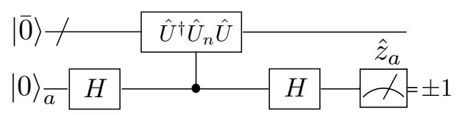
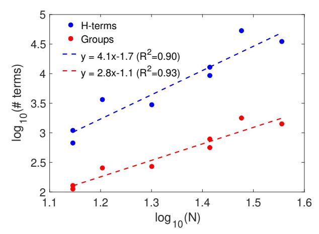

# Unitary partitioning approach to the measurement problem in the Variational Quantum Eigensolver method

Artur F. Izmaylova,b, Tzu-Ching Yena, Robert A. Langa,b, and Vladyslav Verteletskyia,b,c

a Chemical Physics Theory Group, Department of Chemistry,

University of Toronto, Toronto, Ontario, M5S 3H6,

Canada; b Department of Physical and Environmental Sciences,

University of Toronto Scarborough, Toronto, Ontario,

M1C 1A4, Canada; c Department of Quantum Field Theory,

Taras Shevchenko National University of Kyiv, Kyiv, 03022, Ukraine

(Dated: October 22, 2019)

To obtain estimates of electronic energies, the Variational Quantum Eigensolver (VQE) technique performs separate measurements for multiple parts of the system Hamiltonian. Current quantum hardware is restricted to projective single-qubit measurements, and thus, only parts of the Hamiltonian which form mutually qubit-wise commuting groups can be measured simultaneously. The number of such groups in the electronic structure Hamiltonians grows as  $N^4$ , where N is the number of qubits, and thus puts serious restrictions on the size of the systems that can be studied. Using a partitioning of the system Hamiltonian as a linear combination of unitary operators we found a circuit formulation of the VQE algorithm that allows one to measure a group of fully anti-commuting terms of the Hamiltonian in a single series of single-qubit measurements. Numerical comparison of the unitary partitioning to previously used grouping of Hamiltonian terms based on their qubit-wise commutativity shows an N-fold reduction in the number of measurable groups.

#### I. INTRODUCTION

The variational quantum eigensolver (VQE) method  $^{1-6}$  provides a practical approach to solving the eigen-value problem for many-body interacting Hamiltonians on current and near-future universal quantum computers. VQE is a hybrid quantum-classical approach based on the variational theorem and a mapping of the electronic structure problem

$$\hat{H}_e(\mathbf{R}) |\Psi(\mathbf{R})\rangle = E_e(\mathbf{R}) |\Psi(\mathbf{R})\rangle$$
 (1)

to its qubit counterpart

$$\hat{H}_q(\mathbf{R}) |\Psi_q(\mathbf{R})\rangle = E_e(\mathbf{R}) |\Psi_q(\mathbf{R})\rangle.$$
 (2)

Here,  $\hat{H}_e(\mathbf{R})$  is the electronic Hamiltonian,  $\mathbf{R}$  is the nuclear configuration of interest,  $E_e(\mathbf{R})$  is the electronic energy,  $\hat{H}_q(\mathbf{R})$  is the qubit Hamiltonian obtained from a second quantized form of  $\hat{H}_e(\mathbf{R})^7$  using one of the fermion-qubit mappings,  $^{8-12}$  and  $|\Psi_q(\mathbf{R})\rangle$  is the corresponding qubit wave-function. For notational simplicity, in what follows, we will skip the nuclear configuration but will always assume its existence as a parameter.

In VQE, the quantum computer prepares a trial qubit wavefunction  $|\Psi_q\rangle$  and then does measurements to accumulate statistics for the expectation value of the qubit Hamiltonian. The classical computer completes the VQE cycle by suggesting a new trial wavefunction based on previous expectation values of energy. The two steps, on classical and quantum computers, are iterated until convergence. One of the strengths of the VQE approach is ability to use relatively short-depth quantum circuits to construct a qubit wavefunction  $|\Psi_q\rangle$  close to the true eigenstate of the problem. Note though that the VQE scheme cannot measure the whole system Hamiltonian at once,

because the system Hamiltonian is not the Hamiltonian of qubits and is not physically implemented in the quantum computer. This is one of the differences between universal quantum computing and quantum simulation. 13,14

Measuring parts of the system Hamiltonian is a very time-consuming task. Experimentally, one can only measure single-qubit Pauli operators,  $\hat{\sigma}_i = \hat{x}_i, \hat{y}_i$  or  $\hat{z}_i$ . A regular qubit Hamiltonian

$$\hat{H}_q = \sum_I C_I \, \hat{P}_I \tag{3}$$

is a linear combination of products of Pauli operators  $\hat{P}_I$  (Pauli "words") for different qubits,

$$\hat{P}_{I} = \prod_{i=1}^{N} \hat{\sigma}_{i}^{(I)}, \tag{4}$$

where  $\hat{\sigma}_i^{(I)}$  is one of the  $\hat{x},\hat{y},\hat{z}$  Pauli operators or the identity  $\hat{1}$  operator for the  $i^{\text{th}}$  qubit, and N is the total number of qubits. For single-qubit measurements one can group only those terms that share a common tensor product eigen-basis. Thus, during the measurement, the system wavefunction can collapse to a set of unentangled eigenstates common to all Pauli operators in the group. A simple criterion for grouping terms based on shared tensor product eigen-basis is their mutual commutativity within single-qubit subspaces or qubit-wise commutativity. 15

If the canonical molecular orbitals are used as an orthonormal basis to setup the fermionic second-quantized Hamiltonian, the total number of terms in the qubit Hamiltonian scales as the fourth power of the number of qubits needed to represent the electronic wavefunction. A better scaling alternative for an orthonormal fermionic basis are plane-waves, 16 where the number of

the qubit Hamiltonian terms only scales quadratically with the number of plane waves. The downside of this approach is a large prefactor for the quadratic scaling that makes the crossing point between the quadratic and quartic scalings far out of reach of current and near future quantum computers.

Recently, we have proposed an efficient technique for grouping qubit-wise commuting (QWC) terms of the Hamiltonian by mapping the qubit Hamiltonian to a graph where connectivity between vertices representing the Hamiltonian terms indicates qubit-wise commutativity. 15 The grouping problem then can be reformulated as a problem of graph partitioning to the minimum number of fully connected subgraphs. This problem is known as the minimum clique cover problem, 17 and it is NP-hard. 18 Using polynomial heuristics, it was found that this grouping approach can reduce the total number of simultaneously measurable parts by a factor of 3 (on average) from the total number of terms in Eq. (3), which still leaves a large number of groups to be measured. 15

Another way to reduce the number of separately measured groups has been suggested recently in Ref. 19, where the idea of the single-qubit measurement was generalized to the case when the result of one qubit measurement was used to determine what single-qubit operator needs to be measured next. Partitioning of the qubit Hamiltonian into fragments that can be measured with such feed-forward measurement procedures increased the number of terms that can be grouped together and thus reduced the number of separately measured groups. However, even though such feed-forward measurements were demonstrated in some experiments, 20–23 they have not yet became available in mainstream quantum computing hardware available to the public. Another difficulty with this approach is that a procedure for ensuring the optimality of this partitioning has yet to be found.

Here, we explore a different route to the Hamiltonian partitioning, which is based on the idea that if the Hamiltonian were a unitary operator, its expectation value could be obtained in one set of single-qubit measurements. Although the qubit Hamiltonian is not a single unitary operator, its individual Pauli products in Eq. (3) are. It is possible to combine some Pauli products to larger groups of unitary operators that constitute measurable sets. The grouping condition for Pauli words involves anticommutativity of terms rather than their commutativity and thus present an alternative approach to the measurement problem. Optimal grouping of unitary fragments is possible through solving a minimum clique cover problem for an anti-commutativity graph constructed based on the qubit Hamiltonian.

The rest of the paper is organized as follows. In Sec. II A we develop a partitioning of the qubit Hamiltonian to a minimal number of unitary fragments. Section II B details the quantum computing circuit for measuring expectation values for these unitary fragments. Assessment of the new scheme is done on a set of molecular systems with the number of terms in  $\hat{H}_q$  up to fifty thousands (Sec. III).

Section IV summarizes the main results and provides concluding remarks.

#### II. THEORY

# A. Unitary Partitioning

Here we will discuss how to partition the qubit Hamiltonian into a linear combination of the minimum number of unitary operators

$$\hat{H}_q = \sum_{n=1}^M d_n \hat{U}_n,\tag{5}$$

where  $\{d_n\}_{n=1}^M$  is a set of real coefficients, and  $\hat{U}_n$  are M unitary operators.

Note that all Pauli words are hermitian unitary operators,  $\hat{P}_I^{\dagger}\hat{P}_I=\hat{P}_I^2=1$ . However, a general sum of unitary operators is non-unitary

$$\left(\sum_{I} C_{I} \hat{P}_{I}\right)^{\dagger} \left(\sum_{I} C_{I} \hat{P}_{I}\right) \neq 1.$$
 (6)

To make  $\sum_{I} C_{I} \hat{P}_{I}$  unitary, it is sufficient to impose the following three additional conditions: 1)  $Im(C_{I}^{*}C_{J}) = 0$ , 2)  $\sum_{I} |C_{I}|^{2} = 1$ , and 3)  $\{\hat{P}_{I}, \hat{P}_{J}\} = 2\delta_{IJ}$  (where  $\{.,.\}$  is the anti-commutator). The first two conditions are easy to satisfy for any partial sum of the Hamiltonian in Eq. (3) because all coefficients are real, hence, only their renormalization is required

$$\sum_{I} C_{I} \hat{P}_{I} = C \sum_{I} \frac{C_{I}}{C} \hat{P}_{I}, \ C = \left(\sum_{I} C_{I}^{2}\right)^{1/2}, \quad (7)$$

then the first two conditions for unitarity will be satisfied for the sum with coefficients  $C_I/C$ .

To satisfy the third condition, one needs to partition the Hamiltonian into groups of Pauli matrices that mutually anti-commute. To reduce the number of unitary operators needed to represent  $\hat{H}_q$  in Eq. (5), we would like to maximize the number of mutually anti-commuting terms in each group. Recently, it was found that a similar problem of finding minimum partitioning into groups of mutually QWC terms can be solved using a graph representation for the Hamiltonian. 15 There, every Pauli word was considered as a graph vertex and edges were put between the terms that qubit-wise commute. The grouping problem is equivalent to the very well-known minimum clique cover (MCC) problem. 17 For the anti-commuting relation, one can also build a graph representation of the Hamiltonian where two Pauli word vertices are connected if the corresponding operators anti-commute. Since two Pauli words always either commute or anti-commute, the anti-commutativity graph is complementary to the commutativity graph. The MCC provides the minimum number of fully connected subgraphs, cliques. Each clique

forms a set of anti-commuting Pauli words whose linear combination can represent a unitary operator

$$\hat{U}_n = \frac{1}{d_n} \sum_{I} C_I^{(n)} \hat{P}_I^{(n)}, \tag{8}$$

$$d_n = \left(\sum_I (C_I^{(n)})^2\right)^{1/2},\tag{9}$$

where  $\{\hat{P}_{I}^{(n)}, \hat{P}_{J}^{(n)}\} = 2\delta_{IJ}$ . Thus, for the further discussion we will assume that solving the MCC problem for the Hamiltonian anti-commutativity graph provides the minimum number of  $\hat{U}_n$  operators. One caveat in approaching the optimal partitioning problem by solving the MCC problem is that the latter is NP-hard.18 To avoid the exponential scaling in solving MCC, we resort to various polynomial heuristic algorithms, which were discussed in Ref. 15.

# B. Unitary Operator Measuring Circuit

Partitioning of the  $H_q$  in Eq. (5) allows us to rewrite the energy expectation value as

$$\bar{E} = \langle \Psi | \, \hat{H}_q | \Psi \rangle = \sum_n d_n \, \langle \Psi | \, \hat{U}_n | \Psi \rangle \,. \tag{10}$$

Accounting for a unitary preparation of the wavefunction  $|\Psi\rangle = \hat{U}\,|\bar{0}\rangle$ , where  $|\bar{0}\rangle$  is N qubit vacuum or initial all-qubits-up state. For measuring, it is convenient to rewrite  $\bar{E}$  in a symmetric form as

$$\bar{E} = \frac{1}{2} \sum_{n} d_{n} (\langle \Psi | \hat{U}_{n} | \Psi \rangle + \langle \Psi | \hat{U}_{n}^{\dagger} | \Psi \rangle).$$
 (11)

By introducing  $|\Phi_n\rangle = \hat{U}^{\dagger}\hat{U}_n\hat{U}|\bar{0}\rangle$  states the energy estimate can be written as

$$\bar{E} = \frac{1}{2} \sum_{n} d_n (\langle \bar{0} | \Phi_n \rangle + \langle \Phi_n | \bar{0} \rangle). \tag{12}$$

In what follows we will discuss how to measure the individual components

$$\langle \bar{0}|\Phi_n\rangle + \langle \Phi_n|\bar{0}\rangle = 2Re\,\langle \bar{0}|\Phi_n\rangle\,,\tag{13}$$

which are directly connected to the energy estimate:

$$\bar{E} = \sum_{n} d_{n} Re \langle \bar{0} | \Phi_{n} \rangle. \tag{14}$$

To measure the real part of the overlap  $\langle \bar{0} | \Phi_n \rangle$  we will not use the swap test24 because this test produces the absolute value of the overlap instead of its real part. Our approach to evaluating  $Re \langle \bar{0} | \Phi_n \rangle$  will be as follows (see Fig. 1). The initial state is a tensor product  $|\bar{0}\rangle \otimes |0\rangle_a$  of one ancilla and N target qubits. First, the Hadamard gate  $H = (\hat{x} + \hat{z})/\sqrt{2}$  is applied to the ancilla qubit

$$|\Psi_1\rangle = |\bar{0}\rangle \otimes (|0\rangle_a + |1\rangle_a)/\sqrt{2}. \tag{15}$$

Second, using a controlled unitary operator  $\hat{U}^{\dagger}\hat{U}_n\hat{U}$  the following superposition is created

$$|\Psi_2\rangle = (|\bar{0}\rangle \otimes |0\rangle_a + |\Phi_n\rangle \otimes |1\rangle_a)/\sqrt{2}.$$
 (16)

Third, another Hadamard gate rotates the  $|\Psi_2\rangle$  state into

$$|\Psi_3\rangle = \frac{1}{2}[|\Phi_{n+}\rangle \otimes |0\rangle_a + |\Phi_{n-}\rangle \otimes |1\rangle_a],$$
 (17)

where  $|\Phi_{n\pm}\rangle = |\bar{0}\rangle \pm |\Phi_n\rangle$ . Finally, the expectation value of the  $\hat{z}_a$  operator is measured. After obtaining the statistics for these measurements one can extract  $Re \langle \bar{0}|\Phi_n\rangle$  from the probabilities of the  $z_a = \pm 1$  measurement outcomes,  $p_{\pm 1} = (1 \pm Re \langle \bar{0}|\Phi_n\rangle)/2$ .

FIG. 1. Circuit for extracting values of  $Re \langle \bar{0} | \Phi_n \rangle$ , it requires N+1 qubits and M series of the  $\hat{z}_a$  single-qubit measurements.

# C. Circuit depth analysis

How can one implement the controlled  $\hat{U}^{\dagger}\hat{U}_{n}\hat{U}$  transformation on a quantum computer? Any  $\hat{U}$  can be presented as a product of one- and two-qubit operators for a regular VQE circuit to generate a wavefunction.25 If  $\hat{U}_{n} = \sum_{k=1}^{L} c_{k}\hat{P}_{k}$ , where  $\sum_{k=1}^{L} c_{k}^{2} = 1$ , using the anticommutativity of terms, this sum can be presented as a product of 2L-1 exponents of Pauli words (entanglers)

$$\hat{U}_n = \prod_{k=1}^{L} e^{i\theta_k \hat{P}_k/2} \prod_{k=L}^{1} e^{i\theta_k \hat{P}_k/2},$$
(18)

where  $\theta_k$ 's can be connected with  $c_k$ 's as

$$\theta_k = \arcsin \frac{c_k}{\sqrt{\sum_{j=1}^k c_j^2}}.$$
 (19)

This connection is easy to understand from a geometric point of view for  $c_k$ 's as Cartesian coordinates of a point on a unit L-1-dimensional sphere and  $\theta_k$ 's as corresponding hyper-spherical coordinate components. Therefore, compared to  $\hat{U}$ , the new transformation  $\hat{U}^{\dagger}\hat{U}_n\hat{U}$  in the worst case (no significant cancellation between terms in the product) will have twice as many terms in addition to 2L-1 terms generated from  $\hat{U}_n$ . The 2L-1 entanglers are not necessarily one- and two-qubit operators, but one can implement each of the entanglers using O(N) CNOT gates and single qubit rotations. Consequently, the cost of  $\hat{U}_n$  scales as O(NL).

To implement the controlled  $\hat{U}^{\dagger}\hat{U}_{n}\hat{U}$ , all one-qubit operators can be replaced by controlled-U gates. For the two-qubit operators, we can find decompositions in CNOT

and one-qubit gates,  $^{26}$  which are then replaced by Toffoli and controlled-U gates. Hence, implementing the controlled  $\hat{U}^{\dagger}\hat{U}_{n}\hat{U}$  is not asymptotically more expensive than implementing  $\hat{U}^{\dagger}\hat{U}_{n}\hat{U}$ .

# D. Application to the projection formalism

To impose physical symmetries one can construct projectors on irreducible representations of the symmetry group or algebra. These projectors can be always presented as a linear combination of unitary operators27

$$\hat{\mathcal{P}} = \sum_{k} a_k \hat{U}_k,\tag{20}$$

and can be applied in the expectation values of the projected Hamiltonian

$$\bar{E} = \frac{\langle \Psi | \hat{\mathcal{P}}^{\dagger} \hat{H}_{q} \hat{\mathcal{P}} | \Psi \rangle}{\langle \Psi | \hat{\mathcal{P}}^{\dagger} \hat{\mathcal{P}} | \Psi \rangle}$$
(21)

$$=\frac{\left\langle \Psi\right|\hat{H}_{q}\hat{\mathcal{P}}\left|\Psi\right\rangle }{\left\langle \Psi\right|\hat{\mathcal{P}}\left|\Psi\right\rangle }.\tag{22}$$

Here, the last equation used hermiticity, idempotency, and commutativity with the Hamiltonian for the symmetry projector. The expansions in unitary transformations for the projector [Eq. (20)] and the Hamiltonian [Eq. (5)] can be easily combined because a product of two unitary operators is unitary. Even though introducing the projector expansion will increase the number of terms for the measurement, it allows one to reduce the complexity of the unitary transformation for the preparation of  $|\Psi\rangle$  by satisfying symmetry requirements by construction.27

### III. NUMERICAL STUDIES AND DISCUSSION

To assess our developments we apply them to several molecular electronic Hamiltonians (Tables I and II). Details of generating these Hamiltonians are given in Supplementary Information. Some of these systems were used to illustrate performance of quantum computing techniques previously.  $^{25,28,29}$ 

To solve the MCC problem we have used several heuristic algorithms based on either reformulating the problem as graph coloring or approximating it as finding and removing maximum cliques. The description of used heuristics can be found in Ref. 15 and original papers: Greedy Coloring (GC), Largest First (LF), Smallest Last (SL), DSATUR (DS), Recursive Largest First (RLF), Dutton and Brigham (DB), COSINE, Ramsey (R), Tomorkerbosch-Tomita (BKT). Ramsey (R), Romannia Scaling with respect to the number of graph vertices.

Table I summarizes results of the unitary partitioning and compares it with previously used qubit-wise commutativity partitioning. Even though the BKT approach

shows superior performance for the first three systems in Table I, due to its exponential computational scaling, it cannot be used for larger systems. Among polynomial algorithms, RLF is the best heuristic in terms of both computational time and the number of produced cliques, the latter is 20% lower than that of the next-best algorithm. Thus, the RLF algorithm can be recommended for larger systems and has been applied for them (see Table II). Both maximum clique size and standard deviation of clique sizes grows approximately linearly with the number of qubits. The difference between results for JW and BK Hamiltonians are negligible.

Fitting the number of the Hamiltonian terms and the number of unitary fragments on the number of qubits (N) for the systems of Table II in the double log-scale reveals  $N^4$  and  $N^3$  scalings respectively (Fig. 2). Thus,

FIG. 2. Dependencies of the total number of the Hamiltonian terms (blue) and the number of unitary groups (red) on the number of qubits for the systems in Table II in the double log-scale. For the last two entries of Table II, the JW and BK results were averaged.

introducing unitary grouping reduces the number of terms to measure by a factor of N. Analytical proof of this result has been obtained recently in Ref. 39. This reduction can be rationalized from the graph connectivity point of view. It is easy to show that an average Pauli word has exponentially many more connections for the graph based on anti-commutativity compared to that based on QWC.

#### IV. CONCLUSIONS

We have introduced and studied a new method for partitioning of the qubit Hamiltonian to a linear combination of unitary transformations. This unitary partitioning allows us to reduce the number of separate measurements required in the VQE approach to the electronic structure problem. Testing the new technique on a set of molecular electronic Hamiltonians revealed an N-fold reduction in the number of operators that require separate measurements. The unitary partitioning scheme increases depth

TABLE I. The number of qubits (N), Pauli words in qubit Hamiltonians (Total), QWC groups  $(M_{\rm QWC})$ , and unitary groups (M) produced by different heuristics for systems with up to 14 qubits. The STO-3G basis has been used for all Hamiltonians unless specified otherwise.

| Systems               | N  | Total | $M_{\rm QWC}$ | GC  | LF  | SL  | DS  | RLF | DB  | С   | R   | BKT |
|-----------------------|----|-------|---------------|-----|-----|-----|-----|-----|-----|-----|-----|-----|
| $H_2$ (BK)            | 4  | 15    | 3             | 11  | 11  | 11  | 11  | 11  | 11  | 11  | 11  | 11  |
| LiH (Parity)          | 4  | 100   | 25            | 33  | 33  | 23  | 29  | 19  | 18  | 20  | 21  | 16  |
| $H_2O$ (6-31G, BK)    | 6  | 165   | 34            | 41  | 43  | 41  | 43  | 32  | 31  | 34  | 35  | 31  |
| $BeH_2$ (BK)          | 14 | 666   | 172           | 141 | 130 | 118 | 120 | 112 | 109 | 116 | 123 | -   |
| $BeH_2$ (JW)          | 14 | 666   | 203           | 139 | 135 | 121 | 119 | 110 | 108 | 120 | 128 | -   |
| H 2 O (BK) | 14 | 1086  | 308           | 176 | 197 | 147 | 154 | 127 | 129 | 145 | 155 | -   |
| $H_2O$ (JW)           | 14 | 1086  | 322           | 181 | 197 | 159 | 153 | 127 | 128 | 153 | 154 | -   |

TABLE II. Comparison of RLF results for BK and JW transformed Hamiltonians: the number of unitary groups (M), their maximum size (Max Size), and standard deviation of their size distributions (STD). The total number of Hamiltonian terms (Total) is almost everywhere the same for JW and BK; for the last two systems, JW numbers are in parenthesis.

| Systems                                   | N          | Total         |                | BK       |     | JW             |          |     |
|-------------------------------------------|------------|---------------|----------------|----------|-----|----------------|----------|-----|
|                                           | 1 <b>V</b> | Iotai         | $\overline{M}$ | Max Size | STD | $\overline{M}$ | Max Size | STD |
| $\overline{\text{BeH}_2 / \text{STO-3G}}$ | 14         | 666           | 112            | 10       | 2.0 | 110            | 11       | 2.1 |
| $H_2O$ / STO-3G                           | 14         | 1086          | 127            | 13       | 2.0 | 127            | 15       | 2.2 |
| $NH_3 / STO-3G$                           | 16         | 3609          | 251            | 25       | 3.9 | 251            | 25       | 3.8 |
| $N_2$ / STO-3G                            | 20         | 2951          | 266            | 17       | 2.5 | 268            | 19       | 2.6 |
| $BeH_2 / 6-31G$                           | 26         | 9204          | 556            | 26       | 4.5 | 558            | 29       | 4.6 |
| $H_2O / 6-31G$                            | 26         | 12732         | 767            | 33       | 5.2 | 779            | 32       | 5.2 |
| $NH_3 / 6-31G$                            | 30         | 52758 (52806) | 1761           | 50       | 7.8 | 1781           | 50       | 7.8 |
| $N_2 / 6-31G$                             | 36         | 34639 (34655) | 1402           | 43       | 5.9 | 1399           | 46       | 5.9 |

of quantum circuits and introduces an additional ancilla qubit. For measuring a group of anti-commuting terms containing L elements on a trial wavefunction prepared using K entanglers, the depth of a new circuit becomes at least 2K+2L-1 entanglers.

The partitioning of the qubit Hamiltonian is done by representing it as a graph where every vertex corresponds to a single Pauli word and the edges are connecting the terms that are anti-commuting. In this representation, the problem of grouping terms that can form a unitary operator corresponds to finding fully connected subgraphs (cliques). To obtain optimal partitioning the number of groups should be the fewest. This is a well-known problem in discrete math, the minimum clique cover problem, which is solved using polynomial heuristic algorithms.

Among various tested heuristics, the RLF approach is found to be the most efficient polynomial algorithm producing the lowest number of unitary groups. Hamiltonians produced using different fermion-qubit transformations (JW and BK) had similar compression rates due to the unitary partitioning.

Another advantage of the unitary partitioning is its straightforward incorporation of the symmetry projections that can always be presented as linear combinations of unitary operators.

#### ACKNOWLEDGEMENT

A.F.I. is grateful to Prof. Michael Molloy for useful discussion and acknowledges financial support from Zapata

Computing Inc., the Natural Sciences and Engineering Research Council of Canada (NSERC), and the Mitacs Globalink Program. R.A.L acknowledges financial support from NSERC.

### NOTE ADDED:

After submission of this manuscript to arXiv we became aware of several new proposals addressing the measurement problem, which appeared within a week or two from each other.  $^{40-43}$ 

# SUPPLEMENTARY INFORMATION: HAMILTONIAN GENERATION

 $H_2$  molecule: One- and two-electron integrals in the canonical restricted Hartree–Fock (RHF) molecular orbitals basis for R(H-H)=1.5 Å, were used in the Bravyi–Kitaev (BK) transformation to produce the corresponding qubit Hamiltonian. Spin-orbitals were alternating in the order  $\alpha$ ,  $\beta$ ,  $\alpha$ , ....

LiH molecule: Using the parity transformation for the LiH molecule at R(Li-H)=3.2~Å, a 6-qubit Hamiltonian containing 118 Pauli words was generated. Spinorbitals were arranged as "first all  $\alpha$  then all  $\beta$ " in the fermionic form; since there are 3 active molecular orbitals in the problem, this leads to 6-qubit Hamiltonian. This qubit Hamiltonian has  $3^{rd}$  and  $6^{th}$  stationary qubits, which allowed us to replace the corresponding  $\hat{z}$  operators

by their eigenvalues,  $\pm 1$ , thus defining the different "sectors" of the original Hamiltonian. Each of these sectors is characterized by its own 4-qubit effective Hamiltonian. The ground state lies in the  $z_3=-1,\,z_6=1$  sector; the corresponding 4-qubit effective Hamiltonian ( $\hat{H}_{\rm LiH}$ ) has 100 Pauli words.

 $H_2O$  molecule: 6- and 26-qubit Hamiltonians were generated for this system in the 6-31G basis, and the 14-qubit Hamiltonian was generated using the STO-3G basis. The geometry for all Hamiltonians was chosen to be  $R(\mathrm{O-H})=0.75$  Å and  $\angle HOH=107.6^{\circ}$  The 14- and 26-qubit Hamiltonians were obtained in OpenFermion using both JW and BK transformations without any modifications, while for the 6-qubit Hamiltonian we used several qubit reduction techniques detailed below.

Complete active space (4,4) electronic Hamiltonian was converted to the qubit form using the BK transformation grouping spin-orbitals as "first all alpha than all beta". The resulting 8-qubit Hamiltonian contained 185 Pauli terms.  $4^{\text{th}}$  and  $8^{\text{th}}$  qubits were found to be stationary; the ground state solution is located in the  $z_3 = 1$ ,  $z_7 = 1$  subspace. By integrating out  $z_3$  and  $z_7$ , the 6-qubit reduced Hamiltonian with 165 terms was derived.

 $N_2$ ,  $BeH_2$ , and  $NH_3$  molecules: The BK and JW transformations of the electronic Hamiltonian in the 6-31G and STO-3G bases produced qubit Hamiltonians by OpenFermion. The nuclear geometry was fixed at R(N-N)=1.1 Å $(N_2)$ ; R(Be-H)=1.4 Å, collinear geometry  $(BeH_2)$ ;  $\angle HNH=107^\circ$  and R(N-H)=1.0 Å $(NH_3)$ .

- 1 A. Peruzzo, J. McClean, P. Shadbolt, M.-H. Yung, X.-Q. Zhou, P. J. Love, A. Aspuru-Guzik, and J. L. O'Brien, Nat. Commun. 5, 4213 (2014).
- 2 M.-H. Yung, J. Casanova, A. Mezzacapo, J. McClean, L. Lamata, A. Aspuru-Guzik, and E. Solano, Sci. Rep. 4, 3589 (2014).
- 3 J. R. McClean, J. Romero, R. Babbush, and A. Aspuru-Guzik, N. J. Phys. **18**, 023023 (2016).
- 4 D. Wecker, M. B. Hastings, and M. Troyer, Phys. Rev. A 92, 042303 (2015).
- J. Olson, Y. Cao, J. Romero, P. Johnson, P.-L. Dallaire-Demers, N. Sawaya, P. Narang, I. Kivlichan, M. Wasielewski, and A. Aspuru-Guzik, arXiv.org, arXiv:1706.05413v2 (2017).
- 6 S. McArdle, S. Endo, A. Áspuru-Guzik, S. Benjamin, and X. Yuan, arXiv.org, arXiv:1808.10402v1 (2018).
- 7 T. Helgaker, P. Jorgensen, and J. Olsen, *Molecular Electronic-structure Theory* (Wiley, 2000).
- 8 S. B. Bravyi and A. Y. Kitaev, Ann. Phys. **298**, 210 (2002).
- 9 J. T. Seeley, M. J. Richard, and P. J. Love, J. Chem. Phys. 137, 224109 (2012).
- A. Tranter, S. Sofia, J. Seeley, M. Kaicher, J. McClean, R. Babbush, P. V. Coveney, F. Mintert, F. Wilhelm, and P. J. Love, Int. J. Quantum Chem. 115, 1431 (2015).
- 11 K. Setia and J. D. Whitfield, J. Chem. Phys. **148**, 164104 (2018).
- 12 V. Havlíček, M. Troyer, and J. D. Whitfield, Phys. Rev. A 95, 032332 (2017).
- 13 J. I. Cirac and P. Zoller, Nat. Phys. 8, 264 (2012).
- J. Argello-Luengo, A. Gonzlez-Tudela, T. Shi, P. Zoller, and J. I. Cirac, arXiv.org, arXiv:1807.09228 (2018).
- V. Verteletskyi, T.-C. Yen, and A. F. Izmaylov, arXiv.org , arXiv:1907.03358 (2019).
- 16 R. Babbush, N. Wiebe, J. McClean, J. McClain, H. Neven, and G. K.-L. Chan, Phys. Rev. X 8, 011044 (2018).
- 17 M. C. Columbic, Algorithmic Graph Theory and Perfect Graphs, Vol. 54 (Annals of Discrete Mathematics (Elsevier), 2004).
- 18 R. M. Karp, in Complexity of Computer Computations. The IBM Research Symposia Series, edited by R. Miller, J. Thatcher, and J. Bohlinger (Springer, Boston, MA, 1972) p. 85103.

- 19 A. F. Izmaylov, T.-C. Yen, and I. G. Ryabinkin, Chem. Sci. **10**, 3746 (2019).
- 20 F. Albarrán-Arriagada, G. A. Barrios, M. Sanz, G. Romero, L. Lamata, J. C. Retamal, and E. Solano, Phys. Rev. A 97, 032320:1 (2018).
- R. Prevedel, P. Walther, F. Tiefenbacher, P. Böhi, R. Kaltenbaek, T. Jennewein, and A. Zeilinger, Nature 445, 65 (2007).
- L. M. Procopio, A. Moqanaki, M. Araújo, F. Costa, I. A. Calafell, E. G. Dowd, D. R. Hamel, L. A. Rozema, v. Brukner, and P. Walther, Nat. Commun. 6, 7913:1 (2015).
- 23 C. Reimer, S. Sciara, P. Roztocki, M. Islam, L. R. Cortés, Y. Zhang, B. Fischer, S. Loranger, R. Kashyap, A. Cino, S. T. Chu, B. E. Little, D. J. Moss, L. Caspani, W. J. Munro, J. Azaña, M. Kues, and R. Morandotti, Nat. Phys. 15, 148 (2019).
- 24 H. Buhrman, R. Cleve, J. Watrous, and R. de Wolf, Phys. Rev. Lett. **87**, 167902 (2001).
- 25 I. G. Ryabinkin, T.-C. Yen, S. N. Genin, and A. F. Izmaylov, J. Chem. Theory Comput. **14**, 6317 (2018).
- 26 G. Vidal and C. M. Dawson, Phys. Rev. A 69, 010301 (2004).
-  $^{27}$  T.-C. Yen, R. A. Lang, and A. F. Izmaylov, arXiv.org , arXiv:1905.08109v1 (2019).
- A. Kandala, A. Mezzacapo, K. Temme, M. Takita, M. Brink, J. M. Chow, and J. M. Gambetta, Nature 549, 242 (2017).
- 29 C. Hempel, C. Maier, J. Romero, J. McClean, T. Monz, H. Shen, P. Jurcevic, B. P. Lanyon, P. Love, R. Babbush, A. Aspuru-Guzik, R. Blatt, and C. F. Roos, Phys. Rev. X 8, 031022 (2018).
- 30 Rigetti Computing, "pyQuil 1.9," (2018), http://docs.rigetti.com/en/1.9/qpu.html.
- 31 D. J. A. Welsh, Comput. J. **10**, 8586 (1967).
- 32 D. W. Matula, G. Marble, and J. D. Isaacson, in *Graph Theory and Computing*, edited by R. C. Read (Academic Press, 1972) pp. 109 – 122.
- 33 D. Brlaz, Commun. ACM **22**, 251256 (1979).
- 34 F. T. Leighton, J. Res. Natl. Bur. Stand. **84**, 489 (1979).
- 35 R. D. Dutton and R. C. Brigham, Comput. J. **24**, 8586 (1981).
- 36 A. Hertz, J. Comb. Theory **50**, 231240 (1990).

- 37 R. Boppana and M. M. Halldrsson, [BIT Numer. Math](http://dx.doi.org/10.1007/bf01994876) 32, [180196 \(1992\).](http://dx.doi.org/10.1007/bf01994876)
- 38 E. Tomita, A. Tanaka, and H. Takahashi, [Theor. Comput.](http://dx.doi.org/10.1016/j.tcs.2006.06.015) Sci. 363[, 2842 \(2006\).](http://dx.doi.org/10.1016/j.tcs.2006.06.015)
- 39 A. Zhao, A. Tranter, W. M. Kirby, S. F. Ung, A. Miyake, and P. Love, arXiv.org , arXiv:1908.08067v1 (2019).
- 40 A. Jena, S. Genin, and M. Mosca, arXiv.org , arXiv:1907.07859 (2019).
- 41 T.-C. Yen, V. Verteletskyi, and A. F. Izmaylov, arXiv.org , arXiv:1907.09386 (2019).
- 42 W. J. Huggins, J. McClean, N. Rubin, Z. Jiang, N. Wiebe, K. B. Whaley, and R. Babbush, arXiv.org , arXiv:1907.13117 (2019).
- 43 P. Gokhale, O. Angiuli, Y. Ding, K. Gui, T. Tomesh, M. Suchara, M. Martonosi, and F. T. Chong, arXiv.org , arXiv:1907.13623 (2019).