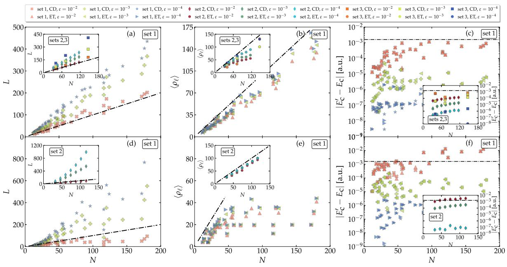
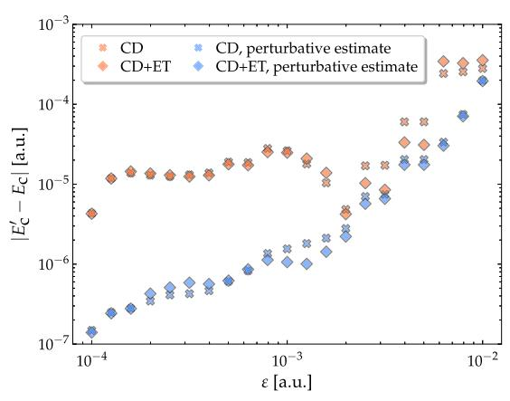
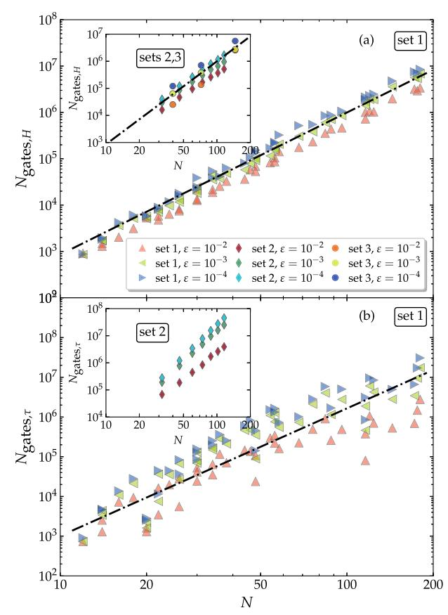
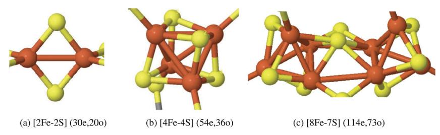

# ARTICLE OPEN

# Low rank representations for quantum simulation of electronic structure

Mario Motta1 ⋈, Erika Ye o2 ⋈, Jarrod R. McClean3, Zhendong Li o1,4, Austin J. Minnich2, Ryan Babbush o3 ⋈ and Garnet Kin-Lic Chan1 ⋈

The quantum simulation of quantum chemistry is a promising application of quantum computers. However, for N molecular orbitals, the  $\mathcal{O}(N^4)$  gate complexity of performing Hamiltonian and unitary Coupled Cluster Trotter steps makes simulation based on such primitives challenging. We substantially reduce the gate complexity of such primitives through a two-step low-rank factorization of the Hamiltonian and cluster operator, accompanied by truncation of small terms. Using truncations that incur errors below chemical accuracy allow one to perform Trotter steps of the arbitrary basis electronic structure Hamiltonian with  $\mathcal{O}(N^3)$  gate complexity in small simulations, which reduces to  $\mathcal{O}(N^2)$  gate complexity in the asymptotic regime; and unitary Coupled Cluster Trotter steps with  $\mathcal{O}(N^3)$  gate complexity as a function of increasing basis size for a given molecule. In the case of the Hamiltonian Trotter step, these circuits have  $\mathcal{O}(N^2)$  depth on a linearly connected array, an improvement over the  $\mathcal{O}(N^3)$  scaling assuming no truncation. As a practical example, we show that a chemically accurate Hamiltonian Trotter step for a 50 qubit molecular simulation can be carried out in the molecular orbital basis with as few as 4000 layers of parallel nearest-neighbor two-qubit gates, consisting of fewer than  $10^5$  non-Clifford rotations. We also apply our algorithm to iron–sulfur clusters relevant for elucidating the mode of action of metalloenzymes.

npj Quantum Information (2021)7:83; https://doi.org/10.1038/s41534-021-00416-z

#### INTRODUCTION

The electronic structure (ES) problem, namely, solving for the ground- or low-lying eigenstates of the Schrödinger equation for atoms, molecules, and materials, is an important problem in theoretical chemistry and physics. There are several approaches to solving this problem on a quantum computer, including projecting approximate solutions to eigenstates using phase estimation1–3, directly preparing eigenstates using the adiabatic algorithm4–6, or using quantum variational algorithms7,8 to optimize parameterized circuits corresponding to unitary Coupled Cluster (uCC)9–11 or approximate adiabatic state preparation12,13.

Time evolution, under the Hamiltonian or the uCC cluster operator, is a common component in these algorithms. For near-term quantum devices (especially with limited connectivity), Trotter-Suzuki based methods for time evolution, (which break the evolution of a complex sum of operators such as the Hamiltonian into a sequence of Trotter steps each evolving only a single term in the sum) are most compelling since they lack the complex controlled operations required by asymptotically more precise methods14–16. In order to perform a discrete simulation, the Hamiltonian or cluster operator is first represented in a single-particle basis of dimension N. However, in many bases, including the molecular orbital and active spaces bases common in ES, the Hamiltonian and cluster operator contain  $\mathcal{O}(N^4)$  second-quantized terms. This leads to at least  $\mathcal{O}(N^4)$  gate complexity for a single Trotter step17,18, a formidable barrier to practical progress. While complexity can be reduced using alternative bases 19,20, such representations are not usually as compact as the molecular orbital one (i.e. a longer basis expansion is required to represent typical physical states of interest). Thus, reducing the cost of the Trotter step for general bases is an important goal, particularly within the context of near-term simulation paradigms.

In this article, we introduce a method to rewrite the Trotter step of a general quantum chemistry Hamiltonian evolution, as well other exponentials of quartic fermionic operators such as the uCC operator, solely in terms of unitary single-particle rotations and Trotter steps of two-body operators. This allows for the efficient implementation of Trotter steps on a linearly connected quantum device within the Jordan-Wigner fermionic encoding20,21. It further allows for a systematic low-rank truncation (whose applicability derives from sparsity in the number of terms in the sum) which can executed in a gate-count efficient manner by the above class of circuits. The procedure starts from a nested matrix factorization of the four-body two-electron interaction term, related to the one described in the Hamiltonian evolution context by Poulin et al.22. A key additional idea is that the nested matrix factorization exposes a low-rank structure when the interaction term is a physical operator. This was observed empirically in the classical electronic structure context for the Hamiltonian by Peng and Kowalski in ref. 23 (although that work obtained an incorrect empirical scaling) and studied more deeply by some of us in ref. 24, where we presented mathematical evidence for the correct scaling. Here, we demonstrate that the low-rank structure allows one to perform truncations that significantly reduce the gate complexity of the Trotter step for the Hamiltonian operator, as well as for the unitary cluster operator. In particular, we achieve a Hamiltonian Trotter step with an asymptotic gate complexity scaling as  $\mathcal{O}(N^2)$  with system size, and  $\mathcal{O}(N^3)$  for fixed systems and increasing basis size. These scalings require only linear nearest-neighbor connectivity. We give numerical evidence that we can carry out a Hamiltonian Trotter step on a 50 qubit quantum chemical problem with as few as 4000 layers of

&lt;sup>1Division of Chemistry and Chemical Engineering, California Institute of Technology, Pasadena, CA, USA. 2Division of Engineering and Applied Sciences, California Institute of Technology, Pasadena, CA, USA. 3Google Inc., Venice, CA, USA. 4Present address: Key Laboratory of Theoretical and Computational Photochemistry, Ministry of Education, College of Chemistry, Beijing Normal University, Beijing 100875, China. ™email: mariomotta31416@gmail.com; erikaye@caltech.edu; babbush@google.com; gkc1000@gmail.com

two-qubit gates on a linear nearest-neighbor architecture, a viable target for implementation on near-term quantum devices. Compiled to Clifford gates and single-qubit rotations, this requires fewer than 105 non-Clifford rotations, an improvement of orders of magnitude over past Trotter-based methods in a fault-tolerant cost model25.

#### **RESULTS**

# **Double-decomposition structure**

We first define the Hamiltonian H and cluster operator  $\tau$ . In second quantization H is

$$H = \sum_{pq=1}^{N} h_{pq} a_p^{\dagger} a_q + \frac{1}{2} \sum_{pqrs=1}^{N} h_{pqrs} a_p^{\dagger} a_q^{\dagger} a_r a_s \equiv h + V \quad , \tag{1}$$

where  $a_p^{\scriptscriptstyle T}$  and  $a_p$  are fermionic creation and annihilation operators for spin orbital  $\phi_{p}$ , and the scalar coefficients  $h_{pq}$  and  $h_{pqrs}$  are the one- and two-electron integrals over the basis functions  $\phi_p$  (here assumed real).

The uCC cluster operator  $\tau = T - T^{\dagger}$ , where T is the standard (non-unitary) coupled cluster (CC) operator. For uCCSD (uCC with single and double excitations applied to a single determinant reference),

$$\tau = \sum_{i=1}^{N_{o}} \sum_{a=N_{o}+1}^{N} t_{ai} (a_{a}^{\dagger} a_{i} - a_{i}^{\dagger} a_{a}) 
+ \frac{1}{4} \sum_{ij=1}^{N_{o}} \sum_{ab=N_{o}+1}^{N} t_{abij} (a_{a}^{\dagger} a_{b}^{\dagger} a_{i} a_{j} - a_{i}^{\dagger} a_{j}^{\dagger} a_{a} a_{b}) 
\equiv \sum_{pq=1}^{N} t'_{pq} a_{p}^{\dagger} a_{q} + \frac{1}{4} \sum_{pqs=1}^{N} t'_{pqrs} a_{p}^{\dagger} a_{q}^{\dagger} a_{r} a_{s} ,$$
(2)

where ij, ab index the  $N_o$  occupied and  $N_v$  virtual spin orbitals respectively, and  $N_o + N_v = N$ . For the scaling arguments with system size, we assume  $N_o$ ,  $N_v \propto N$ , while increasing basis size corresponds to increasing  $N_v$  only. Both H and  $\tau$  contain  $\mathcal{O}(N^4)$  second-quantized terms. Thus, for arbitrary Hamiltonian integrals or cluster amplitudes, regardless of the gate decomposition or fermion encoding used, implementing the time-evolution Trotter step requires at least  $\mathcal{O}(N^4)$  gates.

The integrals and cluster amplitudes that one encounters in molecular ES applications, however, are not arbitrary, but contain considerable structure. We now show that this allows us to construct approximate operators H' or  $\tau'$ , accurate to within a desired tolerance  $\varepsilon$ , that can be implemented with greatly reduced gate counts. The physical basis for this result is the pairwise-nature of the Hamiltonian interactions, arising from the  $1/r_{12}$  Coulomb kernel in real-space. More precisely, we will rewrite the two-fermion parts of H and  $i\tau$  associated with the integrals  $h_{pqrs}$  and  $t'_{pars}$  as a double-factorized form

$$\sum_{pq=1}^{N} S_{pq} a_{p}^{\dagger} a_{q} + \sum_{\ell=1}^{L} \sum_{ij=1}^{\rho_{\ell}} \frac{\lambda_{i}^{(\ell)} \lambda_{j}^{(\ell)}}{2} n_{i}^{(\ell)} n_{j}^{(\ell)} \equiv S + \sum_{\ell=1}^{L} V^{(\ell)} , \qquad (3)$$

where, defining  $\psi_i^{(\ell)} = \sum_{p=1}^N U_{pi}^{(\ell)} \phi_{pp}$ 

$$n_{i}^{(\ell)} = \sum_{ps=1}^{N} U_{pi}^{(\ell)} a_{p}^{\dagger} a_{s} U_{si}^{(\ell)} = a_{\psi_{i}^{(\ell)}}^{\dagger} a_{\psi_{i}^{(\ell)}}$$

$$(4)$$

are number operators in a rotated basis. Approximate H' and  $\tau'$  with reduced complexity can then be obtained by truncating the summations over L,  $\rho_\ell$ . The dependence of the error  $\varepsilon$  on L and  $\rho_\ell$  is discussed further below.

The doubly-decomposed form of V can be obtained using a nested matrix factorization, a type of tensor factorization introduced in ref.  $^{23}$ . We illustrate this for the Hamiltonian operator. First, the creation and annihilation operators are

reordered.

$$V = \frac{1}{2} \sum_{pqrs=1}^{N} h_{ps,qr} (a_{p}^{\dagger} a_{s} a_{q}^{\dagger} a_{r} - a_{p}^{\dagger} a_{r} \delta_{qs}) = V' + S , \qquad (5)$$

and V' is recast into a supermatrix indexed by orbitals (ps), (qr) involving electrons 1,2 respectively. Due to the eight-fold symmetry  $h_{pqrs} = h_{srqp} = h_{pqsr} = h_{qprs} = h_{qpsr} = h_{rsqp} = h_{rspq} = h_{srpq}$  this matrix is real symmetric, thus we can write a matrix decomposition in terms of a rank-three auxiliary tensor  $\mathcal L$  such that

$$V' = \sum_{\ell=1}^{L} \left( \mathcal{L}^{(\ell)} \right)^2 = \sum_{\ell=1}^{L} \sum_{pqrs=1}^{N} \mathcal{L}_{ps}^{(\ell)} \mathcal{L}_{qr}^{(\ell)} a_p^{\dagger} a_s a_q^{\dagger} a_r.$$
 (6)

A simple way to obtain  $\mathcal L$  is to diagonalize the V' supermatrix, although other techniques  $^{26-32}$ , such as Cholesky decomposition (CD), are also commonly used; we use the Cholesky decomposition in our numerical simulations below. (Note that the positive nature of the Coulomb kernel means that V' is positive also, as is used in the Cholesky decomposition). The next step is to decompose each auxiliary matrix  $\mathcal L^{(\ell)}$ . Again for the Hamiltonian, this is also real symmetric, thus we can similarly diagonalize it,

$$\sum_{p_{s}=1}^{N} \mathcal{L}_{p_{s}}^{(\ell)} a_{p}^{\dagger} a_{s} = \sum_{i=1}^{\rho_{\ell}} U_{p_{i}}^{(\ell)} \lambda_{i}^{(\ell)} U_{si}^{(\ell)} a_{p}^{\dagger} a_{s} \quad , \tag{7}$$

where  $\lambda^{(\ell)}$ ,  $U^{(\ell)}$  are the eigenvalues and eigenvectors of  $\mathcal{L}^{(\ell)}$ . Combining the two eigenvalue decompositions yields the double-factorized result, Eq. (3).

In the cluster operator, amplitudes t have four-fold mixed symmetry and antisymmetry,  $t_{abij}=t_{jiba}=-t_{baij}=-t_{abji}$ . Thus because the cluster operator is not simply symmetric, we cannot use a Cholesky decomposition and must modify the arguments above. However, as shown in the Supplementary Discussion, using a singular value decomposition of the cluster operator, we can write  $i\tau=\sum_{\ell\mu}Y_{\ell,\mu}^2$ , where  $Y_{\ell,\mu}$  are normal and can be diagonalized giving the same double-factorized form.

## **Accuracy of low-rank approximations**

For an exact decomposition of  $H, L=N^2$  and  $\rho_\ell=N$ . However, it is well established from empirical ES calculations that the ranks L and  $\rho_\ell$  can be significantly reduced if we approximate H by truncating small terms. The low-rank truncations are performed as follows: in the case of L, we truncate the CD in the AO basis or localized MO basis based on the  $L^\infty$  norm, i.e. use the smallest L such that  $\max_{psqr}|h_{ps,qr}-\sum_{\ell=1}^L\mathcal{L}_{ps}^{(\ell)}\mathcal{L}_{qr}^{(\ell)}|<\epsilon_{\text{CD}}$ . The computational cost of the modified Cholesky decomposition scheme is known to scale asymptotically like  $\mathcal{O}(N^3)$  within the AO basis for a fixed error threshold  $L^3$ . For  $\rho_\ell$ , we perform an eigenvalue truncation (ET) based on the  $L^1$  norm, i.e. use the smallest  $\rho_\ell$  such that  $\sum_{j=\rho_\ell+1}^N |\lambda_j^{(\ell)}| < \epsilon_{\text{ET}}$ . Note that for H,  $\epsilon_{\text{CD}}$  and  $\epsilon_{\text{ET}}$  have dimension energy and square root of energy. For simplicity, we have chosen  $\epsilon_{\text{CD}} = \epsilon_{\text{ET}} \equiv \epsilon$  in atomic units. For this truncation of H it has been shown that when increasing the molecular size or simulation basis,  $L \sim \mathcal{O}(N)$ , while  $\ell_\ell = \ell_\ell = \ell_\ell = \ell_\ell$  for increasing molecular size in the asymptotic limit  $\ell_\ell$ .

For the uCC operator, the amplitudes t can be cast in a supermatrix  $t_{ai,bj}$  that is symmetric,  $t_{ai,bj} = t_{bj,air}$  but not positive. Therefore, we substitute the Cholesky decomposition with a singular value decomposition, obtaining  $L \sim \mathcal{O}(N)$  with increasing basis size but  $L \sim \mathcal{O}(N^2)$  with increasing molecular size (albeit with a small coefficient); the scaling properties of  $\rho_{\ell,\mu}$  have not previously been studied. Note that, for the uCC operator, the truncations  $\varepsilon_{\text{SVD}}$ ,  $\varepsilon_{\text{ET}}$  are dimensionless, unlike for H.

Fig. 1 Truncation results for H and  $\tau$ . a Linear scaling of the number L of vectors with basis size N, in the low-rank approximation of H. b Sublinear scaling of the average eigenvalue number  $\langle \rho_{\ell} \rangle$ . c Error  $|E'_c - E_c|$  in the ground-state correlation energy from the low-rank approximation of H, compared with chemical accuracy (horizontal black line). Data points in all of the main figures comprise small molecules with fixed size and increasingly large basis (set 1); insets show alkane chains with up to 8 C atoms (set 2) and iron–sulfur clusters of nitrogenase (set 3). Lines indicate N (left, middle) and the chemical accuracy (right). d–f Same as the upper panel, for the uCC operator  $\tau$ , with  $\langle \rho_{\ell} \rangle$  averaged over  $\mu$ . The symbol  $\varepsilon$  indicates  $\varepsilon = \varepsilon_{\text{CD}} = \varepsilon_{\text{TH}}$ .

In Fig. 1 we show L and  $\langle \rho_\ell \rangle$  for different truncation thresholds in: **(set 1)** a variety of molecules that can be represented with a modest number of qubits (CH4, H2O, CO2, NH3, H2CO, H2S, F2, BeH2, HCl) using STO-6G, cc-pVDZ, 6-31G\*, cc-pVTZ bases; **(set 2)** alkane chains  $C_nH_{2n+2}$ ,  $n \le 8$ , using the STO-6G basis; **(set 3)** Fe–S clusters ([2Fe–2S], [4Fe–4S], and the nitrogenase PN cluster, in active spaces with N=40, 72, 146 respectively. Further details the of calculations are given in the Methods section.

We first give some context to these sets for quantum simulation. The valence active space models considered in the Fe–S systems in set 3 are representative of a nearer-term quantum application where not all degrees of freedom are treated on a quantum computer. In this set, the underlying Gaussian basis dependence is largely removed by the reduction to an active space, as such calculations converge exponentially quickly with basis size34. All electron simulations of molecules of the kind in set 1 and 2 may be considered in the context of quantum resources available in the longer-term. While we have considered only a representative set of systems, additional intuition for the Hamiltonian ranks in these classes of molecules can be obtained from quantum Monte Carlo calculations, which work well for sets 1 and 2, and where a similar decomposition has been applied24.

For the uCC operator, in order to treat sufficiently large systems to observe the scaling trends, we have used the (classically computable) traditional CC amplitudes, equal to the uCC amplitudes in the weak-coupling limit (they agree through third order in perturbation theory). The uCC and traditional CC amplitudes are thus similar for all molecules in sets 1 and 2 near their equilibrium geometries, and molecules in set 3 in the highest spin electronic state.

For Hamiltonian evolution, we clearly see the  $L \propto N$  scaling across different truncation thresholds, for both increasing system size and basis. For  $\tau$ ,  $L \propto N$  with increasing basis in a fixed molecule, while  $L \propto N^2$  with increasing size (e.g. in alkane chains). Interestingly, the value of L in the Hamiltonian decomposition is

quite similar across different molecules for the same number of spin orbitals (qubits). In the subsequent ET for the Hamiltonian,  $\langle \rho_\ell \rangle$  features sublinear scaling for set 2 (alkanes,  $n \geq 5$ , represented here with 75–125 qubits), as well as for set 3 (Fe–S clusters). While we have shown in 1D systems that  $\rho_\ell \sim O(1)$  rigorously in the asymptotic size regime, these systems are still too small to see this saturation, although the practical reduction in  $\rho_\ell$  from full rank in sets 2 and 3 is significant. For the uCC operator, we observe that  $\langle \rho_\ell \rangle$  scales like  $\mathcal{O}(N)$  for alkane chains and increasing molecular size, while it is approximately constant for increasing basis set size. The less favorable scaling of L,  $\langle \rho_{\ell,\mu} \rangle$  with system size for the uCC operator, relative to H, stems from the antisymmetry properties of the amplitudes, which in the current factorization means that  $Y_{\ell,\mu}$  do not show the same sparsity as  $\mathcal{L}^{(\ell)}$ .

#### **First-order correction**

The error arising from the truncations leading to  $H^\prime$  and  $\tau^\prime$  can be understood in terms of two components: (i) the error in the operators, and (ii) the error in the states generated by time evolution with these operators. It is possible to substantially reduce both errors using quantities that can be computed classically. We illustrate this for the error in H'. First, the correlation energy, defined as  $E_c = E E_{\rm HF}$  with E the total energy and  $E_{\rm HF}$  the Hartree–Fock energy, is usually a much smaller quantity than the total energy in chemical systems. It is expected to be subject to much smaller truncation errors, mainly due to cancellation of errors between exact and mean-field truncations. Thus, using the classically computed meanfield energy of H', we can obtain the truncated correlation energy as  $E'_{c} = E' - E'_{HF}$ . Second, we can estimate the remaining error in  $E'_{c}$ from first-order perturbation theory as  $\langle \psi | H - H' | \psi \rangle$ , where a classical approximation to  $\psi$  is used. If the classical  $\psi$  is accurate, the corrected  $E'_c$  is then accurate to  $\mathcal{O}(\varepsilon^2)$ . In Fig. 2 we plot  $|E'_c - E_c|$ for H2O at the cc-pVDZ level. Adding the perturbative correction from the classical CC ground-state reduces the error by about an order of magnitude, such that even an aggressive truncation

Fig. 2 Error  $|E_c'-E_c|$  for H2O (cc-pVDZ) as a function of  $\varepsilon=\varepsilon_{\text{TH}}=\varepsilon_{\text{CD}}$ , with and without perturbative correction (blue, orange points respectively) for CD and CD+ET truncation schemes (crosses, diamonds), measured using HF and CC wavefunctions. The error increases with  $\varepsilon$ , and is visibly smaller with perturbative correction.

threshold of  $\epsilon_{CD} = \epsilon_{TH} \equiv \epsilon = 10^{-2}$  a.u. yields the total correlation energy within the standard chemical accuracy of  $1.6 \times 10^{-3}$  a.u.

For the  $\tau'$  truncation, one could include a similar error correction for the correlation energy derived from approximate cluster amplitudes (although we do not do so here). Note that we have only considered taking a given amplitude  $\tau'$  and the error from implementing the corresponding uCC operator with truncation. However, there is the additional possibility of optimizing the amplitude  $\tau'$  within the truncated form in a variational uCC approach. In this case, the stationary condition can formally be obtained by differentiating through the ansatz. While we reserve a detailed error analysis in this setting for future work, so long as one is close to the variational minimum, it is clear that the resulting error in the variational energy remains quadratic with respect to small truncations of  $\tau'$ .

## **Gate counts for quantum computers**

The double-factorized decomposition Eq. (3) provides a simple circuit implementation of the Trotter step. For example, for the Hamiltonian Trotter step, we write

$$e^{i\Delta tH} = e^{i\Delta t(h+S)}U^{(1)} \prod_{\ell=1}^{L} e^{i\Delta tV^{(\ell)}} \tilde{U}^{(\ell)} + \mathcal{O}(\Delta t)^{2} , \qquad (8)$$

where  $\tilde{U}^{(\ell)} = U^{\dagger(\ell)}U^{(\ell+1)}$ . Time evolution then corresponds to (single-particle) basis rotations with evolution under the single-particle operator h+S and pairwise operators  $V^{(\ell)}$ . Note that because h+S is a one-body operator, it can be exactly implemented (with Trotter approximation) using a single-particle basis change  $U^{(0)}$  followed by a layer of N phase gates (the latter being a simultaneous application of one-qubit gates to all qubits). The single-particle basis changes  $U^{(\ell)}$  can be implemented using  $\binom{N}{2} - \binom{N-\rho_\ell}{2}$  Givens rotations (detailed in the Supplementary Discussion). These rotations can be implemented

mentary Discussion). These rotations can be implemented efficiently using two-qubit gates on a linearly connected architecture 20,21.

Taking into account  $S_Z$  spin symmetry to implement basis rotations separately for spin-up and spin-down orbitals gives a count of  $2\binom{N/2}{2}-2\binom{(N-\rho_\ell)/2}{2}$  with a corresponding circuit depth (on a linear architecture) of  $(N+\rho_\ell)/2$ . Using a fermionic swap network, a Trotter step corresponding to

Fig. 3 Gate counts per Trotter step of the Hamiltonian and uCC operator, for  $\varepsilon_{\text{CD}} = \varepsilon_{\text{ET}} = \varepsilon_{\text{SVD}} = 10^{-2}$ ,  $10^{-3}$ , and  $10^{-4}$  (red, green, blue). Gate counts per Trotter step of the (a) Hamiltonian and (b) uCC operator. Black lines indicate power-law fits, with optimal exponents 3.06(3) and 3.2(1), respectively. Both gate counts scale as the third power of the basis size N across a wide range of truncation thresholds, an improvement over the  $O(N^4)$  scaling assuming no truncation.

evolution under the pairwise operator  $V^{(\ell)}$  can be implemented in  $\binom{\rho_\ell}{2}$  linear nearest-neighbor two-qubit gates, with a two-qubit gate depth of exactly  $\rho_\ell$ .

Summing these terms, counts thus are  $\binom{N}{2} + \sum_{\ell \mu} [\binom{N}{2} - \binom{N-\rho_{\ell,\mu}}{2}] + \binom{\rho_{\ell,\mu}}{2}$ , where the  $\mu$  subscript can be ignored when considering the Hamiltonian.

To realize this algorithm on a near-term device, where the critical cost model is the number of two-qubit gates, one can either implement the gates directly in hardware36, which requires  $\sum_{\ell=1}^L \left[\frac{N\rho_\ell}{4} + \frac{\rho_\ell^2}{4} - \rho_\ell\right] \text{ gates on a linear nearest-neighbor architecture, with circuit depth } \sum_{\ell=1}^L \frac{N}{2} + \frac{3\rho_\ell}{2}. \text{ If decomposing into a standard two-qubit gate set (e.g. CZ or CNOT), the gate count would be three times the above count.}$ 

To realize this algorithm within an error-corrected code such as the surface code  $^{37}$ , where the critical cost model is the number of T gates, one can decompose each Givens rotation gate in two arbitrary single-qubit rotations and each diagonal pair interaction in one arbitrary single-qubit rotation. Thus, the number of single-qubit rotations is  $\sum_{\ell=1}^{L} [\frac{N\rho_{\ell}}{2} - 2\rho_{\ell}]$ . Using standard synthesis techniques for single-qubit rotations, the number of T gates depends on the desired precision as  $1.15\log_2(1/\epsilon_{RS}) + 9.2$  times this count  $^{38}$ , where  $\epsilon_{RS}$  is the tolerance of rotation synthesis.

Fig. 4 Iron-sulfur clusters used in the present work, and their active spaces (specified by numbers of active electrons and orbitals). a [2Fe-2S] (30e,20o), b [4Fe-4S] (54e,36o), c [8Fe-7S] (114e,73o).

Note that while defining  $\varepsilon_{RS}$  is needed to obtain the final T gate count (see e.g. ref. 39), if we assume a given synthesis threshold, the relative cost of two algorithms in the error-corrected cost model is obtained simply by comparing the number of single-qubit rotations.

In Fig. 3 we show the total gate counts needed to carry out a Trotter step of H' and  $\tau'$  with different truncation thresholds. Using the scaling estimates obtained above for  $L, \rho_\ell$  in the gate count expression, we expect the Hamiltonian Trotter step to have a gate count  $N_{\rm gates} \sim \mathcal{O}(N^2)$  for increasing molecular size, and  $\mathcal{O}(N^3)$  for fixed molecular size and increasing basis size, and the uCC Trotter step to show  $N_{\rm gates} \sim \mathcal{O}(N^4)$  for increasing molecular size and  $\mathcal{O}(N^3)$  with increasing basis size. This scalings are confirmed by the gate counts in Fig. 3. As seen, the crossover between  $N^3$  and  $N^2$  behavior of the Hamiltonian Trotter gate cost, for alkanes (set 2), occur at larger N than one would expect from the  $\langle \rho_\ell \rangle$  data alone from Fig. 1, due to tails in the distribution of  $\rho_\ell$ .

The threshold for classical-quantum crossover in recent quantum supremacy experiments (although dependent on the precise computational task) has been studied in detail at roughly 50 qubits, see for example ref. 40. For near-term devices, the number of layers of gates on a parallel architecture with restricted connectivity is often considered a good cost model. Using the circuit depth estimate  $\Sigma_{\ell}(N+\rho_{\ell})$ , we see that we can carry out a single Hamiltonian Trotter step on a system with 50 qubits with as few as 4000 layers of parallel gates on a linear architecture. Within cost models appropriate for error correction, the most relevant cost metric is the number of T gates25,41,42. For our algorithms, T gates enter through single-gubit rotations and thus, the number of non-Clifford single-qubit rotations is an important metric. Based on the gate count estimate for basis changes, the number of non-Clifford rotations required for our Trotter steps is roughly 100,000. For a fixed  $\epsilon_{RS} = 10^{-6}$ , the number of T gates obtained after rotation synthesis would then be approximately 30 times this number.

#### DISCUSSION

In summary, we have introduced a nested decomposition of the Hamiltonian and uCC operators, leading to substantially reduced gate complexity for the Trotter step both in realistic molecular simulations with under 100 qubits, and in the asymptotic regime. The discussed decomposition is by no means the only one possible and, for the uCC operator, it is non-optimal, as more efficient decompositions for antisymmetric quantities exist43. Future work to better understand the interplay between classical tensor decompositions and the components of quantum algorithms thus presents an exciting possibility for further improvements in practical quantum simulation algorithms.

Note: since the time this paper was first posted as a preprint, many other works have further applied the decomposition in this work, or very closely related decompositions. Some examples of such applications include the implementation of a cluster-Jastrow

ansatz44; its use as a component in efficient Hamiltonian evolution in conjunction with other techniques and under different cost models45,46; and use of this form to reduce the cost of measurements47,48).

#### **METHODS**

The Hartree–Fock calculations for the small molecules were obtained using chemistry package PySCF49, and calculations for the iron–sulfur clusters were obtained using density-matrix renormalization group (DMRG)50,51 implemented within PySCF as BLOCK.

#### **Details of calculations**

Here, we provide further details about the calculations yielding the data shown in the main text, focusing on each of the three studied sets (set 1, set 2, set 3).

Set 1—comprises 9 small molecules (namely CH4, H2O, CO2, NH3, H2CO, H2S, F2, BeH2, HCl), studied at experimental equilibrium geometries from ref. 52. Molecules in this set have been studied with restricted Hartree–Fock (RHF) and restricted classical coupled cluster with single and double excitations (RCCSD) on top of the RHF state. Matrix elements of the Hamiltonian and classical RCCSD amplitudes have been computed with the PySCF software 49, using the STO-6G, 6-31G\*, cc-pVDZ, cc-pVTZ bases.

Set 2—comprises alkane chains (namely ethane, propane, butane, pentane, hexane, heptane and octane, all described by the chemical formula  $C_nH_{2n+2}$  with n=2...8), studied at experimental equilibrium geometries from ref. 52. Molecules in this set have been studied with RHF, RCCSD methods. Matrix elements of the Hamiltonian and classical RCCSD amplitudes have been computed with the PySCF software 49, using the STO-6G basis.

Set 3—comprises Fe–S clusters [2Fe–2S] [2Fe(II)] and [4Fe–4S] [2Fe(III),2Fe(II)], and the  $P^N$ -cluster [8Fe–7S] [8Fe(II)]) of nitrogenase.

The active orbitals of [2Fe–2S] and [4Fe–4S] complexes were prepared by a split localization of the converged molecular orbitals at the level of BP86/TZP-DKH, while those of the [8Fe–7S] were prepared at the level of BP86/def2-SVP. The active space for each complex was composed of Fe 3d and S 3p of the core part and  $\sigma$ -bonds with ligands, which is the minimal chemically meaningful active space. The structure of the iron–sulfur core and the numbers of active orbitals and electrons for each complex are summarized in Fig. 4.

Molecules in this set were treated with density-matrix renormalization group (DMRG) $^{50,51}$ , using the PySCF software. The DMRG calculations were performed for the S=0 states, which are the experimentally identified ground states, with bond dimensions 8000, 4000, and 2000 for [2Fe–2S], [4Fe–4S], and [8Fe–7S]. Note that the active space employed in the present work for the  $P^N$ -cluster is larger than the active space previously used to treat the FeMoco cluster of nitrogenase, having the same number of transition metal atoms $^{25}$ .

Broken-symmetry unrestricted Hartree–Fock (UHF) ( $M_S = 0$ ) calculations were carried out for [2Fe–2S] and [4Fe–4S]. For [8Fe–7S], due to convergence issues, high-spin UHF calculations were used instead.

#### **DATA AVAILABILITY**

Data regarding the electronic structure calculations can be provided upon request. The matrix elements  $h_{pq}$ ,  $h_{pqr}$  for the iron–sulfur cluster are made available in a compressed archive form (FeS\_integrals.tar).

6

# CODE AVAILABILITY

Code performing the double-decomposition and electronic structure calculations are available upon request. PySCF is available on GitHub (<https://github.com/pyscf/pyscf>).

Received: 2 September 2020; Accepted: 19 April 2021;

# REFERENCES

- 1. Kitaev, A. Y. Quantum measurements and the Abelian stabilizer problem. Electron. Colloquium Comput. Complex. 3, Preprint at: [http://arxiv.org/abs/quant-ph/](http://arxiv.org/abs/quant-ph/9511026) [9511026](http://arxiv.org/abs/quant-ph/9511026) (1996).
- 2. Abrams, D. S. & Lloyd, S. Quantum algorithm providing exponential speed increase for finding eigenvalues and eigenvectors. Phys. Rev. Lett. 83, 5162 (1999).
- 3. Aspuru-Guzik, A., Dutoi, A. D., Love, P. J. & Head-Gordon, M. Simulated quantum computation of molecular energies. Science 309, 1704 (2005).
- 4. Farhi, E. et al. A quantum adiabatic evolution algorithm applied to random instances of an NP-complete problem. Science 292, 472 (2001).
- 5. Wu, L.-A., Byrd, M. & Lidar, D. Polynomial-time simulation of pairing models on a quantum computer. Phys. Rev. Lett. 89, 057904 (2002).
- 6. Babbush, R., Love, P. J. & Aspuru-Guzik, A. Adiabatic quantum simulation of quantum chemistry. Sci. Rep. 4, 6603 (2014).
- 7. Peruzzo, A. et al. A variational eigenvalue solver on a photonic quantum processor. Nat. Commun. 5, 4213 (2014).
- 8. O'Malley, P. J. et al. Scalable quantum simulation of molecular energies. Phys. Rev. X 6, 031007 (2016).
- 9. Kutzelnigg, W. Quantum chemistry in Fock space. I. The universal wave and energy operators. J. Chem. Phys. 77, 3081 (1982).
- 10. Yanai, T. & Chan, G. K.-L. Canonical transformation theory for multireference problems. J. Chem. Phys. 124, 194106 (2006).
- 11. Romero, J. et al. Strategies for quantum computing molecular energies using the unitary coupled cluster ansatz. Quantum Sci. Technol. 4, 014008 (2018).
- 12. Farhi, E., Goldstone, J. & Gutmann, S. A quantum approximate optimization algorithm. Preprint at: <https://arxiv.org/abs/1411.4028> (2014).
- 13. Wecker, D., Hastings, M. B. & Troyer, M. Progress towards practical quantum variational algorithms. Phys. Rev. A 92, 042303 (2015a).
- 14. Berry, D. W., Childs, A. M., Cleve, R., Kothari, R. & Somma, R. D. Simulating Hamiltonian dynamics with a truncated Taylor series. Phys. Rev. Lett. 114, 090502 (2015).
- 15. Low, G. H. & Chuang, I. L. Hamiltonian simulation by qubitization. Quantum 3, 163 (2019).
- 16. Low, G. H. & Wiebe, N. Hamiltonian simulation in the interaction picture. Preprint at: <https://arxiv.org/abs/1805.00675> (2018).
- 17. Seeley, J. T., Richard, M. J. & Love, P. J. The Bravyi-Kitaev transformation for quantum computation of electronic structure. J. Chem. Phys. 137, 224109 (2012).
- 18. Hastings, M. B., Wecker, D., Bauer, B. & Troyer, M. Improving quantum algorithms for quantum chemistry. Quantum Inf. Comput. 15, 1–21 (2015).
- 19. Babbush, R. et al. Low-depth quantum simulation of materials. Phys. Rev. X 8, 011044 (2018a).
- 20. Kivlichan, I. D. et al. Quantum simulation of electronic structure with linear depth and connectivity. Phys. Rev. Lett. 120, 110501 (2018).
- 21. Jiang, Z., Sung, K. J., Kechedzhi, K., Smelyanskiy, V. N. & Boixo, S. Quantum algorithms to simulate many-body physics of correlated fermions. Phys. Rev. Appl. 9, 044036 (2018).
- 22. Poulin, D. et al. The Trotter step size required for accurate quantum simulation of quantum chemistry. Quantum Inf. Comput. 15, 361–384 (2015).
- 23. Peng, B. & Kowalski, K. Highly efficient and scalable compound decomposition of two-electron integral tensor and its application in coupled cluster calculations. J. Chem. Theory Comput. 13, 4179 (2017).
- 24. Motta, M., Shee, J., Zhang, S. & Chan, G. K.-L. Efficient ab initio auxiliary-field quantum Monte Carlo calculations in gaussian bases via low-rank tensor decomposition. J. Chem. Theory Comput. 15, 3510–3521 (2019).
- 25. Reiher, M., Wiebe, N., Svore, K. M., Wecker, D. & Troyer, M. Elucidating reaction mechanisms on quantum computers. Proc. Natl Acad. Sci. 114, 7555 (2017).
- 26. Whitten, J. L. Coulombic potential energy integrals and approximations. J. Chem. Phys. 58, 4496 (1973).
- 27. Hohenstein, E. G. & Sherrill, C. D. Density fitting and Cholesky decomposition approximations in symmetry-adapted perturbation theory: Implementation and application to probe the nature of π-π interactions in linear acenes. J. Chem. Phys. 132, 184111 (2010).

- 28. Beebe, N. H. & Linderberg, J. Simplifications in the generation and transformation of two-electron integrals in molecular calculations. Int. J. Quantum Chem. 12, 683 (1977).
- 29. Koch, H., Sánchez de Merás, A. & Pedersen, T. B. Reduced scaling in electronic structure calculations using Cholesky decompositions. J. Chem. Phys. 118, 9481 (2003).
- 30. Aquilante, F. et al. MOLCAS 7: the next generation. J. Comput. Chem. 31, 224 (2010).
- 31. Purwanto, W., Krakauer, H., Virgus, Y. & Zhang, S. Assessing weak hydrogen binding on Ca+ centers: An accurate many-body study with large basis sets. J. Chem. Phys. 135, 164105 (2011).
- 32. Motta, M. & Zhang, S. Ab initio computations of molecular systems by the auxiliary-field quantum Monte Carlo method. Wires Comput. Mol. Sci. 8, e1364 (2018).
- 33. Folkestad, S. D., Kjønstad, E. F. & Koch, H. An efficient algorithm for Cholesky decomposition of electron repulsion integrals. J. Chem. Phys. 150, 194112 (2019).
- 34. Petersson, G. A., Malick, D. K., Frisch, M. J. & Braunstein, M. The convergence of complete active space self-consistent-field energies to the complete basis set limit. J. Chem. Phys. 123, 074111 (2005).
- 35. Wecker, D. et al. Solving strongly correlated electron models on a quantum computer. Phys. Rev. A 92, 062318 (2015b).
- 36. Niu, M. Y., Boixo, S., Smelyanskiy, V. N. & Neven, H. Universal quantum control through deep reinforcement learning. npj Quantum Inf. 5, 33 (2019).
- 37. Fowler, A. G., Mariantoni, M., Martinis, J. M. & Cleland, A. N. Surface codes: towards practical large-scale quantum computation. Phys. Rev. A 86, 032324 (2012).
- 38. Bocharov, A., Roetteler, M. & Svore, K. M. Efficient synthesis of universal repeatuntil-success quantum circuits. Phys. Rev. Lett. 114, 080502 (2015).
- 39. Kivlichan, I. D. et al. Improved fault-tolerant quantum simulation of condensedphase correlated electrons via Trotterization. Quantum 4, 296 (2020).
- 40. Arute, F. et al. Quantum supremacy using a programmable superconducting processor. Nature 574, 505 (2019).
- 41. Childs, A. M., Maslov, D., Nam, Y., Ross, N. J. & Su, Y. Toward the first quantum simulation with quantum speedup. P. Natl Acad. Sci. 115, 9456 (2018).
- 42. Babbush, R. et al. Encoding electronic spectra in quantum circuits with linear T complexity. Phys. Rev. X 8, 041015 (2018b).
- 43. Shenvi, N. et al. The tensor hypercontracted parametric reduced density matrix algorithm: Coupled-cluster accuracy with o(r 4 ) scaling. J. Chem. Phys. 139, 054110 (2013).
- 44. Matsuzawa, Y. & Kurashige, Y. Jastrow-type decomposition in quantum chemistry for low-depth quantum circuits. J. Chem. Theory Comput. 16, 944 (2020).
- 45. Berry, D. W., Gidney, C., Motta, M., McClean, J. R. & Babbush, R. Qubitization of arbitrary basis quantum chemistry leveraging sparsity and low rank factorization. Quantum 3, 208 (2019).
- 46. von Burg, V. et al. Quantum computing enhanced computational catalysis. Preprint at: <https://arxiv.org/pdf/2007.14460.pdf> (2020).
- 47. Huggins, W. J. et al. Efficient and noise resilient measurements for quantum chemistry on near-term quantum computers. npj Quantum Inf. 7, 23 (2021).
- 48. Yen, T.-C. & Izmaylov, A. F. Cartan sub-algebra approach to efficient measurements of quantum observables. Preprint at: <https://arxiv.org/abs/2007.01234> (2020).
- 49. Sun, Q. et al. PySCF: the Python-based simulations of chemistry framework. Wires Comput. Mol. Sci. 8, e1340 (2018).
- 50. White, S. R. Density matrix formulation for quantum renormalization groups. Phys. Rev. Lett. 69, 2863 (1992).
- 51. Chan, G. K.-L. & Head-Gordon, M. Highly correlated calculations with a polynomial cost algorithm: A study of the density matrix renormalization group. J. Chem. Phys. 116, 4462 (2002).
- 52. Johnson, R. D. et al. NIST computational chemistry comparison and benchmark database. <http://cccbdb.nist.gov/> (2018).

### ACKNOWLEDGEMENTS

M.M. gratefully acknowledges Shiwei Zhang and James Shee for valuable interactions. M.M., Z.L., and G.K.C. (theoretical analysis, electronic structure calculations, drafting of the paper) were supported by NSF grant number 1839204. E.Y. (gate counts, electronic structure calculations) was supported by a Google graduate fellowship and a Google award to G.K.C. A.M. (drafting of the paper) was supported by NSF grant CBET CAREER number 1254213.

# AUTHOR CONTRIBUTIONS

R.B., G.K.C., and M.M. contributed to the conception of the project; M.M., J.R.M., Z.L., R.B., and G.K.C. contributed to the theoretical analysis; M.M., Z.L., E.Y., and G.K.C.

contributed to the electronic structure calculations; M.M., J.R.M., E.Y., R.B., and G.K.C. contributed to the gate counts analysis. All authors contributed to the drafting of the paper.

## COMPETING INTERESTS

The authors declare no competing interests.

# ADDITIONAL INFORMATION

Supplementary information The online version contains supplementary material available at <https://doi.org/10.1038/s41534-021-00416-z>.

Correspondence and requests for materials should be addressed to M.M., E.Y., R.B. or G.K.-L.C.

Reprints and permission information is available at [http://www.nature.com/](http://www.nature.com/reprints) [reprints](http://www.nature.com/reprints)

Publisher's note Springer Nature remains neutral with regard to jurisdictional claims in published maps and institutional affiliations.

Open Access This article is licensed under a Creative Commons Attribution 4.0 International License, which permits use, sharing,

adaptation, distribution and reproduction in any medium or format, as long as you give appropriate credit to the original author(s) and the source, provide a link to the Creative Commons license, and indicate if changes were made. The images or other third party material in this article are included in the article's Creative Commons license, unless indicated otherwise in a credit line to the material. If material is not included in the article's Creative Commons license and your intended use is not permitted by statutory regulation or exceeds the permitted use, you will need to obtain permission directly from the copyright holder. To view a copy of this license, visit [http://creativecommons.](http://creativecommons.org/licenses/by/4.0/) [org/licenses/by/4.0/](http://creativecommons.org/licenses/by/4.0/).

© The Author(s) 2021